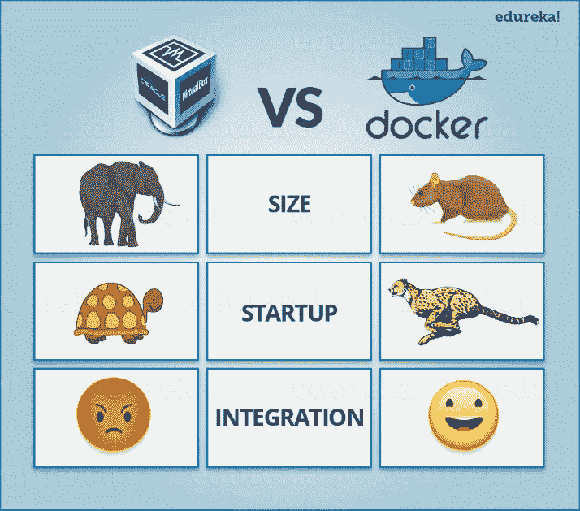
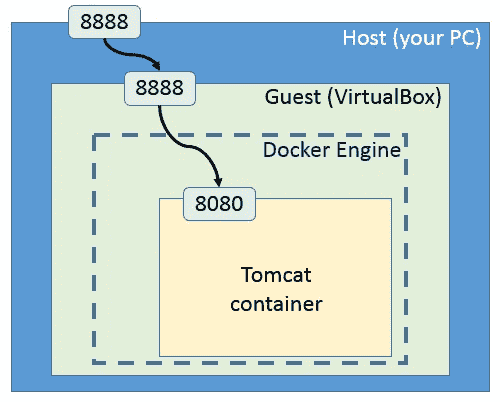

# 我喜欢 Docker 的原因

> 原文：<https://itnext.io/the-reason-i-love-docker-1410820a7c36?source=collection_archive---------4----------------------->

## Docker 是什么，它能帮助我们什么，为什么要使用它，谁在使用它。


# 码头工人——你好伙计

当你加入一家新公司时。您必须克隆并安装一个新项目。是啊，问题来了。你需要安装 Java，Spring boot，Mysql，Kafka，然后尝试运行…构建失败。您检查错误日志:丢失 Redis。好的，然后安装 Redis。但是你用的是 Windows，在 Windows 上安装 Redis 比 Ubuntu 或者 Linus 要难。所以你决定…用 Ubuntu。

那天晚上你安装了 Ubuntu。建造。Oke，又失败了。你向领导求助= >缺少一些环境变量。但是在运行项目之前，你再次问他是否需要其他东西。“你有没有运行‘mvn install’来安装软件包”——没有，我当然没有。好吧，上次建…不，这不是最后一次。失败了。一些关于 Mysql 的错误，可能是版本不匹配。项目中使用的 Mysql 是 mysq5.7。但是你已经安装了 MySQL 8…哦，我的天哪

好吧，另一个故事。当你必须维护 3-4 个项目时，每个项目都需要 Golang(用它的包安装 Golang 是可怕的，相信我)，NodeJS，MySQL，Kafka，有一天他安装了，嘣，Kafka 死了。你不知道如何拆卸和重装。仍然显示错误。相关项目之所以这么崩溃，是因为都需要卡夫卡来运行。他很伤心，从那以后，每当他在服务器上安装任何东西，他的手都会颤抖，就像你第一次见到你的爱人一样。😄

那么，…解决方案是什么？

# 什么是 Docker

从这样的问题和其他几十个原因，Docker 诞生了。


Wiki 上关于 Docker 的定义:

> Docker 是一组平台即服务产品，使用操作系统级虚拟化来交付称为容器的软件包中的软件。容器是相互隔离的，捆绑了它们自己的软件、库和配置文件；他们可以通过明确定义的渠道相互交流。

我的定义，更简单:

Docker 是一个工具，允许我们在特定的环境中运行项目，定义清晰，独立于原始环境。

# 什么码头工人能帮助我们。

*   Docker 给你一个具体的目标环境，比如你需要 Ubuntu 配 Java 10，NodeJS 6.0 Mysql 5.7。你所需要做的就是声明一个文件，docker 会为你完成剩下的工作。(我稍后会谈到它是如何工作的)
*   Docker 中的环境独立于原始环境:Docker 将为您创建一个“虚拟”环境，无论您的原始操作系统是什么，您都可以在其中运行您的项目。因此，无论你是在 Windows 还是 Mac 上，你仍然可以在 Ubuntu 环境或任何环境(目前支持 Docker)下运行该项目
*   定义后的 Docker 环境将是“不可变的”。您可以在任何具有您定义的相同环境的计算机上设置。
*   每个项目都有一个特定的配置文件。10 年后，当你再次阅读该项目时，你仍然知道运行该项目需要什么，应该做什么。您只需要将配置文件交给其他人，他们自己就会知道该做什么。
*   因为每个项目我们都可以在单独的环境下设置，项目不会冲突(你有 2 个项目，一个用 Mysql 5.7，另一个用 Mysql 8，你会怎么做？想想 Docker)。从而最小化相互依赖，安装、添加和删除库时，配置不会受到其他项目的影响。
*   Docker 可以帮助自动愈合(自我恢复，重新启动)，如果发生错误。

# **虚拟机呢**

你听说过 VMWare 或 Virtual Box 吧。

但是我认为，虚拟机最大的缺点之一是沉重、非常复杂、非常慢的安装。使用虚拟机时，我们必须为其削减固定数量的资源，导致根操作系统和虚拟机共享硬件，降低了二者的性能。，当你遇到需要重新安装的错误时，你会体验到这种痛苦。

有了 Docker，它将创建一个“虚拟环境”，而不再是一个虚拟机。因此，它将与外部环境共享硬件、RAM、CPU，..速度将是相同的，与原始环境共享文件。此外，在 Docker 中创建一个“虚拟”环境只需一个或几个命令就可以快速轻松地完成。



# 为什么我需要 Docker

*   当我们的项目有很多人一起工作时，Win 用户，Mac 用户，Linux 用户。但是在每个操作系统上安装软件和库的方式是不同的。安装时也可以对项目进行更改。这导致项目在不同的操作系统上不正确地运行。
*   每个项目都需要很多东西来搭配:MySQL，Redis，extensions，…而记住安装每一个都很累，记住如何正确配置更累。而且最大火的是安装有故障的时候，但是错误擦除完了和重装是不一样的。
*   每个项目都需要很多东西来搭配:MySQL，Kafka，Redis，extensions，…而记住安装每一个都很累，记住如何正确配置更累。
*   当我们有许多项目，共享许多东西，这导致当我们想要改变，修改一个共享资源，将影响相关的项目。
*   有一个案例让我感到非常痛苦。那就是当我们移动环境的时候(比如移动服务器)，我们需要移动旧的项目，移动到新的环境。如何移动所有的数据，用数十亿的东西从头开始重新配置。

Docker 会用一种非常简单容易的方式帮你解决上面的事情。(是啊，非常非常容易)。

# 谁在使用 Docker

每个人，每个人:谷歌、脸书、亚马逊、推特、阿里巴巴……以及我工作的公司。可能你的公司，你朋友的公司都在用 Docker。

此外，我们还有其他工具与 Docker 配合使用，以获得更多好处:

*   Kubernetes:管理 Docker 运行的项目的工具，管理日志，出错时自动修复，自动缩放，自动部署，自动和自动。
*   CI / CD:测试、检查错误和部署到真实环境都是自动完成的，不再需要安装杂乱的工具来自动部署。
*   Github、Gitlab、Bitbucket、…等源代码管理平台对 Docker 的支持。

凭借 Docker 带来的所有伟大的东西，这就是 Docker 今天极其受欢迎的原因。

# Docker 中你需要知道的定义

在 Docker 中，会有很多我们需要了解的东西。所以我提几个基本概念，是必须的，也是经常用到的。

**图像** 图像是 Docker 中最基本的单位之一。图像将定义一个环境及其内容。如果我们的应用程序想要运行，它需要图像。


例如，在 Image 中，我们可以定义以下组件(或仅一个):

*   环境:Ubuntu 18.04
*   Python 3
*   MySQL 5.7

一些有用的命令:

*   列出最近创建的图像

```
$ docker images
```

*   按名称和标签列出图像

```
$ docker images java
```

**容器**


A `Container`是`Image`的一个实体。最简单的理解就是:`Image`是一个类，`Container`是从那个类初始化的对象。

从一个映像中，我们可以初始化数百个容器。每个项目可以包含从一个或多个图像创建的一个或多个容器。例如，我们有一个 Python 项目:

*   Ubuntu 环境->需要 Ubuntu 映像 18.04
*   Python 3 -> Python 3 图像(OpenJDK)

因此，在运行上述项目时，我们需要创建 2 个容器:一个 Ubuntu 容器和一个 Python 3 容器。

**Port** 因为 Docker 中的环境是完全独立于原环境的。因此，为了能够使用 Docker 中运行的应用程序，我们需要从 Docker 打开端口，以便外部可以呼叫进来。



如上图所示，我们有一个运行在 Docker 容器中的 Tomcat 服务器。在容器中，我们为外部访问环境开放端口 8080。从外部环境，我们开放端口 8888，以便真正的用户(在您的计算机之外)可以访问。因此，用户将访问端口 8888，以便与 Docker 容器中运行的应用程序进行通信。

**卷** 因为 Docker 环境是独立的，所以 Docker 中运行的应用的文件系统也是独立的。事实上，几乎总是需要在根环境和 Docker 环境之间交换文件:DB 存储、日志存储、图像……因此根环境要访问 Docker 中运行的应用程序的文件系统，我们需要这个卷

我们使用根环境的卷来告诉 Docker:如果您创建了一个新的日志文件，请记住为我保存它，然后为我创建一个日志文件的“投影”。当我在我这边(外部)编辑/删除时，或者当我在我这边编辑/删除时，必须在两个环境中更改日志文件(从外部环境安装到 Docker 中)

# 设置 Docker & Docker-撰写

**码头工人安装**

*   [为 Windows 安装。](https://docs.docker.com/docker-for-windows/install/)
*   [为 Ubuntu 安装。](https://docs.docker.com/install/linux/docker-ce/ubuntu/)
*   [为 Mac 安装。](https://docs.docker.com/v17.12/docker-for-mac/install/)

检查您是否成功安装:

```
docker --version
```

**Docker-compose 安装**

要在 Docker 中运行项目，可以使用以下命令来运行每个容器:

```
docker run container1
docker run container2
docker run container3
.........................
```

但是在运行实际项目的时候，大多数时候我们会使用 docker-compose 来运行项目，因为我们对于 1 个项目总是需要 1 个以上的容器。

Docker-compose 是一个同时配置和运行多个 Docker 容器的工具。使用 docker-compose 将使我们更容易运行一个或几个容器，并帮助我们轻松地对项目有一个概述。

# 结论

关于 Docker 和 Docker 带来的好处，我已经给大家简单介绍过了。希望你能在下一个项目中使用它。再见。