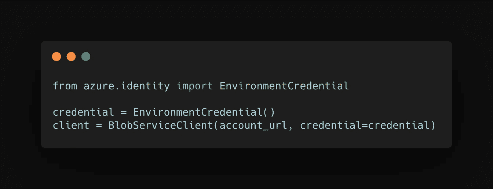
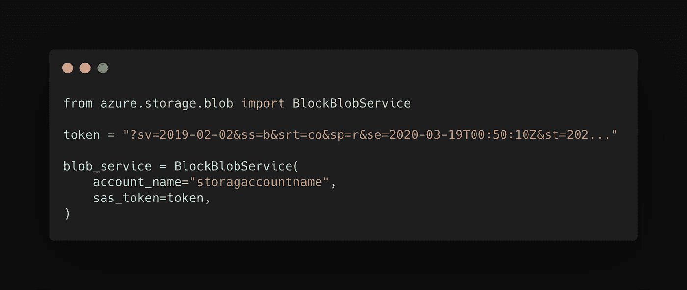
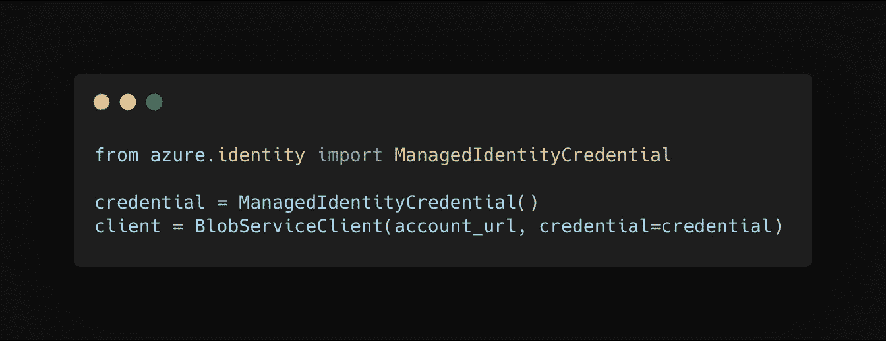
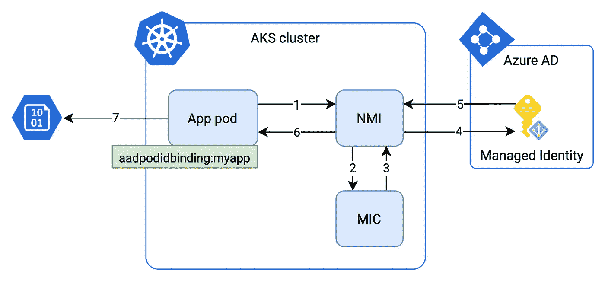
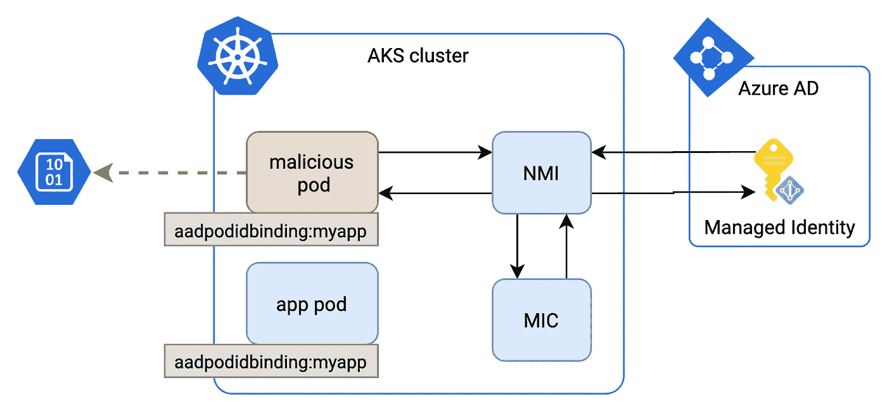

# 从 Azure Kubernetes 集群内部访问 Azure 服务的正确方式

> 原文：<https://itnext.io/the-right-way-of-accessing-azure-services-from-inside-your-azure-kubernetes-cluster-14a335767680?source=collection_archive---------0----------------------->


本杰明·马塞罗在 [Unsplash](https://unsplash.com/) 上拍摄的照片

通常，运行在 Azure 上的应用程序需要访问其他 Azure 资源，如存储帐户、CosmosDB 或 KeyVault 实例。当使用[托管身份](https://docs.microsoft.com/en-us/azure/active-directory/managed-identities-azure-resources/overview)看似简单的任务时，在 AKS 集群的上下文中就变得有点复杂了。节点在不同的 pod 之间共享，我们需要在 pod 级别而不是节点级别保持细粒度的访问策略。

如果你来自 AWS 领域，你可能知道像 K8S 或 kiam 的 IAM 控制器 [Zalando 这样的项目。Azure 有](https://github.com/zalando-incubator/kube-aws-iam-controller) [AAD Pod 身份](https://github.com/Azure/aad-pod-identity/)，你可以认为它等同于上面提到的项目。

在本文中，我将带您了解在您的集群中设置 Azure Access Directory Pod 身份的过程。这篇文章分为四个部分

*   我们想要解决的问题
*   AAD Pod 身份背后的概念
*   安全性
*   部署步骤

# 问题

假设一个带有应用程序 X 的 pod 需要对 blob 存储容器中的数据具有读取权限。有几种方法可以实现这一点，例如:

*   **环境凭证**

将读取环境变量，然后作为服务主体或用户进行身份验证。



*   **存储账户密钥**

请将其视为您的存储帐户的 root 密码。您可能不想冒险在任何应用程序中使用它。(我甚至不会给你看代码示例:)

*   **SAS 令牌(共享访问签名)**

可以提供给应用程序的字符串，用于授予对存储资源的粒度临时访问权限:例如，容器、单个 blob。



这些选项中的每一个都要求我们有一个特定的值，比如上面的令牌，或者在目标机器上设置环境变量。这些值可以在容器映像中定义，作为 K8S 秘密注入，或者在部署 YAML 中设置为 env 变量。对于一个令牌，我们需要确保我们定期轮换它；env 变量需要传递到目标 pod。

理想情况下，我们希望摆脱这一需求，使用能够简化整个流程的东西。我们希望:

*   ***确保我们的应用程序只访问必要的资源***
*   ***对我们的应用程序不应用或应用最小的代码更改***
*   ***自动获取访问令牌，而不是使用固定凭证***
*   ***令牌应该有其使用期限，并且仅对我们的应用*** 有效
*   ***令牌应该自动旋转***

# 它是如何工作的

## 托管身份

托管身份允许对支持 Azure AD 身份验证的任何服务进行身份验证，而无需将凭据附加到您的应用程序。创建身份后，您需要附加一个角色，该角色定义身份可以对特定资源做什么。

让我们来看看示例代码:



它看起来几乎和上面的`EnvironmentCredential`例子一样，但是有一个细微的区别。`ManagedIdentityCredential`实时创建一个访问令牌，无需任何附加数据到您的应用程序，而`EnvironmentCredential`则需要您设置带有秘密的 env 变量。

## AAD Pod 身份

当您将 AAD Pod Identity 部署到集群时，您将获得两个组件:

*   **托管身份控制器(MIC)**

监视更改并在检测到相关更改(例如，pod 或身份绑定已修改)时，附加或删除分配的身份。

*   **节点管理身份(NMI)**

一个守护进程集，它劫持对节点元数据的每个`ManagedIdentityCredential`调用。

## 在后台



1.  在您的 pod 中，`ManagedIdentityCredential`实例向 Azure 实例元数据服务(IMDS) `[http://169.254.169.254/metadata/identity/oauth2/token](http://169.254.169.254/metadata/identity/oauth2/token)`发送请求
2.  该请求被 NMI 截获。NMI 然后通过查询 MIC 来检查哪个身份被分配给源 pod
3.  MIC 检查 AKS 集群中的 Azure 身份映射。如果存在，则将其返回给 NMI
4.  NMI 服务器根据上一步中返回的 pod 身份映射向 AD 请求访问令牌
5.  AD 将令牌传递给 NMI
6.  NMI 将令牌传输到应用程序
7.  该应用程序使用令牌查询 Azure 服务

# 安全性

在我们部署任何东西之前，了解其背后的潜在安全风险是至关重要的。

## 重用选择器绑定



MIC 通过`aadpodidbinding`标签识别 pod。如果集群中的任何其他 pod 重用`aadpodidbinding`,它也会访问相关的身份绑定。对于只有一个项目的集群来说，这不太可能发生，但是仍然需要谨慎，特别是如果集群在逻辑上是跨团队/项目共享的。

默认情况下，AAD Pod Identity 跨名称空间用标识映射 Pod。如果集群是共享的，那么部署 AAD Pod 标识至关重要，[强制命名空间匹配](https://github.com/Azure/aad-pod-identity/blob/master/docs/readmes/README.namespaced.md)。

## NMI 截获到实例元数据端点的所有连接

默认情况下，NMI 组件会捕获所有发送到集群内部 IMDS 的请求。对于某些用例来说，这可能还不够。最简单的方法是在集群中创建`AzurePodIdentityException`资源:

```
apiVersion: "aadpodidentity.k8s.io/v1"
kind: AzurePodIdentityException
metadata:
  name: aad-identity-exception
spec:
  PodLabels:
    noaad: true
```

然后，对于每一个我们不想使用 AAD Pod 身份的 app，我们简单的指定`spec.template.metadata.labels`到`noaad: true`。当然，您可以使用您的自定义标签。

# 安装 AAD Pod 身份

## 1.将 aad-pod-identity 部署到您的集群

运行以下命令:

```
kubectl apply -f [https://raw.githubusercontent.com/Azure/aad-pod-identity/master/deploy/infra/deployment-rbac.yaml](https://raw.githubusercontent.com/Azure/aad-pod-identity/master/deploy/infra/deployment-rbac.yaml)
```

请注意，部署将转到`default`名称空间。

## 2.创建新的受管身份并为其分配角色

```
az identity create -g "<your_resource_group>" -n "<your_managed_identity_name>"
```

该命令应返回以下内容:

```
{
  "clientId": "00000000-0000-0000-0000-000000000000",
  "clientSecretUrl": "https://control-westeurope.identity.azure.net/subscriptions/00000000-0000-0000-0000-000000000000/resourcegroups/<your_resource_group>/providers/Microsoft.ManagedIdentity/userAssignedIdentities/<your_managed_identity_name>/credentials?tid=00000000-0000-0000-0000-000000000000&oid=00000000-0000-0000-0000-000000000000&aid=00000000-0000-0000-0000-000000000000",
  "id": "/subscriptions/00000000-0000-0000-0000-000000000000/resourcegroups/myresourcegroup/providers/Microsoft.ManagedIdentity/userAssignedIdentities/<your_managed_identity_name>",
  "location": "westeurope",
  "name": "<your_managed_identity_name>",
  "principalId": "00000000-0000-0000-0000-000000000000",
  "resourceGroup": "<your_resource_group>",
  "tags": {},
  "tenantId": "00000000-0000-0000-0000-000000000000",
  "type": "Microsoft.ManagedIdentity/userAssignedIdentities"
}
```

现在是分配角色的时候了。这里我用的是`Storage Blob Data Reader`。这将允许从 blob 存储帐户中读取数据:

```
az role assignment create --role "Storage Blob Data Reader" --assignee "<the managed identity id returned previously>" --scope "<your resource id>"
```

*提示 1* :你可以在这里找到更多角色[。如果您正在寻找更具体的东西，您可能](https://docs.microsoft.com/en-us/azure/role-based-access-control/built-in-roles)[想要创建一个自定义角色](https://docs.microsoft.com/en-us/azure/role-based-access-control/custom-roles)。

*提示 2* :如果您不知道您的资源 id，您可以使用:

```
az resource list
```

## 3.在您的群集中创建 Azure 身份

用以下内容创建一个文件`aadpodidentity.yaml`:

```
apiVersion: "aadpodidentity.k8s.io/v1"
kind: AzureIdentity
metadata:
  name: <your_managed_identity_name>
spec:
  type: 0
  ResourceID: <the managed identity id returned previously>
  ClientID: <the managed identity clientId returned previously>
```

应用它:

```
kubectl apply -f aadpodidentity.yaml
```

## 4.将 Azure 身份绑定到 pod 选择器

创建另一个名为`aadpodidentitybinding.yaml`的清单文件:

```
apiVersion: "aadpodidentity.k8s.io/v1"
kind: AzureIdentityBinding
metadata:
  name: myapp-azure-identity-binding
spec:
  AzureIdentity: <your_managed_identity_name from the previous step>
  Selector: <your_app_selector_name>
```

部署它

```
kubectl apply -f aadpodidentitybinding.yaml
```

现在，MIC 知道，每当集群中出现具有特定选择器的 pod 时，它需要将之前创建的身份绑定到它。

## 5.托管身份控制器(MIC)权限

MIC 需要读取关于我们刚刚创建的托管身份的信息。因为它使用 AKS 服务主体来查询 Azure 资源，所以我们需要为我们的 AKS 服务主体分配一个特定的角色。

首先，您需要找到服务主体 id:

```
az aks show -g "<aks_resource_group>" -n "<aks_cluster_name>" --query servicePrincipalProfile.clientId -o tsv
```

现在只需将`Managed Identity Operator`角色分配给 AKS 服务主体:

```
az role assignment create --role "Managed Identity Operator" --assignee "<result of the previous command>" --scope "<the “id” field of az identity create command executed previously>"
```

## 6.更新您的部署清单

最后一步是更新您的部署清单。在`spec.template.metadata.labels`中添加一个名为`aadpodidbinding`的新标签，该标签带有您在第 4 步中选择的选择器名称。

```
apiVersion: apps/v1
kind: Deployment
metadata:
  name: myapp
spec:
  template:
    metadata:
      labels:
        aadpodidbinding: <your_selector_name>
  ...
```

# 摘要

恭喜，您已经准备好将您的托管身份用于在 AKS 群集中运行的应用程序。

我希望你觉得这是有用的。如果你有任何问题或者想听听其他话题，请告诉我。