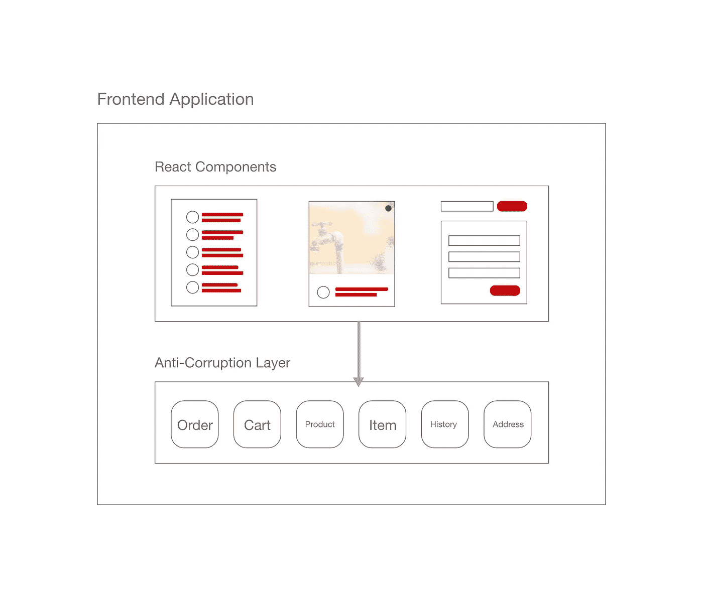

# 在 React 应用程序中放置业务逻辑的正确方法

> 原文：<https://itnext.io/the-right-way-to-place-business-logic-in-your-react-application-8bf16145f48d?source=collection_archive---------0----------------------->

*更新(2022 年 7 月 17 日):我最近总结了我在许多文章中讨论过的模式，并在 leanpub* *中发表了一本关于* [*主题的书。现在差不多完成了(90%)，如果你能给我提供任何反馈，那就太好了。*](https://leanpub.com/maintainable-react)

如果你有兴趣深入这个主题，我已经创建了一个在线课程[涵盖了这篇文章中讨论的所有主题以及更多。本课程旨在互动、吸引人，并包含实用的技巧和技术。课程结束时，你将对这门学科有一个扎实的理解，并能够在日常生活中运用所学。](https://icodeit.thinkific.com/courses/maintainable-react)

我们已经讨论了 React 应用程序中的项目结构，如何命名我们的文件，何时使用`hooks`来管理副作用等等。我们甚至会讨论在我们的观点中应该采用哪种编程范式。但是在这些讨论中，我们没有过多触及一个话题，那就是我们应该把我们的商业逻辑放进去的地方。我认为，部分原因是我们忽略了 React 是一个构建视图的库(而不是框架)。

在许多情况下，开发人员会简单地将逻辑写入他们的组件。即使是有经验的开发人员通常也只是停留在将这些计算和逻辑提取到一个定制的钩子或者一些辅助函数中。但是这种提取方式没有解决这个问题。事实是，即使我们有更小的组件，并将逻辑移入钩子或助手中，它们实际上是无组织地分散在各处。以一个网上购物应用程序为例，如果我们想改变`cart`中的逻辑，很可能我们也会改变`product`和`validation`模块。我们通常必须改变助手和视图(更不用说这些相关的测试设备了)。

# 全景

而我们应该跳出细枝末节，站在更高的层面来审视整个问题。如果你仔细看看 React，并接受它只负责我们应用程序的视图部分，我们面临的许多问题将会自动修复。不管我们是使用传统的`MVC/MVP`模式还是它们的变体`MVVM`，如果 React 是`V`，显然我们需要其他东西来填充应用程序中的`M`或`VM`角色，对吗？

在许多项目中，我还发现我们在后端使用的许多好的实践在前端世界中不太被注意/认可，例如分层、设计模式等等。一个潜在的原因是前端相对较新，需要一些时间来赶上。例如，在一个典型的 Spring MVC 应用程序中，我们会有`controller`、`service`和`repository`，每个开发人员都接受这种分离背后的原因:`controller`没有业务逻辑，`service`不知道模型如何呈现或序列化给消费者，而`repository`只关心数据访问。然而，在前端应用程序中，我们以某种方式将 React 应用程序与 Spring 进行比较，由于缺乏原生支持(就像没有开箱即用的控制器或存储库)，我们将这些代码编写成组件。这将导致业务逻辑无处不在，随之而来的是缓慢的迭代和较低的代码质量。

# 业务逻辑泄漏

我们可以称之为`business logic leakage`，意思是业务逻辑本来应该放在某个地方，由于某种原因(维护或管理不好)放错了。虽然我们没有一个好的机制，但结果是它们被写在任何“方便”的地方(在组件、钩子和助手函数中)。


与真实世界中的泄漏 tap 不同，在代码中捕捉这种泄漏有点困难。你必须更加注意才能看到它们。以下是我发现的一些常见症状:

*   使用变压器
*   x.y.z
*   防御性编程

# 使用变压器

很容易检测到这种模式:如果您正在执行`map`来转换数据，您可能正在跨越两个有界的上下文(这可能导致逻辑泄漏)。我们都见过或可能写过这样的代码:

```
fetch(`https://5a2f495fa871f00012678d70.mockapi.io/api/addresses`)
.then((r) => r.json())
.then((data) => {
    const addresses = data.map((datum: RemoteAddress) => ({
        street: datum.streetName,
        address: datum.streetAddress,
        postcode: datum.postCode
    })) setAddresses(addresses)
});
```

在上面的代码片段中，后端服务返回的内容与前端使用的内容并不完全匹配，因此我们需要转换/翻译它。这可能是因为我们正在使用另一个团队开发的服务，或者我们正在使用第三方服务(比如 Google Search API)。因此，看似无害的代码违反了一些原则:

*   一个组件需要知道`RemoteAddress`类型
*   一个组件需要定义一个新类型`Address` (setAddresses)
*   data.map 正在进行一些较低级别的映射

# x.y.z

如果你使用了不止一个点`.`操作符，很可能意味着一些概念丢失了。例如，`person.deliveryAddress`比`person.primaryAddress.street.streetNumber + person.primaryAddress.suburb`更好，因为前者适当地隐藏了细节。

下面的代码表明`ProductDialog`对`product`了解太多，一旦`product`的结构改变，我们必须改变很多地方(测试和组件)

```
const ProductDialog = (props) => {
  const { product } = props; if(product.item.type === 'Portion') {
    //do something
  }
}
```

显然我们在处理*数据*，而不是这里的*模型*。所以`product.isPortion()`会比原始数据检查更有意义。

# 防御性编程

就我个人而言，我对防御性编程没什么意见，我也在某些场合使用它。但我在许多项目中发现，人们倾向于在组件中做太多，这增加了很多噪音。

例如:

```
const ProductDetails = (props) => {
  const { product } = props
  const { item } = product
  const { media } = item as MenuItem

  const title = (media && media.name) || ''
  const description = (media && media.description) || '' return (
    <div>
      {/* product details */}
    </div>
  )
}
```

注意，我们在组件的中做空检查和回退操作，我们应该在一个专门的地方做这种类型的逻辑。

# 如何修复该问题？

实际上，我们可以尝试两步走的方法来解决这个问题。

1.  常规重构
2.  系统模型化

# 常规重构

首先，当我们在 React 组件中看到一些逻辑时，我们可以像在任何其他情况下一样执行重构。例如，只需将逻辑/计算从:

*   变形金刚(电影名)
*   x.y.z
*   防御性编程

帮助函数。以上面的转换器为例，我们可以简单地将匿名函数提取到一个命名函数中，并将其移动到一个单独的文件中:

```
const transformAddress: Address = (address: RemoteAddress) => {
    return ({
        street: datum.streetName,
        address: datum.streetAddress,
        postcode: datum.postCode
    })
}//...
const addresses = data.map(transformAddress)
```

这种情况下看起来没什么大不了的。但是在大多数情况下，我们会放很多空头支票或者回退等等。我们通常需要做一些翻译，例如，我们从 remote 获取的州名是缩写，如 VIC 或 NSW，但我们需要在页面上以全文显示它们，如 Victoria 或 New South Wales。

```
const states = {
  vic: "Victoria",
  nsw: "New South Wales",
  //...
};const transformAddress: Address = (address: RemoteAddress) => {
  return {
    street: address.streetName,
    address: address.streetAddress,
    postcode: address.postCode,
    state: states[address.state.toLowerCase()]
  };
};
```

同样，我们可以用`extract function`把`title`和`description`做成一个函数:

```
const getTitle = (media) => (media && media.name) || ''
const getDescription = (media) => (media && media.description) || ''
```

随着越来越多的像`transformAddress`和`getTitle`这样的逻辑被移到`helpers.ts`中，最终我们将拥有一个庞大的万能文件。这意味着它将变得不可读和高维护成本。我们可以将文件分成模块，但是这些函数之间的引用会使它们难以理解。这有点像我们在面向对象编程之前面临的问题——我们有太多的模块，每个模块中有太多的函数，浏览它们太困难了。换句话说，我们需要一种更好的方式来组织这些助手功能。

幸运的是，我们不需要重新发明轮子，面向对象编程就是为此而生的。通过在 OOP 中简单地使用`class`和`encapsulation`，我们可以很容易地将这些函数分组，并使代码更具可读性。分组的过程被称为建模，这意味着我们需要建立一种更好的方式来组织数据，使 UI 组件更容易使用。

# 系统模型化

简而言之，建模是将数据和行为放在一起，隐藏细节，并为消费者提供一种通用语言。例如，我们不应该使用`product.item.type === 'Portion'`，相反，我们应该创建一个`Product`类，它有一个`isPortion`用于它们的消费者。这在后端服务中很常见，但在前端世界中还没有广泛使用。原因是，如上所述，人们忽略了`React`只负责视图。一个健康的前端应用程序也应该有其他部分，它需要模型、与后端通信的逻辑，甚至日志/路由等等。但是在本文中，我们将只关注建模和逻辑。

回到上面的例子，通过定义一个`Address`类来替换`data.map`中的匿名函数，我们得到:

```
class Address {
  constructor(private addr: RemoteAddress) {} get street() {
    return this.addr.streetAddress;
  } get postcode() {
    return this.addr.postcode;
  }
}
```

在用法上没有什么不同:

```
const AddressLine = ({ address }: { address: Address }) => (
  <li>
    <div className="result">{address.street}</div>
  </li>
);
```

唯一需要改变的是将`transformAddress`替换为`new Address`:

```
const addresses = data.map((addr: RemoteAddress) => new Address(addr))
```

对于状态名转换的私有成员/函数:

```
private readonly states = {
    vic: "Victoria",
    nsw: "New South Wales",
    //...
  }; get state() {
    return this.states[this.addr.state.toLowerCase()];
  }
```

现在结构清晰多了。`states`现在是类`Address`的私有成员。类的好处是它将所有相关的逻辑聚合到一块，所以它们是隔离的，易于维护。

将所有相关的逻辑放在一个地方还有其他好处。首先，这种分离使得测试变得非常容易和可靠，因为组件依赖于模型(而不是原始数据)，我们不需要为组件测试准备空值或越界数据。同样，测试模型更关注数据和逻辑(空值、验证和回退)。其次，一致性使得它更有可能在其他场景中被重用。最后，如果我们需要切换到另一个第三方服务，我们只需要修改模型，视图基本上可以保持不变。



前端应用程序中的反腐败层

随着越来越多的模型被创建，我们可能需要为它们创建一个完整的层。这部分代码不知道 UI 组件的存在，并且纯粹围绕业务逻辑。我们将该层称为反腐败层，它防止不可靠的第三方数据结构破坏我们的视图。通过这个中间层，我们唯一需要改变的就是模型中的变形金刚。

# 摘要

封装业务逻辑，即使在瘦客户机的环境中，也是一个相对较大的话题。在本文中，我们讨论了业务逻辑泄漏的几种症状，以及如何处理它们。通过进行定期重构，我们可以确保组件只负责呈现数据，而不应该进行任何计算或数据映射。我们应该将这些逻辑分离到纯 JavaScript 文件中(而不是 jsx/tsx)。通过建模，我们可以使用对象来隐藏细节，只使用`getter`来访问数据。它将所有的逻辑封装在模型中，并允许视图更简单地完成它们的工作。这种方法给我们带来的好处是:更容易对模型和视图进行测试，更容易跟踪业务需求变化，以及更简单的视图代码(因为大部分工作都是在模型中完成的)。

# 参考

*   [重构访问外部服务的代码](https://martinfowler.com/articles/refactoring-external-service.html)
*   [GUI 架构](https://martinfowler.com/eaaDev/uiArchs.html)
*   [模型-视图-视图模型](https://en.wikipedia.org/wiki/Model%E2%80%93view%E2%80%93viewmodel)