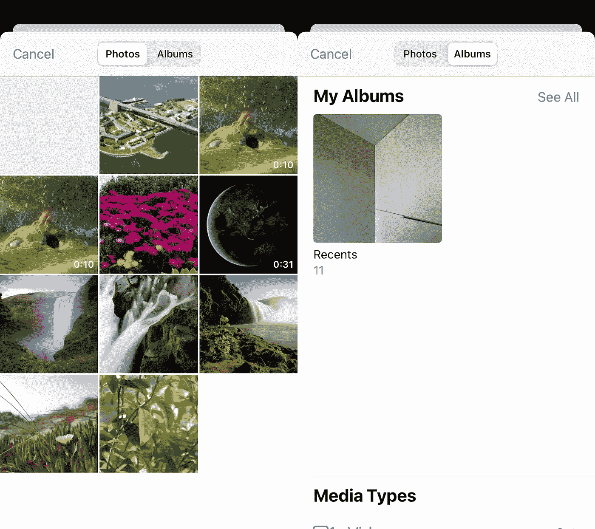
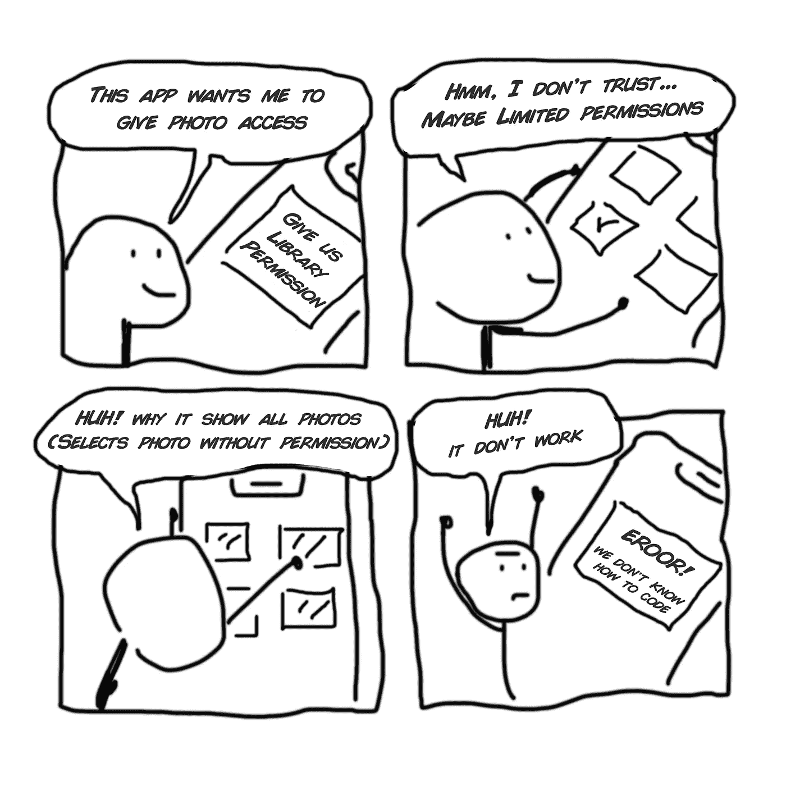

# 使用 PHPicker 和检索 EXIF 数据而无需在 Swift 中请求库权限的正确方法

> 原文：<https://itnext.io/the-right-way-to-use-phpicker-and-retrieve-exif-data-without-requesting-library-permissions-in-336c13f87e3f?source=collection_archive---------0----------------------->

在这篇短文中，我将概述使用 PHPicker 的正确方法以及何时不使用 PHPicker。这篇文章背后的原因是我在尝试用 PHPicker 构建一个本地库时遇到的挫折。互联网上的许多文章都在方法上有所限制，没有解决一些核心问题以及 PHPicker 和 iOS 权限的问题。

我们来谈谈存在的问题。

## PHPicker 是什么？

从 iOS 14 开始，PHPicker 是系统提供的 Picker，它允许您访问用户照片库中的照片和视频。



## PHPicker 和库权限的问题

> 库权限不应该与 PHPicker 一起使用。

在使用具有库权限的 PHPicker 时，存在一些基本的用户体验问题。但是首先，为什么我们要在使用 PHPicker 时请求库权限呢？

互联网上排名最高的文章鼓励您使用 PHAsset 和 PHPicker 来获取额外的数据，如 exif 和结果的位置信息。这样做的问题是，要获取 PHAsset，您必须拥有库权限来访问资产，这违背了 PHPicker 的核心理念:Picker 可以在不需要请求权限的情况下使用。

苹果公司自己甚至建议，你应该只在“必要”时请求许可，但不要详细说明这导致的边缘情况。

就像我说的…几个小时的挫折，我遇到的所有教程都鼓励你使用 PHAsset 来获取元数据。没有人建议你用其他方式获得 exif 元数据，这就是我今天要给你提供的，其他方式…正确的方式。

除了需要请求权限之外，另一个问题是用户何时选择受限的库访问。这可能会产生一些令人困惑的用户体验问题。PHPicker 仍然会显示所有照片(甚至是没有通过有限 Picker 获得许可的照片),选择一张没有通过有限照片选择对话框获得许可的照片将导致应用程序无法检索⁴.相没有 PHAsset，大多数关于如何获取元数据和处理 PHPicker 结果的教程都有所欠缺。

从用户的角度来看，它看起来像这样:

你的应用程序请求访问用户库
*用户说:“我将只给这个应用程序有限的访问一些照片”*

您的应用程序打开 PHPicker 并显示所有照片
*用户说:“哈，我以为我只给了有限的访问权限，哦好吧”*

用户选择了一张他们没有给我们访问权限的照片。
*应用程序现在需要什么都不做，或者向用户解释，要检索他们选择的照片的某些元数据，他们必须再次更新他们的权限。*

用户感到困惑。



关于 PHPicker 的连环漫画

所有这些问题的发生都是因为我们将库权限与 PHPicker 结合使用。PHPicker 从来不是用来这样使用的。许多教程推荐这种方式，无意中建议在使用 PHPicker 时使用 PHAsset 作为提取 exif 数据的直接方式。将 PHAsset 与 PHPicker 一起使用是一种反模式。

## 使用 PHPicker 的正确方法

为了创建一个易于遵循的指南，让我们从头开始。
您想用一个配置来设置您的 PHPicker 并展示它:

```
var configuration = PHPickerConfiguration();
...let picker = PHPickerViewController(configuration: configuration);
picker.delegate = self
self.present(picker, animated: true, completion: nil)
```

然后确保您的类扩展了*PHPickerViewControllerDelegate*、*UIAdaptivePresentationControllerDelegate*并实现了 *picker()* 实例方法:

```
class MyPickerClass: PHPickerViewControllerDelegate,         UIAdaptivePresentationControllerDelegate { func picker(
     _ picker: PHPickerViewController, 
     didFinishPicking results: [PHPickerResult]
   ) {
      // This is where the magic happens 🪄
   }
}
```

现在在 *picker* 方法中，我们可以在这里检索资产和元数据。在这一点上，大多数文章要么指导你使用*nsiteprovider*(它不需要库权限)，但没有告诉你如何获得 exif 数据，要么告诉你使用 *PHAsset* ，这是使用 *PHPicker* 的错误方式，因为我们需要⁵.的权限

> PHAsset 不应该与 PHPicker 一起使用，这不是使用这些 API 的正确方式

现在让我们来看看代码。

首先，我们希望循环遍历结果并提取 NSItemProvider:

```
func picker(
  _ picker: PHPickerViewController, 
  didFinishPicking results: [PHPickerResult]
) {
  for result in results {
     let itemProvider: NSItemProvider = result.itemProvider;
  }
}
```

使用 *itemProvider* 我们现在可以读取对象的类型，并根据它是照片、视频还是其他东西来处理它。有几种方法可以做到这一点，但我发现最好的方法是:

```
func picker(_ picker: PHPickerViewController, didFinishPicking results: [PHPickerResult]) {for result in results {
        let itemProvider: NSItemProvider = result.itemProvider;if(itemProvider.hasItemConformingToTypeIdentifier(UTType.image.identifier)) {
   // Handle the image here
        } else  if(itemProvider.hasItemConformingToTypeIdentifier(UTType.movie.identifier)) {
          // Handle the video here
        } else {
          // Unsupported asset
        }
    }
}
```

一旦我们知道了资产的类型，我们就可以加载它。在这种情况下，从*nsiteprovider*加载资产的最佳方式是 *loadFileRepresentation* ，它允许我们轻松地访问 exif 数据。虽然您可以根据自己的需求使用 *loadItem* 、 *loadFileRepresentation* 、 *loadObject* 等。参见 [NSItemProvider](https://developer.apple.com/documentation/foundation/nsitemprovider) 文档。

```
func picker(_ picker: PHPickerViewController, didFinishPicking results: [PHPickerResult]) {for result in results {
        let itemProvider: NSItemProvider = result.itemProvider;if(itemProvider.hasItemConformingToTypeIdentifier(UTType.image.identifier)) {
   itemProvider.loadFileRepresentation(forTypeIdentifier: UTType.image.identifier) { data, error in
    // Now we can get EXIF data
           }
        }
    }
}
```

一旦我们有了*数据*对象，在这种情况下，当在图像上使用*加载文件表示*时，它将是类型 *URL* 。我们可以使用它从资产中加载 exif 数据:

```
if let url = data as? URL {
   let options = [kCGImageSourceShouldCache as String:  kCFBooleanFalse]
   let data = NSData(contentsOf: url)
   let imgSrc = CGImageSourceCreateWithData(data, options as CFDictionary)
   let metadata = CGImageSourceCopyPropertiesAtIndex(imgSrc, 0, options as CFDictionary)
}
```

元数据数据对象如下所示(从 Xcode 控制台拷贝):

```
ColorModel = RGB;
DPIHeight = 72;
DPIWidth = 72;
Depth = 8;
Orientation = 6;
PixelHeight = 3024;
PixelWidth = 4032;
PrimaryImage = 1;
ProfileName = "Display P3";
"{TIFF}" = {
    DateTime = "2022:05:26 14:28:29";
    HostComputer = "iPhone XR";
    Make = Apple;
    Model = "iPhone XR";
    Orientation = 6;
    ResolutionUnit = 2;
    Software = "15.4.1";
    TileLength = 512;
    TileWidth = 512;
    XResolution = 72;
    YResolution = 72;
},
"{Exif}" = {
    ApertureValue = "1.69599381283836";
    BrightnessValue = "2.126521070833867";
    ColorSpace = 65535;
    CompositeImage = 2;
    DateTimeDigitized = "2022:05:26 14:28:29";
    DateTimeOriginal = "2022:05:26 14:28:29";
    ExifVersion =     (
        2,
        3,
        2
    );
    ExposureBiasValue = 0;
    ExposureMode = 0;
    ExposureProgram = 2;
    ExposureTime = "0.02";
    FNumber = "1.8";
    Flash = 16;
    FocalLenIn35mmFilm = 26;
    FocalLength = "4.25";
    ISOSpeedRatings =     (
        200
    );
    LensMake = Apple;
    LensModel = "iPhone XR back camera 4.25mm f/1.8";
    LensSpecification =     (
        "4.25",
        "4.25",
        "1.8",
        "1.8"
    );
    MeteringMode = 5;
    OffsetTime = "+02:00";
    OffsetTimeDigitized = "+02:00";
    OffsetTimeOriginal = "+02:00";
    PixelXDimension = 4032;
    PixelYDimension = 3024;
    SceneType = 1;
    SensingMethod = 2;
    ShutterSpeedValue = "5.644289064920122";
    SubjectArea =     (
        2013,
        1511,
        2217,
        1330
    );
    SubsecTimeDigitized = 579;
    SubsecTimeOriginal = 579;
    WhiteBalance = 0;
},
"{GPS}" = {
    Altitude = "19.96612929490311";
    AltitudeRef = 0;
    DestBearing = "272.5662841313811";
    DestBearingRef = T;
    HPositioningError = "7.460463890353189";
    ImgDirection = "272.5662841313811";
    ImgDirectionRef = T;
    Latitude = "39.47537";
    LatitudeRef = N;
    Longitude = "0.3831666666666667";
    LongitudeRef = W;
    Speed = 0;
    SpeedRef = K;
},
```

然后，您可以从元数据变量中提取如下属性:

```
metadata[kCGImagePropertyColorModel];
metadata[kCGImagePropertyPixelWidth];
metadata[kCGImagePropertyPixelHeight];
```

很难处理这个对象，所以我创建了一个名为 [ExifData](https://gist.github.com/lukebrandonfarrell/961a6dbc8367f0ac9cabc89b0052d1fe) 的类，你可以用它来处理这个对象，它目前支持来自 exif 对象的 26 个值，你可以根据自己的需要扩展这个类。它可以这样使用:

```
let exif = ExifData(data: data);
let exif = ExifData(url: url);exif.dateTimeDigitized
```

它支持使用*数据*、 *URL* 或 *UIImage* 进行初始化，这意味着您可以使用以下方法 *loadItem* (将返回一个 *UIImage* )、 *loadDataRepresentation* (将返回一个*数据*对象)和 *loadFileRepresentation* (将返回一个 *URL* )。

**重要！**需要注意的一点是 *UIImage.pngData()* 和 *UIImage.jpegData()* 从这些方法返回的结果 *Data* 对象中剥离 exif 数据。因此，如果您使用这些方法进行压缩，请确保在此之前提取 exif 数据！

我们做到了！我们有一种方法可以使用 *PHPicker* 获得资产，并且在不请求许可的情况下检索 exif 数据。由于 *ExifData* 类我已经与你分享了接受 *URL* 、*数据*和 *UIImage* 数据类型，它应该给你在选择之后做你可能想要在图像上执行的其他操作的灵活性，例如压缩和调整大小。这里有一篇关于 UIImage 的大小调整和压缩的很棒的文章:[图像大小调整技术— NSHipster](https://nshipster.com/image-resizing/) 。

## 参考

*   [1] —苹果开发者文档[苹果开发者文档]([https://Developer . Apple . com/Documentation/photokit/phpickerviewcontroller](https://developer.apple.com/documentation/photokit/phpickerviewcontroller))。
*   [2] —建议使用 PHPicker 的 PHAsset 的排名靠前的文章:[在 SwiftUI 中使用 PHPicker 获取照片元数据—Felix Larsen]([https://www . Felix Larsen . com/blog/photo-metadata-PHPicker view](https://www.felixlarsen.com/blog/photo-metadata-phpickerview))。
*   [3] —苹果建议只有在“必要”的情况下才请求许可[见见新的照片拾取器— WWDC20 —视频—苹果开发者](【https://developer.apple.com/videos/play/wwdc2020/10652/? 时间=633 )。
*   [4] — PHPicker 和权限混淆【对 PHPicker 的隐私|苹果开发者论坛感到困惑】([https://developer.apple.com/forums/thread/652819](https://developer.apple.com/forums/thread/652819))。
*   [5] —关于 PHPicker 的深度指南(不包括如何提取 exif 数据)iOS 14 中 PHPicker 的完整指南]([https://www.appcoda.com/phpicker/](https://www.appcoda.com/phpicker/))。