# 数据可视化的根源

> 原文：<https://itnext.io/the-roots-of-data-visualization-9e6ca7c1a884?source=collection_archive---------7----------------------->

[*点击这里在 LinkedIn 上分享这篇文章*](https://www.linkedin.com/cws/share?url=https%3A%2F%2Fitnext.io%2Fthe-roots-of-data-visualization-9e6ca7c1a884)

很多年前，我读过保罗·格拉厄姆写的一篇非常鼓舞人心的文章:[Lisp 的根源](http://www.paulgraham.com/rootsoflisp.html)。给定有限数量的操作符和一个单一的数据结构(列表)，您可以构建一种编程语言。那一刻，我被简单的哲学震惊了:一方面，lisp 很小，每个操作符都很简单；另一方面，像宏、高阶函数、递归之类的东西可以帮助你构建任何复杂的程序员。最美妙的是，复杂的东西是用最简单的组件建造的。

最近，我在研究与数据可视化相关的东西，发现同样的哲学也适用于这里。一个吸引人的、漂亮的数据可视化可能只由很少的元素组成，如形状、长度、颜色、纹理和角度。

实际上，Nathan Yau 是《数据点:有意义的可视化》一书的作者，他在下图中列出了书中常用的元素:

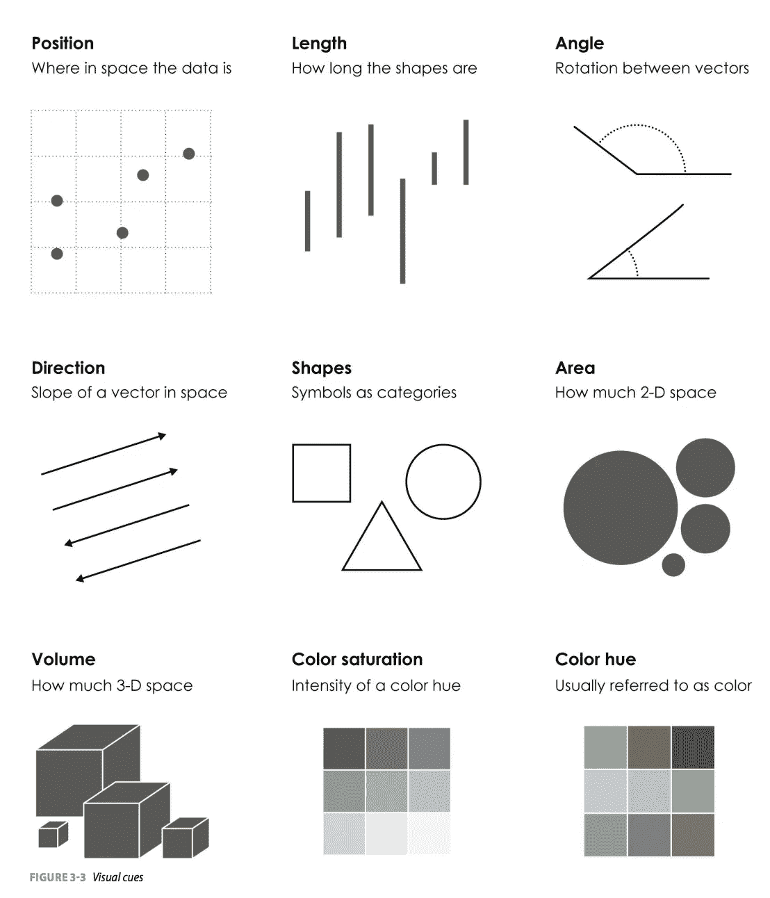

视觉线索——来自 Nathan Yau

令人兴奋的事实是，通过将这些元素组合在一起，您可能会实现`1+1>2`。

# 心理学和认知系统

数据可视化实际上是基于人类的视觉认知系统。因此，对人类视觉系统如何工作的一些理解可以帮助我们设计更有效的可视化(更快地向读者传递我们想要表达的信息)。

## 心理学

在生活中，我们会遇到这样的情景:如果一件产品原价 10 美元，如果折扣价是 5 美元，消费者将极有可能购买它；但是如果产品的价格是 100 美元，打折后的价格是 95 美元，那就没那么有吸引力了。所以这两种折扣的绝对数量是相同的(都是 5 美元)，但效果是不一样的。

这被描述为[韦伯-费希纳定律](https://en.wikipedia.org/wiki/Weber%E2%80%93Fechner_law):

> *韦伯-费希纳定律是指心理物理学领域的两个相关定律，即韦伯定律和费希纳定律。这两个定律都与人类感知有关，更具体地说，与物理刺激的实际变化和感知变化之间的关系有关。这包括对所有感官的刺激:视觉、听觉、味觉、触觉和嗅觉。*

这可能会影响到我们在设计一些可视化时，需要考虑以下事情:

*   避免使用面积进行比较
*   当差异足够大时，考虑使用非线性视觉元素
*   使用多种颜色作为视觉编码时，使色差足够大

例如:

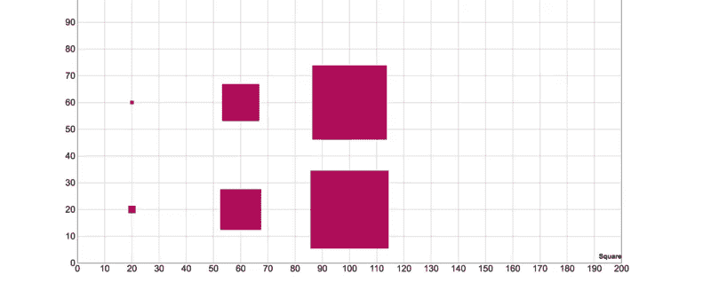

在上面的图像中，当面积增加时，你很难通过正方形来区分实际的差异。如果仔细观察底层数据，会发现绝对差都是 5:

```
var data = [
  {width: 5, height: 5},
  {width: 10, height: 10}, {width: 50, height: 50},
  {width: 55, height: 55}, {width: 100, height: 100},
  {width: 105, height: 105}
];
```

## 格式塔心理学

> *格式塔心理学或格式塔主义(德语:格式塔[ɡəˈʃtalt]“形状，形式”)是柏林实验心理学派的一种心灵哲学。格式塔心理学试图理解在一个明显混乱的世界中获得和保持有意义的感知能力背后的规律。格式塔心理学的中心原则是，心灵形成一个具有自组织倾向的全球整体。*

它强调人类看到一个画面，会先简化成一个整体，再细化成各个部分；而不是先识别每个部分，再组合成一个整体。

最著名的达尔马提亚狗:

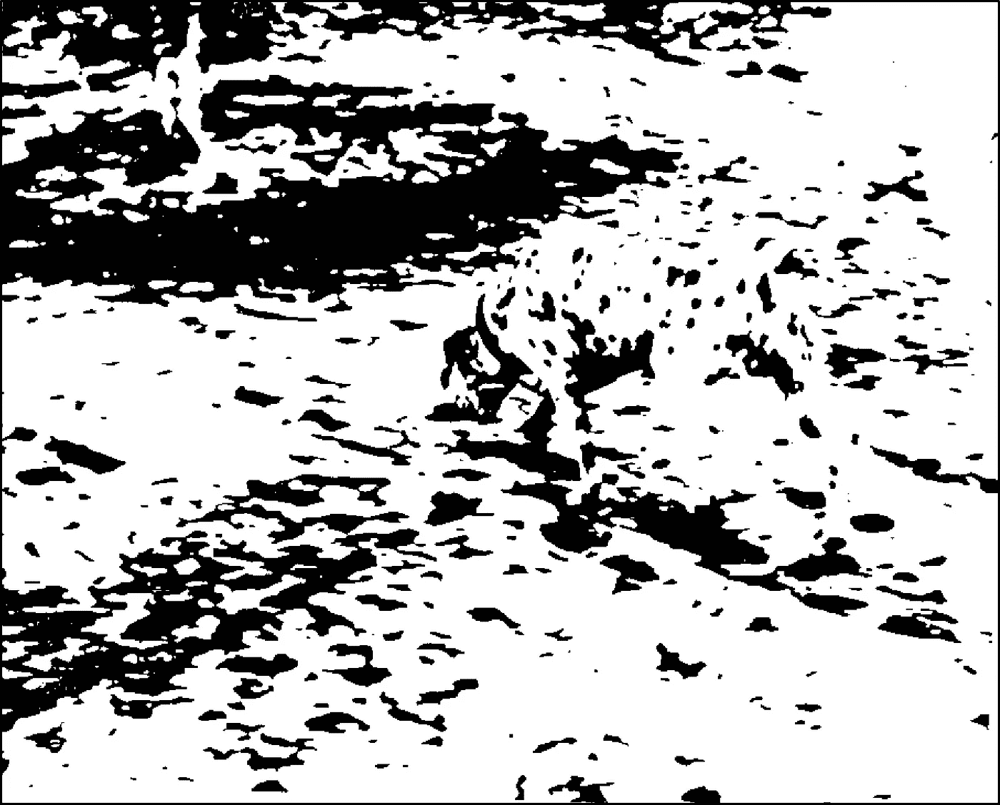

著名的达尔马提亚狗

你可以很容易地(嗯，也许没那么容易)识别出一只在悬垂的树荫下嗅着地面的狗，但是通过首先识别它的身体部位，狗是不会被识别出来的。

实际上，格式塔原则包含许多次级原则:

*   邻近定律
*   类似律
*   闭合定律
*   对称定律
*   共同命运法则

我不会一一列举，因为互联网上有很多这样的例子。请记住，当你设计一些可视化产品时，考虑使用这些法则来帮助你建立一些易于人们消费的东西。

# 视觉设计的基本原则

在他的书*非设计师的设计书*中，Robin Williams 讨论了视觉设计的 4 个非常基本的原则:

*   对比(使用不同的颜色、字体、字号来构建信息层次)
*   重复(重复样式，如标题所用的颜色)
*   对齐(垂直或水平对齐)
*   邻近性(将相关事物放得更近)

看看这个简单的例子:


## 一些简单的用法

*   淡化折线图的背景网格(对比)
*   突出显示异常值(不同颜色形成对比)
*   图表和图例中使用的颜色(重复)
*   靠近轴的标签(接近度)

好了，理论已经足够了，让我们跳到一个非常具体的例子，看看我们如何将这些原则应用于它。

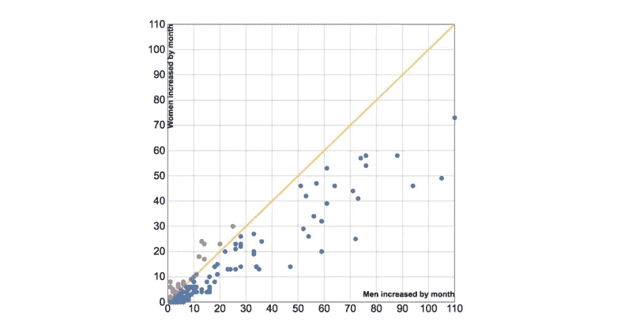

# 星夜图

我从我女儿的日常活动中收集了一些数据(基本上，她只做 3 种事情:吃饭、睡觉和玩一会儿)。

数据可视化的第一步是`what do you want to get from the data`，在这种情况下，我只想知道她每天睡多少小时，分布情况如何。

## 增强型条形图

一旦我有了视觉化的概念，下一步就是选择正确的视觉编码。所以对于我们人类的眼睛来说，最准确的编码是`length`。我需要将`sleeping hours`转换成`length`，最简单的方法是条形图。

我们期望的数据(CSV 格式)如下:

```
2016/11/21,768
2016/11/22,760
2016/11/23,700
```

第一个字段是日期，第二个字段是睡眠时间。我在纸上画了一些草图，如图所示:

Y 轴表示 24 小时内每天的时间，X 轴表示日期。实心矩形表示她在睡觉，而虚线矩形表示她醒着。

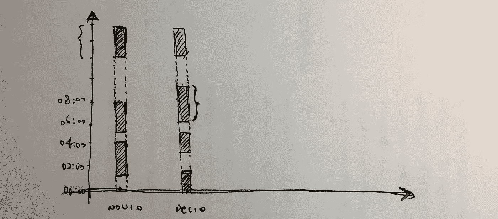

起草

## 原始数据

```
name,date,length,note
心心,2016/11/21 19:23,119,
心心,2016/11/21 22:04,211,
心心,2016/11/22 02:03,19,
心心,2016/11/22 02:23,118,
心心,2016/11/22 05:58,242,
心心,2016/11/22 10:57,128,
心心,2016/11/22 14:35,127,
心心,2016/11/22 17:15,127,
心心,2016/11/22 20:02,177,
心心,2016/11/23 01:27,197,
```

这里有一个小问题，就是我们的 Y 轴是固定长度的，如果她从 23:00 开始睡觉，3 个小时后醒来，那么 Y 轴上的横条将超过 24。

所以我写了一个简单的脚本来转换数据:

```
require 'csv'
require 'active_support/all'
require 'json'csv = CSV.read('./visualization/data/sleeping_data_refined.csv', :headers => :first_row)data = []
csv.each do |row|
    date = DateTime.parse(row['date'], "%Y/%m/%d %H:%M")

    mins_until_end_of_day = date.seconds_until_end_of_day / 60
    diff = mins_until_end_of_day - row['length'].to_i

    if (diff >= 0) then
        data << {
            :name => row['name'],
            :date => row['date'],
            :length => row['length'],
            :note => row['note']
        }
    else 
        data << {
            :name => row['name'],
            :date => date.strftime("%Y/%m/%d %H:%M"),
            :length => mins_until_end_of_day,
            :note => row['note']
        } data << {
            :name => row['name'],
            :date => (date.beginning_of_day + 1.day).strftime("%Y/%m/%d %H:%M"),
            :length => diff.abs,
            :note => row['note']
        }
    end
end
```

一旦我们有了`cleaned`数据，我们就可以试着画出条形图。以下是需要考虑的几点:

*   时间应该与零对齐
*   她睡得越久，酒吧就应该越深

```
var dateRange = _.uniq(data, function(d) {
    var date = d.date;
    return [date.getYear(), date.getMonth(), date.getDate()].join("/");
});xScale.domain(dateRange.map(function(d) { return d.date; }));function getFirstInDomain(date) {
    var domain = xScale.domain(); var index = _.findIndex(domain, function(d) {
        return date.getYear() === d.getYear() 
            && date.getMonth() === d.getMonth() 
            && date.getDate() === d.getDate();
    }); return domain[index];
}
```

函数`getFirstInDomain`按日期返回`X`，所以日期`2016/11/21 19:23`和`2016/11/21 22:04`将返回 d3.scale 的一个整数

我们可以根据睡眠时间将睡眠质量分为 5 个等级，使用 d3 非常简单:

```
var level = d3.scale.threshold()
  .domain([60, 120, 180, 240, 300])
  .range(["low", "fine", "medium", "good", "great", "prefect"]);
```

我们可以在矩形上添加不同的`CSS Class`:

```
svg.selectAll(".bar")
    .data(data)
    .enter()
    .append("rect")
    .attr("class", function(d) {
        return level(d.length)+" bar";
    })
//...
```

好了，最后的输出看起来是这样的。我们可以知道她早上 0-6 点睡觉，然后下午 10-13 点，最后晚上 18-20 点睡觉。

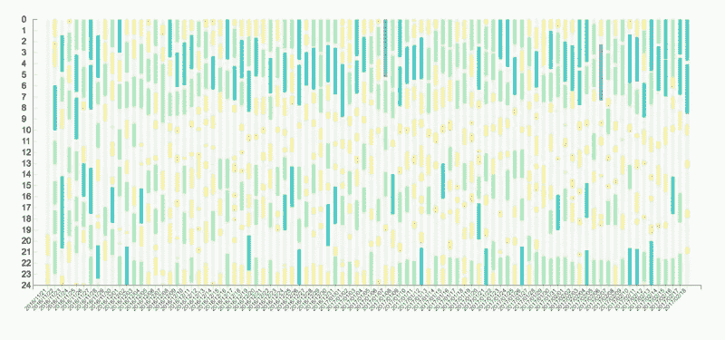

星形条形图

## 星夜图

但是当数据增加时就有问题了。我们可以尝试另一种方式，比如径向轴。因为我们设想了与`time`相关的东西，所以实现`watch`的周期会很棒。

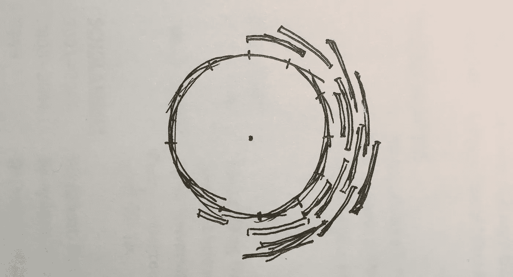

星夜图草稿

## 将角度转换为弧度

这里需要一点数学，我们先把圆(360 度)分成分钟，然后每分钟的角度数为:`360/(24*60)`，再用公式把角度换算成弧度:`degree * π/180`:

```
var perAngle = (360 / (24 * 60)) * (Math.PI/180);
```

对于任何特定的时间，比如说`10:20`，我们首先计算分钟数:`10*60+20`，乘以`preAngle`，结果就是起始弧角，再加上睡眠分钟数的倍数`preAngle`就得到终止弧角:

```
function startAngle(date) {
    var start = (date.getHours() * 60 + date.getMinutes()) * perAngle;
    return Math.floor(start*1000)/1000;
}function endAngle(date, length) {
    var end = (date.getHours() * 60 + date.getMinutes() + length) * perAngle;
    return Math.floor(end*1000)/1000;
}
```

所以结果看起来是这样的:

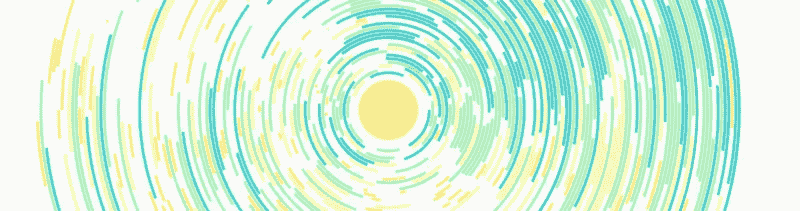

星图(部分)

此外，我们可以使用线性比例和 *svg* 渐变来为图形绘制图例(非常感谢[关于 svg 渐变](https://www.visualcinnamon.com/2016/05/smooth-color-legend-d3-svg-gradient.html)的伟大帖子 *Nadieh Bremer* )。):

```
var colorScale = d3.scale.linear()
  .range(["#2c7bb6", "#00a6ca","#00ccbc","#90eb9d","#ffff8c","#f9d057"].reverse());var defs = vis.append("defs");var linearGradient = defs.append("linearGradient")
    .attr("id", "linear-gradient")
    .attr("x1", "0%")
    .attr("y1", "0%")
    .attr("x2", "100%")
    .attr("y2", "0%");linearGradient.selectAll("stop") 
  .data( colorScale.range() )                  
  .enter().append("stop")
  .attr("offset", function(d,i) { return i/(colorScale.range().length-1); })
  .attr("stop-color", function(d) { return d; });
```

一旦我们有了梯度和范围，我们就可以用它来绘制图例。

```
var legendWidth = 300;var legendsvg = vis.append("g")
  .attr("class", "legendWrapper")
  .attr("transform", "translate(" + (width/2+legendWidth) + "," + (height - 40) + ")");//Draw the Rectangle
legendsvg.append("rect")
  .attr("class", "legendRect")
  .attr("x", -legendWidth/2)
  .attr("y", 0)
  .attr("width", legendWidth)
  .attr("height", 3.5)
  .style("fill", "url(#linear-gradient)");

//Append title
legendsvg.append("text")
  .attr("class", "legendTitle")
  .attr("x", 0)
  .attr("y", -10)
  .style("text-anchor", "middle")
  .text("Sleeping Minutes");
```

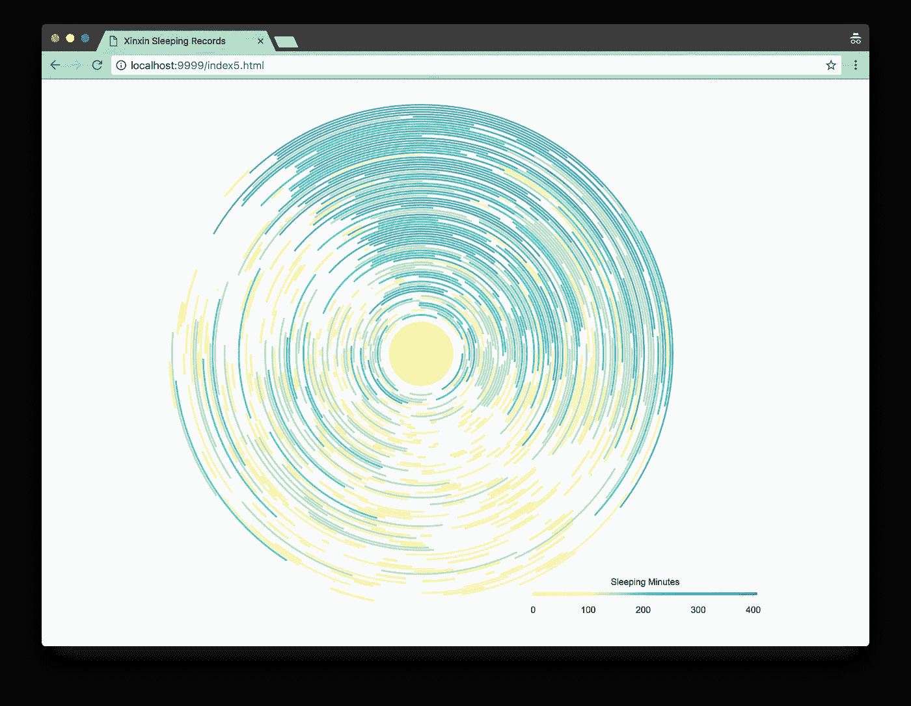

带图例的星夜图

我还为每个弧线添加了一个工具提示。

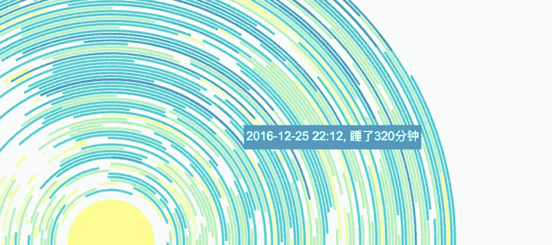

悬停时的工具提示

最终的可运行演示在这里托管:[欣欣的睡眠状态](http://bl.ocks.org/abruzzi/d01a221df9cf79b918a00033695092c9)，你可以在这里找到所有的[代码]((https://github.com/abruzzi/health-recording))。

添加一些背景图片后，最终版本看起来是这样的:

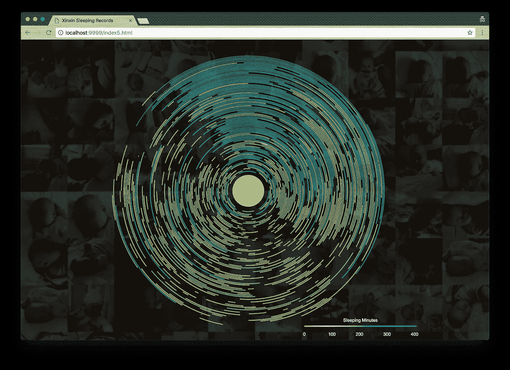

星夜图的最终版本

# 摘要

我们讨论了数据可视化的一些理论，以及构建一个真正的可视化程序的原子元素。我们也谈到了视觉设计的一些原则，可以使表达更有效。最后，有一个端到端的例子，说明我们如何应用这些原则和理论来制作一个有意义的，美丽的图形。