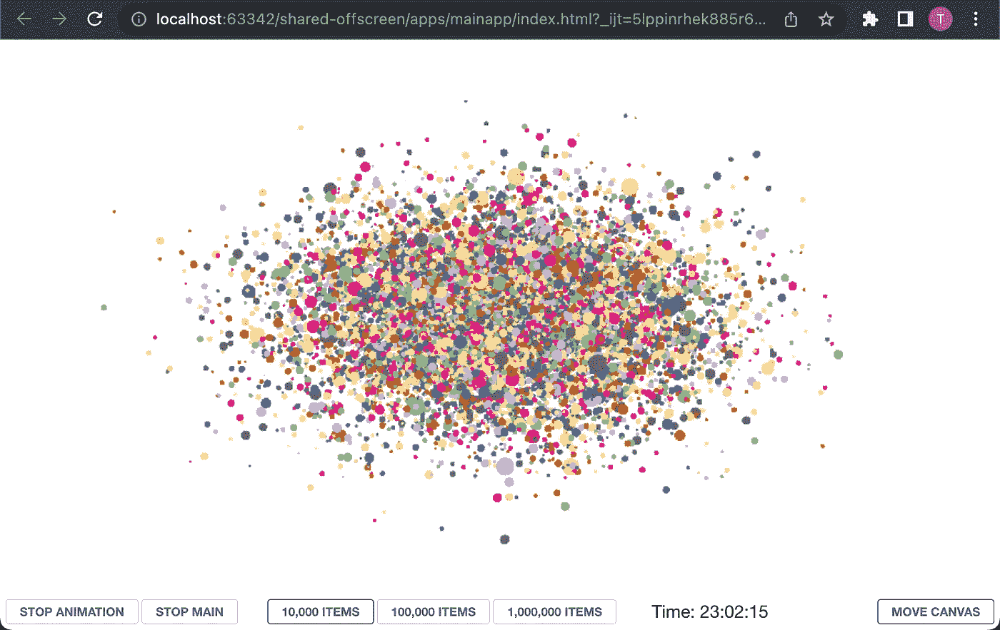
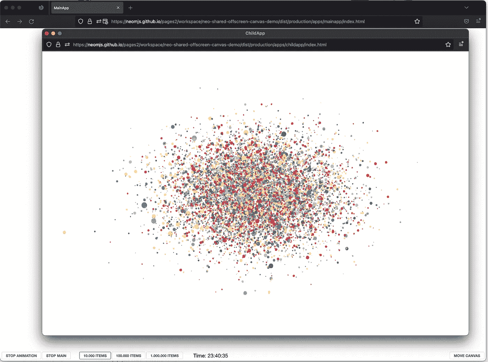

# 成功使用多窗口 WebGL 画布的秘诀

> 原文：<https://itnext.io/the-secret-of-successfully-using-multi-window-webgl-canvas-5a2d05555ad1?source=collection_archive---------0----------------------->

## 将屏幕外画布与共享工作人员相结合

## 使用 WebGL 内容渲染画布节点，并将其移动到不同的窗口中，而无需像 D3 那样重新加载依赖项，保持当前状态，并且无需创建新的组件 JS 实例。

# 内容

1.  介绍视频
2.  定义:屏幕外画布和共享工作器
3.  优势和潜在使用案例
4.  演示的内容
5.  密码
6.  共享工作人员的功能请求
7.  在线演示
8.  neo.mjs 项目

# 1.介绍视频

# 2.定义:屏幕外画布和共享工作器

> `OffscreenCanvas`接口提供了一个可以在屏幕外呈现的画布，将 DOM 和画布 API 解耦，这样`[<canvas>](https://developer.mozilla.org/en-US/docs/Web/HTML/Element/canvas)`元素不再完全依赖于 DOM。渲染操作也可以在一个 [worker](https://developer.mozilla.org/en-US/docs/Web/API/Web_Workers_API) 上下文中运行，允许你在一个单独的线程中运行一些任务，避免主线程上的繁重工作。

 [## 屏幕外画布-Web API | MDN

### 当使用元素或画布 API 时，渲染、动画和用户交互通常发生在主…

developer.mozilla.org](https://developer.mozilla.org/en-US/docs/Web/API/OffscreenCanvas) 

> `SharedWorker`接口表示一种特定的 worker，可以从几个浏览上下文中*访问*，比如几个窗口、iframes 甚至 worker。他们实现了一个不同于专用工人的接口，并且具有不同的全局范围`[SharedWorkerGlobalScope](https://developer.mozilla.org/en-US/docs/Web/API/SharedWorkerGlobalScope)`。

 [## shared worker-Web API | MDN

### SharedWorker 接口表示一种特定的工作器，可以从几个浏览上下文中访问它…

developer.mozilla.org](https://developer.mozilla.org/en-US/docs/Web/API/SharedWorker) 

# 3.优势和潜在使用案例

`OffscreenCanvas`的整个概念都围绕着将画布节点的所有权转移到一个工人身上。这对于确保昂贵的计算可以在独立的 CPU 内核中进行非常有意义，CPU 内核可以并行计算它们，而不会对我们的渲染线程产生负面影响。

显然，我们想到的第一件事是将每个画布节点移动到它自己的[专用工作器](https://developer.mozilla.org/en-US/docs/Web/API/Worker)中，只要还有空闲的 CPU 内核可用，以最大化性能增益。

*那么，我们为什么还要考虑使用一个* `*SharedWorker*` *来代替，它允许我们连接到多个浏览器窗口呢？*

## 好处:

1.  如果你想使用更大的库，比如 [D3](https://d3js.org/) ，你只需要将它们**加载到你的共享作用域**中。甚至不需要缓存重载。
2.  如果您有一个昂贵的和/或时间敏感的逻辑来操作画布的状态，您可以将它应用于多个窗口中的多个画布节点。

## 使用案例:

1.  考虑创建一个多屏幕游戏，其中你想在每个屏幕上显示一个别致的动画时钟，并想确保它们绝对同步。
2.  我最近与一家大公司讨论了一个工程工作场所，每个工程师在多个屏幕上工作。有点像复杂的基于 web 的 IDE。他们正在使用笨重的 3d 模型，如果需要的话，他们希望能够在不同的屏幕上实时移动这些模型。

# 4.演示的内容

创建一个体面的工人-设置我们自己可以花大量的时间。幸运的是 [neo.mjs](https://github.com/neomjs/neo) 为我们提供了我们所需要的:

我已经在一个专门的工人内部创建了演示。请随意浏览此处的内容:

 [## 在屏幕外渲染 3d:使用 canvas workers 获得最佳性能

### OffscreenCanvas Web API 使我们能够将画布 DOM 元素的所有权转移到 workers 中。

itnext.io](/rendering-3d-offscreen-getting-max-performance-using-canvas-workers-88c207cbcdc2) 

因为这一部分已经被讨论过了，所以我们可以把重点放在本文中的多窗口方面:)

# 5.密码

您可以在这里找到包含完整工作演示(MIT 许可)的存储库:

 [## GitHub - neomjs/shared-offscreen:将现有画布节点移动到新浏览器中的测试用例…

### 使用 WebGL 内容呈现画布节点，并将其移动到不同的窗口中，而无需重新加载依赖项，如…

github.com](https://github.com/neomjs/shared-offscreen) 

## 与之前演示的不同之处:

在我们的主应用程序中，我们需要切换到使用`SharedWorkers`[apps/main app/neo-config . JSON](https://github.com/neomjs/shared-offscreen/blob/main/apps/mainapp/neo-config.json)

为了将画布节点移动到不同的浏览器窗口中，我们需要第二个应用程序: [apps/childapp](https://github.com/neomjs/shared-offscreen/tree/main/apps/childapp)

这个几乎只包含一个空的视窗:

在我们的演示中，右下角有`Move Canvas`按钮:

那么，让我们来看看这个→ `moveCanvas()`是做什么的:
[apps/main app/view/maincontainercontroller . mjs](https://github.com/neomjs/shared-offscreen/blob/main/apps/mainapp/view/MainContainerController.mjs)(完整代码)

1.  `moveCanvas()`创建一个包含我们的`ChildApp`的新弹出窗口
2.  令人惊奇的是，我们的两个应用程序都在同一个共享应用程序工作器中，所以创建弹出窗口将触发`onAppConnect()`
3.  最好的部分是，我们可以简单地删除现有的`webgl-component` JavaScript 实例，并将其添加到我们的`ChildApp`的视口中。虽然这个实例碰巧位于不同的浏览器窗口中，但我们甚至可以保留相同的 JS 实例
4.  如果我们关闭弹出窗口，我们将触发`onAppDisconnect()`，这将把我们的画布组件实例移回我们的`MainApp`

**但是……我们真的可以多次转移画布节点的所有权吗？**

理论上，它可能适用于一个空的 canvas 节点，但是一旦我们设置了像`WebGL`这样的上下文，试图再次移动节点就会导致 JS 错误。

那么，它是如何工作的呢？

神奇的事情发生在我们的 canvas 组件本身内部:
[src/component/canvas . mjs](https://github.com/neomjs/neo/blob/dev/src/component/Canvas.mjs)

每次我们(重新)挂载组件时，它都会在 DOM 中放入一个新的空画布节点。之后，它将被传输到我们的(共享的)画布工作器中，并被添加到我们的 id 映射中。

由于它的 id 和以前一样，下一个动画标记将把我们现有的状态应用到另一个浏览器窗口中的画布节点。

# 6.共享工作人员的功能请求

浏览器支持:

1.  Chromium 和 Firefox 中都有屏幕外画布
2.  Chromium、Firefox 和 Safari 技术预览版中提供了共享工作器

对于多屏应用，我们最有可能使用原生外壳(例如 [Electron](https://github.com/electron/electron) )，所以如果不是所有的浏览器都被支持，那也不算太糟糕。不过，看到一些努力确实让我很开心！

> 您也可以在 workers 中使用 requestAnimationFrame

 [## 屏幕外画布-Web API | MDN

### 当使用元素或画布 API 时，渲染、动画和用户交互通常发生在主…

developer.mozilla.org](https://developer.mozilla.org/en-US/docs/Web/API/OffscreenCanvas#asynchronous_display_of_frames_produced_by_an_offscreencanvas) 

虽然`requestAnimationFrame()`在专门的工作人员中确实可用，但遗憾的是`SharedWorkers`并非如此。

有点明显，因为不清楚我们想要使用哪个主线程。

**然而，在共享工作者内部，我们有连接端口。**

如果有新的主线程连接，端口应该包含`requestAnimationFrame()`，我们就可以开始了。

# 7.在线演示

旁注:有时我们需要重新加载一次应用程序才能看到动画。需要在某个时候对此进行调试。

开发模式(按原样运行代码→Chromium):
[https://neom js . github . io/pages 2/workspace/neo-shared-off screen-canvas-demo/apps/main app/index . html](https://neomjs.github.io/pages2/workspace/neo-shared-offscreen-canvas-demo/apps/mainapp/index.html)

dist/production(基于 web pack→Chromium & Firefox):
[https://neom js . github . io/pages 2/workspace/neo-shared-off screen-canvas-demo/dist/production/apps/main app/index . html](https://neomjs.github.io/pages2/workspace/neo-shared-offscreen-canvas-demo/dist/production/apps/mainapp/index.html)

画布动画在开发模式下运行更加流畅。这很可能与 [d3fc](https://github.com/d3fc/d3fc) lib 中的作用域问题有关。

不过，在火狐内部看到这个作品还是很棒的:

# 8.neo.mjs 项目

“应用程序工作人员是主角”或“脱离主线程”不再是虚构的，而是非常稳定和快速地工作:

 [## GitHub - neomjs/neo:应用工人驱动的前端框架

### neo.mjs 使您能够使用一个以上的 CPU 创建可扩展的高性能应用程序。不需要照顾一个…

github.com](https://github.com/neomjs/neo) 

neo 已经发布了 4.2.1 版，在生态系统中提交了超过 15000 次。

如果您还没有了解性能、可伸缩性和可扩展性的优势，您可能想了解下一代多线程前端主题。

最诚挚的问候&快乐编码，
托比亚斯