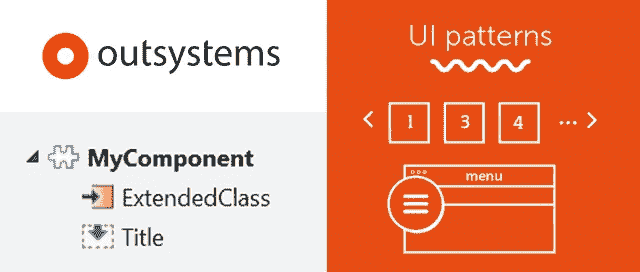
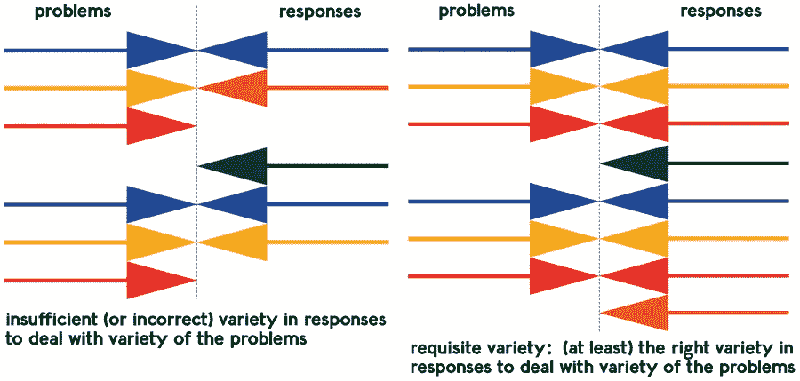
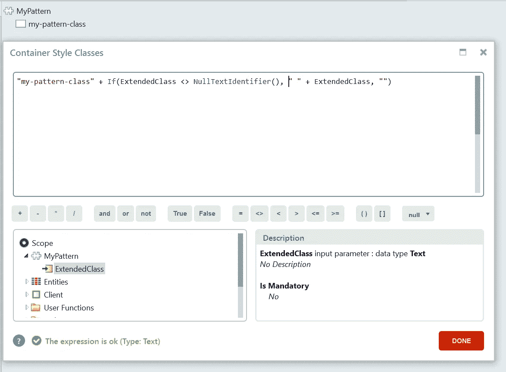
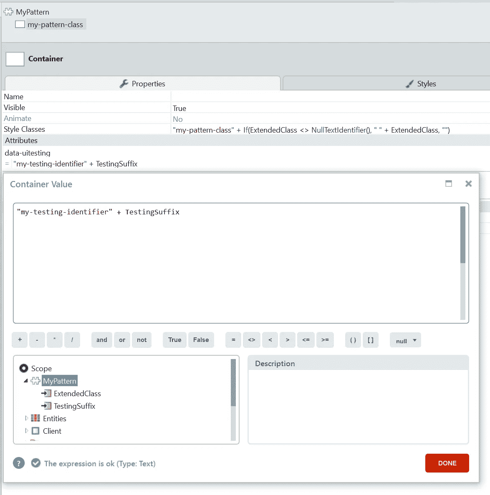
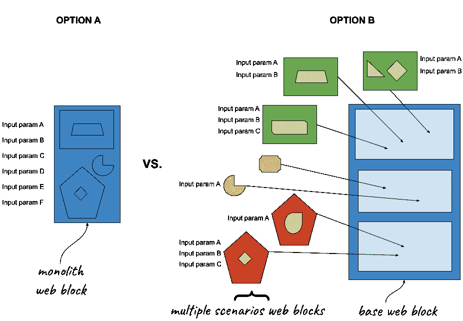
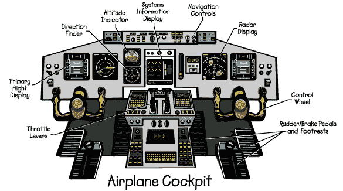
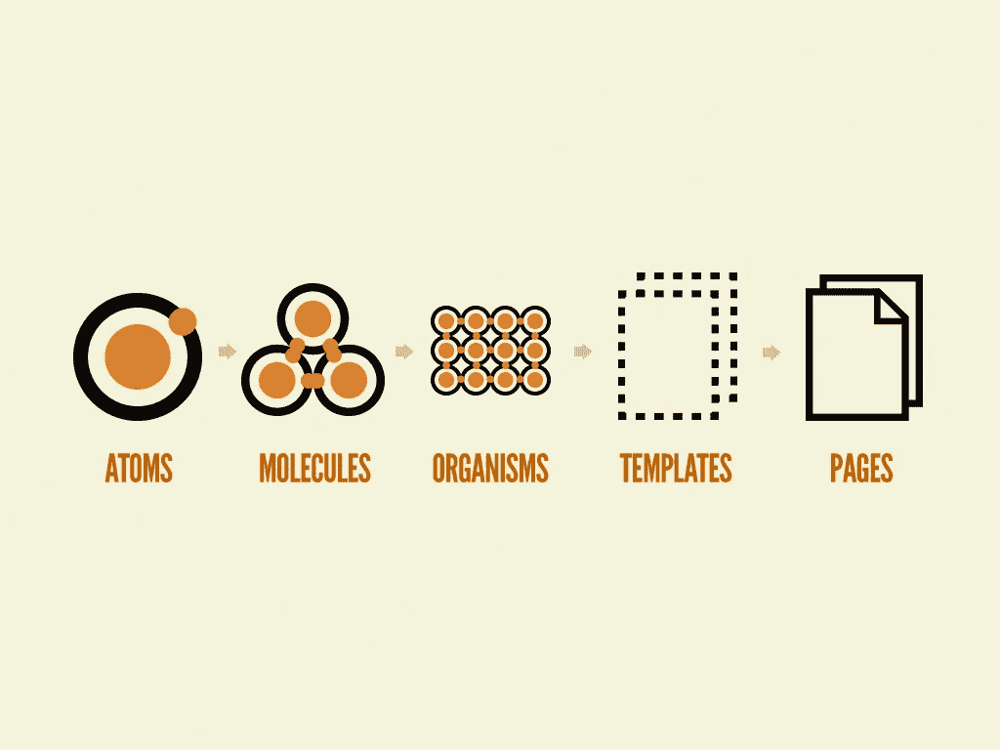

# 在外部系统中构建良好 UI 模式的秘密

> 原文：<https://itnext.io/the-secrets-to-build-a-good-ui-pattern-in-outsystems-95d2a015974b?source=collection_archive---------0----------------------->

在外部系统中构建良好 UI 模式的秘密

这里有一些技巧和最佳实践，可以帮助您在外部系统应用程序上构建可伸缩且易于维护的 UI 模式。

首先让我澄清一下，这篇文章不是关于秘密的:这里的一切都是众所周知的！是的，标题是一个巨大的点击诱饵。😎这是一件好事，因为你可以马上开始实施。

# 原则

软件工程是基于你、我和其他人从我们开始这条道路以来学到的原则。

我相信你已经听说过**不要重复自己**的原则或者**单一责任**的原则(如果没有，看看它们吧！).

对于构建 UI 模式这个主题，我可以介绍由 Ross Ashby 制定的**必要变化法则**。

 [## 必要变化定律

### 编辑描述

pespmc1.vub.ac.be](http://pespmc1.vub.ac.be/ASC/LAW_VARIE.html) 

它以一种简化的方式陈述

> 一个控制系统必须有和它想要控制的系统一样多的可能状态

或者另一个

> 为了妥善处理这个世界抛给你的各种各样的问题，你需要有一套应对措施，这些措施(至少)和你所面临的问题一样微妙

如果我们稍微思考一下，这些陈述适用于外部系统 UI 模式的开发。当被应用程序开发人员使用时，模式应该响应它将面临的所有可能的场景和用法。

这是创建它的前端开发人员和设计它的 UI 设计人员共同关心的问题。我们需要抽象地思考，着眼于森林而不是树，将我们自己从业务层中分离出来。这不是一件容易的事情。

让我们进一步阐述一下，看看这些图片:

图片无耻地抄袭自[http://requisitevariety.co.uk/what-is-requisite-variety/](http://requisitevariety.co.uk/what-is-requisite-variety/)

以下是我的看法:

我们的 UI 模式应该 ***响应*** 所有存在的 ***问题*** 。而且理想情况下甚至会出现 ***将来会存在*** 的问题。

既然我已经列出了我的**北极星原则**，我可以留下一些如何实现目标的实用技巧和最佳实践。构建这样的 UI 模式:

*   适合的
*   可攀登的
*   易于维护

像所有的主张和概括一样，在许多情况下这些都不适用，但是我假设你能够区分它们。😏

# 1.每个 UI 模式都应该有一个 ExtendedClass 参数

向您构建的每个 UI 模式添加一个非强制性的文本输入参数。这个简单的技术允许我们扩展任何给定的 web 块，以我们希望的任何方式运行。

有时我看到开发人员添加不必要的容器只是为了实现边距或填充。有了这个参数，我们可以添加类似于" **margin-bottom-m** "的内容，CSS 类属性将变成"**my-pattern-class margin-bottom-m**"，无需额外的容器就可以获得想要的效果。

我们最终可以得到:
-“**我的-花纹-级填充-l**“
-“**我的-花纹-级余量-底-m 圣诞-促销**”
-“**我的-花纹-级我的-花纹-级-暗**”

你明白了。😉

# 2.宽度和外部边距或填充

UI 模式应该适应它们的父容器，如果单独放在“主体”中，它应该是 100%宽。确定网块的宽度应该是容器的责任。通过这种方式，我们的 UI 模式可以真正响应和适应不同的屏幕分辨率或多页面结构和布局。

**开发者**:但是在我的场景中这个 ComponentX 需要正好是 230px！
**组件**:好的，你可以拥有！只需创建并添加"**your-specific-scenario**" CSS 类到 ExtendedClass 参数，就可以了。我希望尽可能保持一般性和适应性。

这个概念也适用于边距和填充。很多次我看到带有内置下边距的图案，当它们是页面上的最后一项时，它们会产生过多的间距…😭

# 3.总是认为不可知论者和一般

或者至少，尽可能多。

如果我正在创建一个用于医疗行业应用程序的 UI 模式，我会问自己……这能用于电子商务应用程序吗？它会如何表现？
或者，如果 UI 模式出现在一个普通的页面中，我会问自己……这可以用在模态中吗？反之亦然。🙄

这也适用于 web 块、占位符或静态实体命名。啊，命名…最困难的事情之一。

如果您将一个 web 块命名为“ **HomepageHighlight** ”，并且该 web 块稍后在不同的页面中使用，这将会很奇怪。

对于占位符，使用标题、副标题、动作、介绍、页眉、页脚、旁白、章节、CTA 等名称，这些术语可以独立于上下文或行业使用。

避免静态实体的条目，如“**小**、**中**、**大**”。想扩大规模怎么办？你会加“**大一点的**”吗？**最大的**？**他们所有人中最大的**？使用类似于“ **size-s** ”、“ **size-m** ”或“ **size-l** ”的东西。您可以随意扩展条目，例如“ **size-xl** ”、“ **size-xxl** ”、“ **size-xxl** ”。

# 4.为 UI 测试准备您的模式

大型应用程序已经自动化了 E2E 测试(或者至少应该这样)。这些测试是基于 XPath 选择器的，为了使这项工作更容易，UI 模式应该有一个清晰的标识符用于自动化测试。

有时你可以使用 CSS 类，这没关系。但是我更喜欢概念的分离。

在下面的例子中，我建议使用属性“data-uitesting”。

我们可以更进一步，使用一个附加的后缀输入参数。在一个列表中，我们可以使用索引，并以类似于**data-ui testing = " my-testing-identifier-3 "**的方式结束，并以特定的顺序断言特定的组件。🧐

# 5.避免强制参数

我们应该避免强制输入参数。

通常 UI 模式有一个**默认**用法，我们可以为这个用例准备 web 块，设置它的输入参数**默认值**。

其中一个优点是在更新较低层的 web 块时，最大限度地减少了破坏性更改。在大规模的 OutSystems 中，UI 模式的突破性改变是你最不想做的事情。👈

如果我们想“强制”做些什么并警告开发者，我们总是可以在 web 块内部用外部系统逻辑或普通的 JavaScript 代码实现它。

发布/刷新时防止编译运行时错误应该是主要目标。

# 6.将控制留给开发人员

当我开始在遗留项目中使用 OutSystems 时，最让我惊讶的事情之一是低级 UI 模式*的存在，这些模式包含像**复选框**和**输入**这样的*元素:那些交互控件在 web 块内*。*

我想了很多次…让我们来谈谈**关注点分离**原则？模型——视图——任何人？

如果开发人员想要扩展控件中的某些内容或使用任何本机属性，他将无法这样做。他将只能访问一个**通知**或一个**事件**，并且将限于他们提供的任何内容。

控件，如输入、复选框、锚……可能连接到模型，应该留给开发人员来处理和操作。

UI 模式应该有一个占位符来保存元素和样式，但不应该担心模型层。

如果将来模型层有所发展，UI 模式不需要改变，也不需要在我们的工厂中强制完全重新发布。

为了做到这一点，有时我们需要更深入的 CSS 和 JavaScript 知识，但有一个解决方案:他们被称为前端工程师。😇

最后，但绝对不是最不重要的…是最重要的:建筑。

# 7.输入参数与占位符

我倾向于认为过多的输入参数是自行车训练轮:它们可能会让你快速前进，但如果你想在高速下改变方向，你需要倾斜你的身体，这些轮子会阻止这一点。

拥有大量的输入参数，如布尔值、字符串或静态实体标识符，可能会妨碍我们的模式遵守我在文章开头提到的原则: ***适应所有可能的场景*** 。

另一方面，占位符允许灵活性。它可以接收一个简单的表达式或大量不同的更小的 web 块来添加我们需要的功能。

请看下图:

## **左边:选项 A**

我们有一个整体的方法。它以完美的方式响应特定的需求。在给定的场景下，它完美地工作。🤙

如果你想在三个月内解决一个不同的用例怎么办？
通常情况下，这将导致一个**额外的输入参数来响应场景**(我打赌当你读到这个时，你只是笑了笑)。

这种方法的结果是大量的输入参数，使我们的 UI 模式看起来像一个飞机驾驶舱，难以理解，并且有如此多的可能性让你不知所措。

通常，该 web 块将位于“ **_Pat** ”模块中，位于“ **Foundation** ”层上，在体系结构树中被多次使用，一次修改将意味着多次引用更新和刷新。

## 右边:选项 B

我们有一个分布式的方法。该解决方案不依赖于单个 web 块，而是大量可以互换使用的 web 块，并允许我们应对更多可能的场景。

您可以将*基础 web 块*放在“基础”层，而*场景 web 块*可以放在同一个“基础”层或“核心”层，以解决更多与业务相关的用例。可能性是无限的。

在*基础 web 块*中的修改是非常罕见的，如果你需要处理一个全新的案例，你只需要创建一个新的*场景 web 块*而不影响现有的。这极大地减少了不必要的参考更新的需要。😄

这也更符合原子设计方法学，它是为创建设计系统而发明的，但是同样的原理也适用。

你可以在这里了解更多:【https://bradfrost.com/blog/post/atomic-web-design/】T4

另一个优点是，我们可以让不同的开发人员在不同的 web 块上工作，而不会不断地冲突和合并他们的工作。🥳

我们甚至可以让不同的团队拥有不同的*场景 web 块，*划分职责并保持一致的外观&感觉，因为*基础 web 块*总是相同的。

# 结束语

就像我之前提到的，每个规则都有例外，所有的建议都应该单独分析。

我真的希望这些技巧能让你的生活更轻松，让你的项目更容易维护和扩展。

你对此有什么想法？

你想让我在一个特定的话题上更进一步吗？

请在评论中联系我！