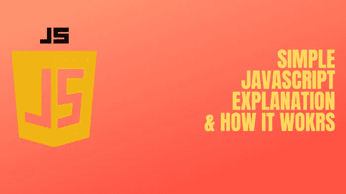
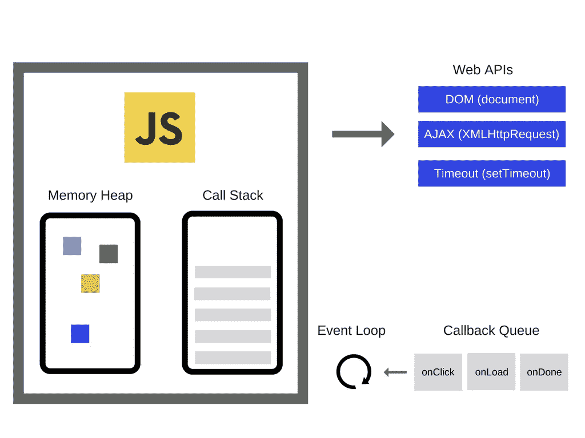
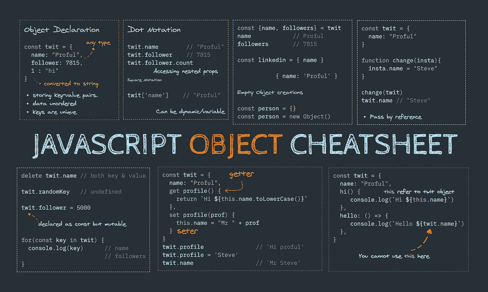

# 关于什么是 Javascript 及其工作原理的简单说明，从传统到现代

> 原文：<https://itnext.io/the-simple-notes-about-what-is-javascript-and-how-it-works-from-legacy-to-modern-bb5f99d7ed26?source=collection_archive---------3----------------------->

关于 javascript 核心概念的简单解释

Javascript 是当今网络开发的主流语言之一。它有着复杂的历史，有上升和下降的趋势，有许多子集，扩展…这可能会让初学者误解这种强大语言背后的核心概念，我就是其中之一。因此，我决定在深入使用框架或库等高级工具之前，先研究并尝试理解基础知识。这篇文章更像是我的个人笔记，从许多来源获得了关于 Javascript 的清晰简明的概述。如果我写错了，请随时指正，不胜感激。)

# **历史**

20 世纪 90 年代是互联网被采用和许多重要技术被创造的时期。当时，两大主流浏览器是网景的 Navigator 和微软的 Internet Explorer，最近还有一场众所周知的法律战。1995 年 9 月，网景公司的程序员 Brandan Eich 只用了 10 天就开发出了一种新的脚本语言。它最初被命名为 Mocha，然后是 LiveScript，最后是 JavaScript。

# **标准**

1997 年，JavaScript 被迅速采用，很明显，这种语言需要适当的维护和标准化。因此，Netscape 把建立语言规范的工作交给了欧洲计算机制造商协会(ECMA)，这是一个以标准化计算为目标的组织。ECMA 规范被标记为 ECMA-262，ECMAScript 语言包括 JavaScript、JScript 和 ActionScript。

ECMA-262 从 1997 年到 1999 年进行了三次修订，但近 10 年后，由于在语言和功能方向上的分歧，第 4 版被放弃。许多现代特性，比如生成器、迭代器、析构赋值、箭头函数、类……都包含在最近的 ECMAScript 规范中。最新版本是第 11 版，正式名称为 ECMAScript 2020，于 2020 年 6 月出版。ECMAScript 2020 的特性之一是 nullish 合并运算符`？？`，当其左侧为' null '或' undefined '时，返回其右侧的操作数。这与` || '运算符形成对比，后者在左侧为 falsy 时使用右侧的值

# **发动机**

第一个 JavaScript 引擎仅仅是解释器，但是所有相关的现代引擎都使用即时编译来提高性能。它运行在一个托管环境中，对于大多数开发人员来说，这是典型的网络浏览器或 Node.js。例如，V8 是最受欢迎的 Javascript 引擎之一，它支持谷歌 Chrome 和 Node.js。还有其他一些如 Charka(微软 Edge)，Spider Monkey(火狐)…

常规的 javascript 引擎由两个主要组件组成:

**内存堆** —这是分配内存的地方

**调用栈** —这是一个数据结构，基本上记录了我们在程序中的位置(JavaScript 是一种单线程编程语言，这意味着它只有一个调用栈)

> 调用堆栈中的每个条目被称为一个*堆栈帧*。"**吹栈** " —这发生在达到最大调用栈大小时。

## **运行时**

浏览器或 Node.js 中有几乎所有 Javascript 开发人员都使用过的 API(例如“setTimeout”、“https . request”…)。然而，这些 API 不是由引擎提供的。它们是从托管环境中附加的，托管环境可以是 Node.js (http、fs … packages)或任何类型的浏览器(DOM 操纵、AJAX、websocket …)，如下图所示。

Javascript 引擎

最后，您可能听说过*** *事件循环* *****，它负责执行代码，收集和处理事件，并执行排队的子任务** 和*** *回调队列**** ，它负责将函数发送到事件循环中的轨道进行处理，它遵循队列数据结构来维护正确的顺序。看一下下面的例子来理解回调是如何工作的。

**语言**

JavaScript 通常被描述为一种[基于原型的语言](https://developer . Mozilla . org/en-US/docs/Learn/JavaScript/Objects/Object _ prototypes)——为了提供继承，对象可以有一个原型对象，该原型对象充当它从其继承方法和属性的模板对象。

Javascript 对象备忘单

# **环境**

与大多数编程语言不同，JavaScript 语言没有输入或输出的概念。它被设计为在宿主环境中作为脚本语言运行，并且由宿主环境提供与外界通信的机制。。最常见的主机环境是浏览器，但是 JavaScript 解释器也可以在大量其他地方找到，包括 Adobe Acrobat、Adobe Photoshop、SVG images、Yahoo 的 Widget 引擎、Node.js 等服务器端环境、开源的 Apache CouchDB 等 NoSQL 数据库、嵌入式计算机、GNOME(GNU/Linux 操作系统最流行的 GUI 之一)等完整的桌面环境。

*本帖原帖自* [*我的博客*](https://techika.com/2021/01/14/simple-notes-javascript/) *。*

**学分**

*   [https://blog.sessionstack.com/tagged/tutorial](https://blog.sessionstack.com/tagged/tutorial)
*   【https://ecma-international.org/ecma-262 号
*   【https://kangax.github.io/compat-table/es6/ 
*   [https://www.springboard.com/blog/history-of-javascript](https://www.springboard.com/blog/history-of-javascript)