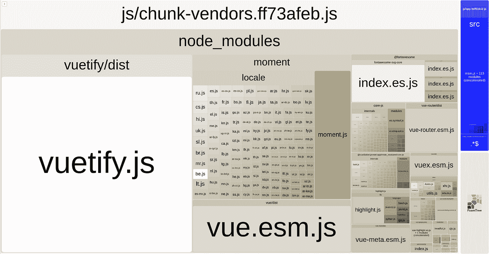
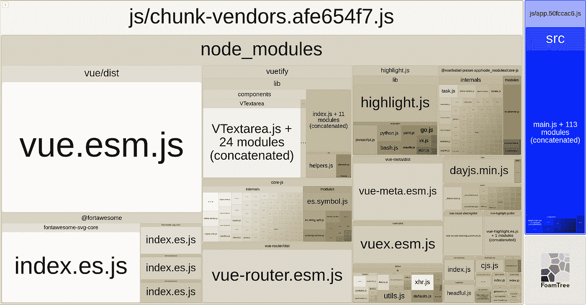
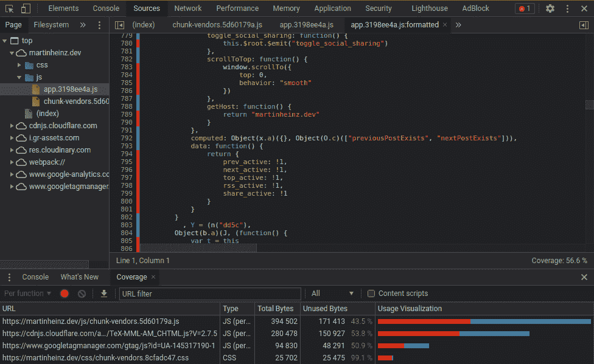
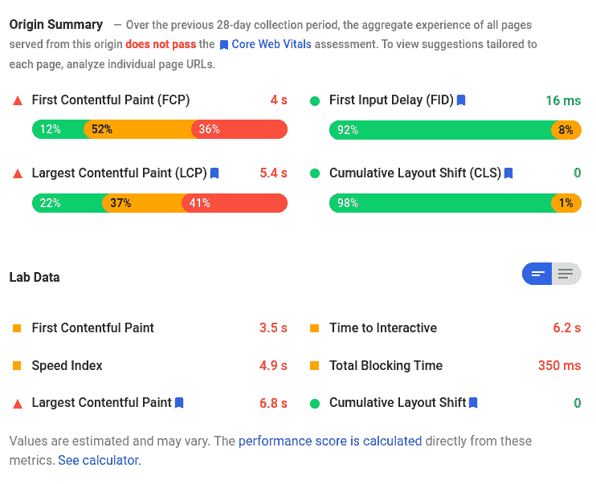
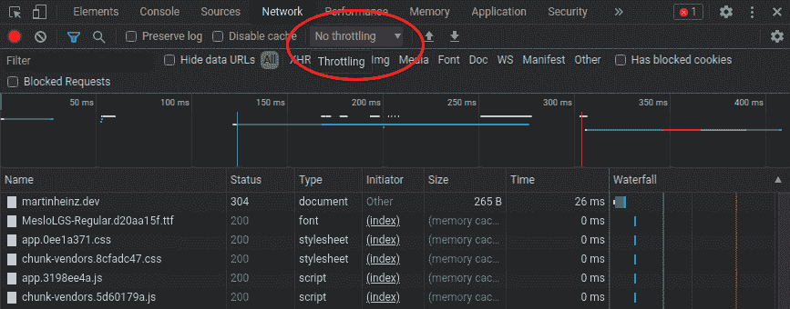

# 让你的网站快速运行的简单技巧

> 原文：<https://itnext.io/the-simple-tricks-to-make-your-website-blazing-fast-2e7f725574df?source=collection_archive---------7----------------------->

使用这些快速简单的技巧来优化您的 web 应用程序的大小和性能，使它尽可能快！

照片由 [CHUTTERSNAP](https://unsplash.com/@chuttersnap?utm_source=unsplash&utm_medium=referral&utm_content=creditCopyText) 在 [Unsplash](https://unsplash.com/?utm_source=unsplash&utm_medium=referral&utm_content=creditCopyText) 上拍摄

Web 应用加载速度是 UX 最基本的部分。忽视网站的性能(加载时间)会赶走用户，因为大多数人倾向于在 3 秒后离开没有加载的页面，因此确保你的应用程序尽可能快地加载是非常重要的。但是你怎么能做到呢？有许多技巧和技术可以加速应用程序的加载时间，其中大多数都不涉及任何实际的代码更改。在某些情况下，仅仅一行配置就可以给你带来巨大的性能提升。因此，在本文中，我们将探索最简单和最有效的技巧，帮助您尽可能快地加载 web 应用程序！

# 压缩

最容易改变性能的方法是使用文本压缩。启用文本压缩会告知浏览器您的服务器支持哪些压缩算法，从而允许它更快、更高效地传输基于文本的数据。

为了充分利用文本压缩，你应该使用最有效的算法。所有主流浏览器都支持它，所以没有理由不使用它。要启用它，你的服务器需要返回`Content-Encoding: br`头，当然，它也需要支持这个算法。

如果你正在使用 NGINX，那么你需要在你的服务器上安装 Brotli 插件。基本安装指南可以在[文档](https://docs.nginx.com/nginx/admin-guide/dynamic-modules/brotli/)中找到，但是如果你在 Docker 容器中运行 NGINX，那么你需要构建你自己的镜像，因为插件默认不包含在基本镜像中。要构建它，您可以运行以下命令:

安装插件时，您还需要加载它并在配置中启用它。这可以添加到您的`nginx.conf`顶部:

最后，为了测试它是否真的存在，您可以运行容器并检查 Brotli 模块的存在:

如果你也向自己的后端/API 发出请求，你应该检查它是否也支持 Brotli 或其他压缩选项，因为这也可以提高整体性能。

# 预加载密钥请求

为了完全加载一个页面，您的 web 应用程序需要某些文件和资源。这些资源通常包括字体、CSS 或 JavaScript 文件等。因此，预加载这些资源以确保它们在应用程序需要时可用是个好主意。这样，您通常可以为每个资源节省大约 200 毫秒！

要预加载这些，您需要在`link`标签中包含`rel="preload"`:

如果你要进行*跨源*资源获取，那么你也需要像上面一样包含`crossorigin`。如果您想查看所有其他内容预加载选项和浏览器兼容性，请查看 MDN 文档[此处](https://developer.mozilla.org/en-US/docs/Web/HTML/Preloading_content)。

# 缓存静态文件

另一个只需要对 web 服务器进行一点配置的改进是静态文件的缓存。所有不会(经常)改变的文件，如字体、图像(`gif`、 `png`、`jpg`)或图标(`ico`、`svg`)都应该被缓存，这样用户的浏览器就不必在每次用户返回应用程序或浏览单个页面时重新下载所有已有的内容。

要实现这一点，您需要配置您的 web 服务器返回`Cache-Control: max-age=...`头，让浏览器知道资源应该被缓存一段时间。要在 NGINX 中进行设置，您需要在配置中包含以下代码片段(`server`部分):

正如您从上面看到的，这里我们将缓存配置分为两个部分。首先告诉浏览器缓存图像、图标、字体等。尽可能多的时间。另一个负责 CSS、JS 和 HTML，并将缓存过期时间设置为 2 小时。这是因为如果您正在开发您的应用程序并定期(每天)部署代码，如果您的代码或样式由于很长的缓存过期而对用户不可见，那将是不幸的。不过，您应该根据自己的需要，根据代码更改的频率对此进行调整。

除了缓存静态文件之外，您最好还缓存来自远程服务/API 的响应。为此，您必须确定哪些远程资源适合缓存，以及它们应该缓存多长时间。然后，您需要对 web 服务器的配置做更多的更改。NGINX 的设置在这里的文档[中有概述。](https://docs.nginx.com/nginx/admin-guide/content-cache/content-caching/)

你可能会遇到一些陷阱，所以我会在这里留下一些有用的链接:

*   [配置示例](https://www.nginx.com/resources/wiki/start/topics/examples/reverseproxycachingexample/)
*   [NGINX 代理文章](https://www.digitalocean.com/community/tutorials/understanding-nginx-http-proxying-load-balancing-buffering-and-caching)
*   [需要忽略的标题](https://stackoverflow.com/a/29358187)
*   [需要忽略的更多标题](https://stackoverflow.com/a/9232739)
*   `[proxy_buffering](https://github.com/nginx-proxy/nginx-proxy/issues/241#issuecomment-357422465)` [必须设置为](https://github.com/nginx-proxy/nginx-proxy/issues/241#issuecomment-357422465) `[on](https://github.com/nginx-proxy/nginx-proxy/issues/241#issuecomment-357422465)`
*   [测试缓存是否工作](https://gryzli.info/2018/03/07/nginx-caching-check-if-request-is-cached/)

# 树摇晃

一般来说，玩弄配置只能让你到此为止，如果你想大大降低应用程序的加载时间，你需要摆脱一些与你的应用程序捆绑在一起的冗余代码。

从应用捆绑包中移除未使用代码的确切过程被称为*树摇动*。之所以会有如此大的不同，是因为你可能包含/导入了很多你实际上并不使用的代码，这些代码必须由浏览器加载，尽管它什么也不做。当您构建应用程序时，您可能会在日志中看到这一点，其中 *Webpack* (或者您可能正在使用的任何其他工具)会警告您，您的包大小超过了推荐的限制，这是一个很好的指标，表明您可能正在捆绑大量未使用的 JavaScript。

现在，即使您看到这种警告，也很难找到使您的应用程序变得过于庞大的库。所以，为了帮助我们，我们可以使用`webpack-bundle-analyzer`——这是一个方便的插件，显示你的应用程序中包含的所有 JS 库的大小。要使用它，你必须安装它并将其添加到你的 Webpack 配置中，这显示在 NPM 网站[这里](https://www.npmjs.com/package/webpack-bundle-analyzer)。

至于实际的优化——没有真正通用的方法来*摆脱*不必要的 JS，因为它依赖于单个庞大的 JS 库。也就是说，您可能不是第一个处理这个特定库的大小问题的人，所以在 StackOverflow 上找到帮助应该很容易(至少对我来说是这样)。

为了让你知道这能有多大帮助，这里有一张我的博客网站前端的前的*和*后的*截图:*

在基于 Webpack Bundle Analyzer 进行更改之前，捆绑包非常庞大:

以前

更改后 *Vuetify.js* 和 *Moment.js* (几乎)完全删除，大小减少 50%以上；

在...之后

除了`webpack-bundle-analyzer`之外，你还可以使用 *Chrome DevTools* 来查找未使用的 JavaScript 和 CSS。为此，您可以打开 *Coverage* 选项卡，通过使用`Control + Shift + P`打开 DevTools *命令菜单*并键入 *Show Coverage* 即可找到该选项卡。你也应该使用非精简版本的应用程序，否则你将找不到任何有用的东西。

正如您在上面看到的，这将突出显示未使用的代码的单独行，这有助于识别死代码的部分或几乎未使用的整个库。

# 寻找更多需要改进的地方

在前面的章节中，我们讨论了优化加载时间和性能的一些容易实现的目标。然而，人们可以做更多的事情来加速 web 应用程序。为了帮助我们，谷歌创造了 PageSpeed(T21)，这是一个工具，可以让你检查一个网页，看看它在各个领域的表现。

绩效总结

除了度量标准之外，PageSpeed 工具还为您提供了指南和许多有用的资源，帮助您解决应用程序的移动和桌面版本的问题。

PageSpeed 工具对于测试您的产品网站很有用，但是当您想在本地开发的同时测试您的应用程序时就不那么方便了。在这种情况下，你可以使用 Chrome DevTools 中的 *Lighthouse* 工具。要使用它，只需导航到 Lighthouse 选项卡并单击*生成报告*，您将获得与 PageSpeed 工具中相同的报告。

另外两个可以帮助你评估应用程序性能的好工具是 Chrome DevTools *网络标签*，它允许你模拟慢速互联网，或者 Chrome DevTools 选项来模拟不同的设备类型——例如老式的移动设备。有了这些，你可以更真实地了解你的应用程序的用户的实际 UX。

因此，要应用网络节流，你可以进入 Chrome DevTools 中的网络选项卡，打开*禁用缓存*复选框旁边的下拉菜单(默认设置为*无节流*，选择其中一个预设或添加自定义网络配置文件(你可以在[文档](https://developer.chrome.com/docs/devtools/network/#throttle)中查看完整示例)。

网络节流

要更改设备类型，您需要按下`Control+Shift+M`，然后从屏幕顶部中间的下拉列表中选择一个设备(也默认设置为*无节流*)。另请参见[文档](https://developer.chrome.com/docs/devtools/device-mode/#throttle)中的完整示例。

# 结束语

实现上述内容后，您的应用程序应该会比以前快一点，但重要的是要记住，在您的机器上运行良好的东西在用户的硬件上可能就不那么好了——可能又旧又慢。还要记住，桌面和移动设备上的性能可能会有很大差异，因此请确保在各种(模拟)设备和各种网络条件下测试性能。

网站加载时间是 UX 的重要组成部分，但不是你应该注意的唯一事情。因此，在浏览上面提到的 PageSpeed 网站时，一定要检查谷歌提供的所有其他指标和建议，以改进你的应用程序。谷歌作为 PageSpeed 测试的一部分运行的许多审计不仅可以帮助你提高网站性能，还可以提高搜索引擎优化或可访问性。

*本文最初发布于*[*martinheinz . dev*](https://martinheinz.dev/blog/48?utm_source=medium&utm_medium=referral&utm_campaign=blog_post_48)

 [## 让 Python 程序快得惊人

### 让我们看看我们的 Python 程序的性能，看看如何让它们快 30%！

towardsdatascience.com](https://towardsdatascience.com/making-python-programs-blazingly-fast-c1cd79bd1b32)  [## Chrome DevTools 的隐藏功能

### 使用这些 Chrome DevTools 提示和技巧，成为一个更高效的 web 开发人员。

towardsdatascience.com](https://towardsdatascience.com/hidden-features-of-chrome-devtools-33d9de390dc0)  [## 每个开发人员都需要知道的网络工具

### 让我们学习被忽视的网络技能，如检查 DNS 记录，扫描端口，排除连接故障…

towardsdatascience.com](https://towardsdatascience.com/networking-tools-every-developer-needs-to-know-e17c9159b180)