# 最简单的 D3 地图和太长的文章，甚至它的标题。野蛮主义建筑地图的分解

> 原文：<https://itnext.io/the-simpliest-d3-map-and-way-too-long-article-about-it-even-its-title-fc0f1d0bdf3f?source=collection_archive---------3----------------------->

我是野兽派建筑风格的忠实粉丝，上个月我看了很多关于野兽派建筑师的讲座——他们的生活和工作——比如勒·柯布西耶、ernő·金手指和其他许多人。

> “房子是居住的机器”——勒·柯布西耶

野蛮主义的概念是广泛的，并与其他现代建筑风格交叉，如构成主义和新野蛮主义。

野蛮主义的产生是由多种原因造成的，其中包括全球经济危机、第二次世界大战带来的新时代的感觉等。这是所有这些原因的反映，但对我们来说主要是政府建筑和公共住宅，例如，这是法国的圣玛丽·德拉·图雷修道院，由勒·柯布西耶设计:

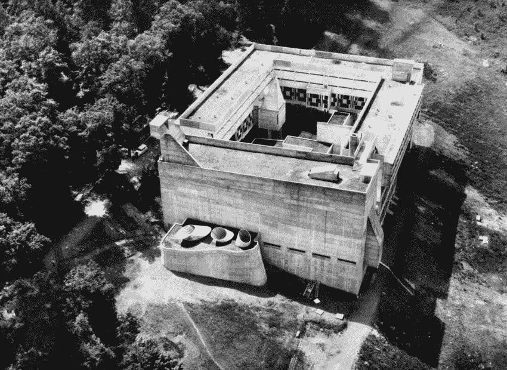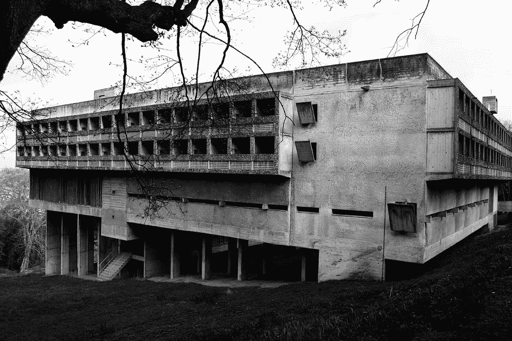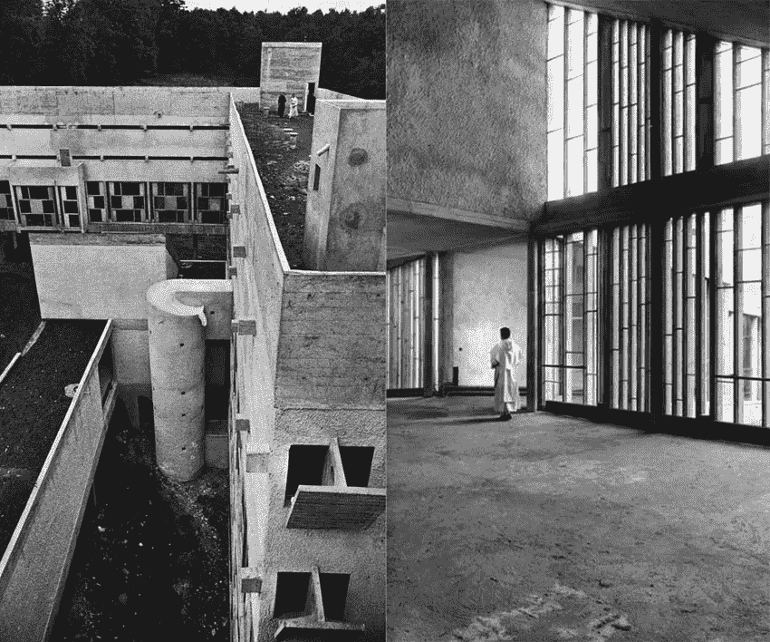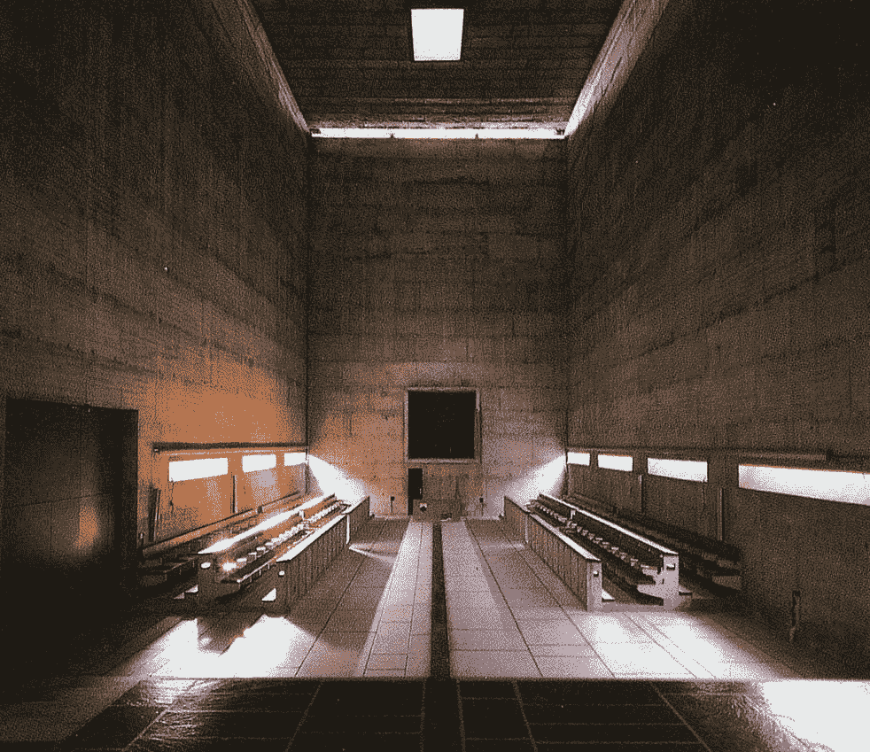

[http://arche yes . com/sainte-Marie-de-la-Tourette-le-Corbusier](http://archeyes.com/sainte-marie-de-la-tourette-le-corbusier/)

野兽派建筑是“尺度”的建筑，因为几乎所有的野兽派建筑都是大尺度的。此外，野兽派建筑在环境中占主导地位，因为它倾向于抑制和与之形成对比。

野蛮主义有一个光明的未来，但随着时间的推移变得越来越被遗弃，因为它(野蛮主义)往往获得了很多负面的内涵。这在任何方面都不奇怪，但我们下次会谈到它。我一定会写一篇关于野蛮主义历史的文章。今天我想分享一下我是如何制作一张带有视觉描述和一些数据管理功能的动物主义地图的。

就像我之前提到的，我是一个粉丝，我想知道:世界上到底有多少野兽派建筑？他们多大了？哪个国家多？为了回答所有这些问题，我决定制作一个互动地图，在那里我可以看到所有建筑的时间透视。

# 研究

地图的第一件事，即障碍#1 是**数据**。如果我的地图上没有建筑，那就没用了。

所以。我的第一个想法是没问题，这很有挑战性，但我准备花几周时间收集数据。

接受我接下来的几周将被许多行 JSON 代码填满的事实，我开始思考，如果我的尝试没有希望了怎么办？如果这种地图已经存在了呢？。所以，我开始用谷歌搜索，是的，我找到了一个网站，里面有野兽派建筑的地图，时间表，还有更多关于野兽派建筑的有用信息😨😱😭

[](http://www.sosbrutalism.org/cms/15802395) [## #暴力主义

### SOSBrutalism 是一个不断增长的数据库，目前包含超过 900 个野兽派建筑。但是，更重要的是，它是一个…

www.sosbrutalism.org](http://www.sosbrutalism.org/cms/15802395) 

我以为；所以，我的宠物项目在开始前就结束了，或者丘吉尔怎么说来着:

> “这不是结束，甚至不是结束的开始，但这也许是开始的结束。”

我为我的发现沮丧了一整天，因为我真的想先做好这张地图。

但是当我第二天早上醒来，(一个好的睡眠总是帮助我)，我的头脑更加清晰，我对自己说；好吧，可能有一个已经存在的地图，但我仍然可以通过这个项目，也许，我会从中学到一些新的东西。事实上，我学到了很多，主要是从我的错误中🙄

# TLDR

为了避免你过多的阅读，下面是结果:你可以使用底部的滑块按年份过滤建筑。

 [## 野兽派建筑

### 编辑描述

pavellaptev.github.io](https://pavellaptev.github.io/brutalist-buildings/) 

# 第一部分.数据

所以，我的研究很快就结束了，但我找到了源头。我的下一步是来自 [**#SOSBrutalism**](http://www.sosbrutalism.org/cms/15802395) 的数据。我开始搜八卦的方式，怎么抢，结果发现他们有页面的模板。

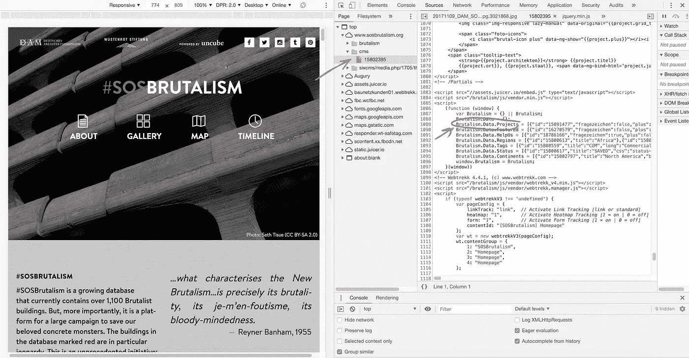

我将这个 JS 对象复制到一个 JSON 文件中。我也问过男生是否可以，他们说可以。

我将这个 JS 对象复制到一个 JSON 文件中。我也问过男生是否可以，他们说可以。下一个需要解决的问题是其中的 **JSON 大小**和**额外键**。原来的 JSON 太大了——**1.4 MB，**所以我写了一个 NodeJS 脚本，让它变小一点，加上我自己的道具。

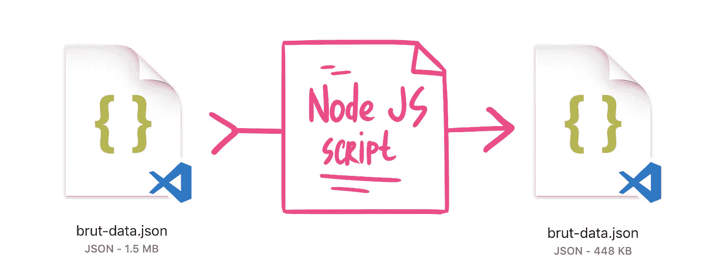

你可能注意到我用了德语而不是英语。这是因为我认为它会给人一种美好的感觉；向传统致敬，保留原始语言。这里有一堂德语课:

*   标题→标题
*   建筑师→建筑师
*   stat→国家
*   施塔特→城市
*   Jahr →年
*   geb ude→建筑物

# 第二部分。设计？

我想象我在地图上有很多点，地图的主要特征应该是一个范围滑块来按年份过滤点。此外，我应该能够在鼠标悬停时查看有关对象的信息。

我最近的项目设计大多是在浏览器中完成的，而不是用设计工具。我发现这种方法非常方便，但是草图还是用设计工具来完成更好。

所以，我在 [Figma](https://www.figma.com) 里做了我的大概设想。

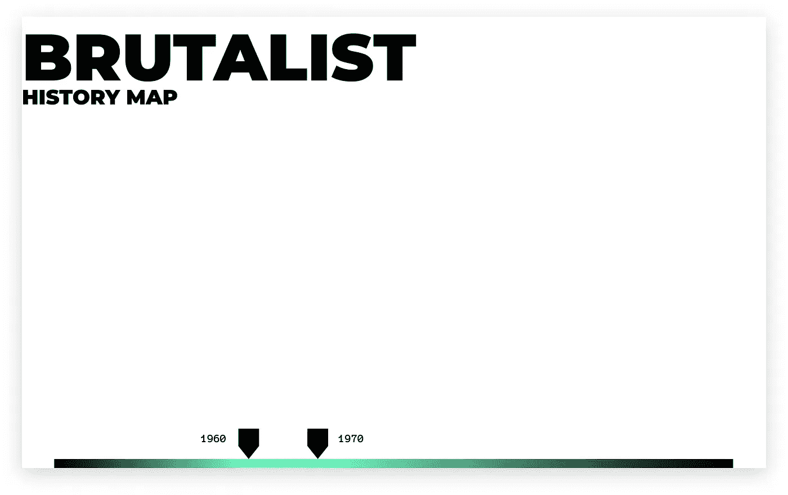

您在这里看不到地图的设计，所以我决定在使用真实数据的浏览器中使用许多对象(如地图标记)会更容易。但是我画了一些主要物体的草图，比如滑块和标题——它们应该是**简单、粗体**和**粗暴**。

# 第三部分。要使用的 JS 库

所以，我有 JSON 与野兽派建筑，我有我的地图的愿景。下一步——选择技术。我想变得更加灵活，这就是为什么我拒绝了像 Mapbox 这样的地图服务，它们有很大的调整范围，但仍然没有完全定制。不管怎样，我找到了一个适合我的解决方案——D3 JS 库和它的插件 d3-geo。它允许您将地理信息呈现到 SVG 或 CANVAS 中。

[](https://github.com/d3/d3-geo) [## D3/D3-地理

### 地理投影、球面形状和球面三角学。-D3/D3-地理

github.com](https://github.com/d3/d3-geo) 

向前看，我的选择是错误的，因为当时我不知道新的情况，我希望我当时就知道我现在知道的。我的错误不在图书馆，我选择了 D3。我选择了 SVG 渲染而不是画布…我们稍后将回到这个问题。

然而，D3-geo 提供了我所需要的一切——完整的地图定制、标记定制、定制工具提示和弹出窗口。

# 第四部分。项目设置

我不喜欢浪费我的时间，这就是为什么我喜欢预处理器。我最喜欢的是 CSS 的 Stylus 和 HTML 的 Pug。

[](http://stylus-lang.com/) [## 富有表现力的、动态的、健壮的 CSS -富有表现力的、健壮的、功能丰富的 CSS 预处理器

### 在线试用手写笔！

stylus-lang.com](http://stylus-lang.com/) [](https://pugjs.org/api/getting-started.html) [## 入门-帕格

### 快速集成入门参考迁移到 Pug 2 React 集成

pugjs.org](https://pugjs.org/api/getting-started.html) 

当我做一个简单的项目时，我会使用 Prepros 应用程序。这是一个简单的方法来使用手写笔或 Pug 预处理器与**实时浏览器重新加载**。零配置，拖放界面。

[](https://prepros.io/) [## 在 Mac、Windows 和 Linux 上编译 Sass、Less、Jade、CoffeeScript，并重新加载实时浏览器

### Prepros 可以编译几乎所有的预处理语言，如 Sass、Less、Stylus、Cssnext、Jade/Pug、Markdown、Slim…

prepros.io](https://prepros.io/) 

但是，当你与 ES6 达成交易时，Prepros 就不那么好了。所以，我决定用[大口喝](https://gulpjs.com)。我首先想到的是使用 [Webpack](https://webpack.js.org) ，但是上次我发现它的配置有些问题。

[](https://gulpjs.com/) [## gulp.js -流式构建系统

### const { src，dest，parallel } = require(' gulp ')；const pug = require(' gulp-pug ')；const less = require('无吞咽')…

gulpjs.com](https://gulpjs.com/) 

*一饮而尽我用:*

*   巨口笔—[https://www.npmjs.com/package/gulp-stylus](https://www.npmjs.com/package/gulp-stylus)
*   囫囵吞下——帕格——[https://www.npmjs.com/package/gulp-pug](https://www.npmjs.com/package/gulp-pug)
*   浏览器同步—【https://browsersync.io/docs/gulp 
*   ES6 的 Webpack 流—【https://github.com/shama/webpack-stream 
*   和唱针的自动修复—[https://www.npmjs.com/package/autoprefixer-stylus](https://www.npmjs.com/package/autoprefixer-stylus)

**下面是我的 Gulp 配置文件:**[https://github . com/PavelLaptev/bruta list-buildings/blob/master/Gulp file . js](https://github.com/PavelLaptev/brutalist-buildings/blob/master/gulpfile.js)

**我的项目结构:**

```
.
├── 📁source
|   ├── 📄index.pug
|   ├── 📁scripts
|   |   ├── 📄main.js
|   |   └── 📁utils
|   |   |   └── ...
|   └── 📁styl
|   |   ├── 📄style.styl
|   |   ├── 📄variables.styl
|   |   ├── 📄map.styl
|   |   └── 📄slider.styl
├── 📁js
|   ├── 📄main.bundle.js
|   ├── 📄brut-data.json
|   └── 📄world-110m2.json
├── 📁favicons
|   ├── 🖼favico-16.png
|   ├── 🖼favico-32.png
|   └── 🖼favico-96.png
├── 📁css
|   ├── 📄style.css
|   └── 📄normalize.css
├── 📄index.html
├── 📄gulpfile.js
└── 📄package.json
```

所有源文件，如*。帕格，*。用 ES6 编写的 styl 和脚本存储在**“source”**文件夹中。我用大块的手写笔和 JS。

# 第五部分:地图颜色编码

在我的项目中，我希望有颜色编码，这意味着我将能够根据年份来识别建筑物，不仅可以查看范围滑块，还可以根据颜色来识别。比起阴影，我更喜欢颜色编码，因为它更容易区分。当然也有例外，但这一次，颜色编码会更好。

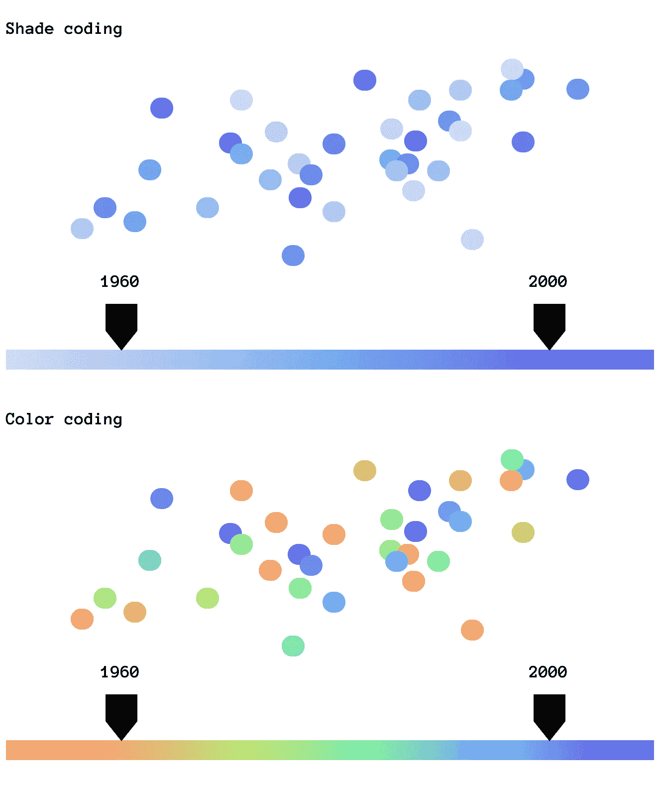

例如，如果你需要在地图上显示高度图和大多边形，阴影效果会更好；但是相反，我们有年和小点。

此外，如您所见，我们有两个地方需要使用相同的颜色——刻度和标记。

为了解决这个问题，我使用了手写笔变量。为什么不是 CSS 变量？不知道，但我认为这只是因为它更容易为我写手写笔 var。

我把这个量表分成五个小部分。

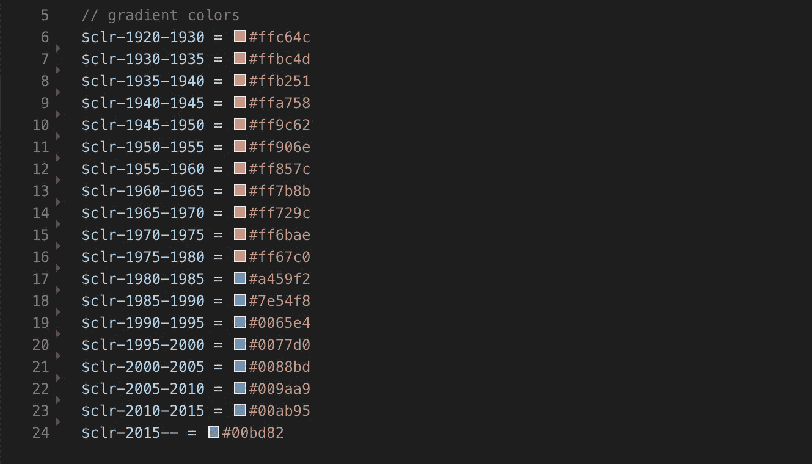

这个色标不是我第一次尝试，因为我尝试过很多变化。所以为了使挑选更容易，我使用了 **Lch 和**David Johnstone 的 Lab 颜色和渐变挑选器。

您可以添加四种常规颜色，该服务会自动在它们之间创建阴影。

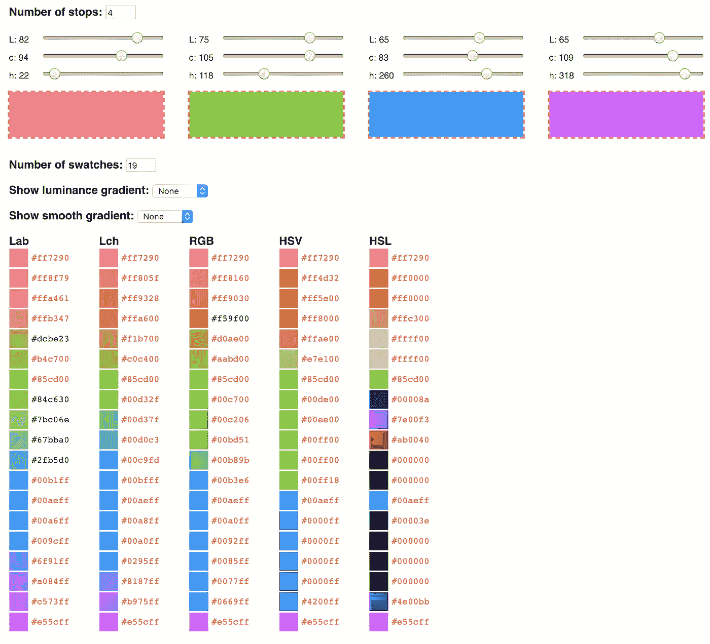 [## Lch 和 Lab 颜色和渐变选择器- David Johnstone

### 这是一个颜色选择器和渐变创建工具，使用各种颜色空间进行选择和插值…

davidjohnstone.net](http://davidjohnstone.net/pages/lch-lab-colour-gradient-picker#ff7290,85cd00,00aeff,e55cff) 

# 第六部分。脚本分解

如果说 Pug 和 Stylus 是容易的部分——JS 是一个有趣的部分，我想一步步解释。但是首先，我们需要添加一些脚本到部分，库的链接

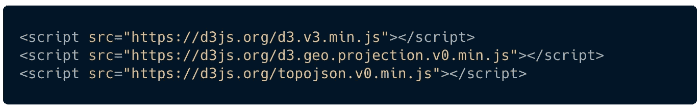

下面是主要的预编译脚本:

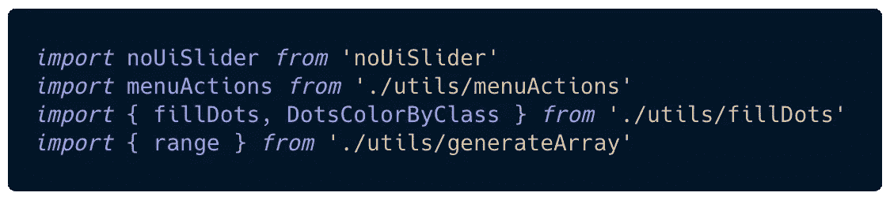

**第 1—4 行**。任何现代剧本的开始部分——导入。这里我们正在导入 [**noUiSlider**](https://refreshless.com/nouislider) 库。

 [## noUiSlider - JavaScript 范围滑块| Refreshless.com

### noUiSlider 是一个免费的轻量级 JavaScript 范围滑块，支持多点触摸(iOS，Android，Windows)。太好了…

refreshless.com](https://refreshless.com/nouislider/) 

noUiSlider 是一个轻量级的 JavaScript 范围滑块，支持全触摸，但对我来说更重要的是支持两个范围手柄。否则，我会使用原生的[输入类型“范围”](https://www.w3schools.com/howto/howto_js_rangeslider.asp)。此外，这个库还有 dragStart、dragEnd 等方法。这很方便，因为你不需要自己写。

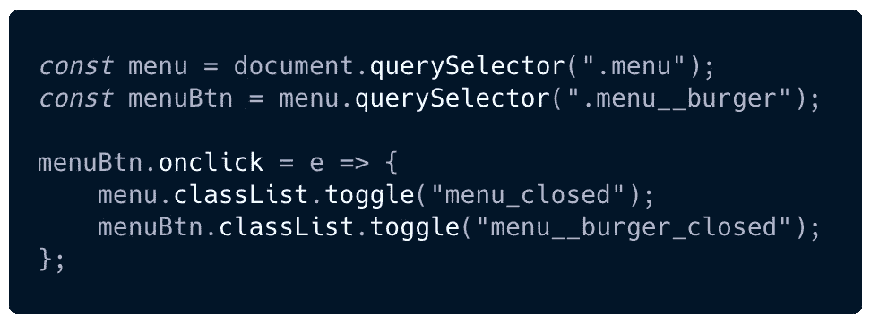

**menuActions** 是汉堡菜单的脚本块。这里没什么有趣的。但是我想注意的是，编写这种类型的脚本变得简单多了，看起来就像在 jQuery 中一样。

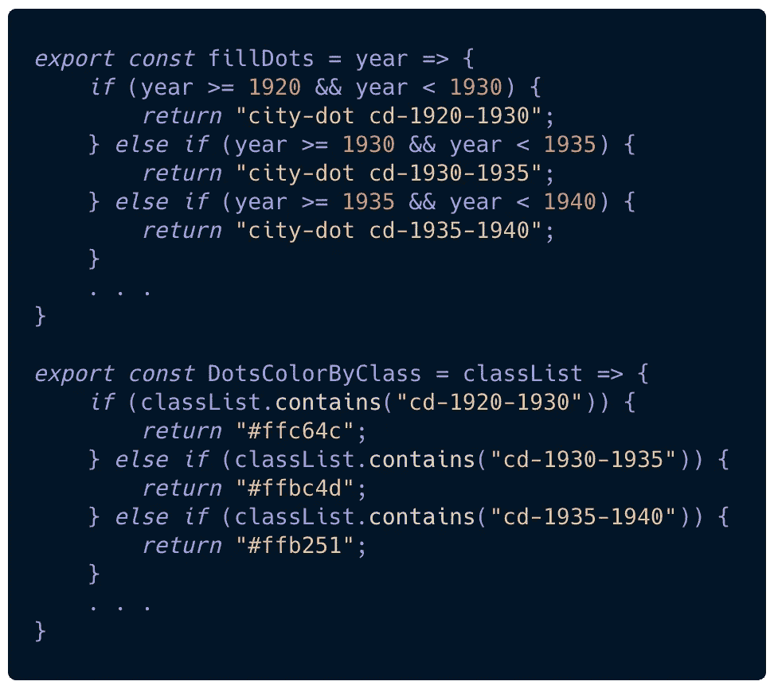

**我在导入的 fillDots()** 和**dotscollorbyclass()**函数很无聊。

**fillDots()** 是一个辅助函数。当我创建所有标记(点)时，我检查当前点的年份是否是 1933 年，我将返回类“CD-193–1935”等。

**DotsColorByClass()** 一个缓解悬停效果的函数。📛我错了——有那么一刻我意识到自己做了一个错误的选择——预处理程序变量而不是 CSS 变量。可悲的是，我不能返回预处理器变量，如果我想改变我的调色板，而不是只在一个地方，我必须在多个地方改变它。但是我把这个眼中钉留给了未来的自己——**看！你这样做了，你为自己感到骄傲吗？是的……我** **也是这么想的！**

继续前进。

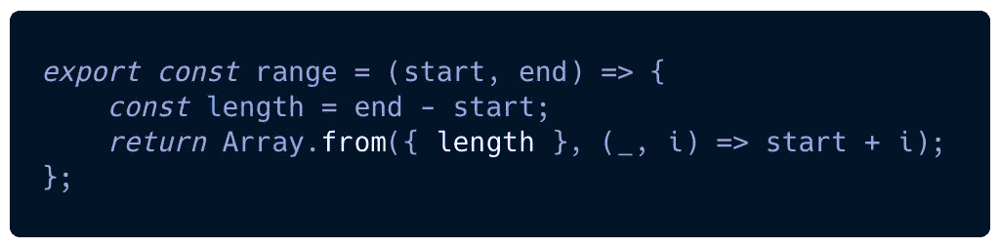

**range** 是一个简单的函数，返回一个介于两个数字之间的数组。我们需要这个函数来过滤超出范围的标记。

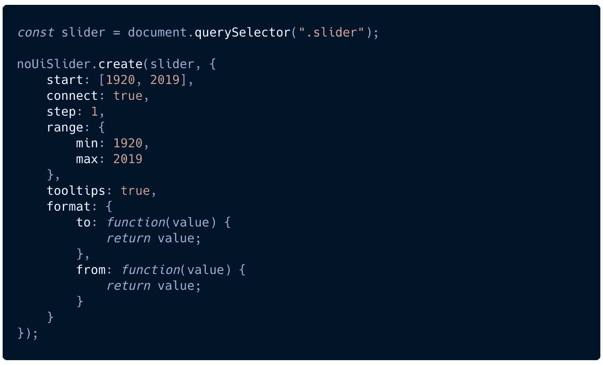

**第 6—26 行。我的脚本中最简单的部分——noUiSlider 设置。noUiSlider 的语法非常清晰易懂，我就不解释了。但是你可以在这里找到文件。**

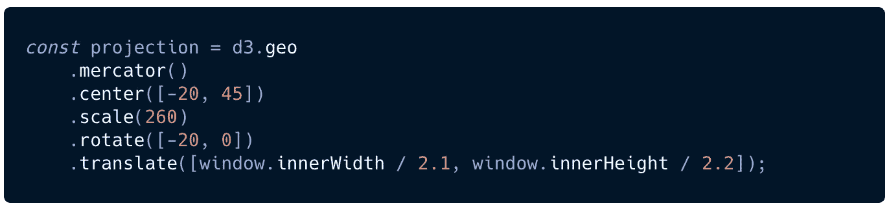

**第 29—34 行。**常量**投影是**我们设置[投影类型](https://github.com/d3/d3-geo-projection#projections)，地图位置，比例，旋转的部分。

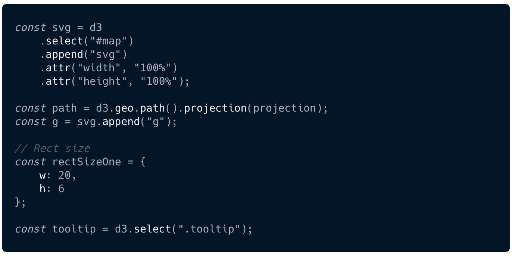

**第 36—51 行**。

*   *常量***SVG。主容器，我们将在其中投射我们的地图和所有的标记。**
*   *const* ***路径。*** 我们放置*const****SVG***的形状生成器
*   const **g.** 这里我们还追加了 *SVG* ***组标签*** 以便对地图有更多的控制，并保持在组中。*我们没有在 const****SVG****中添加这个标签，因为稍后我们将只使用这个独立的标签。*
*   *const****rectSizeOne*。只是一个简单的对象，大小适合我们的标记。我只是把宽度和高度分组。这里的“一”是一个雏形，在开始的时候，我计划为马克笔制作不同的尺寸，但后来我拒绝了这个想法。**
*   *常量* ***工具提示*** 。它是悬停时出现的弹出工具提示。这个工具提示应该已经在 HTML 中了，并且默认情况下具有 CSS 属性“display: none”。我也制作了动画占位符作为图像预加载器。

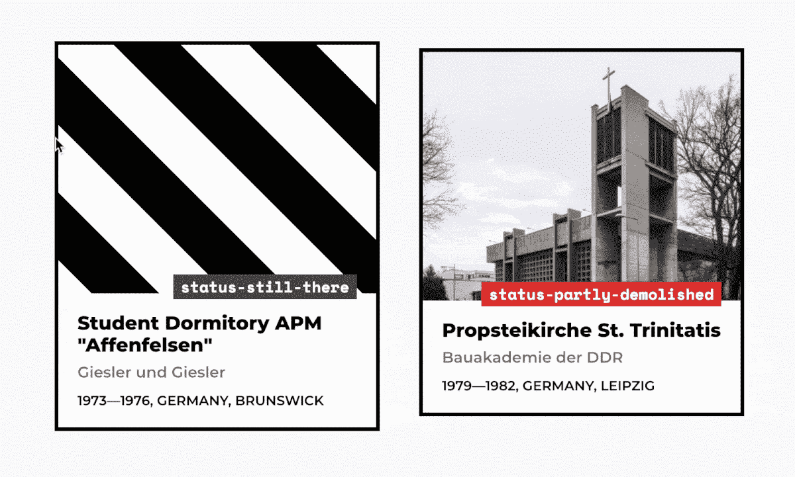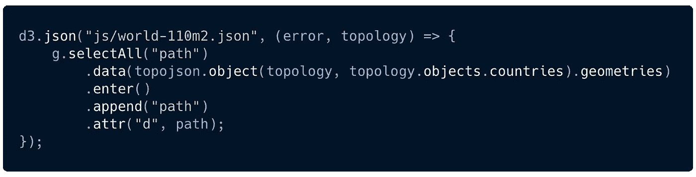

**线 54—60** 。这是两个主要函数中的第一个，我们用世界地图解析 JSON 文件，并将获得的数据放在我们的 SVG 容器中。在那里，我们还使用了另一个 JS 库 TopoJSON。TopoJSON 是 GeoJSON 的扩展，可以更有效地对拓扑进行编码。

[](https://github.com/topojson/topojson) [## 托普杰松/托普杰松

### GeoJSON 的一个扩展，对拓扑进行编码！🌐。创建一个帐户，为 topojson/topojson 开发做贡献…

github.com](https://github.com/topojson/topojson) 

如果你正在读这封信，请突出显示这一行。你赢得了 5 颗星！⭐⭐⭐⭐⭐

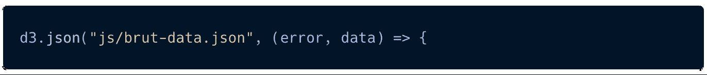

**第 62 行**。这是我们的第二个主要功能。在这里我们解析 **brut-data.json** ，这个 json 包含了所有关于野蛮主义建筑的数据，比如:

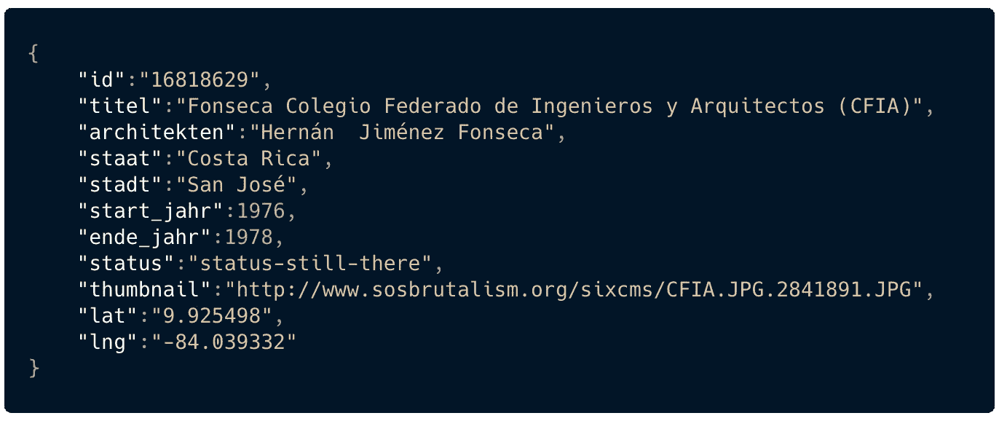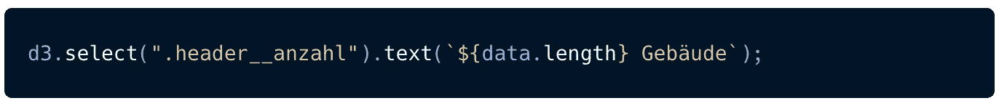

**第 63 行**。这一行负责计算 JSON 对象的长度——所有建筑物的数量——并将其放在头中。这里我使用文字或字符串模板作为 ES6 的一个很酷的特性，它允许你以一种清晰的方式制作类似于`"" + data.length + "Gebaeude"`的字符串``${data.length} Gebaeude``

[](https://developer.mozilla.org/en-US/docs/Web/JavaScript/Reference/Template_literals) [## 模板文字(模板字符串)

### 模板文字是允许嵌入表达式的字符串文字。您可以使用多行字符串和字符串…

developer.mozilla.org](https://developer.mozilla.org/en-US/docs/Web/JavaScript/Reference/Template_literals) 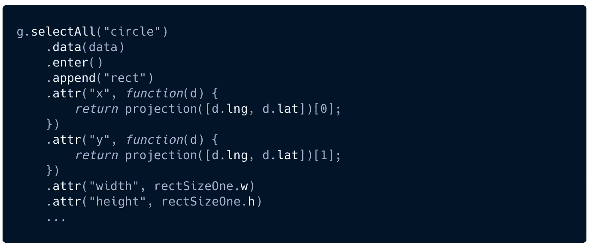

**65—76 线**。这是长链函数的开始，我们将为它们创建标记和动作。

这里，我们为每个标记创建一个矩形形状；根据 JSON 原始数据中的纬度和经度设置 x/y 位置；并设置宽度和高度。

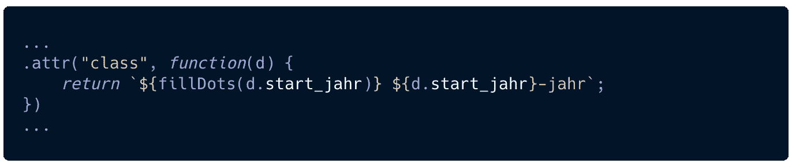

**第 77—79 行**。然后我们需要给每个标记添加一个类，每个类都有自己的`**fill**`。通过`**fillDots()**`,我们定义了某个标记将拥有哪个类。

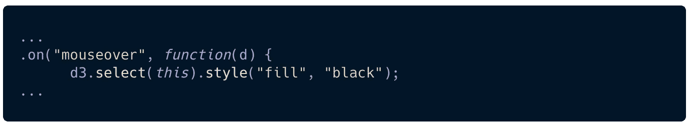

**第 80–81 行**。`**on("mouseover")**`悬停功能将管理我们与标记的所有交互。我们从用黑色填充标记开始。

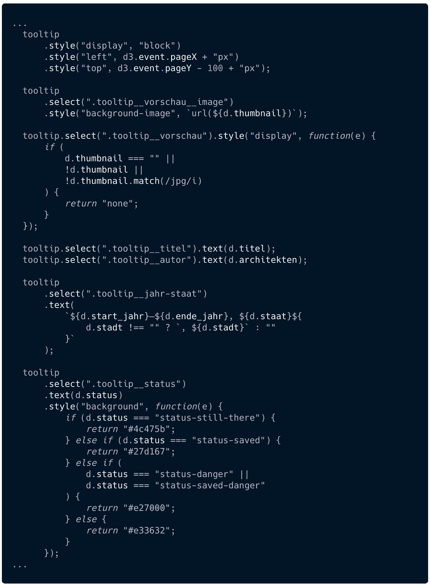

**第 83—130 行**。这是一篇很长的文章，但没有什么特别的，只是在鼠标悬停时对工具提示进行了操作——功能包括标题、年份、图像等。

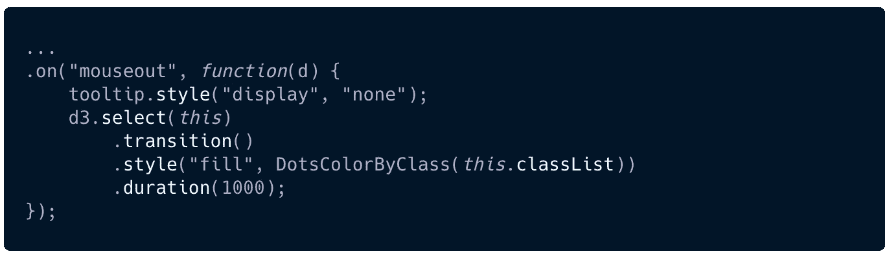

第 131—137 行。`**on("mouseout")**`这里我们隐藏工具提示，并使用`**DotsColorByClass()**` 和 D3 `**transition()**` 函数恢复标记的初始颜色。

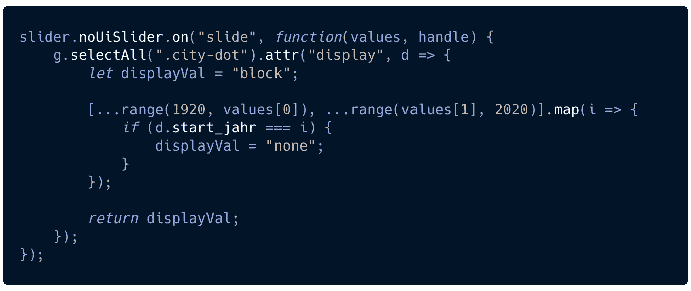

**139—152 线**。noUiSlider 有许多功能强大的函数来管理事件，这里我们使用的是`**on("slide")**`监听器。

每次当用户拖动处理程序时，我们将监听该事件，如果标记仍在范围内，则返回 CSS `**"display”**`属性`**"block”**`，如果标记超出刻度上的选定范围，则返回`**"none”**`。

有一个有趣的部分——我们如何在选定的范围内绘制标记。

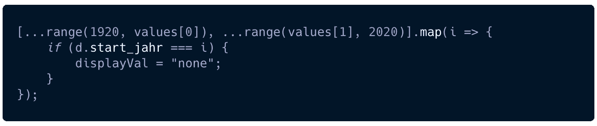

你可能知道为了使用`**map()**`方法，我们需要一个数组。有几种方法可以创建一个“实例”数组，但是我选择了语法上最简单的一种。我使用了**扩展操作符**。

您可以在本文中详细了解它:

[](https://medium.freecodecamp.org/https-medium-com-gladchinda-hacks-for-creating-javascript-arrays-a1b80cb372b) [## 创建 JavaScript 数组的技巧

### 用 JavaScript 创建和克隆数组的有见地的技巧。

medium.freecodecamp.org](https://medium.freecodecamp.org/https-medium-com-gladchinda-hacks-for-creating-javascript-arrays-a1b80cb372b) 

因此，如果我们看到我们的 **"start year"** 键不等于数组中的任何数字，(我选择过滤建筑，而不是按照 **"end year "，**，因为在我看来，按照 **"start year"** 过滤建筑更正确)我们返回`**"display: none"**`。

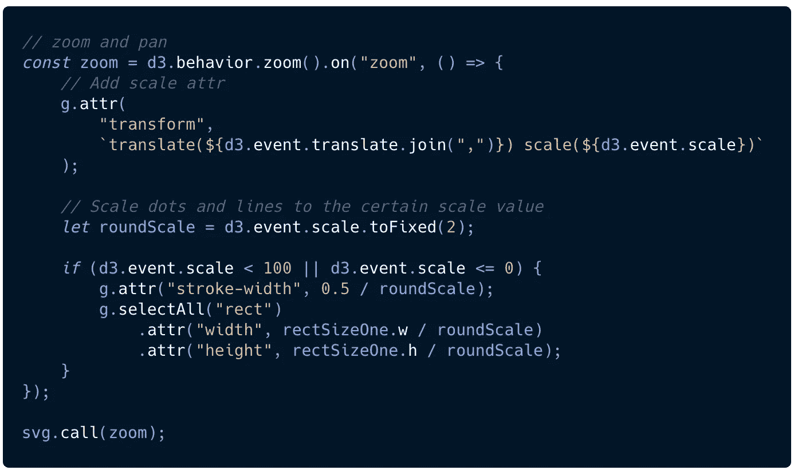

**156—172 线**。`**zoom()**`函数也是一个事件监听器函数。这里，我们更改了`transform: translate()`属性，并且还更改了缩放时标记的大小，以使它们保持相同的大小，而不管我们是缩小还是放大地图。

唷…就是这样，脚本的最后一部分。

# 第七部分。测试

我总是从设置 gulp、预编译器、插件等基础开始工作，并使用实时浏览器重载一步一步地走向结果。

所以，之前一切正常…

# 第八部分。即将出现的问题

…在我与 Babak Fakhamzadeh 交谈之前。我们在谈论# SOSBrutaism 的数据，他发给我一个链接，里面有一个关于 public.opendatasoft.com 的新数据。可惜现在已经没有了，所以我在这里不能提供任何链接，不过我有足够的时间去抓取。你可以在这里下载👇

[](https://github.com/PavelLaptev/brutalist-buildings/blob/master/json-archive/brut-data-true.json) [## PavelLaptev/野兽派建筑

### 野兽派建筑列表。通过创建一个关于…的帐户，为 PavelLaptev/野兽派建筑的发展做出贡献

github.com](https://github.com/PavelLaptev/brutalist-buildings/blob/master/json-archive/brut-data-true.json) 

我现在拥有的是 3433 栋建筑，而不是 1256 栋。这对我来说是个问题，因为当你处理像 SVG 这样的 DOM 元素并且没有太多数据的时候，一切都会很好。但是如果你有一个沉重的 JSON，你需要忘记 DOM 元素，而使用 CANVAS。这里有一个很好的解释:

当你有大量的元素时，总是使用 CANVAS——幕后操作比使用 DOM 元素要快得多。

> HTML `<canvas>`元素用于通过 JavaScript 动态绘制图形。
> [w3schools.com](https://www.w3schools.com/html/html5_canvas.asp)

而 D3 有几种渲染的方法，包括 CANVAS。一开始，我没有考虑到这一点，并开始了我的项目，就好像我的 JSON 中没有超过 1000 个元素一样。那我该怎么办呢？

我问了明显队长，他回答说:

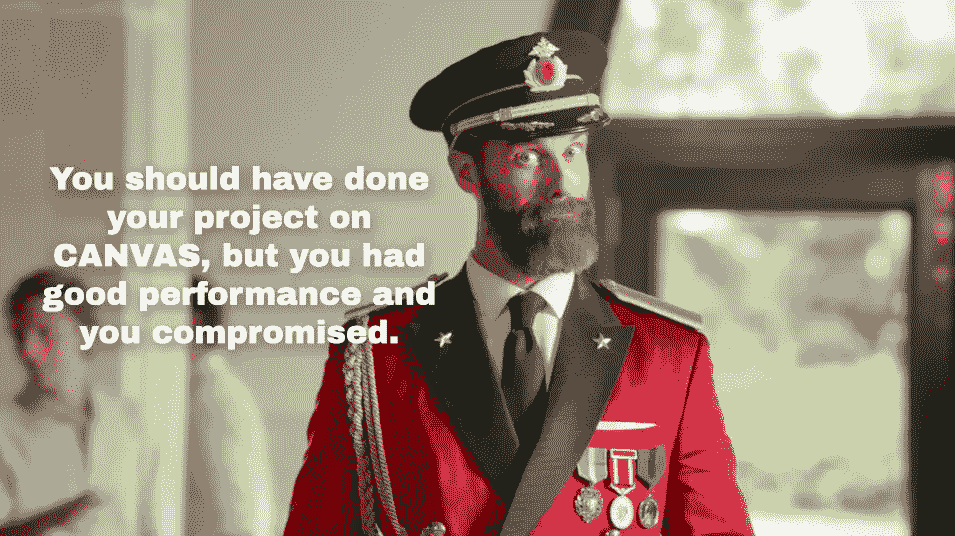

> 谢谢队长！还有，我也没想到我的数据可以补充。

下面是两张地图之间的帧率比较——1，256 和 3，433 个对象 *(2.6 GHz 英特尔酷睿 i7，16 GB 2133 MHz，镭龙 Pro 450 2048 MB)* :

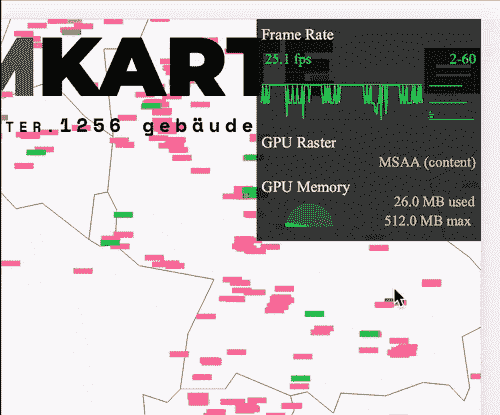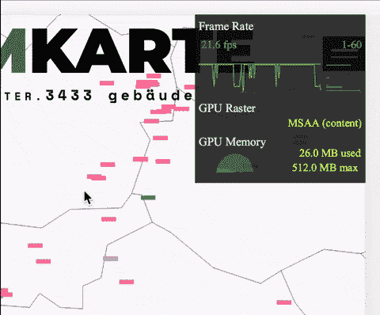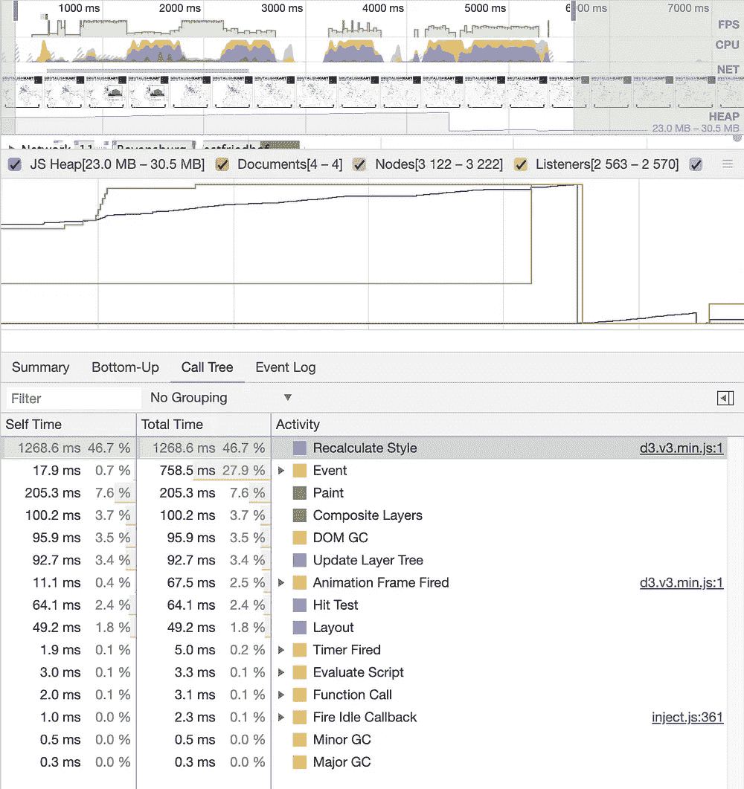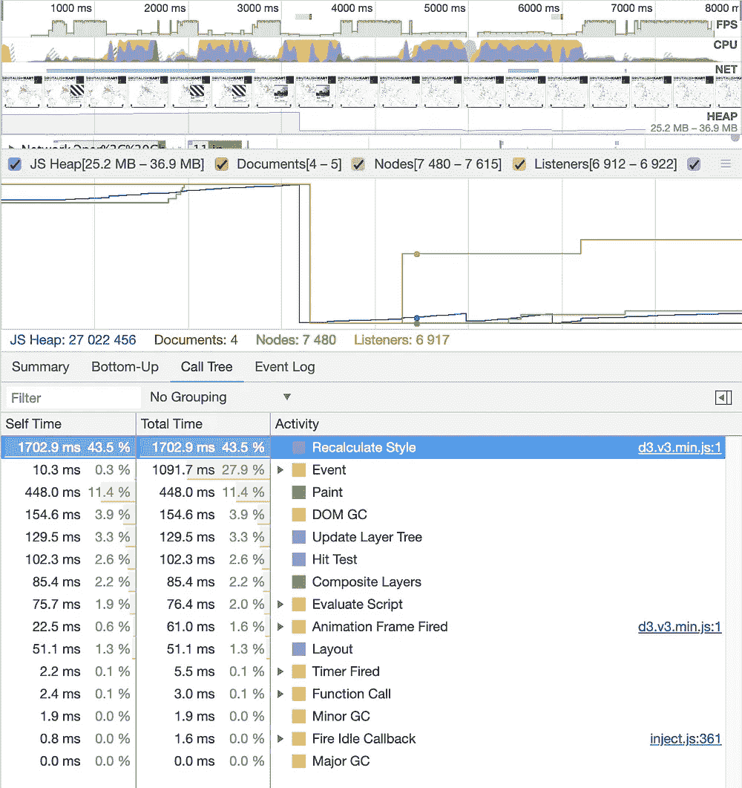

让一切都在画布上不是一个小的修正；我认为修改代码会花费太多的时间，但主要原因是因为这个项目我筋疲力尽了。不，我仍然尊重野蛮主义，但不得不以不同的方式做这个项目。我会从头开始做我的下一个项目，我会更加关注细节。

# 部分 VIX。结果呢

我想我已经说了我想说的一切，所以，击鼓吧，🥁

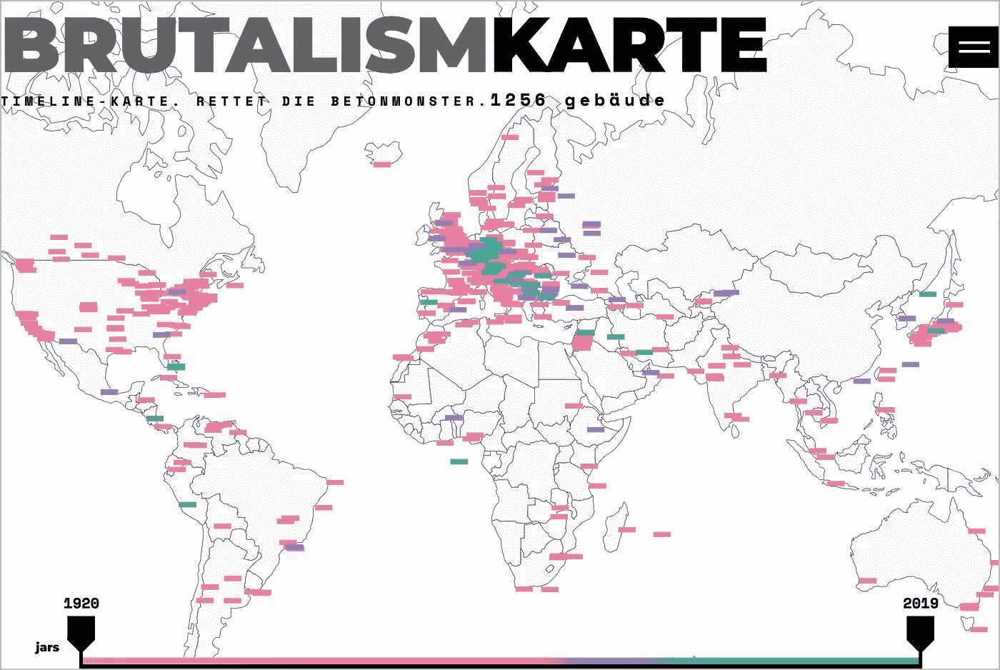

[pavellaptev.github.io/brutalist-buildings](https://pavellaptev.github.io/brutalist-buildings/)

https://pavellaptev.github.io/brutalist-buildings

## 感谢您的阅读:-)，希望您喜欢