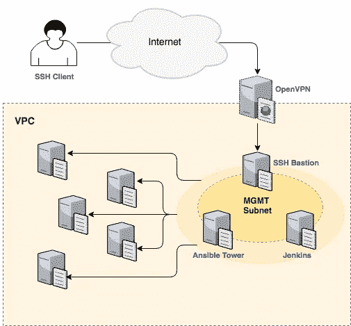

# SSH 管理待办事项列表

> 原文：<https://itnext.io/the-ssh-management-to-dos-list-7c40421387e1?source=collection_archive---------0----------------------->


照片由 [rawpixel](https://unsplash.com/photos/xhmek6FD_8Y?utm_source=unsplash&utm_medium=referral&utm_content=creditCopyText) 在 [Unsplash](https://unsplash.com/search/photos/single-key?utm_source=unsplash&utm_medium=referral&utm_content=creditCopyText) 上拍摄

在工作中，我们的大多数虚拟机都运行 Linux。能够 SSH 到我们的服务器，以便跨不同的堆栈开发、自动化或故障排除服务，这对我们来说至关重要。话虽如此，但从第一天起，确保我们以安全的方式这样做就成了首要关注的问题。

在接下来的文章中，我将分享一些我们在控制 SSH 的过程中实施的措施。

# 1:用 SSH 客户端证书消除**密钥爆炸**

大家都知道，繁忙的工程师遇到共享服务器，第一个失控的就是 SSH keys。仅仅工作几天后，SSH 密钥就开始通过各种渠道传播:电子邮件、Slack、复制到服务器上，有时它们甚至出现在一个合流站点上。

为了防止这种情况，我们使用 SSH 证书。这个概念类似于 TLS PKI，即引入第三方机构来签署用户密钥。因此，目标服务器不再需要依赖 authorized_key 文件，因为它们可以根据本地公共 CA 根证书按需验证提供的凭证。

除此之外，SSH 证书可以携带关于客户端的额外元数据，比如通用名称、允许的功能、到期信息、允许的 Linux 用户模拟等。

> [https://ef.gy/hardening-ssh](https://ef.gy/hardening-ssh#SSH%20certificates)(向下滚动到 SSH 证书)

# 2:使用 Hashicorp Vault 提供 SSH 证书自签名服务

Hashicorp Vault 提供了一个易于设置的 PKI 后端来处理 SSH 证书签名工作流。在我们的例子中，用户使用他们的 AD 或 AWS 凭证登录到 Vault，然后提交他们的个人 id_rsa.pub 密钥给 Vault 签名。生成的证书允许用户根据他们的角色最多一天通过 SSH 进入不同的环境。

```
# ------------------------------------
# cat /usr/local/bin/vault-ssh.sh
# ------------------------------------#! /bin/bashset -ueUSERNAME=fist.last@ldapdomain.com
SSH_DIR=~/.ssh
export VAULT_ADDR=[https://vault.shrd.](https://vault.shrd.sparklecore.net)internal.net# Login to Vault using LDAP if not already logged in
if ! vault token lookup > /dev/null 2>&1; then
  # The Vault cli will prompt for a password
  vault login -method=ldap -field token_policies [username=$USERNAME](mailto:username=$USERNAME@sparkletech.com.au)
fi# Sign POC and DEV environment certificates
vault write -field=signed_key **ssh-poc**/sign/ec2-user  public_key=@${SSH_DIR}/**id_rsa.pub** > ${SSH_DIR}/**id_rsa-poc-cert.pub**vault write -field=signed_key **ssh-dev**/sign/ec2-user  public_key=@${SSH_DIR}/**id_rsa.pub** > ${SSH_DIR}/**id_rsa-dev-cert.pub**
```

为了连接到服务器，我们在 SSH 命令参数中结合了签名证书和私钥:

```
ssh -i **id_rsa** -i **id_rsa-poc-cert.pub** ec2-user@mybox.internal.net
```

> [https://www . vault project . io/docs/secrets/ssh/signed-ssh-certificates . html](https://www.vaultproject.io/docs/secrets/ssh/signed-ssh-certificates.html)

# 3:设置 SSH 配置文件

SSH 配置文件通过将所有连接信息移动到一个文件中来帮助您摆脱 SSH 命令行的冗长。下面是一个默认 SSH 配置文件的例子，它允许我只需输入`ssh poc_kafka`就可以通过堡垒进入我的开发 Kafka 服务器:

```
# ------------------
# cat ~/.ssh/config
# ------------------Host poc_datastax
  Hostname datastax.poc.internal.netHost poc_loopback
  Hostname loopback.poc.internal.netHost **poc_kafka**
  Hostname kafka.poc.internal.netHost **poc_***
  IdentityFile ~/.ssh/id_rsa
  CertificateFile ~/.ssh/id_rsa-poc-cert.pub
  ProxyCommand ssh bastion_shrd nc %h %p 2> /dev/null
  User ec2-user# Tunnel SSH connections through a single subnet
Host bastion_shrd
  Hostname bastion.shrd.internal.net
  IdentityFile ~/.ssh/id_rsa
  CertificateFile ~/.ssh/id_rsa-poc-cert.pub
  User ec2-user
```

除此之外，您还可以将这些信息分成多个文件，然后使用它们来分隔您的环境:

```
ssh -F ~/.ssh/config-**stg**  loopback
ssh -F ~/.ssh/config-**prod** loopback
```

> [https://linux.die.net/man/5/ssh_config](https://linux.die.net/man/5/ssh_config)

# 4:通过源代码控制共享 SSH 配置

我们在 ssh 配置文件上遇到的一个问题是，它们很快就会过时，而且很难在整个团队中保持最新的 SSH 信息同步。

作为一个解决方案，我们最近开始对每个项目的 SSH 配置文件进行源代码控制，以便在需要特定工作负载的连接信息时，很容易知道去哪里:如果我需要访问 Kafka 服务器，我应该能够在 Kafka git repo 中找到连接信息。

这个解决方案也可以应用于 Ansible 项目，这样 SSH 连接信息就保存在代码旁边:

```
# ------------------
# cat ./ansible.cfg
# ------------------[defaults]
inventory = ./inventory.ini
remote_user = ec2-userhost_key_checking = false
retry_files_enabled = false
retry_files_enabled=false
nocows = true[privilege_escalation]
become = true
become_method = sudo[ssh_connection]
control_path = %(directory)s/%%h-%%r
pipelining = true
**ssh_args = -F ./ansible-ssh.cfg**
```

然后，我们将所有连接信息打包到本地 SSH 配置文件中，如下所示:

```
# ---------------------
# cat ./ansible-ssh.cfg
# ---------------------Host bastion_shrd
  Hostname bastion.shrd.internal.net
  IdentityFile ~/.ssh/id_rsa
  CertificateFile ~/.ssh/id_rsa-poc-cert.pub
  User ec2-userHost 10.90.?.*
  CertificateFile ~/.ssh/id_rsa-poc-cert.pubHost 10.90.3?.*
  CertificateFile ~/.ssh/id_rsa-dev-cert.pubHost 10.90.6?.*
  CertificateFile ~/.ssh/id_rsa-shrd-cert.pubHost 10.90.*.*
  IdentityFile ~/.ssh/id_rsa
  ProxyCommand ssh -F ./ansible-ssh.cfg bastion_shrd nc %h %p 2> /dev/null
  User ec2-user
```

# 5:通过双因素 OpenVPN +管理网络堡垒的隧道 SSH

我们所有的服务器都运行在私有网络和 dns 后面的云中。这意味着，如果没有某种网络魔法，就无法从我们的桌面访问服务。这就是 OpenVPN 派上用场的地方:

*   它充当 NAT，允许连接的客户端访问私有网络 IP。
*   它可以修改桌面的默认 DNS 服务器来使用 OpenVPN 的服务器，这样就可以解析私有 DNS 记录。
*   它可以与 LDAP 身份提供者集成，通过双因素身份认证进行增强，处理暴力密码攻击，控制哪个用户可以访问哪个范围的子网等。

话虽如此，但并不是网络中的每个人，无论是人还是机器，都应该拥有 SSH 功能:我们不希望任何恶意的受损服务器在其他机器周围打探。为了控制这种情况，我们在网络级别设置了 ACL，以将 SSH 连接限制到一个管理子网，该子网还托管了 Jenkins 和 Ansible Tower 等自动化引擎。我们还在这个子网中放置了一个 SSH 堡垒，这样来自 OpenVPN 的可信用户就可以通过它到达环境中的其他服务器。



# 6:通过报告/var/log/secure 文件来监控活动

我们还没有开始这方面的工作，但是正如我们在下面看到的，SSH 证书的使用给我们留下了用户到连接的信息。我们目前正在将这些日志记录信息放入一个中央存储库，但在未来，我们希望创建图形分析和指标来了解我们的服务器周围的行为。

```
Aug  4 02:20:46 ip-x-x-x-x sshd[12437]: Accepted publickey for ec2-user from x.x.x.x port 55746 ssh2: RSA-CERT ID [vault-ldap-first.last@ldapdomain.com.au](mailto:vault-ldap-first.last@ldapdomain.com.au)-1c5ea7ca827f81296db79c94cc2b46acb908cc14d84eaa28701dfc9748794465 (serial 1112258391964872070) CA RSA SHA256:VXSUR8gWWDItRMTMMhgC2XrUxvMtk4b5qacG8RyUX3gAug  4 02:20:47 ip-x-x-x-x sshd[12437]: pam_unix(sshd:session): session opened for user ec2-user by (uid=0)Aug  4 02:20:48 ip-x-x-x-x sshd[12440]: Received disconnect from x.x.x.x port 55746:11: disconnected by userAug  4 02:20:48 ip-x-x-x-x sshd[12440]: Disconnected from x.x.x.x port 55746Aug  4 02:20:48 ip-x-x-x-x sshd[12437]: pam_unix(sshd:session): session closed for user ec2-user
```

# 包扎

如您所见，SSH 管理不是一项简单的任务。如果除了 Google 之外的云提供商能够提供现成的 SSH 管理，让事情变得更简单，那就太好了。我希望在此之前，这篇文章能够在这方面提供一些思路。

干杯