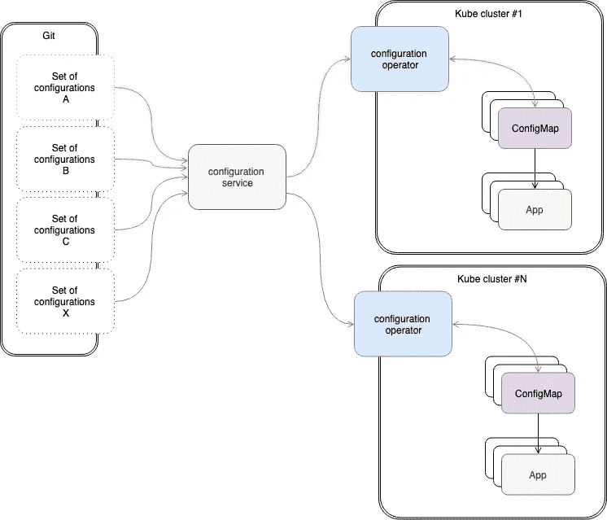
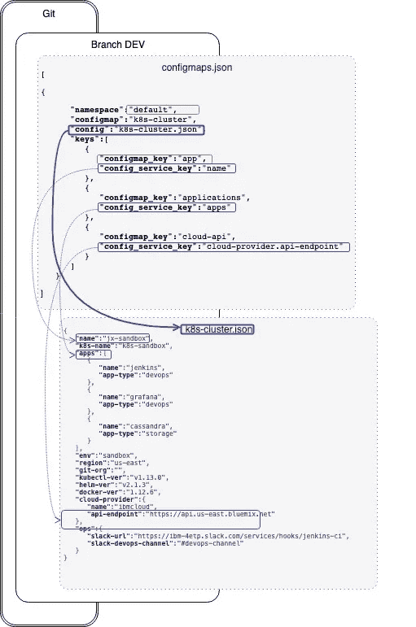
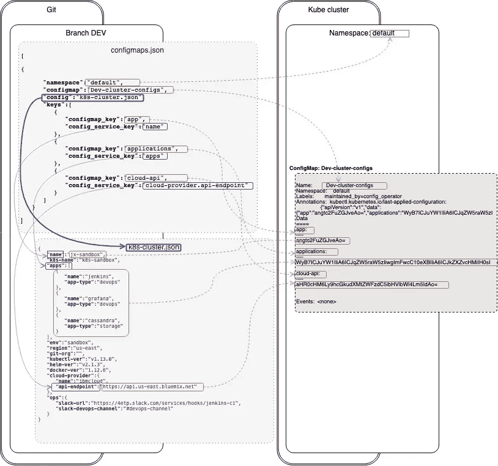

# 在 Kubernetes 集群上管理应用程序配置的标准方式

> 原文：<https://itnext.io/the-standard-way-to-manage-application-configurations-on-kubernetes-clusters-7e60e190bd9b?source=collection_archive---------0----------------------->


*本文是跨* [*环境*](https://en.wikipedia.org/wiki/Deployment_environment) *和云管理配置数据的一系列实用且可重复的方法中的一部分。*

所有这一切都源于我最近与一位客户会面的副产品，也源于我与一位合作伙伴的对话。

现在给你一点背景知识…

# 语境

在我之前的[文章](/a-standard-way-of-managing-configurations-for-multiple-environments-and-clouds-ee8d54703efc)中，我描述了使用 Git 作为事实来源的生产级系统和应用程序的配置管理组件的方法。如果你不打算读这篇文章，我会试着用几个要点概括一下。

*   以 JSON 文件形式管理的配置数据
*   提交到 Github 的 JSON 配置文件
*   每个应用程序/系统环境(开发、试运行、生产等。)为代表的 Git 分支。例如，Git 分支`dev`托管[环境](https://en.wikipedia.org/wiki/Deployment_environment) `DEV`的所有配置文件。不用说，分支永远不会被合并。
*   通过配置服务以 REST 端点和 JSON 路径密钥的形式检索配置

有助于理解这一概念的快速示例:

考虑下面的 JSON 配置文件`my-service.json`在分支`prod`(它服务于`prod`环境)

```
{
"app" : "services",
"port": "8000", 
"app-type" : "backend",
"env" : "sandbox",
"log-level": "debug"
}
```

因此，如果我要部署寻找其参数(如端口号等)的`my-service`应用程序。它执行一个简单的 REST GET 调用来获取端口号和日志级别，如下所示:

```
$ curl [http://config-service.mydomain/api/v2/my-service/prod/port](http://config-service.mydomain/api/v2/my-service/prod/port)
8000$ curl [http://config-service.mydomain/api/v2/my-service/prod/](http://config-service.mydomain/api/v2/my-service/prod/port)log-level
info
```

每次你提交一个分支的变更，它会通过 GitHooks 自动传播到服务的缓存中，因此你的应用程序永远不会使用过期的配置数据。

这种方法宣传了一系列高价值的好处，例如

*   将配置管理归结为简单的 REST 调用
*   维护事实的单一版本——所有的配置数据都可以在 Git 分支中存储和管理
*   完全可追溯性和审计，所有传输
*   更强的安全保证，与权威后端的集成
*   完全不受云限制(非常适合多云部署)

# 好了，这一切都很好，现在怎么办。

使用 REST 调用逐个获取配置对于大多数用例来说都很好，但是，当涉及到部署在 Kubernetes 上的应用程序时，使用 Kubernetes 提供的配置管理组件(ConfigMaps)绝对有意义，这是管理配置的最强大的方法之一。那么，我们如何获得由配置数据服务提供的配置(并由 Git 支持)并在“实时模式”下将其“翻译”成配置图，并确保它不会失去同步呢？

好吧，看起来相当棘手的解决方案结果非常简单——使用 [Kubernetes 操作符](https://kubernetes.io/docs/concepts/extend-kubernetes/operator/)。Kubernetes 算子到底是什么？操作员是与定制资源协同工作的控制者，执行“人类操作员”必须处理的任务。考虑部署一个具有可管理数量的节点的数据库集群，管理升级，甚至执行备份。自定义资源将指定数据库版本、要部署的节点数量、备份频率及其目标存储，控制器将实施执行这些操作所需的所有业务逻辑。例如，这就是 [etcd 操作符](https://github.com/coreos/etcd-operator)的作用。

# 与 Kubernetes 集群同步配置事实来源

## 将配置数据推送到 Kubernetes

这个高层次的草图旨在为下面描述的解决方案提供一个可视化的表示。



因此，工作流程如下:

*   配置数据服务(CDS)从单一事实源(基于 Git 的 repo)实时向应用程序提供所需的配置。它可以运行在单独的集群上，也可以运行在同一个集群上，可以运行在同一个云实例上，也可以运行在完全不同的云实例上，甚至可以运行在独立的虚拟机上——有许多部署选项。最重要的是，它公开了一组端点作为检索配置数据的手段。
*   您的单一事实源，在我的例子中是 Github repo，包含一个简单的 JSON 文件`configmaps.json`，它描述了什么配置(来自 Github)将以 ConfigMaps 的形式被推送到您的 Kubernetes 集群。这里有一个这样的`configmaps.json`的快速示例，可以在这里[找到](https://raw.githubusercontent.com/OlegGorj/config-data/sandbox/configmaps.json)

```
[  
   {  
      **"namespace"**:"default",
      **"configmap"**:"cassandra-test",
      **"config"**:"cassandra.json",
      **"keys"**:[  
         {  
            **"configmap_key"**:"app",
            **"config_service_key"**:"app"
         }
      ]
   },
   {  
      **"namespace"**:"default",
      **"configmap"**:"k8s-cluster",
      **"config"**:"k8s-cluster.json",
      **"keys"**:[  
         {  
            **"configmap_key"**:"app",
            **"config_service_key"**:"name"
         }
      ]
   }
]
```

这个例子提供了创建两个名为`cassandra-test`和`k8s-cluster`的配置图的说明。向下滚动查看此示例的详细分解。

*   下一个组件是实际的配置操作符。它所做的是，查看`configmaps.json`文件，然后解析它并在您的 Kube 集群中生成配置映射。请记住，这是正在进行的工作:欢迎您使用它(带有快速参考:)，它工作，但我不认为它已经准备好进入生产的黄金时间。我仍在测试它，并添加错误处理程序等等。

## configmaps.json 文件示例

让我们检查一个简单的`configmaps.json`文件的例子，以及它如何转换成实际的 ConfigMap 资源。

```
[
   {  
      **"namespace"**:"default",
      **"configmap"**:"k8s-cluster",
      **"config"**:"k8s-cluster.json",
      **"keys"**:[  
         {  
            **"configmap_key"**:"app",
            **"config_service_key"**:"name"
         },
         {  
            **"configmap_key"**:"applications",
            **"config_service_key"**:"apps"
         },
         {  
            **"configmap_key"**:"cloud-api",
            **"config_service_key"**:"cloud-provider.api-endpoint"
         }
      ]
   }
]
```

如上面的代码片段所示，这是一个 ConfigMap 配置列表，每个配置都有以下键:

*   `namespace` —您想要部署 ConfigMap 的名称空间
*   `configmap` —配置图的实际名称
*   `config` —包含配置映射的配置数据的配置文件(在 Git 上)
*   `keys` —键对列表:`**config_service_key**`指向 Git 分支中的配置数据，`**configmap_key**`是 ConfigMap 中的键的名称

希望下面的草图能提供这种映射的说明:



因此，下一节将展示 Config Operator 如何将这个 configmaps.json 转换成一组实际的 ConfigMap 资源。

# Kubernetes 配置运算符

## 它是怎么做到的

在这一切的核心，有一个[配置数据 Kubernetes 操作符](https://github.com/OlegGorj/config-data-operator)，它读取`configmaps.json`文件并将其翻译成 Kube 集群上的一组配置映射。下图显示了这种转换是如何完成的，以及`configmaps.json`中的哪些键映射到配置图中的属性。



所以，让我们快速看一下`configmaps.json`文件的结构(这里有一个[文件的例子](https://github.com/OlegGorj/config-data/blob/sandbox/configmaps.json)),更详细的分解请参考[自述文件](https://github.com/OlegGorj/config-data-operator/blob/master/README.md)。

*   本质上，JSON 文件是描述符的列表，这些描述符向操作员提供如何构建配置图的指令，因此您可以将每个块作为一个配置图
*   在每个块中，有一组键，在上面的示例中，一个键称为`“namespace”`，其值为“default ”,指定将在其中部署此配置图的名称空间
*   下一个键是`configmap`，它指定了配置图的名称
*   下一个，`config`指向 JSON 文件(在同一个 git repo 中)，该文件为即将到来的 ConfigMap 提供了 ***实际的*** 配置值。在上面的例子中，它指向文件`k8s-cluster.json`。
*   现在，下一个叫做`keys`的键有点棘手。它的作用是将配置文件(`k8s-cluster.json`)中的密钥映射到待配置文件(`k8s-cluster`)中的密钥，如下所示:

```
"**keys**": [  
   {  
      **"configmap_key"**:"app",
      **"config_service_key"**:"name"
   },
   {  
      **"configmap_key"**:"applications",
      **"config_service_key"**:"apps"
   },
   {  
      **"configmap_key"**:"cloud-api",
      **"config_service_key"**:"cloud-provider.api-endpoint"
   }
]
```

## 建设

构建说明作为 git repo 的自述文件的一部分提供。如果在编译代码时有任何问题，请随时提出。

## 部署

```
$ kubectl describe configmap k8s-clusterName:         k8s-clusterNamespace:    defaultLabels:       maintained_by=config_operatorData====app:----angtc2FuZGJveAo=applications:----WyB7ICJuYW1lIiA6ICJqZW5raW5zIiwgImFwcC10eXBlIiA6ICJkZXZvcHMiIH0sIHsgIm5hbWUiIDogImdyYWZhbmEiLCAiYXBwLXR5cGUiIDogImRldm9wcyIgfSwgeyAibmFtZSIgOiAiY2Fzc2FuZHJhIiwgImFwcC10eXBlIiA6ICJzdG9yYWdlIiB9IF0Kcloud-api:----aHR0cHM6Ly9hcGkudXMtZWFzdC5ibHVlbWl4Lm5ldAo=Events:  <none>$ echo angtc2FuZGJveAo= | base64 -Djx-sandbox$ echo WyB7ICJuYW1lIiA6ICJqZW5raW5zIiwgImFwcC10eXBlIiA6ICJkZXZvcHMiIH0sIHsgIm5hbWUiIDogImdyYWZhbmEiLCAiYXBwLXR5cGUiIDogImRldm9wcyIgfSwgeyAibmFtZSIgOiAiY2Fzc2FuZHJhIiwgImFwcC10eXBlIiA6ICJzdG9yYWdlIiB9IF0K | base64 -D[ { "name" : "jenkins", "app-type" : "devops" }, { "name" : "grafana", "app-type" : "devops" }, { "name" : "cassandra", "app-type" : "storage" } ]
```

# 待续..

在下一组文章中，我打算描述更多的用例，并提供更多关于如何在多租户和高复杂性环境中部署此类操作符的见解。

一如既往，感谢任何反馈和问题。干杯！