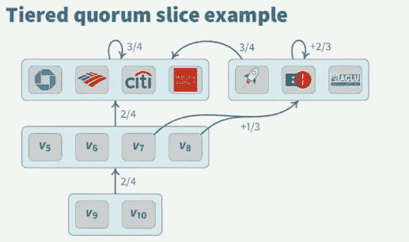

# 恒星共识协议:分权解释

> 原文：<https://itnext.io/the-stellar-consensus-protocol-decentralization-explained-338b374d0d72?source=collection_archive---------0----------------------->

[*点击这里在 LinkedIn* 上分享这篇文章](https://www.linkedin.com/cws/share?url=https%3A%2F%2Fitnext.io%2Fthe-stellar-consensus-protocol-decentralization-explained-338b374d0d72)

# 房间里的大象

首先，我想澄清一个误解，即[恒星](https://www.stellar.org)和涟漪做同样的事情。我很高兴看到恒星社区的增长。对恒星的新兴趣是惊人的，但代码是完全不同的。Stellar 是一个分散的协议。[涟漪](https://ripple.com/)不是。

# 联邦拜占庭协议

联邦拜占庭协议(FBA)是一种使用节点、法定切片和法定人数的共识模型。仲裁片是用于达成协议的节点集。将来永远不能变的协议就是法定人数。

FBA 和 Stellar 有什么关系？[Stellar Consensus Protocol(SCP)](https://www.stellar.org/papers/stellar-consensus-protocol.pdf)是 FBA 的进化。先前的 FBA 协议具有确定的成员列表。要记住的要点是 SCP 使用开放成员资格。任何人都可以加入。

# 权力下放是如何实现的

在 SCP 中，一个重要的概念是节点具有选择信任的能力。听起来很简单，但这是如何工作的呢？我花了几周时间想弄明白。我联系了 SCP 的创始人 David Mazières，答案很简单。信任是在节点的配置文件中设置的。退一步说，这是一个发现的时刻。

并非所有节点都有相同的配置文件，因此片和定额将动态形成。选择信任的能力分散了网络。

# 分散示例

下图是从大卫·马齐耶尔在谷歌的 SCP 谈话中截取的截图。你可以在这里观看这个演讲[，在这篇文章末尾有一个链接。](https://www.youtube.com/watch?v=vmwnhZmEZjc)

该图显示了节点如何能够选择信任谁。在本例中，节点 7 和 8 被设置为不信任银行。因此，与银行的协议需要节点信任的另一个法定切片。当一个协议形成时，法定人数就产生了。关于详细的解释，我强烈推荐观看完整的演示。

[https://www.youtube.com/watch?v=vmwnhZmEZjc](https://www.youtube.com/watch?v=vmwnhZmEZjc)