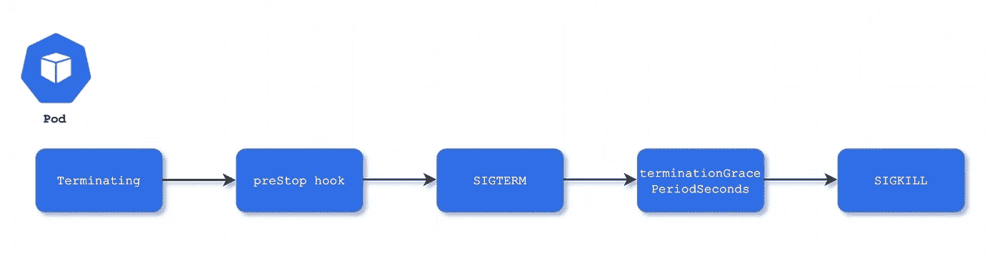

# 在 Kubernetes 的 pod 生命周期事件中确保零停机时间的微妙之处

> 原文：<https://itnext.io/the-subtleties-of-ensuring-zero-downtime-during-pod-lifecycle-events-in-kubernetes-6461c12f7736?source=collection_archive---------2----------------------->



我感兴趣的一个话题是确保 web 应用程序的正常运行时间。kubernetes 调度程序有许多正当的理由需要终止一个健康的容器。一些这样的事件是——版本更新、自动缩放和集群[装箱](https://kubernetes.io/docs/concepts/scheduling-eviction/resource-bin-packing/)(其中 pod 可以在工作节点周围移动)。这使得最重要的是确保吊舱确实能够*优雅地退出* *！*虽然[滚动更新](https://kubernetes.io/docs/tutorials/kubernetes-basics/update/update-intro/)部署策略为零停机部署提供了框架，但即使是最流行的反向代理& WSGI 框架也存在一些微妙之处，如果不进行微调，可能会在此类事件中导致少量错误。此外，直到应用程序在高负载/流量环境中运行时，这些问题才会显现出来。在此，我想强调其中的一些。

首先，让我们看看 kubernetes pod 的生命周期。具体来说，我们想放大一个 pod 终止时会发生什么:

1.  pod 从所有服务的端点列表中删除，并置于`Terminating`状态。这意味着 pod 不再接收任何新的流量。
2.  接下来，如果定义了一个`[preStop](https://kubernetes.io/docs/concepts/containers/container-lifecycle-hooks/#container-hooks)`钩子，它将被执行。
3.  一个`TERM`信号被发送到 pod 中每个容器内的主过程(pid 1)。这是应用程序启动正常关机的提示。
4.  然后调度程序等待`terminationGracePeriodSeconds`(默认为 30 秒)。
5.  如果应用程序仍然没有完成关闭，一个`KILL`信号被发送到 pod 以强制关闭应用程序，并且 pod 被移除。

只要应用程序服务完所有在上述步骤 1 之前进入的*进行中的*请求，并在步骤 5 之前优雅地关闭，这一切都很棒。

然而在实践中，有一些陷阱。

虽然大多数应用程序处理一个`TERM`信号并启动正常关机，但由于使用`TERM`信号时悬空套接字的问题，一个广泛使用的反向代理 nginx 设计了不同的`STOPSIGNAL,`。即 [nginx 使用](https://github.com/nginxinc/docker-nginx/blob/3fb70ddd7094c1fdd50cc83d432643dc10ab6243/stable/alpine/Dockerfile#L122) `SIGQUIT`启动正常关机。那么，我们该怎么处理呢？这就是`preStop`钩子派上用场的地方。如果您使用 nginx 作为缓冲反向代理，它位于一个 pods 中的 WSGI 框架的前面，那么对 nginx 容器使用下面的`preStop`钩子:

```
preStop:
  exec:
    command:
      - nginx
      - -s
      - quit
```

本质上，我们拦截了 nginx 的终止生命周期，并在 kubernetes 调度程序向它发送`TERM`信号之前向它发送了`QUIT`信号，从而确保了正常关闭

接下来，大多数 WSGI 框架都有一个[待定连接的 backlog](https://docs.gunicorn.org/en/stable/settings.html#backlog) 。在高流量环境中，在 pod 终止开始后，在 backlog *中发现一些连接并不罕见，请注意，这些请求会在上述步骤 1 之前到达。在这里，我们只需要给应用程序足够的时间，在它从调度程序接收到一个`TERM`信号之前完成处理 backlog。时间的长短实际上取决于用例/应用。`preStop`钩再次出手相救。请留出足够的时间让您的应用程序完成对任何飞行中请求的服务:*

```
preStop:
  exec:
    command:
      - /bin/sh
      - -c
      - sleep 9
```

最后但同样重要的是，我最喜欢的一个陷阱来自于编写`Dockerfile`时使用的模式！经常会看到一个名为`entrypoint.sh`的 shell 脚本，它是应用程序的`[ENTRYPOINT](https://docs.docker.com/engine/reference/builder/#entrypoint)`。当 shell 脚本启动应用程序时，应用程序本身成为 shell 的子进程，因此不会收到发送给父进程的任何信号！因此，当 kubernetes 调度程序向 PID 1(shell)发送一个`TERM`信号时，应用程序本身没有启动正常关闭的提示！处理这个问题的一个很好的方法是使用 [bash 内置](https://ss64.com/bash/exec.html) `[exec](https://ss64.com/bash/exec.html)`从 shell scirpt 中启动您的应用程序(如果您必须这样做的话)。`exec`内置用提供给它的命令替换 shell，从而使您的应用程序成为容器中的主进程(因此，能够接收来自 kubernetes 调度程序的信号)。

以上只是几个例子，说明了在 kubernetes 集群中正常 pod 终止期间，一些容易忽略的事情会如何影响应用程序的正常运行时间。有没有和上面类似的例子？如果是这样，我很想在评论区听到他们的消息！