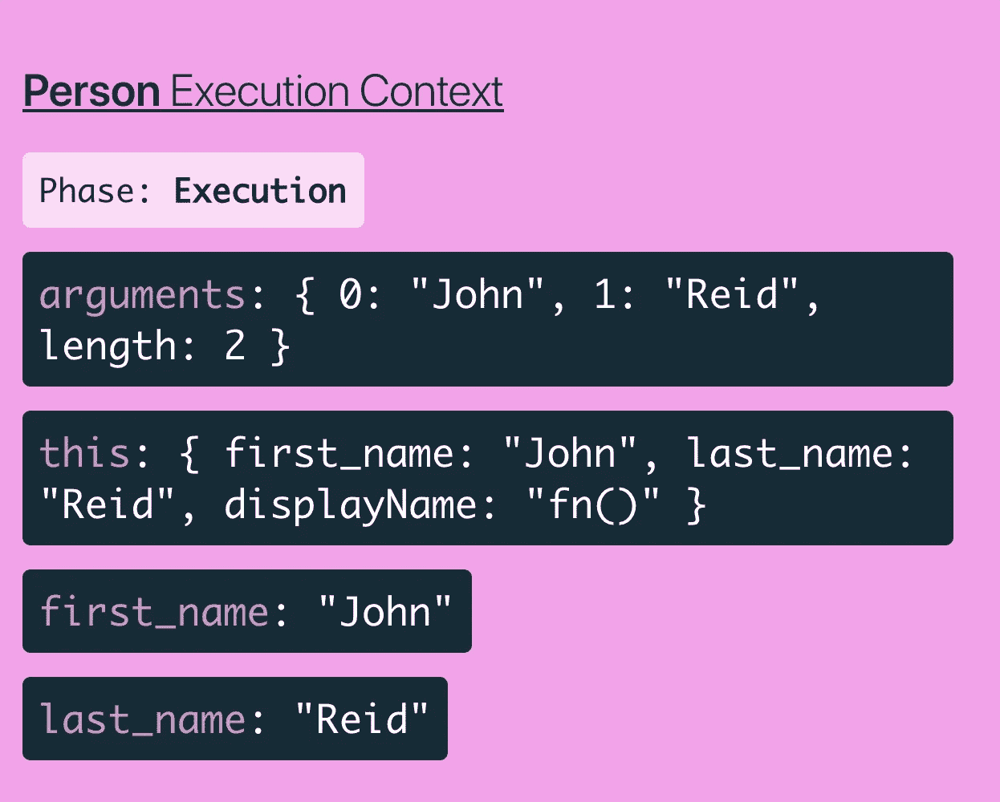

# JavaScript 中的“this”关键字，不再神秘

> 原文：<https://itnext.io/the-this-keyword-in-javascript-demystified-c389c92de26d?source=collection_archive---------0----------------------->


西蒙·艾布拉姆斯在 [Unsplash](https://unsplash.com/search/photos/coding?utm_source=unsplash&utm_medium=referral&utm_content=creditCopyText) 上的照片

刚开始学习 JavaScript 的时候，我花了一些时间去理解 JavaScript 中的`this`关键字，并能够快速识别出`this`关键字指向哪个对象。我发现理解`this`关键词最困难的事情是，你通常会忘记你在一门或多门 JavaScript 课程或学习资源中读到或看到人们解释的不同案例和情况。在 ES6 中引入箭头函数之后，事情变得更加混乱，因为箭头函数以不同的方式处理`this`关键字。我想写这篇文章来陈述我所学到的东西，并试图以一种能帮助任何像我一样正在学习 JavaScript 并且理解`this`关键词有困难的人的方式来解释它。

如您所知，任何 JavaScript 行被执行的环境(或范围)被称为“执行上下文”。Javascript 运行时维护这些执行上下文的堆栈，并且位于该堆栈顶部的执行上下文当前正在被执行。`this`变量引用的对象在每次执行上下文改变时都会改变。

默认情况下，执行上下文是全局的，这意味着如果代码作为简单函数调用的一部分被执行，那么`this`变量将引用全局对象。在浏览器的情况下，全局对象是`window`对象。例如，在 Node.js 环境中，一个特殊的对象 global 将是`this`的值。

例如，尝试以下简单的函数调用:

```
function foo () {
  console.log("Simple function call");
  console.log(this === window);
}foo();
```

通过调用`foo()`，我们将得到以下输出:

```
“Simple function call”
true
```

这就证明了这里的`this`指的是`global`对象，也就是我们例子中的`window`对象。

注意，如果为任何函数启用了严格模式，那么`this`的值将是`undefined`，因为在严格模式下，全局对象引用`undefined`而不是`window`对象。

让我们试试下面的例子:

```
function foo () {
  'use strict';
  console.log("Simple function call");
  console.log(this === window);
}foo();
```

在这种情况下，我们的输出将是:

```
“Simple function call”
false
```

现在让我们想象一下，我们有下面的构造函数:

```
function Person(first_name, last_name) {
    this.first_name = first_name;
    this.last_name = last_name;

    this.displayName = function() {
        console.log(`Name: ${this.first_name} ${this.last_name}`);
    };
}
```

让我们创建一些人员实例:

```
let john = new Person('John', 'Reid');
john.displayName();
```

如果我们在控制台中尝试这样做，应该会得到以下输出:

```
"Name: John Reid"
```

这里发生了什么？当我们在`Person`上调用`new`时，JavaScript 会在`Person`函数内部创建一个新对象，并保存为`this`。然后，`first_name`、`last_name`和`displayName`属性将被添加到新创建的`this`对象上。我使用了泰勒·麦金尼斯[的](https://medium.com/u/c52389e3ee63?source=post_page-----c389c92de26d--------------------------------) [JavaScript 可视化工具](https://tylermcginnis.com/javascript-visualizer)来看看这在幕后是什么样子的。这是我得到的:



您会注意到我们在`Person`的执行上下文中创建了一个`this`对象，并且这个对象有三个属性`first_name`、`last_name`和`displayName`。这个工具以一种有趣的方式将幕后发生的步骤制作成动画，帮助你理解`this`对象是如何创建和填充的。

我们现在已经讨论了与`this`关键字绑定相关的两种常见情况。还有一个案例我想提一下，可能也有点让人困惑。假设我们有这个函数:

```
function simpleFunction () {
    console.log("Simple function call")
    console.log(this === window); 
}
```

我们现在知道，如果我们像下面这样做一个简单的函数调用，`this`关键字将引用全局对象，在我们的例子中，它是`window`对象。让我们这样做:

```
simpleFunction();
```

事实上，我们得到这个作为我们的输出:

```
“Simple function call”true
```

让我们创建一个简单的用户对象，如下所示:

```
let user = {
    count: 10,
    simpleFunction: simpleFunction,
    anotherFunction: function() {
        console.log(this === window);
    }
}
```

现在，我们有了一个引用我们的`simpleFunction` 函数的`simpleFunction`属性。我们还添加了另一个属性作为名为`anotherFunction`的方法。

如果我们调用`user.simpleFunction()`，我们将在控制台的输出中得到这个:

```
“Simple function call”
false
```

为什么会这样？因为`simpleFunction()`现在是`user`对象的一个属性，那么`this`关键字将引用`user`对象，而不是本例中的全局对象。

如果我们现在给`user.anotherFunction()`打电话，我们也应该期待同样的事情。我们的`this`关键字将引用`user`对象。因此，`console.log(this === window);`应该返回`false`，并且我们应该在控制台中得到这个输出:

```
false
```

再来讨论一个案例。如果我们像下面这样做，会发生什么？

```
let myFunction = user.anotherFunction;myFunction();
```

如果您尝试这样做，应该会得到以下输出:

```
true
```

但是为什么会这样呢？在这种情况下，我们做一个简单的函数调用。正如我们现在已经知道的，如果一个方法作为一个简单的函数被调用，那么`this`关键字将引用全局对象，在我们的例子中它等于`window`对象，因此`console.log(this === window);`将打印`true`。

让我们看另一个例子:

```
var john = {
    name: 'john',
    yearOfBirth: 1990,
    calculateAge: function() {
        console.log(this);
        console.log(2016 - this.yearOfBirth); function innerFunction() {
            console.log(this);
        }
        innerFunction();
    }
}
```

如果我们调用`john.calculateAge()`，现在会发生什么？我们应该得到类似这样的东西:

```
{name: "john", yearOfBirth: 1990, calculateAge: ƒ}
26
Window {postMessage: ƒ, blur: ƒ, focus: ƒ, close: ƒ, parent: Window, …}
```

在`calculateAge`函数中，`this`引用调用的‘John’对象。但是在`innerFunction`函数内部，这个`this`指的是全局对象，在这种情况下是`window`对象。有些人认为这是 JS 中的一个错误，但是规则说每当我们进行常规函数调用时，那么`this`将引用全局对象。

我还了解到 JavaScript 中的函数也是一种特殊类型的对象。每个函数都有`call`、`bind`和`apply`方法。这些方法可用于将自定义值`this`设置为函数的执行上下文。让我们看下面的例子:

```
function Person(firstName, lastName) {
    this.firstName = firstName;
    this.lastName = lastName; this.displayName = function() {
        console.log(`Name: ${this.firstName} ${this.lastName}`);
    }
}
```

让我们创建两个新人:

```
let person = new Person("John", "Reed");
let person2 = new Person("Paul", "Adams");
```

并呼叫:

```
person.displayName();
person2.displayName();
```

这应该会打印:

```
Name: John Reed
Name: Paul Adams
```

现在，让我们对`person`对象使用`call`:

```
person.displayName.call(person2);
```

我们在这里做的是将`this`的值设置为`person2`对象。所以，这应该打印出来:

```
Name: Paul Adams
```

如果我们使用`apply`，同样的情况也会发生:

```
person.displayName.apply([person2]);
```

我们将获得:

```
Name: Paul Adams
```

`call`和`apply`方法之间唯一的区别是传递参数的方式。在`apply`的情况下，第二个参数是一个参数数组，在`call`方法的情况下，参数被单独传递。

让我们也试着用`bind`方法做同样的事情。`bind`返回一个新方法，其中`this`引用传递的第一个参数。例如:

```
let person2Display = person.displayName.bind(person2);
```

如果我们现在调用`person2Display`，我们也应该得到`Name: Paul Adams`。

## 箭头功能

作为 ES6 的一部分，引入了一种定义函数的新方法。它看起来像下面这样:

```
let displayName = (firstName, lastName) => {
    console.log(Name: ${firstName} ${lastName});
};
```

与普通函数不同，箭头函数没有自己的`this`关键字。它们只是使用编写它们的函数的关键字`this`。他们有一个词法变量`this`。

让我们看一个我们在 ES5 中曾经做过的事情的例子:

```
var box = {
    color: 'green', // 1
    position: 1, // 2
    clickMe: function() { // 3
        document.querySelector('body').addEventListener('click', function() {
            var str = 'This is box number ' + this.position + ' and it is ' + this.color; // 4
            alert(str);
        });
    }
}
```

如果我们打电话:

```
box.clickMe();
```

将显示一条警告，内容为:“这是未定义的箱号，它是未定义的”。

让我们一步一步来分析这里发生了什么。如果你看上面的例子，我加了一些注释`// 1`、`// 2`和`// 3`。在第`// 1`和`// 2`行，我们的`this`关键字可以访问`color`和`position`属性，因为它引用了`box`对象。

在`clickMe`方法中，我们的`this`也可以访问`color`和`position`属性，因为它仍然引用`box`对象。但是，`clickMe`方法为`querySelector`定义了一个回调函数，这个回调函数现在是一个常规函数调用，所以我们的`this`现在将引用全局对象，在本例中是`body`对象。当然，`position`和`color`没有在`body`对象中定义，所以这就是为什么它们的值会是`undefined`，我们得到一个警告显示‘这是未定义的盒号，它是未定义的’。

我们可以使用 ES5 方法解决这个问题，方法如下:

```
var box = {
    color: 'green',
    position: 1,
    clickMe: function() {
        var self = this;
        document.querySelector('body').addEventListener('click', function() {
            var str = 'This is box number ' + self.position + ' and it is ' + self.color;
            alert(str);
        });
    }
}
```

添加`var self = this`是让闭包函数使用引用`box`对象的`this`关键字的值的一种变通方法。我们现在只需要在回调函数中使用新的`self`变量。

如果我们打电话:

```
box.clickMe();
```

我们应该得到一个警告显示:“这是 1 号箱子，它是绿色的”。

在这种情况下，箭头函数的使用对我们有什么帮助呢？让我们看看下面这个例子，它是基于我们讨论过的上一个例子。我们将用箭头函数替换`clickMe`内部点击事件监听器的回调函数:

```
var box = {
    color: 'green',
    position: 1,
    clickMe: function() {
        document.querySelector('body').addEventListener('click', () => {
            var str = 'This is box number ' + this.position + ' and it is ' + this.color;
            alert(str);
        });
    }
}
```

关于箭头函数令人惊奇的事情是它们共享它们周围的词法关键字`this`。因此，在我们的例子中，它与它的外部函数共享关键字`this` 。外部函数的这个`this`关键字引用了`box`对象，因此`this.position`和`this.color`将具有正确的值`green`和`1`。

让我们再举一个例子:

```
var box = {
    color: 'green',
    position: 1,
    clickMe: () => {
        document.querySelector('body').addEventListener('click', () => {
            var str = 'This is box number ' + this.position + ' and it is ' + this.color;
            alert(str);
        });
    }
}
```

哦！现在，我们得到一个警告说:'这是未定义的箱子号码，它是未定义的'。这里发生了什么？

`click`事件侦听器的闭包的`this`关键字共享其周围的`this`关键字的值。在这种情况下，其周围是箭头功能`clickMe`。`clickMe` arrow 函数的`this`关键字引用全局对象，在本例中是`window`对象。因此，`this.position`和`this.color`将是未定义的，因为我们的`window`对象不知道任何关于`position`或`color`属性的事情。

我想再给你看一个例子，这是一个关于`map`函数的常见例子，它在很多情况下都很有用。我们在上面定义了一个`Person`构造函数方法:

```
function Person(firstName, lastName) {
    this.firstName = firstName;
    this.lastName = lastName; this.displayName = function() {
        console.log(`Name: ${this.firstName} ${this.lastName}`);
    }
}
```

让我们给`Person`的原型添加一个名为`myFriends`的新方法:

```
Person.prototype.myFriends = function(friends) {
    var arr = friends.map(function(friend) {
        return this.firstName + ' is friends with ' + friend;
    });
    console.log(arr);
}
```

让我们创建一个新人:

```
let john = new Person("John", "Watson");
```

如果我们调用`john.myFriends(["Emma", "Tom"])`，我们将得到这样的输出:

```
["undefined is friends with Emma", "undefined is friends with Tom"]
```

这与我们上面讨论的例子非常接近。`myFriends`函数体中会有一个引用调用对象的`this`关键字。但是，`map`函数内部的闭包是一个普通的函数调用，所以`map`函数闭包内部的`this`关键字将引用全局对象，在这种情况下是`window`对象使得`this.firstName`的值未定义。现在我们知道如何解决这个问题了！我们至少有三种方法来解决这种情况:

1.  通过将`myFriends`函数体内的`this`赋给另一个变量，例如称为`self`，并在`map`函数的闭包内使用它:

```
Person.prototype.myFriends = function(friends) {
    // 'this' keyword maps to the calling object
    var self = this;
    var arr = friends.map(function(friend) {
        // 'this' keyword maps to the global object
        // here, 'this.firstName' is undefined.
        return self.firstName + ' is friends with ' + friend;
    });
    console.log(arr);
}
```

2.通过在`map`函数的闭包上使用`bind`:

```
Person.prototype.myFriends = function(friends) {
    // 'this' keyword maps to the calling object
    var arr = friends.map(function(friend) {
        // 'this' keyword maps to the global object
        // here, 'this.firstName' is undefined.
        return this.firstName + ' is friends with ' + friend;
    }.bind(this));
    console.log(arr);
}
```

调用`bind`将返回映射回调函数的新副本，但是带有映射到外部`this`关键字的`this`关键字，在这种情况下，将是引用对象调用`myFriends`的`this`关键字。

3.我们可以将`map`函数的回调创建为一个箭头函数:

```
Person.prototype.myFriends = function(friends) {
    var arr = friends.map(friend => `${this.firstName} is friends with ${friend}`);
    console.log(arr);
}
```

现在，arrow 函数定义中的`this`关键字将从其周围共享词法范围，这是我们已经创建的实例`myFriends`。

以上三种解决方案都应该给出这样的结果:

```
["John is friends with Emma", "John is friends with Tom"]
```

在这一点上，我希望我已经设法让`this`这个关键词的概念对你来说变得有点平易近人了。在这篇文章中，我分享了一些我遇到过的常见情况以及如何处理它们，但是当然，随着您构建更多的项目，您将会遇到更多的情况。希望我的讲解可以帮助你在接近`this`关键词绑定话题时保持坚实的基础。如果您有任何问题、建议或改进，我总是很乐意了解更多信息，并与世界各地所有优秀的开发人员交流知识。请随意写评论，[发微博给我](https://www.twitter.com/_MohamadSafwat)，或者[给我留言](mailto:mailmsafwat@gmail.com)！