# 关于微服务的三个厄运问题

> 原文：<https://itnext.io/the-three-doom-questions-about-microservices-e2c5bd2d5c93?source=collection_archive---------1----------------------->

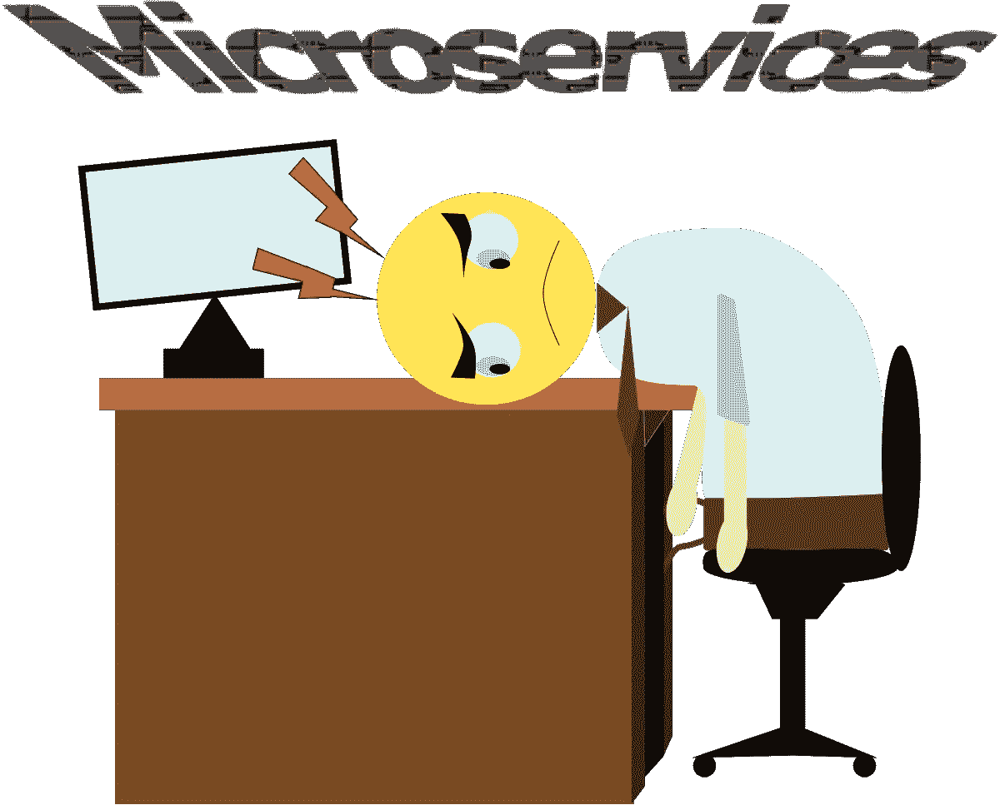

通常，当有人告诉我，我将帮助维护一个微服务中间件时，我的脑海中就会出现一个宏问题的想法。如果我说微服务系统是要开发的最复杂的软件系统，我想我没有弄错。认为一组没有上下文的独立应用程序具有与单个应用程序相同的行为是很难做到的。然而，微服务中的问题通常不是始于开发，而是始于设计。主要问题是大多数开发者不理解什么是微服务系统。他们认为每一方都可以相互对话的分布式应用已经是微服务系统，这是完全错误的。本文的目的是摧毁关于微服务的不正确假设，以尽量避免有宏观问题的项目。

# 微服务系统的简单定义

最简单，同时也是最完美的微服务系统的例子来自于一个单片的 appUnix 控制台。在我看来，如果微服务系统没有与 Unix 控制台命令相同的行为，那是因为我们没有微服务系统。让我们想一想:

“ls -l”命令在 Unix 中用于列出文件夹中的文件。另一方面，我们也有“grep”命令来过滤正则表达式的文件内容。两者相互独立。“ls”并不关心“grep”的存在，对于“grep”也是一样。唯一的共同点是它们运行在 Unix 控制台的上下文中。但是，如果我们用管道字符(“|”)连接“ls -l”和“grep”，我们可以使用正则表达式过滤目录中的文件。这里发生的不是“ls”命令正在打开与“grep”的通信。在这种情况下，“ls”将文件列表返回到控制台，控制台使用该文本作为“grep”命令的输入。“ls”和“grep”保持相互独立。

Unix 控制台的另一个特性是“&”。如果您在命令行末尾添加“&”字符，它会将命令的执行发送到后台，允许您同时执行几个命令。该特性的另一个证明是当几个人通过 ssh 连接到同一个 Unix 系统时。在这种情况下，控制台为每个连接打开一个线程，以便每个用户都可以执行他们想要的命令，而不管其余连接的用户。

现在假设您安装了一个新版本的 Unix 控制台，其中“ *grep* ”命令不起作用。你还能用游戏机工作吗？答案是肯定的。一两个命令在控制台 Unix 中不起作用的事实不会对最终用户产生大的影响。

我想提请注意的最后一点是，Unix 控制台命令是不可重用的。您不能像在 Unix 系统上一样在另一个操作系统上安装“ls”。为此，您必须安装 Unix 模拟器或终端。“ls”和其他 Unix 命令耦合到操作系统。

所有这些特征都是微服务系统必须具备的特征。请注意，在前面的任何一点上，我都没有提到服务器、docker、云、分布式应用程序等等。这些是我们可以用来获得上述特征的工具/策略，但它们不是微服务定义的一部分。

# 关于微服务的三个厄运问题

关于微服务的三个厄运问题是我平时问软件架构师的三个问题，用来验证他们是否真的了解什么是微服务系统。当然，如果您已经理解了前面 Unix 和微服务之间的相似之处，那么本文的其余部分将是多余的。但是，我建议您尝试回答这些问题，以验证您是否已经记住了与编写应用程序相关的所有内容，该应用程序的不同部分充当独立的服务。

# 1 个问题:在微服务中间件中，我们必须通过以下方式对微服务进行编码…

正确答案是**特征**。

按功能对微服务进行编码过于繁琐。例如，它意味着编码服务来验证电话号码或验证用户是否有有效的会话。这毫无意义。

为一个用户故事开发微服务，意味着以宏服务收尾；单片应用程序，提供几乎所有的应用程序功能。最终结果可能是几个非常相似的单片应用程序相互通信以共享信息，或者是一个大型应用程序带有几个小卫星。

正确答案是微服务功能。比如说；购买物品的微服务、登录用户的微服务、更新用户信息的微服务等。然而，最常见的是由业务实体来实现微服务…这是一个很大的错误。

让我给你看一个这样的例子:想象一下，我们必须为 bandit's pizza restaurant 编写一个应用程序，允许它的顾客通过 web 应用程序订购 pizza。由于我们希望根据业务模型调整基础设施的成本，我们决定将中间件划分为微服务。为此，我们的软件架构师决定为每个业务实体编写一个微服务，因此我们有三个微服务:

*   客户端:管理所有与客户相关的操作的微服务
*   Commands:管理所有与比萨饼订单相关的操作的微服务
*   Pizza:管理与 pizza 相关的所有操作的微服务

应用程序模式应该是这样的:

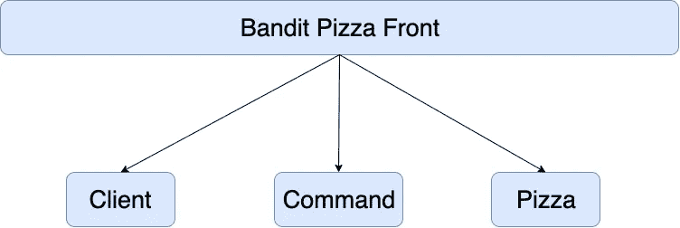

现在假设应用程序在线接收大量订单。因为微服务命令是管理比萨饼订单的命令，所以我们希望它的更多实例能够在尽可能短的时间内响应所有请求:

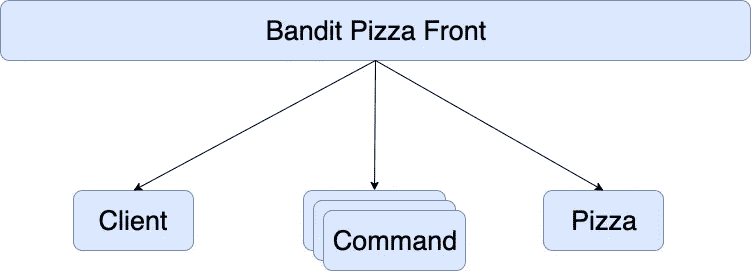

这里的问题是，餐馆订单是由一个顾客和一系列为其家庭准备的比萨饼组成的。但是，微服务命令不知道关于客户或比萨饼的任何信息，因此它必须调用客户端微服务和比萨饼微服务来收集其余信息:

假设网络的延迟为 0，那么微服务命令向客户端和 pizza 微服务发出的信息请求对最终响应的时间没有影响(尽管我们知道事实并非如此)因为在这种情况下，响应时间不是主要问题。主要问题是客户端和 pizza 微服务的扩展方式与命令相同，即尝试响应来自该微服务所有实例的所有请求:

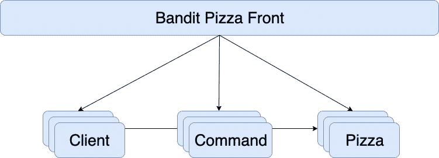

最后，每个订单的所有中间件都进行了扩展，这增加了基础设施成本，因为云服务是根据使用情况和消耗的资源来计费的。

另一个问题是，业务需要运行中的三个微服务来使应用程序工作。假设客户微服务出现错误并且处于非活动状态。该应用程序不能注册新客户，但也不能为新订单开具发票，因为微服务命令需要获得谁购买了比萨饼的信息。最后，我们得出结论，虽然它是一个分布式应用程序，但我们真正拥有的是一个整体应用程序，一旦我们达到这一点，唯一的解决方案是将其烧毁并从 0 重新构建。

设计这种应用的正确方法是根据应用特性对微服务进行编码。所以我们应该有一个微服务来创建一个客户端，更新一个客户端，读取一个客户端，创建一个命令，更新一个命令，读取一个披萨等等。每个微服务必须能够从数据源中读取完成任务所需的所有信息。继续以创建订单的微服务为例，如果我们希望这个微服务独立于其他服务，它必须能够读取客户和披萨信息。

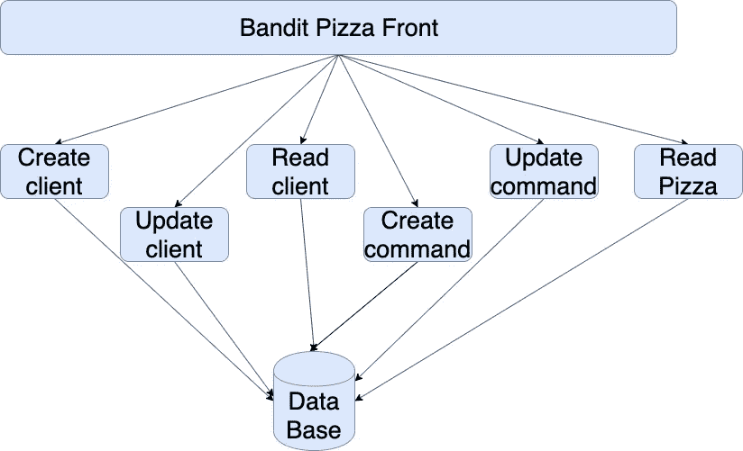

请注意，在本例中，应用程序的每个部分都具有相同的 Unix 命令行为。每个微服务相互独立，每个微服务根据系统需求单独扩展，如果一个微服务出现故障，应用程序仍可运行，所有微服务都与应用程序相关联，因为所有微服务都实现了 Bandit Pizza 业务模式的一项功能

# 2 问:微服务架构的一个主要特点是…

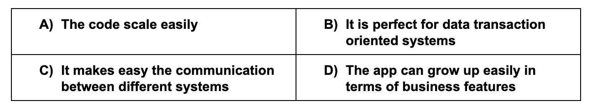

正确答案是 D；在微服务系统中，向应用添加新功能非常容易。

B 和 C 是与微服务无关的随机句子，A 是许多人认为微服务的优势，但事实恰恰相反。

我们必须首先了解缩放实例、缩放特征和缩放代码之间的差异。上一个问题中的例子，bandit pizza 应用程序，是一个扩展实例的例子；IT 系统(微服务系统、操作系统等。)为应用程序创建更多的线程来服务客户端请求。

为了理解代码可伸缩性，让我们看一个单一应用程序的 lego 模式的例子:

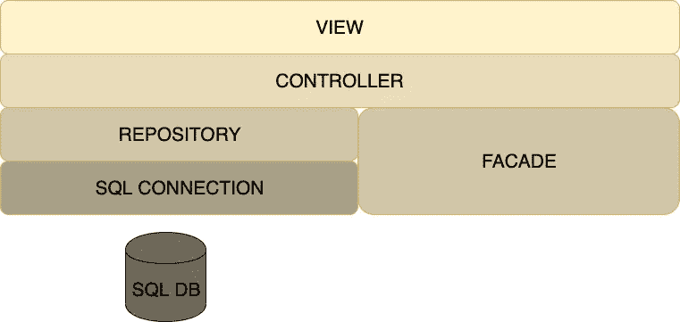

因此，我们有了为客户端公开接口的视图(如果您正在考虑通过路由器或资源公开 REST API 更改视图的中间件)、作为业务逻辑所在层的控制器、作为所有转换和数据验证层的外观、公开业务实体数据的存储库以及公开访问数据库的连接方法的 sql 连接。正如你所看到的，这个应用程序的每一部分都是由职责划分的。现在假设数据源需求发生了变化，出现了第二个数据库，一个 nosql 数据库，其中包含应用程序中相同实体的新信息。调整代码以适应这种变化非常简单:

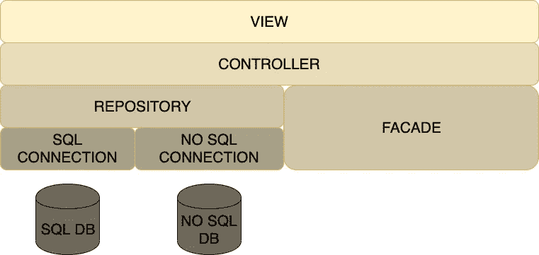

这是可能的，因为单片应用的主要优点之一；职责分离。每一层都有独特的职责，所以如果层之间的契约保持不变，在其中一层上添加更多代码不会影响应用程序的其余部分。

现在让我们看看同样的例子，但是在我们的 bandit pizza 应用程序中。首先，我们有一个场景，其中所有微服务从同一个数据库读取和写入数据:

现在让我们添加一个 nosql 数据库来提供系统的更多信息:

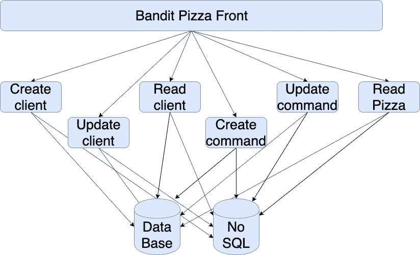

如您所见，整个应用程序都受到了影响，这是因为连接数据库的责任扩展到了所有微服务。这就是在微服务系统中扩展代码如此困难的原因。因为每一次代码更改都必须在不同的地方进行多次。在这种情况下，只要我们在所有微服务上进行相同的更改(这里的“相同”是指完全相同)，一切都应该没问题。然而，说实话，这种情况从未发生过。如果两个人在两个不同的微服务中应用相同的更改，通常会发生的情况是每个人以不同的方式实现解决方案。这时系统开始有不同的行为来做同样的事情，维护变得有点糟糕。

另一方面，扩展微服务应用程序中的功能非常容易。继续我们的 pizza bandits 应用程序，想象我们想要添加一个积分系统来建立餐馆顾客的忠诚度。变化如下:

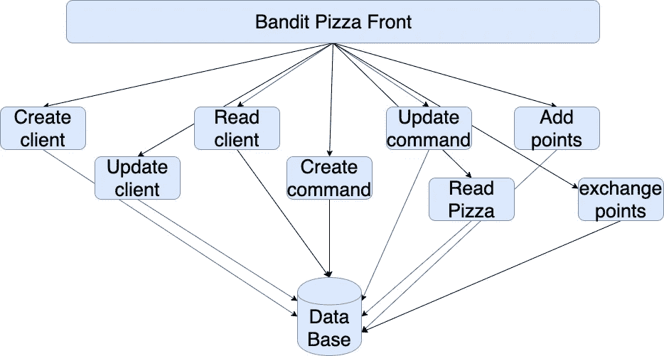

如您所见，我们增加了两个微服务，但其他服务没有改变。monolith 应用程序中的相同变化意味着大量工作，因为这意味着在所有层中添加代码，并且可能更新它们之间的通信合同。就是“定一物断四”的问题出现的时候。

# 3 个问题:微服务架构使之变得简单…

正确答案是 A:资源按需平衡。微服务系统中棘手的部分是确保具有更高需求的微服务是为业务产生金钱收入的微服务，因此由资源消耗产生的额外费用被直接补偿。

在这一点上，你应该能够很容易地放弃错误的答案。正如我们在上一个问题中解释的那样，相同的责任分散在所有微服务中。这意味着相同的解决方案在几个地方实现(可能以不同的方式)，所以在微服务系统中重用代码是很困难的。这样做的直接后果是，与单一应用程序相比，开发阶段的费用应该更高。当然，开发中还有其他因素可能会改变这种肯定，如开发人员的专业知识、需求的复杂性等。但在相同的情况下，开发整体应用程序比开发微服务系统更快、更便宜。

让我们用另一个例子来验证一下。让我们想象下一个微服务系统:

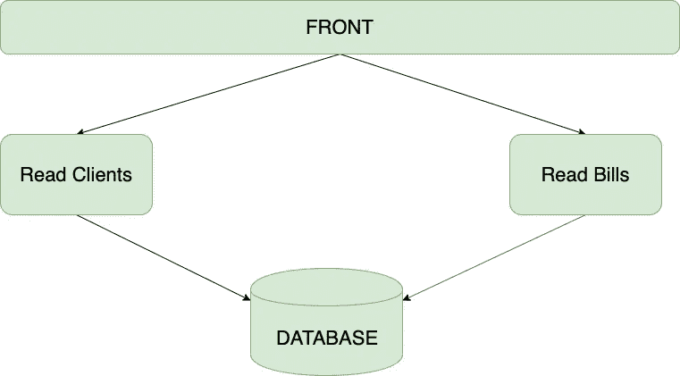

这是一个非常简单的付费应用程序的典型设计。我们有两种微服务:

1.  读取客户端，从数据库中读取客户端信息
2.  读取账单，从数据库中读取账单信息

但是，如果您考虑账单中包含的信息，您会意识到账单包含客户信息，因此最后，“阅读账单”微服务也必须理解客户信息(如果您没有清楚地看到这一事实，请下次再阅读第一个问题)。因此，我们在两个不同的地方实现了相同的客户端概念。现在，假设客户端的模型发生了变化。突然，业务人员需要一个新的字段，一些数据格式的变化或其他影响数据库中客户端模式的变化。为此，我们决定更新微服务“读取客户端”,以便正确读取客户端的全部信息。在这一点上，我们有两个不同的客户端概念，右边的在“读取客户端”中实现，旧的在“读取账单”中实现。这意味着最终用户正在查看关于客户端的不一致的信息，这取决于他/她正在阅读客户端数据界面还是账单数据界面。

为了解决这个问题，我们必须更新所有读取客户信息的微服务；“读取账单”和其他(我敢打赌有 2 个以上的微服务读取客户信息)，同时，尽可能保持更新的相似性。它通常涉及开发团队中的大量工作和协调。

使用库可以缓解这个问题(在微服务系统中无法解决)。你可以开发一个读取客户信息的库，把它作为所有微服务的依赖。但是，有可能多个微服务正在运行同一个库的不同版本。这有助于以快速和敏捷的方式在多个地方应用相同的解决方案，但它不能完全消除前端数据不一致错误的可能性。

一般来说，这意味着我们必须通过应用程序功能和库来协调项目，这增加了开发时间，从而增加了这一阶段的成本。

# 结论

开发人员很难理解的一点是，没有完美的解决方案(我看过好几次:“React 是最好的”，“Java 在所有情况下总是更好”，“NoSQL 是一个双赢的选择”)。各有利弊。在这种情况下，微服务使公司能够更有效地投资 IT 基础设施，但这是通过增加开发阶段的时间和成本来实现的。此外，微服务系统仍然是实现起来最复杂的系统，因此确保开发团队拥有适当的技能和经验来处理项目肯定会遇到的问题是很重要的。如果降低基础设施成本节省下来的钱不足以抵消额外的开发成本或者 ROI 过高，那么微服务系统肯定不是一个值得的解决方案。

选择微服务实施是因为它是最新或最现代的解决方案，这是走向全面灾难的第一步。第二步是将微服务设计成一个分布式的整体应用程序，而不考虑它在短期内涉及的内容及其后果。不幸的是，这两个事件仍然是最常见的。所以，我亲爱的读者和开发者，当你开始为你的下一个项目考虑解决方案的时候，想想解决问题最有效的方法，而不是在你的下一个很酷的会议上。