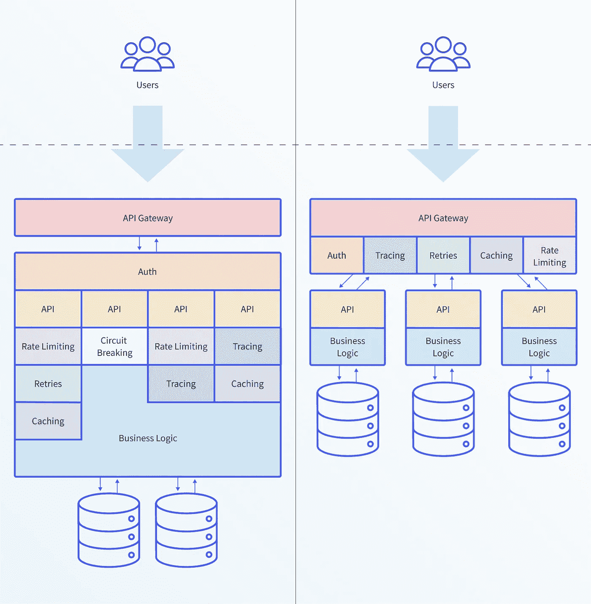

# 采用 Kubernetes 时，API 网关面临的两个最重要的挑战

> 原文：<https://itnext.io/the-two-most-important-challenges-with-an-api-gateway-when-adopting-kubernetes-cf2d63bab7e7?source=collection_archive---------4----------------------->

## 扩展边缘管理并支持多种需求

使用微服务模式构建应用程序并将这些服务部署到 Kubernetes 上已经成为当今运行云原生应用程序的实际方法。在微服务架构中，单个应用被分解成多个微服务。每个微服务都由一个小团队所有，该团队有权也有责任为特定的微服务做出正确的决策。

这种责任通常从用户请求到达的系统边缘开始，一直延伸到服务的业务逻辑，并向下延伸到相关的消息传递和数据存储模式。

> **边缘和 Kubernetes 入口**
> 
> 最终用户需要能够访问微服务。内部微服务和最终用户之间的边界被称为**边缘**。为了让最终用户访问内部应用程序，流量需要跨越边界。在 Kubernetes，流量通过一个叫做**入口**的软件越过边界。

当将 API 网关与运行在 Kubernetes 上的基于微服务的应用程序集成时，您必须考虑两个主要挑战:

*   如何扩展数百个服务和相关 API 的管理；和
*   网关如何支持广泛的微服务架构、协议和配置，这些架构、协议和配置通常跨越整个边缘堆栈。

# API 网关:微服务的焦点

API 网关是如何管理、保护和呈现 API 的核心。它作为一个软件组件(或一系列组件)部署在虚拟机上或 Kubernetes 中，充当系统的单一入口点。API 网关的主要职责是让用户能够可靠、安全地访问多个 API、微服务和后端系统。

微服务和 Kubernetes 提供了实现灵活性。例如，一个团队可能选择在系统边缘(内部服务和最终用户之间的边界)将基于容器的微服务公开为一组基于 HTTP 的 REST APIs。另一个团队可能会选择 Protobufs 和 gRPC。有实时流需求的团队可以通过 WebSocket APIs 公开他们的微服务。Kubernetes 中部署的任何 API 网关都必须支持所有这些协议。

每个团队不仅可以自由做出这些选择，而且还要对后果负责；这通常解释为“你建造它，你运行它”。虽然不是每个组织都完全赞同这种工作方式，但每个微服务团队都需要能够理解、诊断和配置处理每个服务和每个用户对应用程序的请求的所有方面。与应用和 API 相关的运行时需求的多样性意味着每个团队将与 edge 堆栈中的所有层一起工作，例如，动态请求处理、WAF 和任何缓存实现。

> 微服务的开发范式——独立、授权和负责任的团队——为使用 API 网关、Kubernetes ingress 和 edge 的微服务团队带来了一系列新的挑战。

在本文中，我们确定了 edge 面临的两个重要挑战:管理独立的微服务，以及访问全面的 edge 堆栈。

# 挑战#1:扩展边缘管理

**管理边缘的挑战随着部署的微服务数量的增加而增加**

在微服务架构中，工程师将管理更多的服务和应用。每个团队都需要能够独立地管理他们的服务，以便将发布从其他团队的计划中分离出来。在边缘公开应用程序的传统方法通常是通过集中运营或平台团队来完成的。然而，当一个组织拥有数百个微服务时，单个运营团队无法扩展以处理必要的变更量。

需要修改边缘配置的典型更改:

*   正在部署的服务的新版本。
*   修改端点、路由指令或相关的后端服务。
*   对身份验证和授权服务的更改。
*   修改非功能性需求，如速率限制、超时、重试模式和断路。
*   用户对新功能的测试，例如，为一小部分 beta 测试用户启用一个功能。

采用基于微服务的架构将导致发布数量的显著增加。这种增长只会加剧边缘管理的挑战，并增加集中运营方法的压力。

# 挑战#2:支持多样化的边缘需求

**微服务在边缘引入了许多新问题**

微服务架构支持架构灵活性。应用程序开发人员利用这种灵活性来选择最适合服务特定需求的编程语言和架构。无论架构如何，edge 都需要支持需要向用户公开的各种功能。这扩展了 API 网关的传统角色，与边缘整合工具需求相关的一些挑战包括:

*   熟练路由各种协议的能力。常见的协议包括 HTTP/1.1、HTTP/2、WebSockets、gRPC、gRPC-Web 和 TCP。
*   提供任何特定服务所需的完整的边缘功能集合，范围从流量管理到可观察性到身份验证等等。
*   在应用程序开发人员的自助服务模型中公开这些功能。

鼓励微服务团队内部实现的多样性允许工程师选择“合适的工作工具”。然而，底层平台的整合提供了许多好处。与其让开发人员为额外的协议支持或安全处理构建定制的实现，不如在边缘为他们提供预先批准的“自助餐”选项，以便他们可以挑选最合适的功能组合，这样更易于管理和扩展。

# 摘要

随着组织采用 Kubernetes 并转向基于微服务的架构，终端用户和内部微服务之间的边界出现了一系列新的挑战。因此，在采用微服务时，系统的这个“边缘”以及 API 网关等相关技术是一个焦点。这些新的边缘挑战是由微服务的组织模式驱动的，在这种模式下，独立团队有权并负责为微服务做出正确的架构和实施决策。

管理系统的边缘总是很复杂。使用多种架构添加更多服务只会增加对边缘的需求。平台团队必须相应地设计、选择和实现他们的 API 网关和边缘工具。

*这个故事最初出现在*[*https://www . getambassador . io/resources/challenges-API-gateway-kubernetes*](https://www.getambassador.io/resources/challenges-api-gateway-kubernetes)