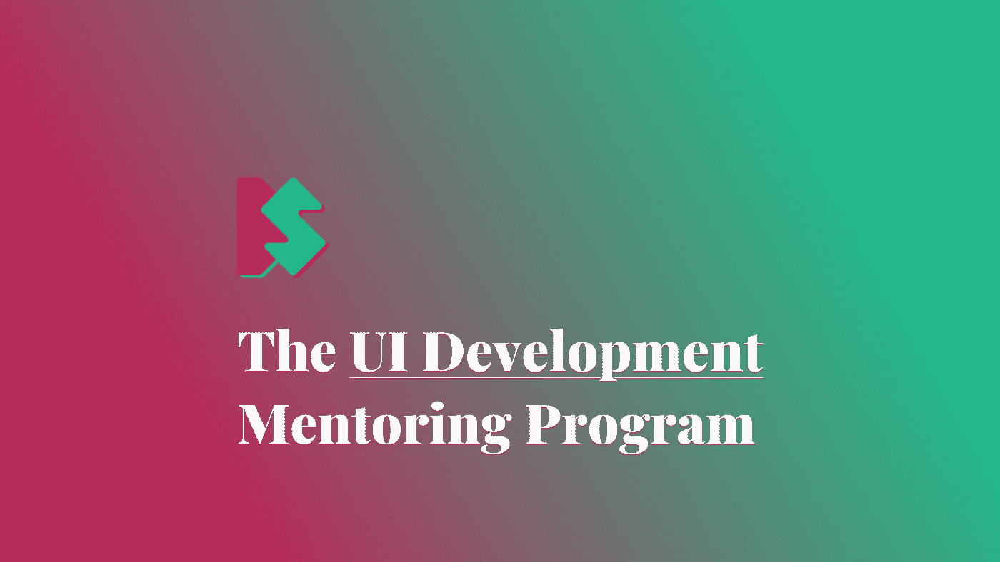
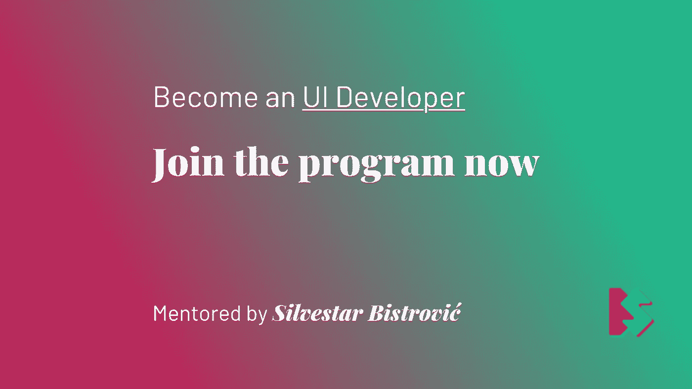
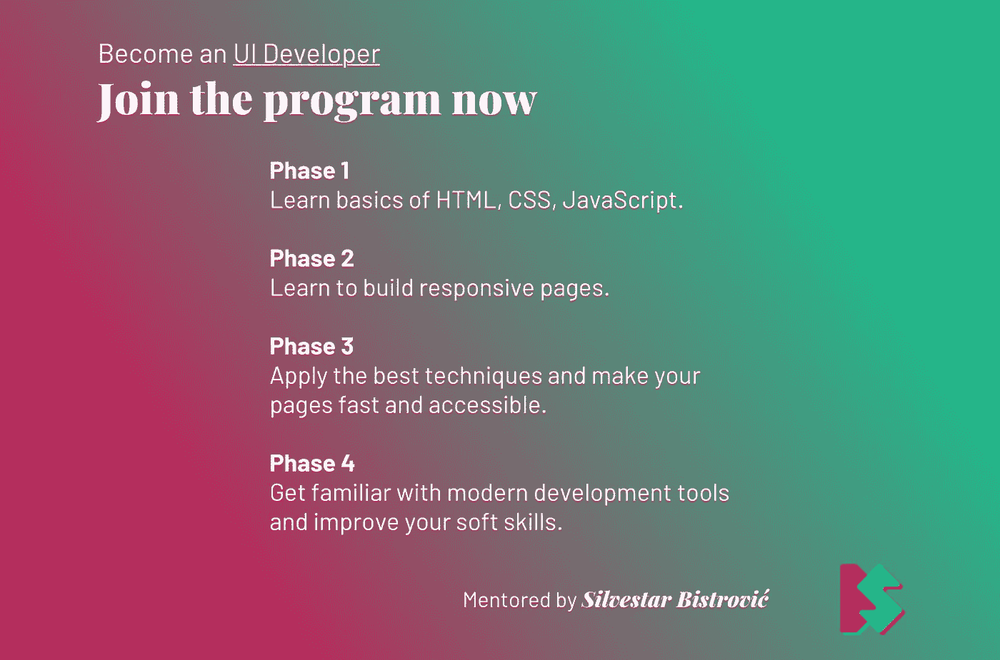

# UI 开发指导计划

> 原文：<https://itnext.io/the-ui-development-mentoring-program-bf060f27b293?source=collection_archive---------8----------------------->

## 师徒制

## 成为一名 UI 开发人员

我有这个想法已经有一段时间了，我决定在指导下尝试一下。上周，我[问了一个关于开发人员辅导的问题，得到了社区的积极回应。这鼓励我开始我自己的 UI 开发人员指导计划。](https://dev.to/starbist/do-you-think-remote-mentoring-could-work-2p2e)

因为我远程工作，所以我在这里谈论远程指导。这意味着我将接受来自世界各地的申请。

> 注意，我位于克罗地亚，我只会说英语和克罗地亚语。🇭🇷

# 背景

你可以在[我的个人网站](https://www.silvestar.codes/)上了解更多关于我的信息，但这里有一个简短的版本。

我是一名经验丰富的 web 工程师，自 2011 年以来一直从事 web 技术工作。我已经开始了 PHP 后端开发人员的职业生涯。我慢慢进步成为一名前端开发人员，现在从事 UI 开发工作。我一直在一家本地公司工作，后来在一家本地创业公司工作，直到 2017 年，我开始作为一名远程自由职业开发者工作。我也是[顶级人才网](https://www.toptal.com#trust-nothing-but-brilliant-freelancers)的一员。

关于我的指导和教学经验，我在以前工作的一家公司组织了编码学校。多年来，我一直在写博客，试图分享一些技术技巧和技术以及我的自由职业经历。我之前通过[共同导师](https://www.codementor.io/@malimirkeccita/)做过一些在线指导。目前，我正在指导我的朋友成为一名 UI 开发人员。

你可以通过[访问我网站上的链接部分](https://www.silvestar.codes/links/)找到更多关于我在线状态的信息。

# 什么是 UI 开发

UI 开发，或者说用户界面开发，是前端 web 开发的一部分，重点是用户界面。这个角色需要的必备技能是 HTML，CSS，JavaScript。许多其他技能属于这一类别，如模板、命名约定、最佳实践、优化、测试、跨浏览器兼容性等等。2020 年的 UI 开发还没有明确的定义，这就是为什么它很难，但也很有趣。

作为 UI 开发人员，您的主要任务是以最易访问和最高效的方式向每台设备上的每个用户呈现和交付内容。有时你会将 PSD 设计切片成模板，有时你会开发独特的组件，有时你会修复风格的 bug 和错误。开发用户界面总是具有挑战性，尤其是在 2020 年，有这么多不同的屏幕和设备成为目标。

作为一名 UI 开发人员，你应该能够创建现代的、反应灵敏的和优化的网站。仔细想想，每个网站或网络应用都需要一个界面。用户界面是呈现给每个用户的最后一层。它理解的远不止 HTML、CSS 和 JavaScript。它理解字体、图形资产、SVG、图标、动画、收藏夹图标、性能、绘画、渲染、审计、测试等等。

正如我去年写的那样，UI 技能经常被忽视，但是它是，或者至少应该是，每个项目的重要部分。这些技能可以与其他技能相结合，你可以成为一名前端或全栈开发人员，甚至是一名 UI 设计师——你是决定者。

# 这些程序

有两种指导计划:一种是基于职业的，另一种是基于技能的。

基于职业的指导计划将关注 UI 开发人员的角色，你可以期待关于这个角色是什么，期待什么，以及如何克服挑战的建议。我会试着根据你的技能和我的经验提供诚实的意见。

基于技能的指导计划被设计为一系列级别，在这些级别中，您将逐渐获得或提高该角色所需的技能。

我认为有四个层次:

*   基础水平，
*   中级水平，
*   高级水平，以及
*   工具和软技能。

如果你完成了基础阶段，你应该能够创建一个带有一点 JavaScript 功能的 HTML 文档。

如果你完成了中级水平，你的网页应该是有反应的。您应该理解并使用一些高级范例，如命名约定和第三方库。

如果你完成了高级课程，你应该能够用至少一个像 WordPress 或 static page generator 这样的系统来创建页面。你应该了解浏览器是如何工作的，并应用最新的最佳技术。

作为奖励，我想让你在开发中使用标准工具，如项目管理、版本控制和沟通工具。此外，如果你需要一些软技能的建议，如口头或书面沟通，我会在这里帮助你。

[项目各阶段的完整说明可以在这里找到。](https://docs.google.com/document/d/1fqhbu3zX1V4LBjPxParJNzDjJwFecx3cQ3-b0vXHwBE/edit?usp=sharing)

# 该过程

这里有一件重要的事情需要注意:我不是老师，我也不会去上课。不过，我会和你谈谈，回答你的问题。

我会试着:

*   让你像开发者一样思考，
*   让你说话像个开发者，
*   让你思考可能出现的问题以及如何避免它们，
*   帮助你实现职业目标。

为了能够有效地做到这一点，我们需要相互理解和尊重。我感谢我的时间；因此，我会感谢你的，我也希望你能为我做同样的事情。话虽如此，我还是会和你分享我的日程表，这样你就可以安排一次我们可以面对面交谈的会议。你也可以期待其他形式的交流，比如电子邮件和休闲频道。请注意，我可能无法实时回答这些问题。

# 要求

这个项目的唯一要求是你想成为一名 UI 开发人员的强烈愿望。你的背景或目前的技能水平并不重要。但是要知道[开发人员的工作需要不断的学习](https://www.silvestar.codes/articles/modern-frontend-developer-skills-and-tools/)。

不会有“期限”，因为你应该选择自己的节奏。我们都是不同的。也许你决定转行，或者你有其他优先考虑的事情。只要你有成为 UI 开发者的决心，我不介意。

# 立即应用

我还没有决定这个项目如何收费。有一点是肯定的:你不会后悔的，而且也不会很贵。

如果你有兴趣，请[填写表格](https://www.silvestar.codes/mentoring/)。让我们一起开始这段旅程吧。🙌

*原载于*[*https://www . silvestar . codes*](https://www.silvestar.codes/articles/the-ui-development-mentoring-program/)*。*