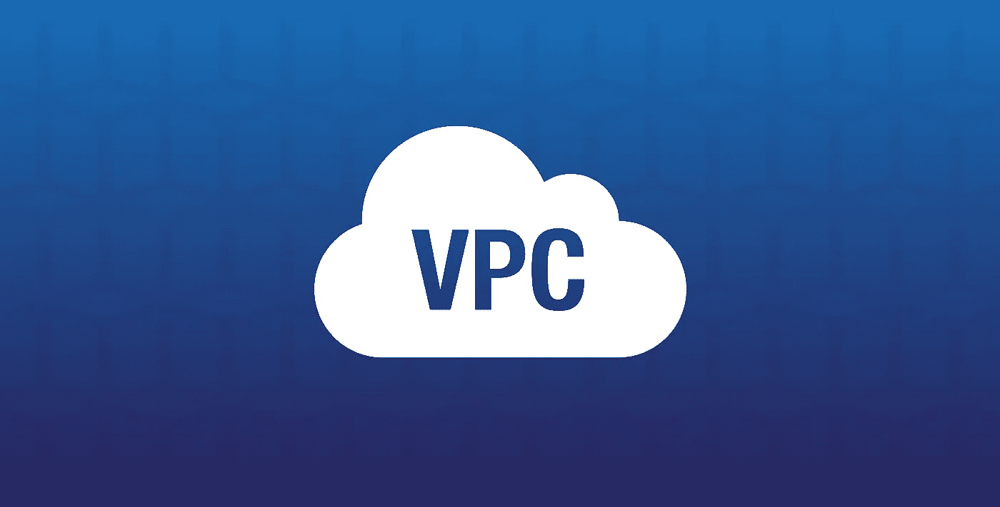
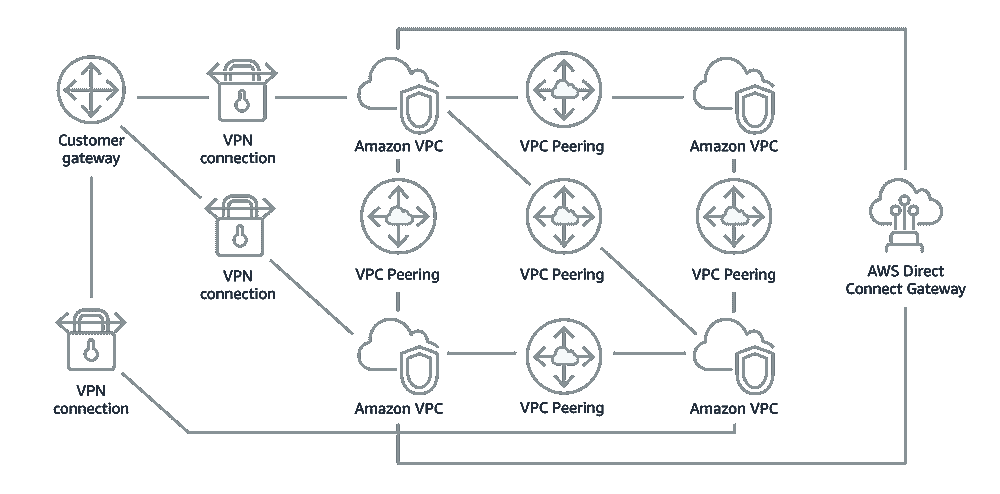
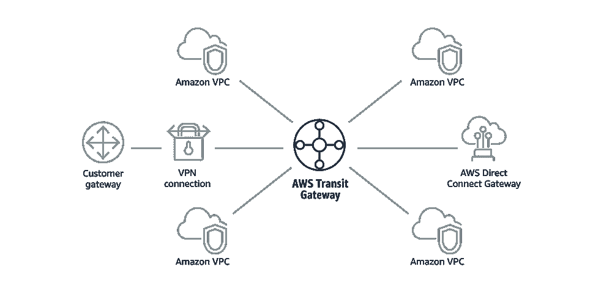
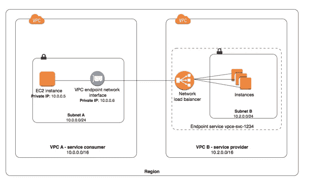
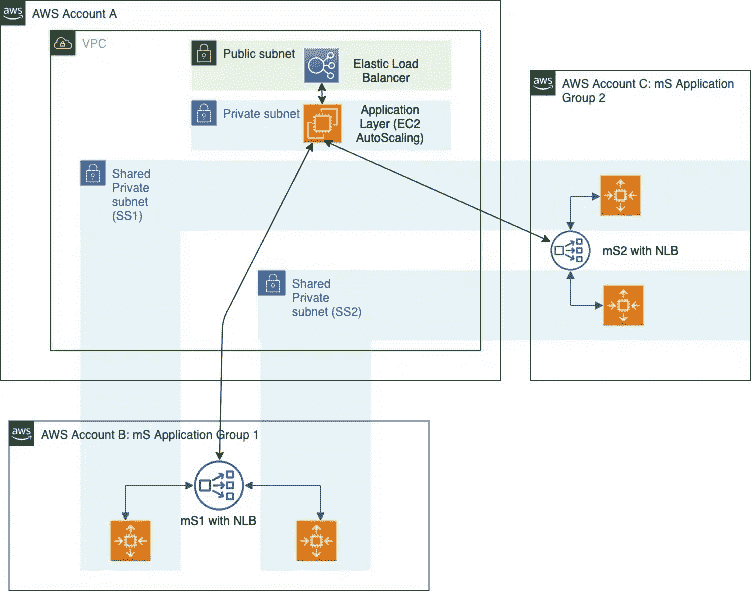

# AWS VPC 交叉通信(对等、共享、中转网关等)的全面指南

> 原文：<https://itnext.io/the-ultimate-guide-for-your-aws-vpc-cross-communication-peering-sharing-transit-gateway-etc-df06ca1e877c?source=collection_archive---------1----------------------->

作为一名开发人员和云架构师，网络端花了我最多的时间去掌握。但是在小型到大型公司的多个项目中工作过之后，我想记录下构建、管理和跨 VPC 交流的不同方法以及它们的优缺点。这个想法是有一种决策树来选择最佳解决方案。

> 不要忘了，没有放之四海而皆准的解决方案，只有针对特定需求的更好设计。

我们将讨论的不同设计是:

*   避免交叉交流
*   VPC 对等
*   AWS 中转网关
*   VPC 端点服务
*   VPC 共享

# VPC 和子网 101

如果你正在读这篇文章，我想你已经有了基本的知识，所以我会长话短说。

**VPC 代表虚拟专用云**，它是一个隔离的网络，在这个网络中，您的所有资源都可以相互通信。AWS 默认 VPC 与此 CIDR 块 172.31.0.0/16。这提供了 65，536 个私有 IPv4 地址

**子网是分配在可用性区域**的 VPC 的一部分。AWS 默认子网是大小/20 的块，因此 4094 专用 IPv4 (172.31.0.0/20、172.31.16.0/20、172.31.32.0/20)。当子网连接了 Internet 网关时，该子网可以是公共的，否则该子网将被视为私有的。这意味着私有子网中的资源将无法访问互联网(例如，不允许 *yum 更新*)。

# AWS 多账户架构设计

现在，AWS 推荐多帐户架构，将不同的服务隔离到它们自己的专用帐户中。

# 问题

由于这种设计，问题是:**既然 VPC 是隔离的，那么在不同 VPC 中运行的服务如何相互通信呢？**

# 解决方法

# 解决方案 1:避免交叉沟通

当我在做一个设计或者一个账户重组的时候，我首先会挑战 VPC 的交叉沟通的需求。你真的需要你的 VPC 互相通信吗？或者你能更好地设计你的架构来避免它吗？这个问题真的很重要，因为如果你能避免“桥接”你的 VPC，你将大大减轻你的帐户和安全的网络管理。它也有一些我们稍后会看到的优点。

用例:您可以将您的统计数据放入一个可访问的共享位置，而不是公开一个端点来获取一些统计数据。基本上你可以推而不是拉你的数据。

# 解决方案 2: VPC 对等

VPC 对等是在两个 VPC 之间建立桥梁的最简单的方法。

VPC A 向 VPC B 请求对等。VPC B 接受连接。VPC 更新它们的路由表并建立连接。

VPC 对等

这种模式很简单，因为我们没有添加任何组件，它可以跨区域工作，并且因为它是免费的，所以也很划算。如果 VPC 很少，这种设计是完美的，因为子网 CIDR 块不能重叠。在帐户工厂模式中更难管理(当您可以用相同的过程创建多个帐户时)。对等与同一帐户或不同帐户、同一地区或跨地区的 VPC 一起工作。因此，当您想要查看您的 ec2、rds 或 lambdas 时，它会非常有用。

# 解决方案 3: AWS 中转网关

VPC 对等是一个很好的解决方案，但是当您的网络扩展到数百或数千个 VPC 时，就很难管理了。管理路由表并避免 IP 重叠并不容易。这就是 AWS Transit Gateway 的用武之地。

不带和带 AWS 中转网关

我们可以看到，中转网关通过这个中心辐射式组件集中管理所有 VPC 连接。它还允许您连接本地 VPC。很容易理解它是如何简化数百个虚拟个人计算机的管理的。一些拥有大型网络的公司为网络管理创建了专用的 AWS 帐户。这就是 AWS 中转网关的位置。

因此，如果中转网关看起来如此完美，你应该忘记对等吗？一点也不。与对等相比，转接网关有一些缺点。其中之一是这种结构是按照 VPC 附件收费的。 **730 小时* 0.05 美元= 37 美元每 VPC**不含流量费，这对于中型公司来说可能很贵。Transit Gateway 还将在您的通信中增加另一跳，因此如果您正在寻求高性能，可以考虑一下。最后，transit gateway 具有 50Gbps 的带宽限制。

因为在你的中转网关中不能有 IP 重叠，所以你必须非常小心地分配你的 CIDR 块。通常你想使用一个小的范围，比如/28

# 解决方案 4: VPC 端点服务

有时候你不需要暴露你所有的 VPC，你只需要暴露一个端点。还记得我在解决方案 1 中的第一个用例吗，您想要为像 prometheus 这样的内部监控工具公开一个/metrics 端点。如果这是你唯一的终点，也许凝视你的 VPC 有点太夸张了。另一个解决方案是创建一个 VPC 端点。

VPC 端点服务

该解决方案适用于提供商/消费者系统。提供者通过 NLB 的 VPC 端点服务公开其服务，消费者通过 VPC ENI 消费服务。此解决方案不是跨区域兼容的。连接是单向的，这意味着提供商将无法访问消费者的 VPC 中的服务。

另一个要点是，提供商只能通过网络负载平衡器公开服务。关于安全性，您可以定义 VPC 端点策略，即 IAM 策略。最后，每个接口端点可以支持每个可用性区域高达 10 Gbps 的带宽，并自动扩展到 40 Gbps。

每个端点接口每月每 AZ 收费 7.3 美元，不含流量。

# 解决方案 5: VPC 共享

从 AWS 来看，“当团队之间的网络隔离不需要由 VPC 所有者严格管理，但帐户级别的用户和权限必须如此时，共享 VPC 非常有用”

这种模式在 Account Factory 模式下非常适用，在这种模式下，您需要为每个新服务/项目创建一个新帐户。云管理员创建一个 VPC，并与所有其他帐户共享。在这种情况下，管理非常简单，因为没有 VPC 之间的连接。所有服务都在同一个 VPC 中，因此可以相互通信。安全性由安全组管理。

AWS VPC 分享

如果部署在共享 VPC 中的所有服务都属于同一个所有者(例如，考虑一个银行中的私有网络)，这种设计很好，但是如果您想要隔离您的一些客户，我不推荐这种设计。

这种架构没有配额，降低了成本，因为在同一 AZ 跨多个帐户的流量没有数据传输费用。

其中一个缺点是，共享 VPC 仅适用于同一组织中的不同帐户。因此，如果你打算考虑你的组织，这不会是一帆风顺的。

# 摘要

现在我们对根据不同需求的不同设计有了更好的了解，下面我们来总结一下。

请随意添加您的评论，我将很乐意更新这篇文章。