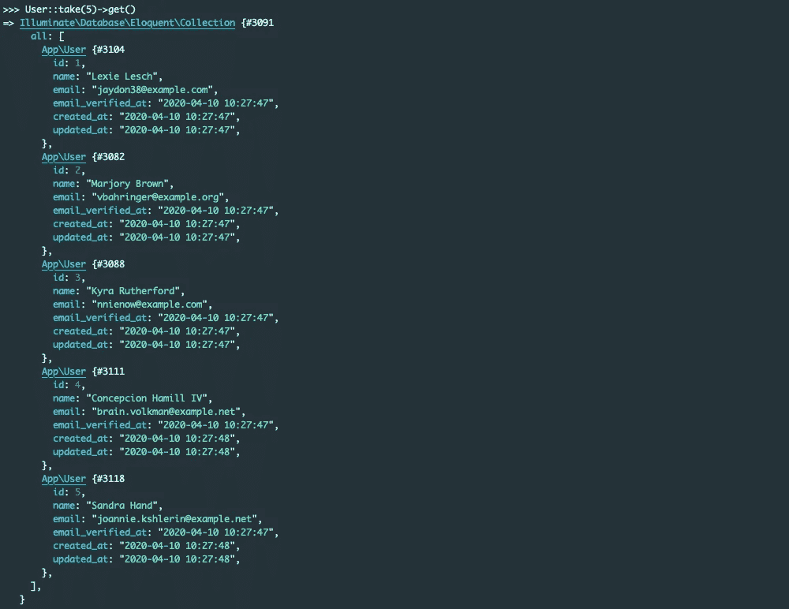
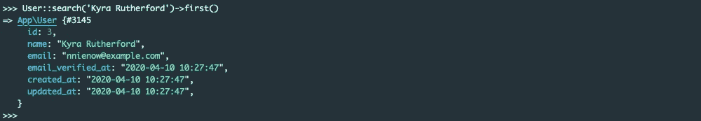
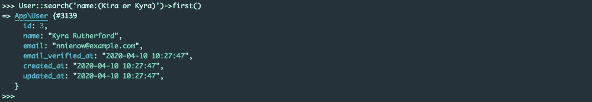
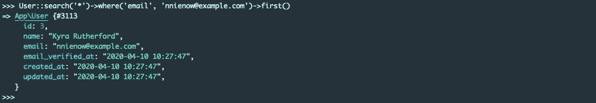
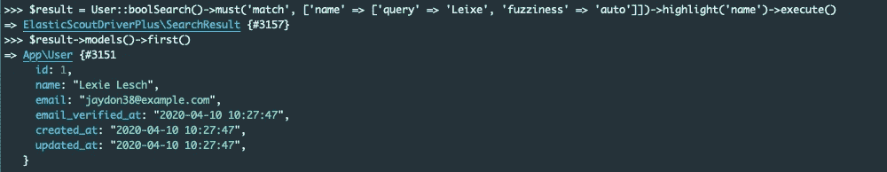
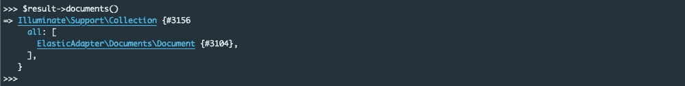
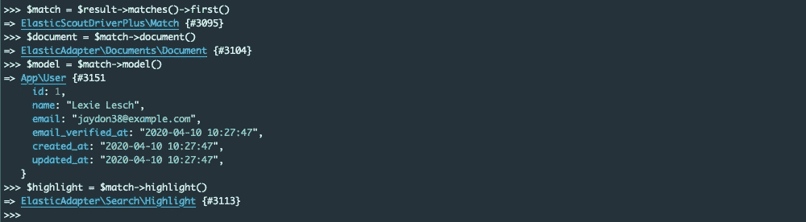
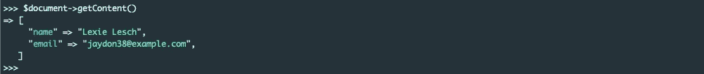
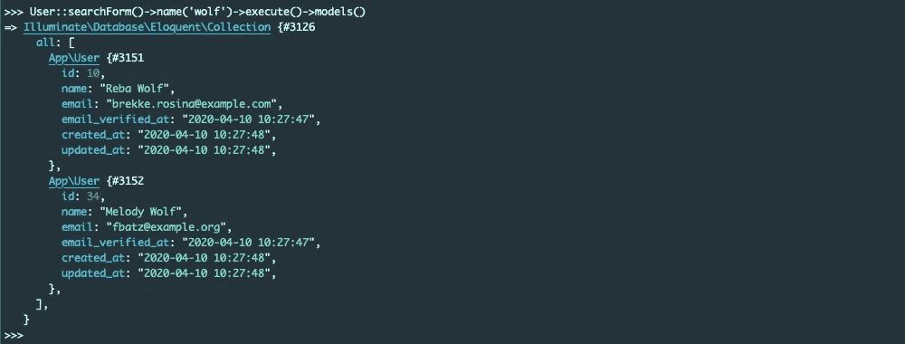
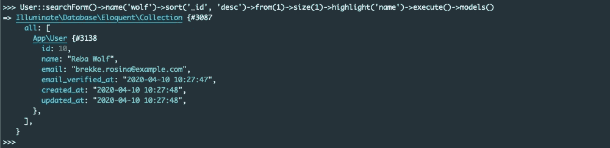

# Laravel 应用中弹性研究的最终指南

> 原文：<https://itnext.io/the-ultimate-guide-to-elasticsearch-in-laravel-application-ee636b79419c?source=collection_archive---------0----------------------->

从一项新技术开始会让人不知所措。尤其是像 Elasticsearch 这么复杂的时候。在这种情况下，最好的知识来源是[官方文档](https://www.elastic.co/guide/en/elasticsearch/reference/current/index.html)，但是它经常不能回答对你来说很重要的问题:从哪里开始？如何在我的本地机器上运行软件？我该如何将它与我心爱的框架整合在一起？

而且，有时候我们就是不能投入那么多时间去研究一项新技术。我们有紧迫的截止日期，另一个主题的重点，我们想要的是一个快速的开始。在这种情况下，专注于你感兴趣的主题的指南可能是你最好的选择。这就是本文的全部内容:它指导您在 Laravel 项目中构建基于 Elasticsearch 的定制搜索引擎所需的步骤。

您可以在本文中找到以下问题的答案:

*   *我怎样才能立刻建立一个开发环境，包括:PHP、数据库、HTTP 服务器和 Elasticsearch？*
*   *我怎样才能创建一个 Elasticsearch 索引并与我的队友分享这个模式？*
*   *如何定制 Elasticsearch 索引的数据？*
*   *如何使用迷你语言语法提出搜索请求？*
*   *如何进行 bool 查询？*
*   *如何构建自定义搜索请求构建器？*

所有答案都以“如何”的方式给出，并附有示例。

# 拉拉多克

在开发一个新项目之前，通常会安装和配置所有必要的软件，这允许您在本地机器上运行代码。我以后会把它称为开发环境。

开发环境的主要目的是在我们将代码发布到生产或其他环境之前，测试我们的代码，看看它实际上是如何工作的。通常用于运行 Laravel 应用程序的软件栈有:PHP、PHP-FPM、Nginx、MySql，在我们的例子中还有 Elasticsearch。

有很多方法可以在本地运行这个软件:你可以使用虚拟机，Docker 容器或者直接在你的电脑上安装堆栈。在本文中，我们将坚持使用 Docker，因为它是目前开发人员最受欢迎的选择。

幸运的是，我们不需要从头开始创建 Docker 映像，因为已经有了一个解决方案，完全符合我们的需求— [Laradock](https://laradock.io/) 。要开始使用 Laradock，您需要将存储库克隆到您选择的目录中:

结果文件夹结构应该如下所示:

其中***elastic-laravel-demo***是一个目录，这是我为演示 Laravel 应用程序准备的

要配置 Laradock，切换到 ***laradock*** 文件夹，并将 ***env-example*** 复制到 ***。env*T11:**

打开 ***。env*** 文件，并将代码路径变量设置为您的应用程序目录，如下所示:

如果你想更深入地了解 Laradock 的可用配置选项和可能性，请查看官方文档[。对于我们的用例，我们可以保持配置的其余部分不变，并且已经在后台启动了必要的容器:](https://laradock.io/documentation/)

# Laravel 应用

让我们创建一个小的演示应用程序，看看如何在 Laradock 环境中配置 Laravel，并为接下来的部分准备一些场地:

当新的 Laravel 安装就绪后，我们需要在 ***中更改 MySql 设置。env*** 文件与 Laradock 默认配置兼容:

每个 Laravel 安装都带有预定义的 ***用户*** 型号、 ***用户工厂*** 以及相关的迁移。我们可以利用它来用一些数据填充我们的演示应用程序。唯一缺少的是***UsersTableSeeder***，它可以使用 Artisan 命令创建:

***用户种子*** 可以在 Laravel 的 ***数据库/种子*** 文件夹中找到。要使用播种机，我们需要定义 ***运行*** 的方法:

不要忘记通过取消注释相关行来启用***database/seeds/database seeder . PHP***中的播种机:

最后，在 ***工作区*** 容器中使用*种子* 选项运行迁移:

# 弹性迁移

我们已经创建了一个数据库和 ***用户*** 表，现在是时候创建一个 Elasticsearch 索引来存储搜索引擎数据了。索引就像关系数据库中的表。它有一个映射，定义了字段类型。

我们如何创造一个？要回答这个问题，让我们考虑一下在 Laravel 应用程序中创建数据库表的方式。常见的做法是什么？当然，数据库迁移！

幸运的是，我们有 [Elastic Migrations](https://github.com/babenkoivan/elastic-migrations) 库，它提供了一个类似于 Laravel 迁移的接口，但是允许您操作 Elasticsearch 索引，而不是关系数据库表。

让我们使用 Composer 安装库:

弹性迁移使用[弹性客户端](https://github.com/babenkoivan/elastic-client)作为依赖项。这意味着，我们需要在**T3 中配置客户端。env** 文件之前我们可以执行一次迁移:

另外，不要忘记运行 Laravel 迁移，因为弹性迁移使用一个数据库表来存储元信息:

要创建迁移文件，我们可以使用 Artisan 命令:

该命令将在***elastic/migrations***文件夹中创建一个存根文件。我们打开带有***create _ users _ index***后缀的文件，修改如下:

正如您在上面看到的，我们在用户索引中只添加了两个字段:姓名和电子邮件。 ***名称*** 字段为[文本类型](https://www.elastic.co/guide/en/elasticsearch/reference/current/text.html)，由 Elasticsearch 分析，可用于全文查询。 ***邮件*** 是[关键字](https://www.elastic.co/guide/en/elasticsearch/reference/current/keyword.html)，不做分析，主要用于过滤。

在编写 Elasticsearch 迁移时，您可以使用许多助手: ***create*** ， ***putMapping*** ， ***putSettings*** ， ***drop*** 等等。我们无法在本指南中涵盖所有内容，因此请参考[项目页面](https://github.com/babenkoivan/elastic-migrations)了解更多详情。

迁移准备就绪后，我们可以借助***elastic:migrate***命令来执行它；

下一步是对用户数据进行索引，但在此之前，让我们在下一节中简要介绍一下 Laravel Scout。

# 弹性侦察驱动器

谈到应用程序中的全文搜索，Laravel 提供了一些东西。我说的是 [Laravel Scout](https://laravel.com/docs/master/scout) ，它可以让你的雄辩模型变得可搜索。Scout 自动保持搜索索引与数据库记录同步。

Scout 是灵活的:你可以在引擎盖下使用任何你选择的引擎(Algolia，Elasticsearch，database 等。).不幸的是，它只配备了一个开箱即用的驱动程序——Algolia。但是这不是一个问题，因为编写自己的驱动程序或者更好地选择一个已经由社区创建的驱动程序是非常容易的。

Scout 不包含在默认的 Laravel 安装中，所以使用 Composer 将其添加到您的应用程序中:

安装库后，您需要发布其配置:

Elasticsearch Scout drivers 有很多，但我们将详细讨论***babenkovian/elastic-Scout-driver***:

您可以通过在 ***中设置 ***SCOUT_DRIVER*** 变量来启用驱动。env*** 文件:

注意，Elastic Scout 驱动程序使用与弹性迁移相同的客户端依赖，因此我们这次不需要配置 Elasticsearch 连接。

现在是时候配置我们的 ***用户*** 模型了。首先，我们需要通过添加 ***可搜索*** 特征来启用搜索功能:

其次，让我们限制由 Elasticsearch 索引的字段，因为我们不希望密码和无用信息存储在我们的搜索引擎中:

最后，随着所有准备工作的完成，我们准备将演示数据导入到 Elasticsearch 中:

注意，你只需要第一次导入一个已有的数据。所有新的数据库记录将自动与 Elasticsearch 同步。

当记录被导入时，我们可以打开 Tinker 并从数据库中获取一些用户，以了解我们可以搜索什么:

让我们试着找到一个存储在 Elasticsearch 中的用户。基拉·卢瑟福怎么样？

弹性侦察兵驱动支持[迷你语言语法](https://www.elastic.co/guide/en/elasticsearch/reference/current/query-dsl-query-string-query.html#query-string-syntax)，这意味着你可以做更复杂的查询。例如，如果我们不记得确切的名字:

或者我们根本不知道名字，但我们有一个电子邮件地址:

正如你所看到的，Elastic Scout Driver 开箱后非常强大，但是如果你想要更多的灵活性或者缺少一些 Elasticsearch 特定的功能，请查看下一部分，我们将在其中讨论 Elastic Scout Driver Plus。

# 弹力侦察兵驾驶员增强版

弹性侦察兵驱动程序是伟大的，但由于它在侦察兵的边界工作，它是非常有限的。它没有公开 Elasticsearch 的具体特性，因为这会破坏与其他驱动程序的兼容性。

这个问题由 [Elastic Scout Driver Plus](https://github.com/babenkoivan/elastic-scout-driver-plus) 解决，它带来了很酷的新功能，如 bool 查询、高亮显示等等。如果你不打算在你的项目中切换不同的 Scout 驱动，而宁愿坚持使用 Elasticsearch，我推荐你安装它:

要启用 Elastic Scout Driver Plus 特性，请在您的模型中添加 ***自定义搜索*** 特征:

要使它工作，您不需要配置其他任何东西。让我们切换到 Tinker 并尝试一下:

在上面的例子中，我们做了一个 [bool 查询](https://www.elastic.co/guide/en/elasticsearch/reference/current/query-dsl-bool-query.html)，它搜索一个名为 ***Leixe*** 的用户，并突出显示结果。不幸的是，我们在名字上有一个拼写错误，但是当模糊性被启用时，这不是问题。

与 Elastic Scout Driver 不同，Plus 版本返回一个 ***SearchResult*** 对象，而不是模型集合。它给你更多的灵活性。例如，如果您不需要模型，并且希望避免额外的数据库查询，您可以只检索文档:

还可以通过匹配获得相关文档、模型和突出显示:

Highlight 是一个对象，用于访问 Elasticsearch 记录的片段:

文档是存储可搜索数据的对象:

而且不需要解释 model 是什么意思，只要记住， ***SearchResult*** 只在你要求的时候才加载模型，所以不需要担心数据库过载。

Scout Driver Plus 提供了如此多的弹性，不可能在一篇文章中涵盖所有内容。如果您想要更多的用法示例，请查看[库文档](https://github.com/babenkoivan/elastic-scout-driver-plus)。

我想通过向您介绍一个非常重要的 Elastic Scout Driver Plus 特性来结束这篇文章——自定义查询构建器。

想象一下，你的网站上有一个表格，可以让你搜索用户。除了在后端使用通用的查询构建器，您还可以创建一个具有更直观界面的自定义查询构建器:

查询构建器构建一个有效负载，作为搜索请求的一部分发送给 Elasticsearch(与分页、高亮规则等一起发送)。).为了使用***SearchFormQueryBuilder***，我们需要在我们的模型中添加一个新方法:

现在我们可以进行更加透明和清晰的查询。看看这个:

当然，您仍然可以使用分页、突出显示和排序:

我希望这个指南能帮助你们中的一些人开始使用 Elasticsearch 和 Laravel。感谢您的阅读，如果您有任何问题，请不要犹豫，在下面留下您的评论🙂