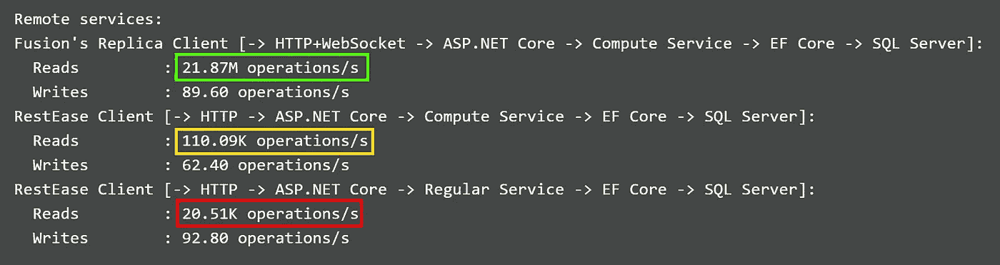

# 非绿色网络:为什么我们的网络应用程序非常低效？

> 原文：<https://itnext.io/the-ungreen-web-why-our-web-apps-are-terribly-inefficient-28791ed48035?source=collection_archive---------0----------------------->

尽管 Amazon 的例子在本文中并不独特，但我将它作为现代 web 服务效率的第一个例子:

在亚马逊上获取一个产品页面的 HTML 即使你几秒钟前也做了同样的事情(所以实际上没有什么变化),也需要 1.3 秒。这是在洛杉矶的 1000Gbps 美国电话电报公司光纤+ WiFi 6 上:

亚马逊服务器花费 1.3 秒“渲染”并发送给你大约 1MB 的文本(209KB 压缩)，或大约 773KB /秒。这样的结果有多好？

我知道这完全不是比较，但我还是想说明这个数字有多小:

*   一个在 4K 渲染~ 130 帧每秒的 FPS 游戏= 30*3840*2160*10 = 10，782，720 KB /秒的像素数据，假设它使用 2 字节每通道+ 4 字节深度缓冲区。
*   10，782，720 / 774 = **13，931** —这是这种 FPS 游戏在亚马逊网页上生成一个字母文本时产生的字节数。
*   即使你考虑到每个网络服务器同时处理 10 … 100 个这样的请求，这种差异看起来仍然令人震惊。

从这个意义上来说，亚马逊完全不是独一无二的:

1.  易贝计时稍微好一点，但仍然是 0.6 秒响应页面刷新**。**

2.Twitter 在重复的 API 请求上花费了 **0.1 … 0.5s** 的时间:

3.Medium 需要大约 1 秒的时间向您发送大约 40KB 响应的第一个字节，再次是对特定帖子页面的*重复*请求:

4.SaaS 服务公司进一步提高了这些计时。例如，查看 GitHub。根据我自己的经验，**2…4 秒的行动-反应时间在 SaaS 世界中或多或少是正常的**。当然，不是每一个动作，但是对于某些动作(甚至是频繁的动作)——绝对是这样。

5.在顶级网站中，脸书是唯一的例外:它对大多数不太受欢迎的内容的重复 API 请求都在 60 毫秒内做出响应，我猜测它肯定解决了我进一步描述的问题。但即使它的结果似乎也是有挑战性的:我对[facebook.com](http://facebook.com)的 ping 时间大约是 4 毫秒，所以它花费了大约 55 毫秒来响应，这实际上仍然很多，如果你知道就在几分钟前几乎相同的响应已经被计算，这意味着你可能只需要几毫秒来命中缓存&重新计算什么发生了变化。

## 为什么我确定有性能改进的空间？

我是花了大半辈子时间来构建 web 服务或其组件的人之一。我越是思考 web 服务是如何工作的，就越是发现我们做得不对。

如果你是开发人员，这里有一个你应该熟悉的例子:**增量构建** *。我们大多数人都在使用它们，有时甚至没有注意到。他们是这样工作的:*

*   构建系统跟踪产生每个构建工件所需的依赖项(通常是文件和其他工件)
*   一旦其中一个依赖关系发生变化，依赖于变化的工件就会被标记为“不一致”(需要重新构建)，以及依赖于它的任何其他构建工件。所以一旦构建被触发，只有不一致的工件被重新构建。其余的只是简单的重复使用。
*   由于开发人员很少一次改变所有的东西，通常所有工件的一个很小的子集在每个后续的构建中被重新构建。

更复杂的构建系统更精细地跟踪依赖关系。例如，现在的一些编译器会为你的文件甚至预编译的代码缓存抽象语法树(ASTs ),所以最终，他们甚至不会在构建你的项目时完全编译受影响的模块。

正如您可能猜到的，您的项目越大，您从增量构建中获得的就越多。

依赖增量构建的大型生态系统的一些示例包括:

*   [码头工人](https://www.docker.com/)。如您所知，容器映像不同于基本映像。当您为您的应用程序构建 docker 容器时，您通常会使用由其他人构建并存储在 docker 图像存储库中的图像。
*   [软件包仓库](https://en.wikipedia.org/wiki/Software_repository) —特别是 NuGet for。NET 或者 Python 的 PyPI。一旦一个包被构建&并存储在其中一个库中，你(或者你的编译器)可以简单地下载&来使用它。

## 等等，但是增量构建和 web 服务有什么关系呢？

这相当简单:

> 现在大多数 web 应用程序几乎是从零开始生成每个页面和每个 API 响应的内容。是的，每次你请求一个内容，他们都做同样的工作。

换句话说，大多数 web 服务不使用类似于增量构建的东西来构建输出。每次你问他们，他们就简单地重建一切。

下面是典型 API 请求的处理方式:

*   中间件堆栈解析请求的各种部分，但最终会到达控制器。
*   控制器调用一个或多个服务。很多情况下这些服务都是远程微服务的客户端，所以~同样的链条“延伸”到实际的微服务，微服务的行为也是类似的。
*   实际的服务触及底层存储—通常是数据库。在某些情况下，它会命中缓存，但这个选项通常只在没有其他帮助时使用——因为[缓存失效很复杂](https://martinfowler.com/bliki/TwoHardThings.html)。这也是为什么缓存通常只在请求处理管道的最开始使用*:*实现基于数据变化的实时缓存失效逻辑很难，所以开发人员倾向于为 API 调用的最小子集实现这样的逻辑。**
*   *因此，即使有缓存，未命中也意味着不仅结果，而且每个中间值都将被重新计算——正如您可能猜到的，大多数支持 ui 的 API 端点都返回聚合。*
*   *如果没有缓存，它总是一个完整的重新计算，换句话说，产生这个 API 调用结果的服务将会多次访问 DB 以获取所有的中间数据，等等。等。*

*这就是为什么您经常看到大多数“资源”请求的响应时间为 10ms 它们很容易缓存。类似地，100 毫秒…1 秒的响应时间对于 API 或“数据”请求来说是正常的——它们很难缓存，因此经常从头开始重新计算。*

*想想这个:*

*   *假设我们考虑过去几分钟访问该网站的所有其他用户的“唯一性”,你认为亚马逊或易贝产品页面上有足够多的唯一内容只显示给你吗？*
*   *对于中型帖子页面、tweet / tweet 线程等也是如此。—它们只包含几百行文本，其中 99%对其他人来说都是一样的。*

*那么，为什么服务器需要 1 来生成这样的页面呢？*

## *问题陈述*

***我们的服务器在处理一个请求的几秒钟内做了什么？大多数情况下，他们一次又一次地重新计算相同的值。事实上，他们重新计算“临时常数”——已知保持不变的值，因为用于产生它们的每个“成分”仍然是相同的。***

***他们为什么要重新计算“临时常数”？**最终，因为他们没有一个好的方法来跟踪“成分”并知道它们何时改变，所以他们悲观地假设每次你需要使用它们的值时，这些成分都不同。*

***他们应该怎么做？**开始跟踪依赖关系，仅重新计算由于内存限制而发生变化或从缓存中逐出的内容。为了清楚起见，这不仅仅是关于 API 响应级别的缓存，而是关于中间体。想想增量构建:如果知道任何微小的变化都会使最终输出无效，那么只缓存最终输出会有帮助吗？但这就是我们的大致情况。*

***这就是为什么我最终在标题中添加了“非绿色网络”:**“[一个经常被重复的说法是，世界数据中心排放的二氧化碳与全球航空业一样多(Pearce 2018)](https://energyinnovation.org/2020/03/17/how-much-energy-do-data-centers-really-use/) ”，尽管这一说法在一年前是有争议的，但云计算工作负载的增长率(10 年内增长了约 10 倍)以及可悲的新冠肺炎可能已经证明了这一点。*正如你可能猜到的，这里能源效率提高的潜力远远高于航空业。**

## *我们怎么会沦落到这种地步？*

*有趣的是，这很自然:*

1.  *只有当性能变得太昂贵而不能忽视时，大多数公司才开始关心性能。这就是为什么性能对于 FPS 游戏来说至关重要(你不会出售一款每秒渲染几帧的游戏)，但对于 web 应用来说却不那么重要——假设亚秒级的响应时间仍然被认为“足够好”。*
2.  *以上对于网络初创公司尤其有效:首先是产品，然后是铃声和哨声，而性能通常是其中之一。*
3.  *有趣的是，你越大，这个问题就越明显。如果知道您的云基础架构占您总支出的 10%,您是否愿意继续在服务器上花费 3-5 倍的成本，并且速度慢 10 倍？值得注意的是，云和社交初创公司往往有更高的服务器成本，因此，例如【Twitter 的服务器成本约占总成本和支出的 35%。但是依赖关系跟踪在开始时比以后更容易解决，也就是说，节省这 10 倍的最简单的方法是提前计划。*
4.  *具有健壮的依赖性跟踪的缓存可能是一个难题。试着谷歌一下，看看解决方案的前景如何，但是总的来说，到目前为止还没有简单的即插即用的解决方案。从开发成本的角度来看，几乎所有可用的解决方案都非常复杂且成本过高。*
5.  *我们已经习惯了摩尔定律。*

*一个有趣的证据证明了其中的一些观点:**缓存有很多解决方案，但是依赖跟踪几乎为零**。*

*[Wikipedia 似乎甚至没有这类产品的列表](https://en.wikipedia.org/wiki/Data_dependency)，尽管解决依赖性跟踪问题对于缓存失效至关重要:它通过允许根据需要(或可能)缓存项目来提高缓存效率，假设失效将不可避免地在正确的时间发生，但更重要的是，它也使最终一致的系统几乎与强一致的系统一样好。*

*因此，如果您知道这两个问题之间的联系有多深，那么这就是不带依赖性跟踪的缓存应该寻找您的方式:*

**

## *但是说真的，基于超时的过期有什么问题吗？*

*让我们使用增量构建来展示不同之处:*

*   ***无缓存:**重建*上的一切*每运行一次*
*   ****基于超时的响应缓存:**无论您进行更改的频率有多高，您都会运行一个过时的构建至少 T 分钟，一旦它们消失了，您将需要等待一个完整的重建**
*   ****响应缓存&实时缓存失效:**重建*一切*一旦*某事*发生变化，否则运行 prev。build——换句话说，它是～非增量构建，但是如果什么都没有改变，就不会在运行时重新构建。**
*   ****基于依赖跟踪的缓存失效**:增量构建&运行。**

## **有什么解决办法吗？**

**毫无疑问，一个也没有——至少没有甚至是不太为人所知的，假设我们谈论的是可以插入到您自己的代码中的通用依赖跟踪库。**

**更准确地说，*没有。*我是[Fusion——一个开源库的作者。NET Core 试图改变我们构建实时网络应用的方式。它所做的一切都基于一个核心特性:对任何计算结果的透明依赖跟踪。这使得 Fusion 能够解决许多更高级别的问题，包括向远程客户端提供任何值的实时更新的能力，以及将响应时间和服务器效率提高约 10 倍。](https://github.com/servicetitan/Stl.Fusion)**

**早些时候，我给出了 web 应用程序潜在效率提升的“数量级”估计，Fusion 的[缓存样本](https://github.com/servicetitan/Stl.Fusion.Samples#4-caching-sample)实际上证明了您可以期待您的服务获得类似的提升:**

*   **仅在服务器端使用的 Fusion 将极其简单的 ASP.NET 核心 API 端点的性能从每秒 20，000 个请求提升到每秒 110，000 个请求。因此，大约 5 倍的性能和效率提升可能是您应该期望的最低值，因为您的服务越复杂，缓存的预期收益就越高。**
*   **但是，一旦依赖关系跟踪扩展到客户端，依赖关系感知客户端(Fusion 术语中的“副本服务”)将扩展到 22，000，000(！)每秒请求数—这还是在单台机器上！**

****

**Fusion 的缓存基准输出**

## **进一步阅读**

**如果你觉得这个帖子很有趣，想了解更多关于 [Fusion](https://github.com/servicetitan/Stl.Fusion) 和它解决的一些其他问题，请查看我的其他帖子:**

*   **[实时是你的下一个网络应用需要的首要特性](https://medium.com/@alexyakunin/features-of-the-future-web-apps-part-1-e32cf4e4e4f4)**
*   **[Fusion 和 SignalR 有多相似？](https://medium.com/swlh/how-similar-is-stl-fusion-to-signalr-e751c14b70c3)**
*   **[Fusion 和 Knockout / MobX 有多相似？](https://medium.com/@alexyakunin/how-similar-is-stl-fusion-to-knockout-mobx-fcebd0bef5d5)**
*   **[简单来说就是融合](https://medium.com/@alexyakunin/stl-fusion-in-simple-terms-65b1975967ab)**
*   **[融合背后的故事](https://github.com/servicetitan/Stl.Fusion/blob/master/docs/Story.md)**

**最后，在 GitHub 和[上查看](https://github.com/servicetitan/Stl.Fusion)[融合库及其示例](https://github.com/servicetitan/Stl.Fusion)。**

## **关于作者**

**如果你在吸毒。你可能也知道我是第一个商业 ORM 产品的创造者。NET (DataObjects。网)。过去，我在 Quora，Inc. 工作，在那里我编写了 asynq 库的最初版本。目前，我是 [ServiceTitan，Inc.](https://www.servicetitan.com/) 的首席技术官，该公司是全球领先的面向住宅和商业服务及更换承包商的一体化软件。**

**我喜欢构建工具来帮助开发人员解决具有挑战性的问题。我在这篇文章中强调的问题很明显是这种类型的:潜在的 10 倍性能提升太好了，不能忽视+知道没有众所周知的解决方案意味着可能其他每个尝试过的人都没有成功地生产出对大多数开发人员来说足够好的东西。这足以激励我开发 Fusion，并尝试在 web 应用效率领域取得进展:)**

****附言**如果你觉得这篇文章有用——即使你不在。NET，请重新分享*。如果你在的话。如果能在推特上发布这篇文章的链接，我们将不胜感激！***