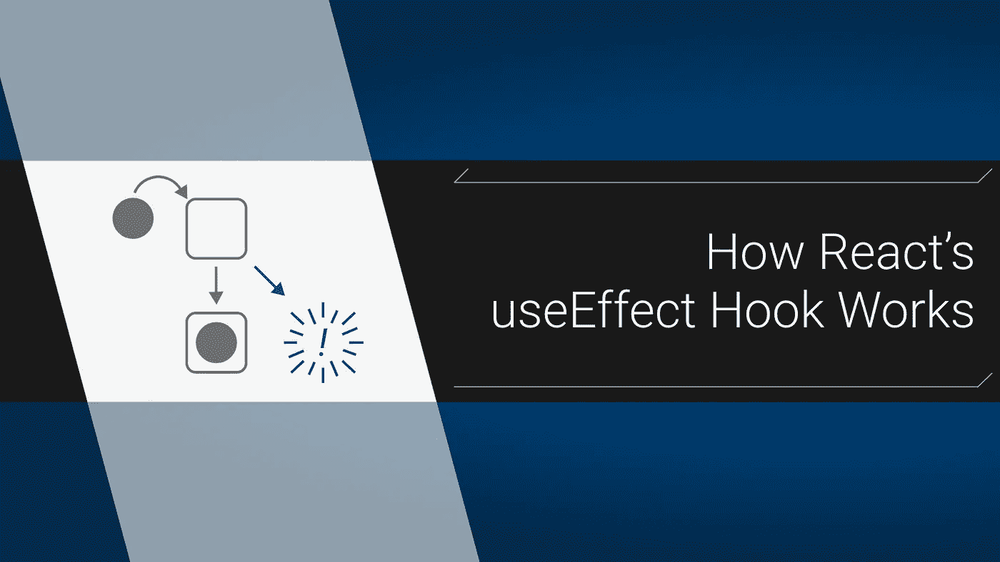

# React 的 useEffect 钩子如何工作

> 原文：<https://itnext.io/the-useeffect-hook-makes-sense-if-you-think-differently-333c2d775400?source=collection_archive---------2----------------------->

## 不一样，但是更好



对于那些通过有状态组件学习 React 的人来说，`useEffect`可能是最难学的一个钩子。对我来说当然是。今天的框架正在简化它们的 API，这就是`useEffect`正在尝试做的事情。它确实简化了事情，但也改变了很多。

# 停止思考生命周期

当我第一次学习反应时，我记住了这些循环。[这个组件生命周期图](https://miro.medium.com/max/4516/1*552z6hbX_b648DjpTLHZNg.png)是一个常用的方法。这似乎使跟踪我的组件的渲染变得简单明了，但这有点多，不是吗？与其跟踪生命周期方法来确保组件的行为，不如我们只关心呈现状态，而生命周期并不重要？

# 专注于渲染

这就是范式的转变:我们现在真的只关心**渲染**。组件挂载后有原始的渲染，以及所有额外的重新渲染。我们只是希望这些与我们的状态同步，就是这样。`useEffect`这样做只有两个参数:副作用回调和一组要观察的状态:

```
**useEffect**(**sideEffectFunction**, [**stateToTrack**]);
```

> (还有卸载的细节，不过这个不太常见的最后阶段我们就不多说了。C [查看文档了解更多关于清理的信息](https://reactjs.org/docs/hooks-effect.html#effects-with-cleanup)

## 副作用回调函数

这就是`useEffect`得名的原因；它负责管理状态变化产生的副作用。当它跟踪的状态改变时，它调用副作用函数。这就是它的全部功能。回调不应该返回任何东西，[除非你正在卸载](https://reactjs.org/docs/hooks-effect.html#effects-with-cleanup)。

## 跟踪状态

该阵列有 3 条主要途径:

1.  **省去**:每次组件重新渲染时效果都会运行。我一般不推荐这个选项。
2.  **包含一个空数组**:这告诉 React 没有要跟踪的状态，所以它会在第一次渲染后运行一次回调函数**，这就是*它*。**
3.  使用填充数组:你可以传递一个或多个状态给`useEffect`来跟踪。这样，就不会在每次渲染后都运行回调，它只会在那些特定的状态改变后运行。

> useEffect 真正做的只是在某些渲染之后调用副作用函数。

这是最基本的，现在让我们编码一些东西，好吗？首先，让我们用它来完成两个非常常见的任务:初始数据抓取和记录状态变化。先说数据部分。

# 新的组件安装模式

在下面的代码中，我们从 [JSON 占位符](https://jsonplaceholder.typicode.com/guide.html)中获取一个用户。我们没有设置默认状态，因为我喜欢在渲染任何东西之前等待真实数据的模式。我们还使用了`useState`钩子，所以如果你还不熟悉的话，可以查看一下[教程。下面是完整的组件和适配器:](https://reactjs.org/docs/hooks-state.html)

```
import **React**, {
  **useEffect**,
  **useState**,
} from '*react*';const **UserAdapter** = {
  get: (**id**) => {
    const **url** = '*https://jsonplaceholder.typicode.com/users*';
    return **fetch**(`*${****url****}/${****id****}*`)
      .then(**res** => **res**.json());
  },
};const **App** = () => {
  const [
    **user**, 
    **setUser**,
  ] = useState(**null**); **useEffect**(() => {
    **UserAdapter**
      .get(1)
      .then((**dbUser**) => {
        **setUser**(**dbUser**);
      });
  }, []);

  ***return*** (
    <*div*> 
    {
      **user**
        ? <*h1*>
            {**user**.name}
        </*h1*>
        : <*p*>
            loading...
        </*p*>
    }
    </*div*>
  );
};export default **App**;
```

这里是`useEffect`部分，特写:

```
**useEffect**(() => {
  **UserAdapter**
    .get(1)
    .then((**dbUser**) => {
      **setUser**(**dbUser**);
    });
}, []); 
```

我们包含了空数组，以确保我们的副作用只在第一次渲染后运行一次。在这种情况下，效果函数只是将我们的第一个用户加载到状态中。在现实世界中，您可能会从您的 url 参数中提取 ID，但现在这样做是可行的。

好了，这和`componentDidMount`基本一样，没什么可怕的。

# 检查更新

只需在你的组件中加入另一个`useEffect`，不需要`componentDidUpdate`。让我们将相关的状态放入数组，以便养成这样做的习惯:

```
**useEffect**(() => {
  **console**.log(**user**);
}, [**user**]);
```

要查看实际情况，让我们添加一个按钮来进行另一个 db 查询:

```
*// initial code ...*
**useEffect**(() => {
  **console**.log(**user**);
}, [**user**]);const **handleClick** = () => {
  **UserAdapter**
    .getOne(**user**.id + 1)
    .then(**dbUser** => {
      **setUser**(**dbUser**);
    });
};***return*** (
  <div>
    { user stuff }
    <*button*
      onClick={**handleClick**}
    >
      Get New User
    </*button*>
*// rest of code ...*
```

每次你点击按钮，我们的第二个`useEffect`注销当前用户的状态。顺便说一下，这是记录状态变化的方法(`[useState](https://stackoverflow.com/questions/56247433/how-to-use-setstate-callback-on-react-hooks)` [没有像](https://stackoverflow.com/questions/56247433/how-to-use-setstate-callback-on-react-hooks) `[setState](https://stackoverflow.com/questions/56247433/how-to-use-setstate-callback-on-react-hooks)`那样的回调)，所以在开发过程中您会经常使用这种模式。相信我。

# 更小的函数===更干净的代码

通过选择专注于渲染，而不是将我们所有的工作锁定在生命周期中，`useEffect`允许我们将逻辑分解成更小的功能。你有 4 件不相关的事情要检查更新吗？现在，您可以将它们分解成各自独立的功能。不可否认`useEffect`是一种新的思维方式；但是一旦你习惯了，我希望你会同意这是一种进步。

大家编码快乐，

麦克风