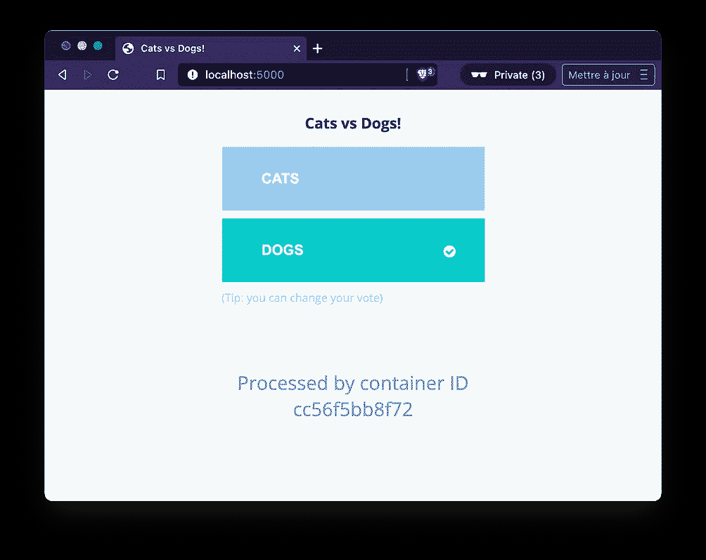
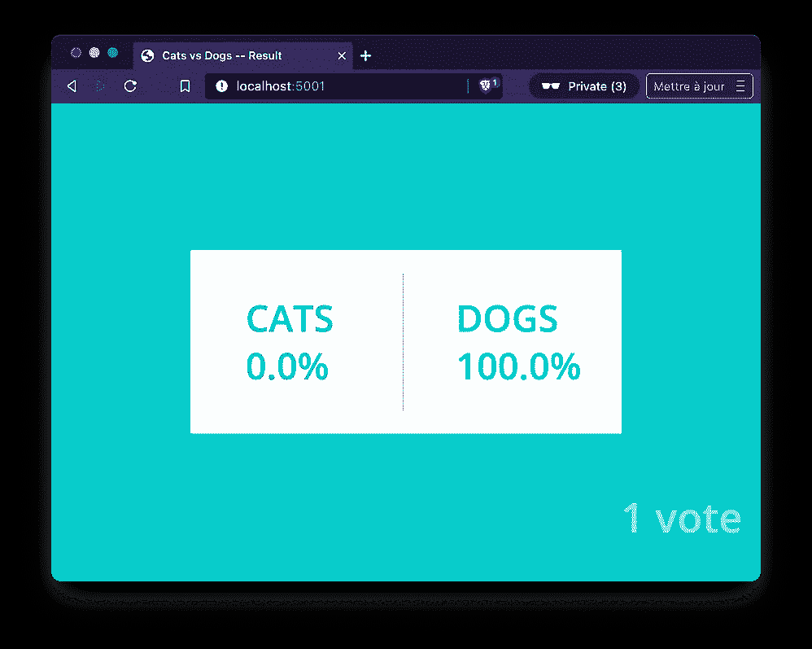
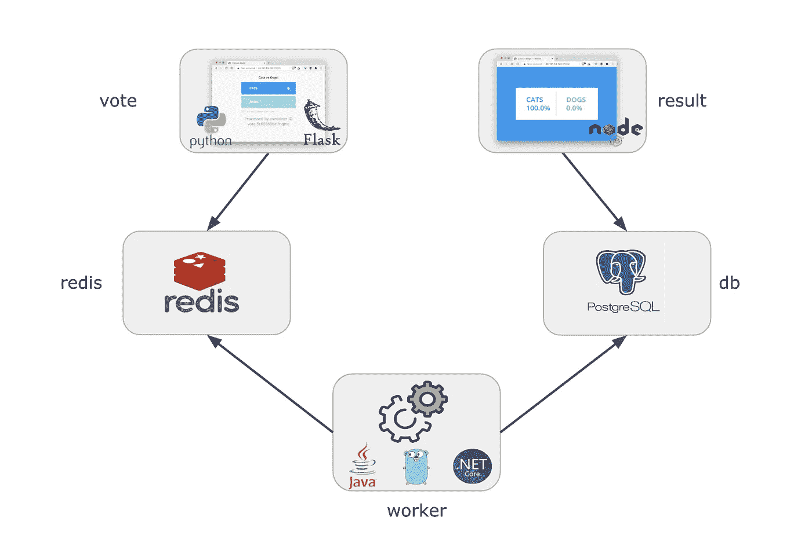
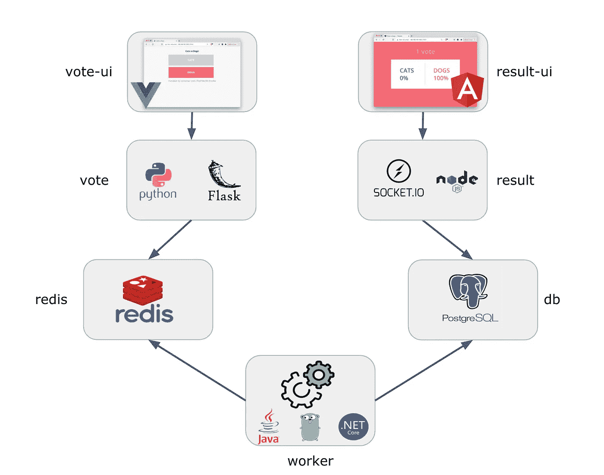
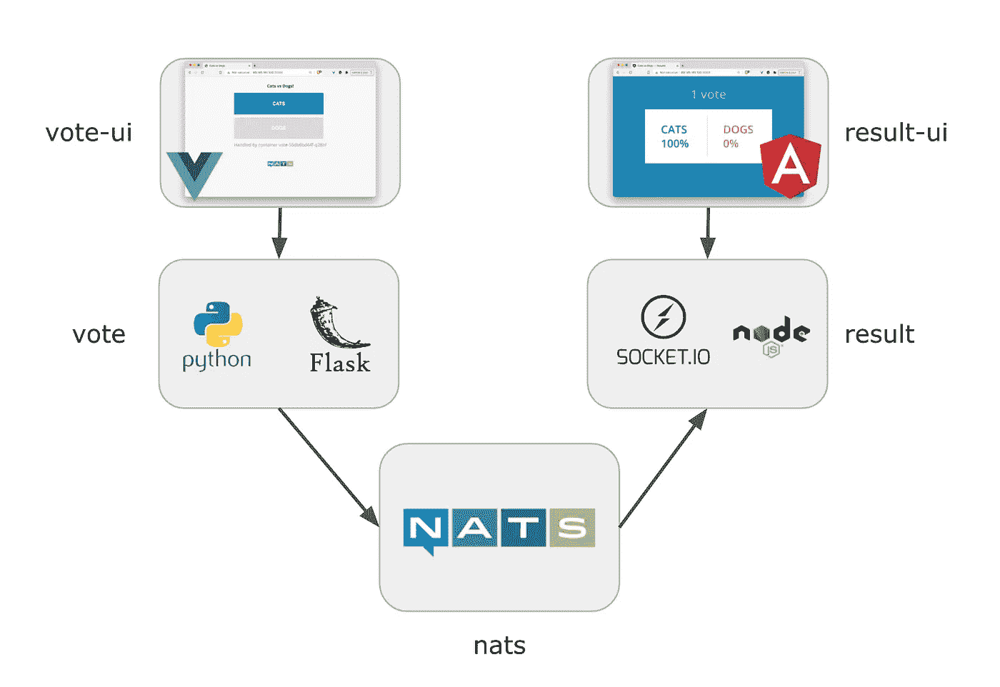

# VotingApp 重新加载

> 原文：<https://itnext.io/the-votingapp-reloaded-e4f237b8f3bf?source=collection_archive---------2----------------------->

## 对这个演示应用程序的增强概述

乔安娜·科辛斯卡在 [Unsplash](https://unsplash.com/s/photos/presentation?utm_source=unsplash&utm_medium=referral&utm_content=creditCopyText) 上的照片

正如我在其他文章中使用(并将使用)VotingApp 来说明不同种类的容器相关技术一样，我将在这里介绍整个应用程序和最近完成的增强。为了避免太多的重复，我将引用其他人的这篇文章。

[VotingApp](https://github.com/dockersamples/example-voting-app) 是 Docker 创建的一个演示微服务应用程序，它主要用于演示 Docker 和 Kubernetes 的功能。基本上，它允许用户从一个 web 界面投票，并从另一个界面查看结果。

投票看看结果。简单却非常有趣

🔥这个应用程序没有遵循所有最好的微服务架构模式，但它绝对非常适合演示和展示，因为它使用了几种语言、不同的组件，并且非常容易理解:)

最初的应用程序被托管在一个单独的 GitHub 库中，但是为了展示额外的功能(并对整个应用程序进行增强),我在 [GitLab](https://gitlab.com/voting-application) 中创建了它的新的(非官方的)家，其中每个微服务都有自己的库。添加了一个额外的[配置库](https://gitlab.com/voting-application/config)，它定义了应用程序:

*   使用 Docker 合成文件
*   使用 yaml 规范
*   通过[舵](https://helm.sh/)图
*   通过[切槽](https://kustomize.io/)结构

VotingApp 现在有 3 个不同的版本，让我们看看每个版本之间的主要区别。

## **版本 1**

下面的模式说明了 VotingApp v1(应用程序的原始版本)的全局架构。

以下是每个微服务的详细信息:

*   **投票**:用 Python 开发的前端，它允许用户在猫和狗之间选择
*   redis :储存选票的数据库
*   worker :从 Redis 获取投票并将结果存储在 Postgres 数据库中的服务。一个 Java，。现在这个服务已经有了 Rust 版本(感谢托马斯·卡斯特利的最后一个版本)
*   **db**:Postgres 数据库，工作人员在其中合并投票
*   **结果**:node . js 开发的前端，显示投票结果

## **第二版**

v2 版本是 v1 的增强版。它基本上将前端和它们所依赖的后端分离开来。以下架构说明了 VotingApp v2 的全局架构。

VotingApp 版本 2 将前端/后端解耦

它仍然使用`redis`、`db`和`worker`微服务，但是`vote`和`result`已经被修改/拆分:

*   **vote-ui**:vue js 中的前端，允许用户选择一个项目
*   **投票**:后端用 Python / Flask 公开一个 API
*   **结果**:后端通过 websocket 向 UI 发送分数
*   **result-ui** :前端角度显示投票结果

## **第三版**

这个 v3 版本使用了一些 v2 组件，但是数据库和`worker`部分已经被替换为 [NATS](https://nats.io/) ，以确保`vote`和`result`之间的通信的发布/订阅。以下模式说明了 VotingApp v3 的全局架构。

VotingApp 版本 3 使用 NATS 作为发布/订阅

## 摘要

本文仅介绍 VotingApp 及其新架构。在以后的文章中，我们将使用这个应用程序来说明许多有趣的概念和工具。有些文章已经有了:

*   [使用原始清单、Helm 和 Kustomize 部署 VotingApp】](/k8s-tips-manifests-helm-kustomize-12f72f878022)
*   [Docker、Kaniko、Buildah 构建图像](/docker-kaniko-buildah-209abdde5f94)
*   [在 Shipa 上部署 voting app](/deploying-the-votingapp-on-shipa-2af9c6097bb3)

敬请期待下期:)