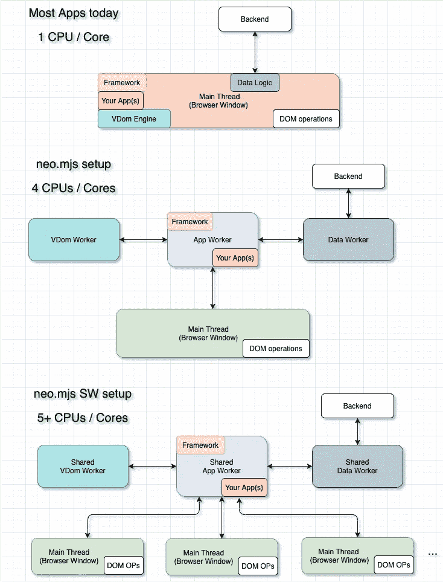
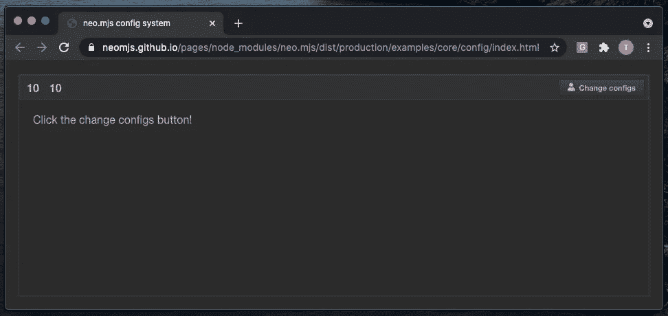
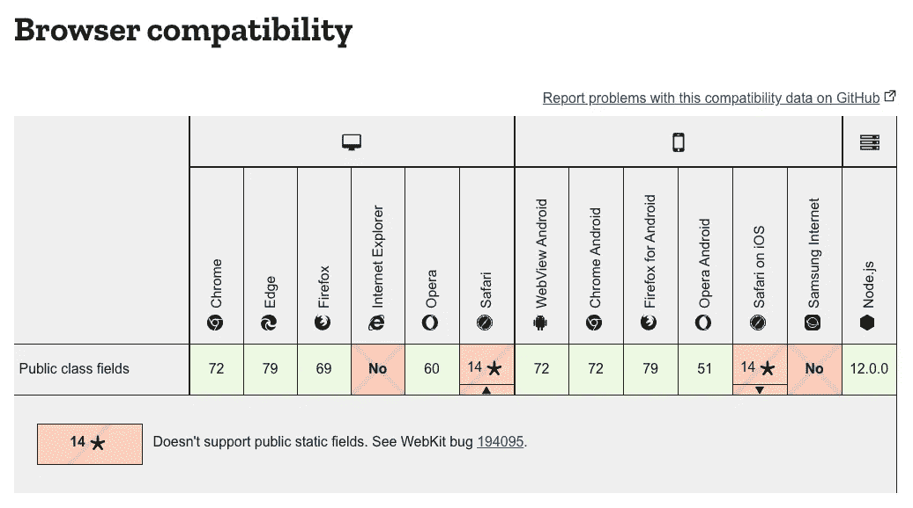

# webworkers 驱动的 UI 框架 neo.mjs 第 2 版发布公告

> 原文：<https://itnext.io/the-webworkers-driven-ui-framework-neo-mjs-version-2-release-announcement-b91b476d6f16?source=collection_archive---------0----------------------->

新产品的概念必须是颠覆性的，否则就没什么必要。但是，使用它们的方式应该尽可能一致。

对于一个框架来说，这意味着关于如何使用它的 API 应该坚如磐石，尤其是在涉及到新版本的时候。从 [neo.mjs](https://github.com/neomjs/neo) v1 迁移到 v2 是小菜一碟。

本文假设您还不熟悉这个项目，所以我们也将介绍一些基础知识。

# 内容

1.  花瓶角色
2.  设计目标
3.  版本 2 中有什么新内容？
4.  统计数字
5.  如何设置我的第一个 neo.mjs 应用程序？
6.  如何从 v1 迁移到 v2？
7.  学 neo.mjs 有多难？
8.  什么时候该用 neo.mjs？
9.  什么是配置系统？
10.  路标
11.  最后的想法
12.  特别感谢

# 1.花瓶角色

让我们看看不使用 [neo.mjs](https://github.com/neomjs/neo) 难以实现的用例:

这是一个扩展到多个浏览器窗口的单页应用程序。该应用程序可以在不需要后端的情况下进行通信。

桌面浏览器是强制性的，最好在 Chrome 或 Edge 上，也可以在 Firefox 上运行:【neo.mjs/dist/production/apps/sharedcovid/

为了对性能有一个印象，尝试螺旋:使用魔法鼠标或触控板，您可以水平滚动。

这导致本地每秒 30.000 次 dom 操作。螺旋是有意构建的，以强调浏览器→每个项目是一个 dom 节点(没有画布，svg，webGL)。

drop 上的基本情况是:

```
dialog.unmount();dialog.appName = 'SharedDialog2'; // name of the other window appdialog.mount();
```

是的，我们正在重用同一个对话框 JS 实例。

[](https://medium.com/geekculture/web-based-multi-screen-apps-including-drag-drop-5e161da6507b) [## 基于网络的多屏幕应用，包括拖放

### 我对这个话题很感兴趣，因为我们将要谈论的技术为新一代的…

medium.com](https://medium.com/geekculture/web-based-multi-screen-apps-including-drag-drop-5e161da6507b) 

我们可以轻松地将复杂的依赖关系惰性加载到应用程序工作人员中。

这也适用于分销/生产。更好的是，我们确实可以在不同的应用程序之间进行分割。意思是:你可以用很少的开销在同一个页面上添加多个应用。

[](https://medium.com/swlh/cross-app-bundling-a-different-approach-for-micro-frontends-e4f212b6a9a) [## 跨应用捆绑——微前端的一种不同方法

### 捆绑分布式版本的应用程序代码一直是一个挑战，尤其是在您想要共享代码的情况下…

medium.com](https://medium.com/swlh/cross-app-bundling-a-different-approach-for-micro-frontends-e4f212b6a9a) 

# 2.设计目标

neo.mjs 概念具有颠覆性:



1.  多线程:框架的大部分部分以及您自己的应用程序代码都在 app worker 内部运行。这使得主线程大部分时间处于空闲状态，从而带来惊人的渲染性能，尤其是在动态操作 DOM 时。
2.  可扩展性和可伸缩性:您几乎可以扩展和更改任何东西。你只会得到你实际使用的代码。你可以偷懒加载模块，甚至可以获得跨应用拆分块。
3.  建立在 web 标准之上:只要最新的 ECMAScript x 特性在所有主流浏览器中可用，neo.mjs 就会使用它们。
4.  “将 UI 开发带回浏览器”
    neo.mjs 是极少数不在 node 内部进行 UI 开发的项目之一，在更改代码时，您不需要任何构建或编译。开发模式可以直接在浏览器中运行框架和应用程序代码。目前仍然局限于 Chromium，因为 Safari(即将推出)和 Firefox 还不支持在 worker 范围内使用 JS 模块。调试真实代码已经为我节省了很多时间。
5.  dist/production(基于 webpack)必须在所有主流浏览器中运行。
6.  基于持久 json 的虚拟 dom 结构。根本没有模板。您也可以用基于 json 的格式定义组件树。JS 这边说了算。您可以控制是否要销毁实例，或者是否要保留实例以供以后重用。
7.  使用虚拟 dom 引擎是可选的，您可以手动构造增量更新，以防您确切地知道应该改变什么来进一步提升性能。
8.  您可以在 neo.mjs docs 应用程序中获得自己的应用程序代码的文档视图

# 3.版本 2 中有什么新内容？

[neo.mjs](https://github.com/neomjs/neo) v2 版本主要是为您提供新的方法，使您的应用程序的状态管理更容易，以及增强您的前端架构。

我写了两篇独立的文章来详细介绍视图模型的实现:

[](/enhance-your-frontend-state-management-with-view-models-7bf49e1a0991) [## 使用视图模型增强您的前端状态管理

### 您很可能使用过 MobX、Redux 或 React 上下文 API。

itnext.io](/enhance-your-frontend-state-management-with-view-models-7bf49e1a0991) [](https://tobiasuhlig.medium.com/enhance-your-frontend-state-management-with-view-models-part2-5a9384bd863c) [## 使用视图模型增强您的前端状态管理—第 2 部分

### 设计目标&谈基于模板文字的视图模型实现。

tobiasuhlig.medium.com](https://tobiasuhlig.medium.com/enhance-your-frontend-state-management-with-view-models-part2-5a9384bd863c) 

从基于字符串的绑定格式化程序到包含模板文字的函数，使用视图模型的方式得到了改进。

作为第一个突破性的变化之一，我利用这个机会最终完成了期待已久的版本 2 的发布。

对于多窗口应用程序来说，视图模型变得非常强大，因为您可以将一个应用程序(窗口)中主容器的父模型指向另一个应用程序(窗口)中的视图模型。**这是跨浏览器窗口访问数据的一种非常好的方式。**

不要使用视图模型或视图控制器来创建定制组件，即使它们很复杂并且使用多个视图(比如日历或表格实现)。

对于 v2，view 控制器的内部工作方式发生了变化。以前，只有拥有自己控制器的组件才触发`parseConfig()`，它们向下解析它们的项目，直到找到一个拥有自己控制器的项目。在 v2 中，每个组件都将在父树中最近的控制器上触发`parseConfig()`,并且只有顶层被解析。优点:您现在可以动态添加包含基于字符串的侦听器的新组件。

我一直努力保持项目依赖关系(npm 包)是最新的。现在随着[节点 v16 版本](https://nodejs.org/en/blog/release/v16.0.0/)的发布，一些事情需要改变。

neo.mjs 仍然在使用 node-sass (libsass ),因为基于 c 的编译器听起来很迷人。dart-sass 更名为 sass，并成为官方标准:

 [## 安装 Sass

### 有许多应用程序可以让您在几分钟之内在 Mac、Windows 和…上使用 Sass

sass-lang.com](https://sass-lang.com/install) 

**好消息**:开关工作非常流畅，我们可以继续使用最新的 scss 功能。

node-sass 和 [webpack-dev-server](https://github.com/webpack/webpack-dev-server) 都依赖于一个名为“fibers”的包。这个在 node v16+已经不能用了。

切换到

```
"webpack-dev-server": "4.0.0-beta.2"
```

删除了最后一个“纤程”依赖，所以我们现在应该很好。

# 4.统计数字

出于好奇，几天前我检查了提交的数量:

[neom js/neo](https://github.com/neomjs/neo)5196
[neom js](https://github.com/neomjs)/* 6347
[pre GA](https://github.com/neomjs/neo/blob/dev/.github/NEOMJS_HISTORY.md)3720

因此，neo.mjs 生态系统总共有 **10.067 次提交**。

sloc 应用程序物理 17133，来源:11054
sloc 构建脚本物理 2036，来源:1709
sloc 示例物理 11005，来源:8805
sloc 资源/scss 物理 6697，来源:5842
sloc src 物理 42032，来源:22393

只是为了得到一个印象。

# 5.如何设置我的第一个 neo.mjs 应用程序？

neo.mjs 命令行界面为您提供了:

1.  打开您的终端(或 cmd)。
2.  输入一个文件夹来存储你的项目
    (我在这个演示中只使用了桌面)
3.  输入“npx neo-app”
4.  你可以在所有问题上按回车键
5.  在 IDE 中打开新生成的工作区文件夹
6.  可选:将其部署到存储库(例如 GitHub)
7.  打开 MainContainer.mjs 文件
8.  变更代码
9.  重新加载浏览器窗口(开发模式不需要任何构建)

更多信息请点击此处:

[](https://github.com/neomjs/create-app) [## neomjs/create-app

### 使用一行程序创建一个新的 neo.mjs 应用程序(工作区): npx neo-app 可以在 macOS、Linux 和 Windows 10 上运行。如果错误…

github.com](https://github.com/neomjs/create-app) 

如果 npx neo-app 在您的本地环境中不工作，默认输出存储在此处:

[](https://github.com/neomjs/workspace) [## neom js/工作空间

### 此存储库包含 npx neo-app 的默认输出。如果 npx 脚本有任何问题，请感觉…

github.com](https://github.com/neomjs/workspace) 

**选项 2:**

可以分叉 [neomjs/neo](https://github.com/neomjs/neo) 库。package.json 包含一个“create-app”程序，它将在框架的 apps 文件夹中创建一个新的应用程序外壳。

如果您想同时处理应用程序代码和框架代码，这种方法尤其有用。

# 6.如何从 v1 迁移到 v2？

我仍然记得将一个客户端项目从 Sencha ExtJS 版本 2 迁移到版本 3。这是一次超级激烈的冲刺，用了整整 6 周。我自己并不需要处理角度迁移，但是我听说过很多关于早期版本重写的故事。

[Rich Waters](https://www.linkedin.com/in/richwaters/) 我在设计 [neo.mjs](https://github.com/neomjs/neo) API 的时候就牢记了这一点。

**从 v1 到 v2 的迁移可以在 10 分钟内完成。**

如果你的应用是 1.5 以上版本，只需运行`npm update`和`build-all`程序。

对于早期版本，有两种策略:

第一种(**推荐**)是用同一个 app 名字运行`npx neo-app`。然后，您可以用旧的应用程序文件夹替换应用程序文件夹的内容，运行`build-all`就完成了。

另一个策略是运行`npx neo-app`，手动调整旧应用外壳的内容。具体来说:删除 node_modules、dist 和 docs 文件夹。手动复制 npx 输出的新文档文件夹。在您的 package.json 中调整 neo.mjs 版本(例如^2.0.4).运行 npm 安装。运行`build-all`。

确保您的 app.mjs 文件使用以下格式:

```
import MainContainer from './view/MainContainer.mjs';

const onStart = () => ***Neo***.app({
    mainView: MainContainer,
    name    : 'MyApp'
});

export {onStart as onStart};
```

# 7.学 neo.mjs 有多难？

我花了相当多的时间让朋友和以前的同事跟上进度。

总的来说，我得到的反馈是，与其他库/框架相比，达到“飞翔”的程度需要更长的时间。根据你的技能水平，可能需要一两个星期。

然而，我也得到了反馈，即**一旦你达到这一点，neo.mjs 就更容易掌握**，你可以做得更多。

对于 v1，我们有一个关于如何创建 covid 演示应用程序的系列教程(2 部分)。为 v2 重写它们可能会有所帮助。我这边有很多工作要做，所以如果你需要的话，请给我一个 ping:

 [## 重写“如何创建 webworkers 驱动的多线程应用程序-第 1 部分”第 1817 期 neomjs/neo

### 最新的框架和生态系统增强包含了一些变化和改进。“加快速度”…

github.com](https://github.com/neomjs/neo/issues/1817) 

到目前为止，每个开发人员都问我:
“鸢，窗口和 window.document 都没有定义，这是怎么回事？”

是的，你的应用程序代码确实在一个 web worker 内部运行。

[](https://developer.mozilla.org/en-US/docs/Web/API/Web_Workers_API) [## Web Workers API

### Web Workers 使得在独立于主执行线程的后台线程中运行脚本操作成为可能…

developer.mozilla.org](https://developer.mozilla.org/en-US/docs/Web/API/Web_Workers_API) 

有一些例外:例如，你不能直接从一个工人内部操纵 DOM，或者使用窗口对象的一些缺省方法和属性

德语中有一个奇妙的词“Kindersicherung”。
含义:“防止儿童伤害自己的机制”

在某种程度上，这适用于 Javascript devs 和真正的 dom。

对于大多数用例，您真的不需要它，您可以坚持使用虚拟 dom。

[](https://medium.com/dataseries/your-benefits-of-working-with-json-based-virtual-dom-7318a983da9e) [## 使用基于 JSON 的虚拟 DOM 的好处

### 许多以前的同事和朋友找到我，问我:“你是如何做到如此高效和快速的……

medium.com](https://medium.com/dataseries/your-benefits-of-working-with-json-based-virtual-dom-7318a983da9e) 

真正有帮助的是查看您生成的应用程序文件:

索引文件将**而不是**包含你的应用程序文件，而是主线程起点(这个将创建工人设置)。在 dist/production 中，主线程文件**只有 42KB** 。

一旦设置就绪，应用程序工作人员将导入您指定了`appPath`的 app.mjs 文件。

如果您愿意，您可以在这里创建多个应用程序，并将它们呈现到一个现有页面的不同 div 节点中。

应用程序工作人员将使用它能找到的所有 app.mjs 文件作为动态导入。这就是我们如何获得跨应用程序分割块。

我最近收到一个问题:“我想在我的 index.html 文件中直接添加一个加载微调器，并在主视图渲染后使用我的 neo.mjs 应用程序将其删除。它在我们的虚拟世界之外。我能做到吗？”

```
***Neo***.currentWorker.sendMessage('main', {
    action: 'updateDom',
    appName: this.appName,
    deltas: {
        action: 'removeNode',
        id    : 'my-loading-spinner'
    }
});
```

您可以手动创建增量更新并将其发送到 main。一旦这个异步操作完成，如果你想做什么，你可以使用`promiseMessage()`。小心使用！

你也可以创建你自己的主线程插件，例如与其他库一起工作。示例:

[src/main/addon](https://github.com/neomjs/neo/tree/dev/src/main/addon)

回购自述底部提到:
欢迎加入 [neo.mjs Slack 频道](https://join.slack.com/t/neotericjs/shared_invite/enQtNDk2NjEwMTIxODQ2LWRjNGQ3ZTMzODRmZGM2NDM2NzZmZTMzZmE2YjEwNDM4NDhjZDllNWY2ZDkwOWQ5N2JmZWViYjYzZTg5YjdiMDc)！

虽然我的时间有限，但我会尽力给你指明正确的方向。

# 8.什么时候该用 neo.mjs？

我的一句名言是:
“开车去超市不需要跑车。”

对于相当简单且大多是静态的网站或应用程序，neo.mjs 可能不太适合。

你的应用程序越大越复杂，使用这个框架能为你产生的价值就越多。

这也适用于创建复杂的(自定义)组件，如螺旋，缓冲网格，日历。

例如，一个很好的用例是一个银行/交易应用程序，您希望使用 web sockets 通过实时更新来敲打 dom。

如果你想基于 [SharedWorkers](https://developer.mozilla.org/en-US/docs/Web/API/SharedWorker) 创建多窗口应用，使用 neo.mjs 的好处是巨大而独特的。

尽管这个框架仍然专注于桌面应用程序，但是它的总体设置也可以在移动领域大放异彩。还有更多工作要做(见:10。路线图)。

# 9.什么是配置系统？

经常出现的一个问题是:

“为什么会有静态的 getConfig()方法？
配置和类字段是一回事吗？”

让我们快速看一下下面的例子:

`className`实际上可能是一个类字段，因为值不会改变。它也可以是静态的。它不是静态的原因是为了调试的目的:如果您将一个组件树登录到控制台并点击条目，看到`className`对了解您正在处理的内容非常有帮助。

**配置系统有什么好处？**

如果我们定义一个带有下划线的配置，比如这里的`a_`，我们可以选择使用`beforeGetA()`、`beforeSetA()`和`afterSetA()`。显然同样适用于`b_`。

为了简单起见，我们将 a & b 定义为空值。我们在 afterSet()方法中使用了`this.down()`,这在构造项目之前是不可用的。

因此，为了保持逻辑简洁，我使用`onConstructed()`来调用:

```
this.set({
    a: 5,
    b: 5
});
```

`afterSetA()`会将标签 1 的文本配置设置为`value + this.b`。

`afterSetB()`会将标签 2 的文本配置设置为`value + this.a`。

→我们正在处理交叉依赖

假设我们已经通过`get()`和`set()`定义了 a & b，我们将在真正的 setters 内部调用自定义的 afterSet()方法。

```
Object.assign(this, {
    a: 5,
    b: 5
});
```

在这种情况下， **a** 将首先被赋值，afterSet()调用将 label1 文本设置为 **5** (5+null)。

然后 **b** 会被赋值，afterSet()调用会将 label2 文本设置为 **10** (5+5)。

使用`this.set()`的不同之处在于，我们可以立即访问两个新值。`this.a`和`this.b`都是非常聪明的吸气剂。

label1 和 label2 都将得到 **10** (5+5)作为它们的文本。

点击按钮将触发:

```
this.set({
    a: 10,
    b: 10
});
```

之后，两个标签文本的值都是 **20** (10+10)。



试试看:[dist/production/examples/core/config/index . html](https://neomjs.github.io/pages/node_modules/neo.mjs/dist/production/examples/core/config/index.html)(在线演示)

配置值确实以前导下划线存储。如果您想进行静默更新(不触发 beforeSet()和 afterSet())，您可以使用`this._a = 7`。

**第二个好处**是`component.Base`扩展了`this.set()`的逻辑

```
myButton.set({
    iconCls: 'fas fa-globe',
    text   : 'Hello world!'
});
```

`afterSetIconCls()`以及`afterSetText()`自身被执行触发重新渲染(将 vdom 对象传递给 vdom 工作器以检查增量更新)。

如果您使用`this.set()`更改两个配置，将只有 1 次增量更新检查。

当我们扩展类时，配置系统的第三个好处是适用的。

一个[标签。容器](https://github.com/neomjs/neo/blob/dev/src/tab/Container.mjs#L36)正在使用一个`activeIndex_`配置。您可以使用:

```
class MyTabContainer extends TabContainer {
    static *getConfig*() {return {
        //...activeIndex: 2
    }}
}
```

这不会覆盖`get()`和`set()`逻辑，但会在实例化时分配新值。

有点过时，但这里有更多的输入:

[](https://codeburst.io/javascript-classes-state-management-v2-2df7663de580) [## Javascript 类:状态管理 v2

### 在撰写了文章《Javascript classes:状态管理》之后，我从 Nige White 那里得到了很多建议(真了不起！)就去了……

codeburst.io](https://codeburst.io/javascript-classes-state-management-v2-2df7663de580) 

**【题外话】那么，neo.mjs 为什么还不使用类字段呢？**

[](https://developer.mozilla.org/en-US/docs/Web/JavaScript/Reference/Classes/Public_class_fields) [## 公共类字段

### 静态和实例公共字段都是可写、可枚举和可配置的属性。因此，不像他们…

developer.mozilla.org](https://developer.mozilla.org/en-US/docs/Web/JavaScript/Reference/Classes/Public_class_fields) 

浏览器支持还不错，但仍是第 3 阶段的提案。

虽然它在 neo.mjs 开发模式下运行良好，但我们仍然需要构建 dist/production 输出。Webpack 在第 4 阶段之前不会支持它。更准确地说， [acorn 解析器](https://github.com/acornjs/acorn)没有。有一个扩展: [acorn-stage3](https://github.com/acornjs/acorn-stage3) ，可以处理。然而，在 Webpack 内部使用 acorn-stage3 替换 acorn npm 包感觉非常棘手，尤其是在您通过“npx neo-app”创建新的 neo.mjs 应用程序的情况下。开放的想法在这一点上。

# 10.路标

我对这个项目已经取得的进展感到高兴。

然而，我想补充的事情还不止这些。

既然 v2 已经发布，构建下一个项目/冲刺的优先级就显得很重要了。**你有机会产生影响！**

含义:如果有你想看的特定项目，给相关的功能请求添加一条评论:
[https://github.com/neomjs/neo/issues](https://github.com/neomjs/neo/issues)

还没有票吗？创建一个！就这么简单。

我个人认为最好是进一步完善桌面方面的东西，因为大多数大而复杂的应用程序仍然存在。一旦这样做了，我们就可以专注于移动。不过，这并不是一成不变的。

同样:以下项目列表是**而不是**订购的。

**主题构建**:CSS 输出仍然是一个整体，不支持 Javascript 方面真正令人印象深刻的分割块。我喜欢按文件来分解输出。要做到这一点，我们需要一个使用的应用程序&框架组件的依赖树。理想情况下类似于 JS 分割块，这样我们可以根据需要延迟加载微小的 css 文件。史诗。

**主题化**:并不是所有的尺寸都是基于 em 的。我们需要调整剩余的 px 值。

**缓冲网格**:虽然表格的实现很简洁，包括锁定的列和粘性的标题，但是对于“大数据”来说还不够。只有渲染你看到的行(加一)才能产生很大的影响。史诗。

**网格编辑**:“记录”是 JS 对象的超级轻量级扩展，用来获取变更事件。如果您更改记录的值，表格视图将会更新。表格视图&缓冲网格的单元格编辑器将会很棒。

**日历**:当前状态仍然是“预览预览”。这令人印象深刻，因为演示确实从真实的 dom 中删除了非活动视图，同时我们仍然可以改变它们的状态并重用相同的 JS 实例。

**更复杂的视图模型示例**:到目前为止，所有演示应用都不需要视图模型。让一个大的演示应用程序使用它们会很有帮助。

**核心。可观察到的**:框架仍然在使用一个早期的从未完成的版本。它足以添加侦听器和触发事件，但是它不支持框架的当前状态。史诗。

**MessageBus (PubSub)** :作为视图模型的一种替代，拥有一种额外的通信方式会很好。我可能没有时间让它进化到 MobX 那样的程度。

数据工人:Rich 有一个概念，商店应该存在于这个线程中。这个想法是 ajax 调用/套接字连接从这里开始，然后本地过滤&排序也在这里发生(以减轻应用程序工作人员的负担),只将需要的数据发送给应用程序工作人员。它更复杂:对于包含少量数据的商店，这个概念没有意义，所以我们需要完善这个概念。史诗。

套接字连接:我们仍然需要它的一个实现。

**查看模型 v3** :我们讨论过支持“双向绑定”。Imo 仅与表单字段相关，它可以删除一些锅炉板代码。要做到这一点，配置设置者需要触发一个更改事件(或使用 MessageBus)来让虚拟机知道更改。棘手的问题，因为我们需要小心不要创建大量没有接收者的变更事件。

**对公共类字段的支持**:一旦它们进入 stage4 并在基于 webpack (acorn parser)的构建中工作，我很乐意添加它们。破变→ neo.mjs v3。史诗。

**增强表单域组件**:这里肯定有改进的空间。史诗。

**滑块组件&滑块字段**:现在有了一个漂亮的拖拽&实现，添加它会很好。

**颜色选择器字段**:需要滑块组件。

**移动**:我们需要增强移动使用的组件，或者创建新的组件。我们还需要更多的例子。Epic++

**更多延迟加载的例子**:有了 cross app split chunks，我们应该重构 covid 或者真实世界的 app，根据需要从一个空的 viewport 和延迟加载模块开始。史诗。

虚拟 dom worker v2 :更准确地说是 vdom。助手 v2。增量更新的结果确实令人印象深刻。然而，增量更新算法包含了太多的树结构生成，可以得到改进。史诗。

**Docs app v2** :我们仍然需要在 dist/prod 中启用延迟加载示例应用。在这一点上有许多方面可以得到加强。Epic++。

**网站 app v2** :由于越来越多的例子进入框架，例子列表已经不够用了。网站应用程序通常可以使用重新设计，但我作为设计师的能力有限。

**GitHub Pages** :在某种程度上，我想完全改变逻辑。现在，我们获取 neo.mjs repo，并展示其中的示例和应用程序。更好的做法是将 repos 的内容放在 neomjs/*中，并使用自己的 neo.mjs 版本进行部署。然后，我们可以将更多示例&演示应用程序移出框架“核心”回购。Epic++。

**更多测试**:我在等待[布林图姆的《午睡》](https://www.bryntum.com/products/siesta/)的下一个主要发布。一旦更多的贡献者加入到项目中，进行更多的用户交互测试将变得越来越重要。不是真正的“单元测试”，而是加载示例应用程序并模拟用户来验证业务逻辑在更改代码时不会中断。Epic++。

这个列表是**不**完整的，但是我在这里做了一个删减。甚至没有提到长期目标，如创建一个运行 neo 核心的中间件(这将是惊人的)。如果您是 Javascript 专家，您很可能知道这个范围的大小，以“小时”→月、年为单位。

**虽然我可以独立完成每个项目，但更多的贡献者可以真正在这里产生影响。**

不要忘记，我仍然需要润色核心的部分，写博客文章，而且不可能把我的全部时间投入到这个项目中(下一节将详细介绍)。

# 11.最后的想法

即使您认为自己是 Javascript 专家，如果您深入研究 neo.mjs 代码库，也很可能会学到很多东西。我会说你可以达到一个全新的水平，然后“飞起来”。

[](https://github.com/neomjs/neo) [## 近地天体

### neo.mjs 使您能够使用一个以上的 CPU 创建可扩展的高性能应用程序，而无需使用…

github.com](https://github.com/neomjs/neo) 

你可以在这里找到所有的在线例子、博客部分和文档:
[https://neomjs.github.io/pages/](https://neomjs.github.io/pages/)

我绝对是那种认为“代码不言自明”的人，更喜欢用行动而不是语言来说服别人。

但是，我得到的反馈是:“**人爱的是人，不是产品。**

我不得不承认，这句话包含着智慧和真理。

如果你想更多地了解我，请随意查看我的 LinkedIn 个人资料。

简而言之:当年我是 Sencha ExtJS 的专家。在完成客户项目后，我加入了 Sencha 专业服务团队 2.5 年。那是一段令人惊奇的时光！由于团队成员限制在 8 人左右，我实际上一直在全球各地飞来飞去，帮助那些已经完全着火的客户项目(并行修复框架和应用相关的问题)。每小时的费用非常高，所以对客户的期望水平也很有挑战性。我喜欢自己的“摇钱树”角色，也感谢有机会深入许多客户项目。这对于我了解 UI 开发行业真正需要什么帮助很大。

后来，我在一个大型项目上帮助 PlayStation 团队工作了 4 年多，从早期的初始阶段一直到发布。我的角色包括负责客户端架构以及实现具有挑战性的部分。

这让我节省了一些钱，这些钱是我为了让 neo.mjs 项目达到现在的水平而完全烧掉的。

开源还被认为是“慈善”，这是个问题。

公司(尤其是在德国)对接触新技术非常犹豫，不管它有多好。我甚至没有提到赞助或官方政府项目。

neo.mjs 的商业模式是业务即服务(BaaS)，这意味着整个代码库都可以免费使用(麻省理工学院许可)。如果您的公司确实需要支持方面的帮助或需要一些 neo.mjs 专家参与，例如设置原型应用程序，欢迎您与我们联系。

我非常乐意全力推动这个框架为你产生更多的价值，但是只要这个项目不在一个可持续的水平上，这是根本不可能的。

问候&快乐编码，
托拜厄斯

# 12.特别感谢

[富水](https://www.linkedin.com/in/richwaters/)，该项目的另一位联合创始人。我仍然很难过，里奇真的消失了，好几年没有他的消息了。

[杜拉赫·贾因](https://www.linkedin.com/in/durlabh/)成为该项目的第一个也是唯一一个赞助商！

[杰拉德·霍兰](https://www.linkedin.com/in/gerard-horan-6671b7/)，我以前的 PlayStation 导师[，帕特·谢里丹](https://www.linkedin.com/in/patsheridan/) (Modus Create)，以及 [Hyle Campbell](https://www.linkedin.com/in/hylecampbell/) (我以前在 Sencha 的团队领导)。没有你对这个项目的关注和你的士气支持，我早就放弃了！

还大大的一句“谢谢！”致许多朋友&来自前 Sencha 社区的前同事！太多了，无法一一列举，但我希望当你读到这里时，你知道我指的是你:)