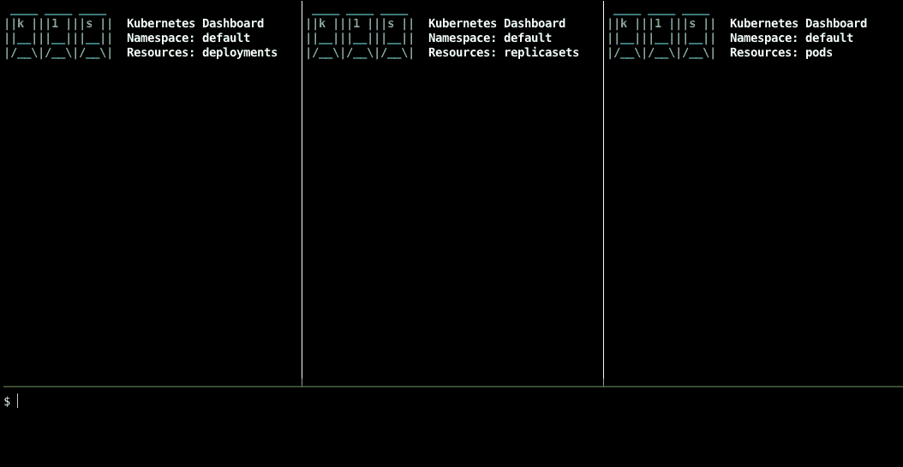
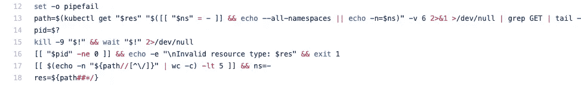
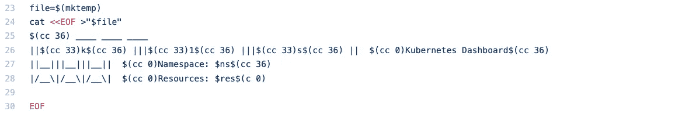
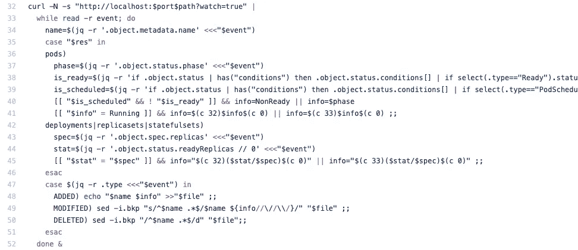
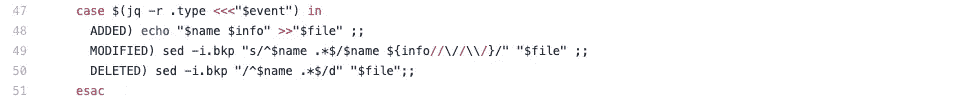

# 世界上最简单的 Kubernetes 仪表板:k1s

> 原文：<https://itnext.io/the-worlds-simplest-kubernetes-dashboard-k1s-4246e03191df?source=collection_archive---------0----------------------->

我实现了由 50 行 Bash 代码组成的“世界上最简单的 Kubernetes 仪表板”。它叫做 [k1s](https://github.com/weibeld/k1s) ，这篇文章解释了如何使用它以及它是如何工作的。


> 当然，“世界最简单”并不是一个严肃的说法。*😉*

你可以在 GitHub 上的[***Wei eld/k1s***](https://github.com/weibeld/k1s)*资源库中找到 k1s 的完整代码和详细使用说明。*

# *内容*

*   *[**概述**](#861d)*
*   *[**安装**](#00a0)*
*   *[**用法**](#60b7)*
*   *[**实现**](#2459)*
*   *[**讨论与结论**](#aab1)*

# *概观*

*以下是 k1s 的大致外观:*

**

*仪表板可以显示任何名称空间(或跨所有名称空间)中任何资源类型的实时视图。对于某些资源类型，会显示附加信息，例如 pod 的当前状态，以及部署所需的和实际的副本数量。*

*您可以并排运行仪表板的多个实例，这允许您同时观察多个资源类型的更新。*

*这里有一个有三个仪表板实例的例子，一个用于[部署](https://kubernetes.io/docs/reference/generated/kubernetes-api/v1.18/#deployment-v1-apps)，一个用于[复制集](https://kubernetes.io/docs/reference/generated/kubernetes-api/v1.18/#replicaset-v1-apps)，一个用于[面板](https://kubernetes.io/docs/reference/generated/kubernetes-api/v1.18/#pod-v1-core)(在 [tmux](https://en.wikipedia.org/wiki/Tmux) 中运行)。然后在部署上执行一些扩展操作和滚动更新:*

**

*请注意如何实时观察部署、其管理的副本集和 pod 之间的交互。这可以让我们深入了解部署是如何工作的。同样，仪表板可以应用于其他资源组合。*

# *装置*

*k1s 是一个简单的 Bash 脚本，安装它所需要做的就是将它复制到本地机器上。如果您在 macOS 上使用自制软件，您可以使用:*

```
***$ brew install weibeld/core/k1s***
```

*在所有其他情况下，您可以按如下方式安装 k1s:*

```
***{
  wget** [**https://raw.githubusercontent.com/weibeld/k1s/master/k1s**](https://raw.githubusercontent.com/weibeld/k1s/master/k1s) **chmod +x k1s
  mv k1s /usr/local/bin
}***
```

*k1s 还依赖于您的计算机上安装的以下工具:*

*   *`[**jq**](https://stedolan.github.io/jq/)`*
*   *`[**watch**](https://linux.die.net/man/1/watch)`*
*   *`[**curl**](https://curl.haxx.se/)`*
*   *`[**kubectl**](https://kubernetes.io/docs/tasks/tools/install-kubectl/)`*

*您可能已经拥有了这些工具中的大部分。如果没有，你可以在 [GitHub 库](https://github.com/weibeld/k1s#dependencies)中找到它们的安装说明。*

# *使用*

*k1s 是一个名为`k1s`的 Bash 脚本，它直接运行在您的本地机器上。它具有以下命令行界面:*

```
***$ k1s [namespace] [resource-type]***
```

*两个可选的命令行参数是:*

*   *`**namespace**` **:** 指定要在其中观察资源的 Kubernetes 名称空间(默认为`default`)*
*   *`**resource-type**` **:** 指定您想要观察的 Kubernetes 资源类型(默认为`pods`)*

*为了观察所有名称空间中的资源类型，可以使用破折号(`-`)作为`namespace`参数。*

*对于给定的资源类型，`resource-type`参数的值可以是 Kubernetes 接受的任何名称变量。这包括复数形式、单数形式和简称(如果有的话)。例如，以下都是有效值:*

*   *`deployments`、`deployment`、`deploy`*
*   *`replicasets`、`replicaset`、`rs`*
*   *`services`、`service`、`svc`*

> *你可以通过`kubectl api-resources`找到所有资源类型的简称。*

*k1s 由本地机器上的 [kubeconfig](https://kubernetes.io/docs/concepts/configuration/organize-cluster-access-kubeconfig/) 配置系统支持。这意味着，k1s 总是适用于在 kubeconfig 文件的当前上下文中指定的集群。换句话说，k1s 适用于 kubectl 默认使用的集群。*

*要退出仪表板，请键入 *Ctrl-C**

# *履行*

*现在，让我们转向实现。如前所述，k1s 是一个 Bash 脚本，下面是 [k1s 版本 0.1.2](https://github.com/weibeld/k1s/releases/tag/0.1.2) 的完整代码:*

*我们将一步一步地浏览上面的代码，但首先，让我们讨论一下 k1s 所基于的一般思想。*

## *基本机制*

*以下是使 k1s 发挥作用的主要因素:*

1.  *使用`[kubectl proxy](https://kubernetes.io/docs/tasks/extend-kubernetes/http-proxy-access-api/)`允许轻松访问 Kubernetes API 服务器(**第 20 行**)。*
2.  *使用`[curl](https://curl.haxx.se/)`对给定资源类型的 Kubernetes API 执行 *watch* 请求(**第 32 行**)。这创建了一个到 API 服务器的持久连接，它返回一个 JSON 资源事件流，这些事件属于`ADDED`、`MODIFIED`或`DELETED`类型。*
3.  *使用`[jq](https://stedolan.github.io/jq/)`解析每个事件并从中提取某些信息，比如事件所涉及的资源的名称。将该信息作为附加行写入文件系统的一个文件中(称为*状态文件*)。如果资源已经存在于文件中，更新它，如果资源被删除，从文件中删除它的行(**第 48–50 行**)。*
4.  *使用`[watch](https://linux.die.net/man/1/watch)`显示状态文件并定期更新(**行 54** )。这给人一种动态更新的全屏终端 app 的感觉。*

*因此，简而言之，k1s 不断地将给定资源类型的状态合并到一个文件中，并用`watch`显示这个文件，以便您可以实时观察任何更新。*

*现在，让我们转向实际的代码。*

## *具体实施*

*`k1s`脚本从以下代码行开始:*

**

*k1s v0.1.2 的第 3–5 行*

*这执行一些基本的检查和初始化:*

*   ***第 3 行**实现打印 k1s 版本的`-v` / `--version`选项。*
*   ***第 4 行**检查本地机器上是否安装了所有的依赖项，如果没有安装，则中止并显示一条错误消息。*
*   ***第 5 行**读取`namespace`和`resource-type`命令行参数的值，如果用户没有指定值，则使用默认值。*

*接下来的两行代码如下:*

**

*k1s v0.1.2 的第 7–8 行。*

*这定义了两个 Bash 函数，用于输出以特定颜色打印文本的 [ANSI 转义序列](https://en.wikipedia.org/wiki/ANSI_escape_code#Colors)。这些函数将在以后用于 k1s 输出的着色部分。*

> *[ANSI 转义序列](https://en.wikipedia.org/wiki/ANSI_escape_code)是由[终端仿真器](https://en.wikipedia.org/wiki/Terminal_emulator)解释的一组标准化代码(例如 [xterm](https://invisible-island.net/xterm/) ， [iTerm2](https://www.iterm2.com/) )。这些代码定义了如何在终端上显示内容的各个方面。它们起源于“哑巴”[视频终端](https://en.wikipedia.org/wiki/Computer_terminal)连接到大型共享计算机的时代。运行在计算机上的程序可以向终端发送 ANSI 转义序列，用于定义光标位置和输出文本颜色等内容。*

*接下来是下面一行:*

**

*k1s v0.1.2 第 10 行。*

*这将打印在启动 k1s 后立即出现的加载指示器。该任务作为后台进程启动，由一个以 0.1 秒间隔打印点的无限循环组成。当 k1s 的初始化过程完成时，该过程将按需终止。*

*下面是下一段代码:*

**

*k1s v0.1.2 的第 12–18 行*

> *对于被截断的行，请参考 [GitHub 库](https://github.com/weibeld/k1s/blob/0.1.2/k1s)中的代码。*

*这段代码实现了 k1s 的主要初始化步骤。它为用户请求的资源类型和名称空间确定 Kubernetes API 路径:*

*   ***第 12 行**启用`pipefail` [Bash 选项](http://th)，如果其包含的任何命令返回非零退出代码，该选项将导致管道语句作为一个整体返回非零退出代码。这是以下命令正常工作所必需的。*
*   ***第 13 行**对所请求的资源类型和名称空间发出一个`kubectl get`请求，并从`kubectl`的输出中提取该操作的正确 Kubernetes API 路径。这里的技巧是增加`kubectl`(用`-v 6`)的详细程度会导致`kubectl`输出它在幕后发出的 HTTP GET 请求的确切 URL。从这个 URL 中，通过一些`grep`和`sed`操作提取 API 路径。*
*   ***第 14 行**记录了第 13 行发出的`kubectl get`命令的退出代码。如果请求成功，这个退出代码为零，否则为非零。非零退出代码最可能(也是假定的)的原因是用户提供了无效的资源类型规范(例如，`dep`而不是`deployments`或`deployment`或`deploy`)。*

> *使用`kubectl get`来确定正确的 API 路径是 k1s 接受所有资源类型名称变量的原因，这些变量也被`kubectl`接受。实际上，k1s 将这些名称变体的处理和正确 API 路径的确定外包给了`kubectl`，这极大地简化了 k1s 的实现。*

*   ***第 15 行**终止从第 10 行开始的加载指示器后台进程。请注意，加载指示器进程的进程 ID (PID)保存在变量`$!`中。在 Bash 中，`$!`是一个内部变量，保存在后台启动的最后一个进程的 PID。由于该脚本从第 10 行开始就没有启动其他后台进程，所以这肯定是加载指示器进程。*
*   ***第 16 行**检查第 13 行`kubectl get`请求的退出代码。如果退出代码为非零值，则假定原因是用户提供了无效的资源类型规范，脚本中止并显示相应的错误消息。*

*接下来的两行只是装饰性的:*

*   ***第 17 行**检查提取的 [API 路径](https://kubernetes.io/docs/reference/using-api/api-concepts/)是否包含名称空间段。如果不是这种情况，则意味着用户请求了跨所有命名空间的命名空间资源类型或者非命名空间资源类型。在这种情况下，将在仪表板中显示的名称空间指示被设置为`-`。这修复了用户请求非命名空间资源类型但仍然指定命名空间的情况。*
*   ***第 18 行**将用户提供的资源类型规范设置为它的规范复数形式，它是从 API 路径中提取的。该值也将显示在仪表板标题中。这意味着，如果用户指定`deploy`或`deployment`来观看部署，仪表板将在标题横幅中统一打印`deployments`。*

*让我们继续下面两行代码:*

**

*k1s v0.1.2 的第 20–21 行*

*这两行设置了`[kubectl proxy](https://kubernetes.io/docs/reference/generated/kubectl/kubectl-commands#proxy)`，脚本稍后将通过它连接到 Kubernetes API 服务器:*

*   ***第 20 行**执行`kubectl proxy`作为后台进程。`kubectl proxy`命令为 Kubernetes API 服务器创建一个本地代理，监听本地机器上的一个随机端口(由`-p 0`指定)。后台进程的输出在一个新的文件描述符`3`中被捕获。*
*   ***第 21 行**从前一行创建的文件描述符`3`(即`kubectl proxy`的输出)中提取`kubectl proxy`选择的随机端口。知道这个端口对于在代码后面构造 Kubernetes watch 请求的 URL 是必要的。*

> *在[这个 StackOverflow 回答](https://stackoverflow.com/a/20018118/4747193)中描述了上述捕获后台进程输出的技术。*

*接下来是下面这段代码:*

**

*k1s v0.1.2 的第 23–30 行*

*该代码创建并初始化状态文件，该文件稍后将通过`watch`命令显示:*

*   *第 23 行创建状态文件。*
*   ***第 24–30 行**将标题横幅写入状态文件。标题横幅由(彩色)k1s 徽标和一些其他信息组成，包括正在查看的命名空间和资源类型。*

*下一段代码如下:*

**

*k1s v0.1.2 的第 32–52 行*

> *对于被截断的行，请参考 [GitHub 库](https://github.com/weibeld/k1s/blob/0.1.1/k1s)中的代码。*

*这段代码让实际的*观察*请求，并处理来自 Kubernetes API 服务器的事件响应流。上面的代码实际上是一个 Bash 语句，由一个`curl`命令组成，该命令通过管道传递给一个`while`循环，该循环一直读取`curl`命令的输出行:*

*   ***线 32** 用`curl`使*手表*请求。这个 URL 是从 Kubernetes API 路径和前面确定的`kubectl proxy`端口构建的。由 *watch* 请求返回的每个响应都是对应于一个资源事件的一行 JSON。`curl`的`-N`选项禁用输出缓冲，以便这些行中的每一行一被接收就被输出。*
*   ***行 33** 开始一个`[while](https://tldp.org/LDP/Bash-Beginners-Guide/html/sect_09_02.html)`循环，处理`curl`的每一个输出行(保存在一个名为`event`的变量中)。该循环无限期运行，只有当用户点击仪表板上的 *Ctrl-C* 时才会终止。*

*循环体的范围从第 34 行到第 51 行。开头的几行从传递到循环体的 JSON 事件对象中提取一些数据:*

*   ***第 34 行**提取事件所涉及的资源名称(即被创建、修改或删除的资源)。使用`jq`工具完成提取。*
*   ***第 35 行**开始一个`[case](http://a)`语句，该语句将根据资源类型采取不同的动作。这样做的目的是特别对待某些资源类型，并为它们确定和提取附加信息。*

*第 36–41 行以特殊方式处理**吊舱**:*

*   ***第 37 行**提取 Pod 当前所处的[阶段](https://kubernetes.io/docs/concepts/workloads/pods/pod-lifecycle/#pod-phase)。相位是 Pod 状态的高级指示，如`Running`或`Pending`。*
*   ***第 38 行**确定 Pod 的`Ready` [条件](https://kubernetes.io/docs/concepts/workloads/pods/pod-lifecycle/#pod-conditions)是否设置为`True`。如果是这种情况，那么 Pod 中的所有容器都通过了它们的[准备就绪探测器](https://kubernetes.io/docs/tasks/configure-pod-container/configure-liveness-readiness-startup-probes/#define-readiness-probes)，并且 Pod 能够服务于用户请求。*
*   ***第 39 行**确定 Pod 的`PodScheduled`状态是否设置为`True`。如果是这种情况，那么 Kubernetes 调度程序已经为 Pod 分配了一个节点。*
*   ***第 40 行**决定 k1s 将显示的 Pod 的状态。默认情况下，k1s 显示 Pod 的阶段。然而，在下面的情况下，行为是不同的:如果 Pod 已经被调度但是当前没有准备好，那么 k1s 显示`NonReady`而不是阶段，在这些情况下是`Pending`。这使得区分还没有被调度的单元和仅仅是暂时暂停或终止的单元变得更加容易。*
*   ***第 41 行**为更好的视觉效果对 Pod 的状态指示器进行着色:如果状态为`Running`则为绿色，其他情况下为黄色。*

*第 42–45 行以特殊的方式处理部署、复制集和状态集(都是 Pod 控制器):*

*   ***第 43 行**决定了 Pod 控制器副本的指定(所需)数量。*
*   ***第 44 行**确定 Pod 控制器当前可用(就绪)的副本数量。*
*   *第 45 行对副本指示器进行格式化和着色:如果副本的可用数量与所需数量相匹配，则为绿色，否则为黄色。*

*接下来，第 47–51 行根据事件类型和上面确定的信息更新状态文件。这是这几行:*

**

*k1s v0.1.2 的第 47–51 行(重复)。*

*   ***第 47 行**开始一个`case`语句，该语句将根据当前事件的类型采取不同的动作。类型可以是`ADDED`、`MODIFIED`和`DELETED`中的一种。*
*   ***第 48 行**处理`ADDED`事件:如果添加了一个资源，它的名称(以及任何先前确定的附加资源类型特定信息)将作为新的一行添加到状态文件中。*
*   ***第 49 行**处理`MODIFIED`事件:如果一个资源被修改(例如当一个 Pod 的阶段改变时)，状态文件中该资源的现有行被替换为包含新信息的新行。*
*   ***第 50 行**处理`DELETED`事件:如果一个资源被删除，它在状态文件中对应的行也被删除。*

*k1s 的代码中只剩下一行:*

**

*k1s v0.1.2 第 54 行。*

*这一行执行`watch`命令，在你的终端窗口显示状态文件并定期更新。更新间隔设置为 0.1 秒，这足够小，在人眼看来就像“实时”一样。*

***就这样！***

*那是 k1s 的完整代码！*

# *讨论和结论*

*正如它的口号所暗示的，k1s 的重点是简单和简洁。这带来了一些限制，需要指出的是:*

*   *目前最大的限制可能是，当仪表板中的项目列表超过终端窗口的高度时，超出窗口底部的所有输出都会被截断，并且没有办法滚动到它。这是因为`watch`不允许滚动超过终端高度的文件。如果你知道解决这个问题的简单方法，请在评论中告诉我。*
*   *显示包括其他资源类型(如服务和端点)在内的更多附加信息会很有意思。然而，这可能是一个无底洞，因为总有更多的东西可以展示，不同的人对不同的东西感兴趣。然而，由于当前的代码如此简短，应该很容易为特定的用例或调查按需定制它。*
*   *该工具取决于其他工具的输出格式，尤其是`kubectl`。这意味着，如果这些工具的输出格式发生变化，那么 k1s 也需要进行调整。但是，鉴于 k1s 代码的简洁性，这应该是一个相对快速的任务。*

*当然，这些限制中的大部分可以通过用真正的编程语言(比如 Go)实现 k1s 来解决，就像所有成熟的 Kubernetes 仪表板一样。然而，k1s 也是作为一种实验开始的，它是关于用尽可能简单的方法(和尽可能少的代码行)实现有用的东西能走多远。它实际上是作为一个 Bash 单行程序开始的，用于在默认名称空间中显示当前的 pod 集。*

*考虑到这一点，这个工具仍然非常有用(至少对于实验性或教育性的用例来说)，它可以作为围绕 Kubernetes 的高级脚本的基础。*

*本着这种精神，随意使用 [k1s](https://github.com/weibeld/k1s) 和文件[问题](https://github.com/weibeld/k1s/issues)和[拉动请求](https://github.com/weibeld/k1s/pulls)！*