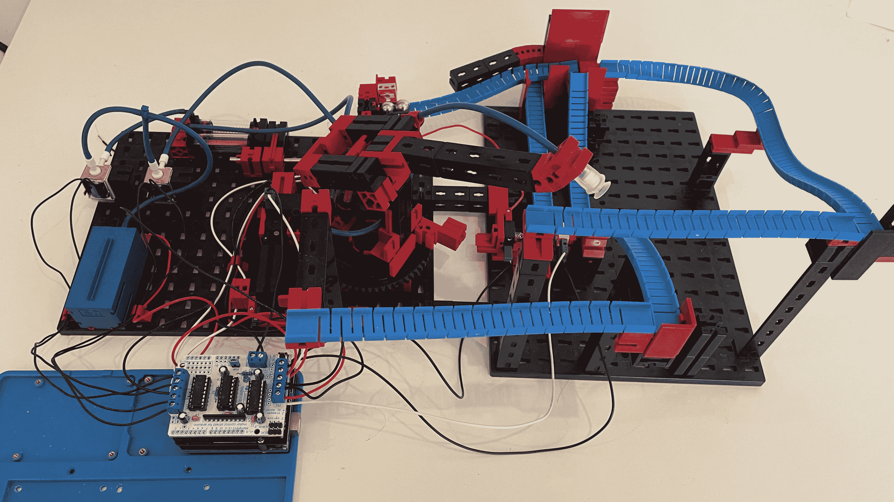

# Zig 和 Go 编程摊牌！

> 原文：<https://itnext.io/the-zig-and-go-programming-showdown-2244b261c051?source=collection_archive---------0----------------------->

## 在 Zig and Go 中构建一个玩具组装器教会了我关于每种语言的什么


这个故事的标题应该是“为什么我放弃了 Zig”，但 Zig 最终给我留下的印象比我预期的要多，而 Go 让我失望。那段经历很好地说明了我在过去两年中与 Zig 的关系:我真的很难决定我对 Zig 的看法。有时，这让我感到沮丧，我准备放弃。其他时候我会想，“这东西真的很棒，很聪明！”

在我们深入研究之前，你可能会问:我为什么要比较 Zig 和 Go？这两种语言是不是差别太大，无法比较？他们在同一个领域竞争吗？的确，它们是不同的，它们并不完全重叠。但就我的兴趣而言，我看到了明显的重叠。请允许我澄清。我更喜欢的语言是 Julia，但是它是为 JIT 编译而设计的，因此不适合为小型命令行实用程序创建二进制文件。例如，我希望我的简单的 [Calcutron-33 玩具组装器](https://github.com/ordovician/Calcutron33.jl)易于任何人下载和安装。任何需要安装虚拟环境、运行时系统或 JIT 编译器的东西都是不可行的。

我的另一个兴趣是编程游戏引擎和微控制器。我用[慧鱼](https://www.fischertechnik.de/en/)建造了一个很酷的大理石跑道，由 [Arduino 微控制器](https://www.arduino.cc)控制，我用标准 [Arduino IDE](https://www.arduino.cc/en/software) 用 C/C++编程。每次我使用 C/C++时，我都发现这种语言妨碍了我。我想要更好的东西。



Arduino 控制的慧鱼大理石轨道

使用 Julia 不是一种选择，因为它不是真正为小型系统设计的。Go 似乎也不是一个好的选择，因为它使用了垃圾收集。然而，Go 是一种与 C#和 Java 等其他 GC 语言非常不同的语言。因为它允许您控制内存布局和使用真正的指针，所以您可以限制垃圾收集的使用。这些特性的结合使得 TinyGo[成为可能:](https://tinygo.org)

> TinyGo 通过创建基于 LLVM 的新编译器，将 Go 编程语言引入嵌入式系统和现代网络。
> 
> 您可以在超过 85 种不同的微控制器板上编译和运行 TinyGo 程序，例如 BBC micro:bit 和 Arduino Uno

因此，自从两年前我开始玩 Zig 以来，我几乎已经决定放弃 Zig，专注于围棋。为什么不呢，当 Go 可以覆盖我感兴趣的大部分系统编程的时候？然而，我一直看到你们，我的读者，似乎对阅读我的 Zig 故事比我的 Go 故事更感兴趣。因此，这个月，我决定带 Zig 再转一圈。

感受一门语言的最好方法是通过实现一些重要的程序。我的选择是用大约 1500 行 Zig 代码完成我的玩具组装器 [Zacktron-33](https://github.com/ordovician/Zacktron-33) 。对应的围棋版本 [Calcutron-33](https://github.com/ordovician/calcutron) 大概是 1000 行围棋代码。请记住，Go 版本还没有完成(10 月 27 日)。

# 最初的惊喜

乍一看，Zig 似乎是一种比 Go 低级得多的编程语言。以下是 Zig 缺少但 Go 中存在的一些东西:

*   垃圾收集工
*   字符串类型
*   抽象接口
*   对并发的内置支持(例如，Goroutines)
*   关闭
*   异常(`panic`在 Go 中)
*   运行时反射

Zig 不使用字符串类型，而是使用基本的字节数组，就像 c 一样。然而，当在函数级工作时，角色是互换的:Go 感觉像低级语言，Zig 感觉像高级语言。我认为原因是 Zig 在其他重要领域比 Go 更复杂:

*   代码的编译时评估，即所谓的`comptime`
*   枚举和联合类型
*   标记联合(总和类型)
*   可选类型(必须明确允许变量或参数采用`null`值)

最终的结果是，Go 擅长于我称之为“大”的编程，而 Zig 擅长于“小”的编程。我这么说是什么意思？你在白板上勾画的所有东西，比如类、模块以及它们之间的关系，都是 Go 的优势所在。一旦深入到单个功能的层面，Zig 就开始大放异彩。

在我的 Zig 解决方案之后，我在 Go 中实现了我的汇编器。在编写 Go 代码时，我经常惊讶地发现，与 Zig 相比，Go 在处理错误和空值方面是多么笨拙。在进行常规编程时，这种东西会不断地被处理。让我通过一个解析汇编源代码文件中的符号的例子来阐明这一点。

# 创建符号表

大多数编程语言都必须处理符号。我发明的 Calcutron-33 汇编语言也不例外。让我展示一个 Calcutron-33 汇编程序的例子。你会注意到标签`loop`和`multiply`，它们代表程序存储器中的特定位置。

```
loop:
    INP x1        // read input into register x1
    INP x2        // store next input value in register x2
    CLR x3        // clear register x3

multiply:
    ADD x3, x1    // add register x1 to register x3
    DEC x2        // decrement register x2
    BGT x2, multiply
    OUT x3        // write register x3 to output

    BRA loop      // non-conditional jump to label loop
```

当解析这个汇编代码时，我必须跟踪这些标签对应的内存地址，这样任何引用这些符号的指令都会替换一个内存地址。

我们先来探讨一下 Go 版本。我使用 Go `Scanner`类型一次扫描文件中的一行。对于每一行，我使用`IndexRune`来确定该行是否有冒号。每个标签的结尾都用冒号标记。`IndexRune`返回您要搜索的字符的索引，如果找不到，则返回`-1`。因此，下面的代码包含一个 if 语句，在字典中记录符号的地址之前检查`i >= 0`(Go 中的`map`)。

```
func readSymTable(reader io.Reader) map[string]uint8 {
	scanner := bufio.NewScanner(reader)
	labels := make(map[string]uint8)
	address := 0
	for scanner.Scan() {
		line := strings.Trim(scanner.Text(), " \t")
		n := len(line)

		if n == 0 {
			continue
		}

		if i := strings.IndexRune(line, ':'); i >= 0 {
			labels[line[0:i]] = uint8(address)

			// is there anything beyond the label?
			if n == i+1 {
				continue
			}
		}
		address++
	}
	return labels
}
```

这种实施方式面临几个突出的挑战:

*   可能会失败，但我不会在代码中处理这个问题。Go 没有以任何方式强迫我或提醒我那样做。
*   很容易忘记检查索引`i > 0`。没有什么会强迫你去做那个检查。你只需要记得去做。

Zig 解决方案避免了上述问题。它使用`readUntilDelimiterOrEof`函数代替 Go 的`Scan`函数来获取单独的行。一个关键的区别是，前者强迫你处理错误，而后者不。如果在读取过程中发生错误，类型为`error`的类似枚举的值将从`readSymTable`函数返回。我稍后将更详细地解释这个机制是如何工作的。

其次，在 Zig 中，我们使用`mem.indexOf`函数而不是`strings.IndexRune`来定位冒号`:`字符的索引。在以下 Zig 代码中，无需检查`i > 0`。相反，如果没有冒号，则返回一个`null`。这算什么进步？

```
fn readSymTable(allocator: Allocator, 
                   reader: anytype) !StringHashMap(u8) {

    var labels = StringHashMap(u8).init(allocator);
    errdefer labels.deinit();
    var address: u8 = 0;

    var buffer: [500]u8 = undefined;
    while (try reader.readUntilDelimiterOrEof(buffer[0..], '\n')) |tmp_line| {
        const line = mem.trim(u8, tmp_line, " \t");
        const n = line.len;

        if (n == 0) continue;

        if (mem.indexOf(u8, line, ":")) |i| {
            const label = try allocator.dupe(u8, line[0..i]);
            try labels.put(label, address);

            // is there anything beyond the label?
            if (n == i + 1) continue;
        }
        address += 1;
    }

    return labels;
}
```

Zig 不允许你对*可能*包含`null`的值做任何事情，直到你显式地打开那个值。

## 理解索引

查看下面的`indexOf`的函数签名，我们可以看到它返回一个类型为`?usize`的值。添加的问号表示该值可能包含一个`null`，因此必须以特殊方式处理。这就是我们所说的可选值或可空值。

```
fn indexOf(comptime T: type, haystack: []const T, needle: []const T) ?usize
```

`usize`本质上是一个无符号整数，大到足以表示数组中的任何索引。通过添加一个问号`?`,我们使类型可选。如果我们没有这样做，那么返回`null`将会产生一个编译错误。通过使返回类型可选(也称为可空)，我们被允许返回`null`。

因为可选值在类型系统中被显式标记，所以编译器可以捕捉任何试图直接使用该返回值的代码，而无需先将其解包。

在展开之前，不能在任何计算或运算中直接使用可选整数。在 Zig 中，您可以使用带横条的 if 语句展开可选值`maybe`。

```
if (maybe) |v| {
    // do stuff with unwrapped v value
}
```

在 Zig 中，从解包选项中捕获的值、错误和许多其他东西都是用竖线中包含的变量捕获的，例如`|i|`。在 Zig 中，不可能编写下面的代码，因为`i`的类型是`?usize`，它不能用作索引来指定`line`字符串的一部分。

```
// This Zig code will not compile
const i = mem.indexOf(u8, line, ":")
const label = try allocator.dupe(u8, line[0..i]);
```

Zig 方法的好处是“忘记”检查`i`是否是`null`是不可能的。

## 了解 readUntilDelimiterOrEof

为了解释 Zig 如何读取文本行，我们需要了解 Zig 如何处理错误。实际上，您可以定义一个要与函数一起使用的错误代码的枚举。

```
const FileOpenError = error {
    AccessDenied,
    OutOfMemory,
    FileNotFound,
};

fn open(filename: []const u8) FileOpenError!File {
   // implementation of a file open function
}
```

感叹号`!`的使用创建了一个联合类型。从`open`返回的值可以是一个`FileOpenError`枚举值或一个`File`对象。当调用这个函数时，您应该编写如下代码:

```
var file = open("foobar.text") catch |err| {
    // do some stuff
	return err 
}
```

如果没有错误，`file`变量被设置为一个有效的文件对象，我们继续执行接下来的几行代码。但是，如果有错误，就会调用`catch`子句，并在`err`变量中捕获错误对象。您可能想尝试在这里处理错误，但通常最好是简单地从带有错误值的函数中提前返回。因为这种选择非常普遍，所以 Zig 有一种通过使用`try`关键字来编写`catch`和`return`代码的简写方式:

```
// will cause a return from enclosing function if open fails
var file = try open("foobar.text")
```

Zig 编译器会强迫你处理错误情况。您必须要么捕捉错误，要么通过使用`try`从封闭函数返回错误来转发错误。现在您可以更好地理解我们的`readSymTable`函数了。

```
fn readSymTable(allocator: Allocator, 
                   reader: anytype) !StringHashMap(u8) {
```

它返回一个类型为`!StringHashMap(u8)`的值。我们没有指定使用的`error`枚举，这意味着函数接受任何返回的错误值。如果没有错误发生，我们的`readSymTable`返回一个字典(hash map ),以字符串键和 8 位无符号整数作为值。如果我们不允许函数返回一个错误对象，那么将`try`放在函数调用之前将会失败。可能返回错误值的函数调用。将`try`放在从不返回错误值的函数调用之前是一个语法错误。

观察我们的`readSymTable`中的 while 循环。注意对`readUntilDelimiterOrEof`的调用是如何以`try`为前缀的，以便在读取文件时发生错误的情况下允许从`readSymTable`返回。然而，即使没有错误，也可能没有更多的行要读取，这就是为什么我们需要`|tmp_line|`来打开返回的可选值。

```
while (try reader.readUntilDelimiterOrEof(buffer[0..], 
                                          '\n')) |tmp_line| {
    // process each line
}
```

我向您详细介绍了`readSymTable`代码示例，以展示 Zig 如何处理许多在编写 Go 代码时容易被忽略的错误情况。在我在 Zig ( [Zacktron-33](https://github.com/ordovician/Zacktron-33) )中实际实现 [Calcutron-33](https://erik-engheim.medium.com/decimal-risc-cpu-a13968922812) 的过程中，除了最琐碎的功能之外，我对几乎任何功能都反复体验了这种好处。

这种更高级的类型系统的缺点是复杂。你可以看到，为了解释这个相对简单的函数，我不得不涉及很多内容。意味着`readUntilDelimiterOrEof`函数得到了复杂的返回类型`!?[]u8`。我们用`[]`来表示它是一个切片。`?`表示类型是可选的，而`!`表示可能返回一个错误。

```
fn readUntilDelimiterOrEof(self: Self, 
                            buf: []u8, 
                      delimiter: u8) !?[]u8
```

# 正确性与简单性

现在，你可能知道为什么我很难决定我喜欢什么方法了。在 Go 中，编写代码检查返回的错误对象是否为`nil`变得很繁琐。这也是一个你可能不总是记得要做的检查。例如，在下面的代码中，忘记在`err`中存储错误对象不会产生编译错误。

```
err := instruction.ParseOperands(labels, operands)
if err != nil {
    return 0, err
}
```

根据我在 Zacktron-33 和其他各种玩具项目中的工作经验，在 Zig 中处理错误要顺利得多。但是这种平滑和更强的正确性保护是有代价的。正如你在我的`readSymTable`演示中看到的，有更多的概念需要你保持头脑清醒。与使用`readUntilDelimiterOrEof`的情况一样，同时处理错误对象和选项让我最初有些晕头转向。

此外，在实践中，围棋并不像看起来那么糟糕。在典型的 Go 情况下，错误对象是两个值中的一个，例如:

```
machincode, err := instruction.MachineInstruction()
if err != nil {
    return 0, err
}
```

在这些情况下，你不能取出你想要的值，除非你也取出错误对象。在 Go 中，如果你没有对返回的`err`对象做任何导致编译错误的事情。因此，就像 Zig 迫使您在使用值之前打开它们一样，Go 实际上也迫使您在大多数情况下处理错误对象。当返回的唯一对象是一个错误对象时，Go 中就会出现问题。在这些情况下，很容易忘记获取和检查错误对象。

Zig 错误处理也不是完美的。您只能返回枚举值，而 Go 允许您返回更复杂的错误对象，其中可能包含各种有用的信息。使用 Zig，您需要提供第二个通道来提供关于发生的错误的注意细节。

# 手动内存分配与垃圾收集

垃圾收集当然很好，但是对于系统编程来说也有点麻烦。在实现操作系统内核或为微控制器编写程序时，您不希望使用垃圾收集器。游戏引擎开发人员也可能更喜欢手动管理内存分配，以避免由于垃圾收集周期开始而导致的任何突然的帧速率下降。这几乎适用于任何实时系统。

然而，Go 在实时系统方面做得比你所期望的带有垃圾收集器的语言好得多。Go 被特别设计成不会产生大量垃圾，语言设计者总是优先考虑低延迟。

补充一点相关的轶事:我和 NASA 的人聊过，他们热情地告诉我，他们在内部的许多实时系统中使用 Go(而不是在他们的飞船、漫游者或类似的东西上)。

对于内存处理，我认为很难称之为赢家，因为 Zig 使得手动内存管理比我习惯的要好得多。下面是一个例子，说明我们如何分配字典来存储符号和它们相应的地址。注意到`errdefer`语句了吗？

```
var labels = StringHashMap(u8).init(allocator);
errdefer labels.deinit();
```

正常情况下，我们会想要返回`labels`字典，而不返回它。但是，如果出现错误，我们将无法正确初始化字典。在这些情况下，我们希望确保字典被释放，以避免内存泄漏。`errdefer`语句只在返回一个`error`对象的情况下执行。因此，在正常返回发生的情况下，不会执行`labels.deinit()`语句。

在 C 程序中纠正这种行为要复杂得多。Zig 的设计者安德鲁·凯利真的花了很多心思让手动内存管理尽可能顺利地工作。所有内存分配都必须通过您提供的分配器来完成。这适用于整个 Zig 标准库。因此，在开发 Zig 程序时，你使用一个特殊的分配器来检测内存泄漏、双释放和许多其他内存问题。这是我的 Zig 汇编程序的一个例子。

```
pub fn main() !void {
    var gpa = std.heap.GeneralPurposeAllocator(.{}){};
    defer _ = gpa.deinit();
    const allocator = gpa.allocator();

	// get command line arguments
    const args = try process.argsAlloc(allocator);
    defer process.argsFree(allocator, args);

    var filename: []const u8 = undefined;

    if (args.len == 2) {
        filename = args[1];
    } else {
        try stderr.print("Usage: assembler filename\n", .{});
        try stderr.print("\nAssembly of {s}:\n", .{filename});
        return
    }

    try assembleFile(allocator, filename, stdout);
}
```

您将会注意到，任何需要内存的东西都会首先请求一个分配器。一旦退出函数范围，我们使用`defer`来释放已分配的内存。

作为一个老的 C 开发人员，我很喜欢这种对内存使用的完全控制。它让你在使用需要分配内存的解决方案时三思。它直接影响了我在编写 Zig 代码时的设计决策，从而降低了内存的使用。

一个缺点是，像闭包和使用`map`、`filter`和`reduce`的函数式编程变得相当困难。另一方面，在系统编程语言中，这不是你主要关心的。

因此，手动内存管理、错误处理和选项都是非常积极的体验，让我喜欢上了 Zig。因此，问题是到底是什么让我接近放弃？

# 是什么让我差点放弃齐格

Zig 真的像打了类固醇的 C。这类似于采用一种与 C 语言功能相似的语言，并加上严格得多的类型系统，使 C 语言成为一种更安全的语言。这肯定有它的魅力，但是对于我这个终端用户来说，在处理对象时，它确实引起了很多挫折。Zig 标准库是面向对象的。事物被组织成具有功能的结构。它们看起来有点像方法，但更像名称空间和语法糖。

我在 Go 中的`Assemble`函数允许我提供各种 I/O 对象，汇编器可以从中读取源代码进行汇编，I/O 对象将结果写入其中。

```
func Assemble(reader io.Reader, writer io.Writer) error {
	// implementation
}
```

Go 中的`Reader`和`Writer`界面使用起来确实很灵活实用。下面是使用它们的一个例子:

```
func AssembleFile(filepath string, writer io.Writer) error {
	file, err := os.Open(filepath)
	if err != nil {
		return err
	}
	defer file.Close()

	return Assemble(file, writer)
}
```

我可以传递一个文件对象，因为它符合`io.Reader`接口。然而，插座、管道或`os.Stdin`也可以连接到`io.Reader`接口。`io.Writer`接口同样有用。您的代码不需要知道编写器是`os.Stdout`、文件还是套接字。我写出这样的汇编机器码:

```
fmt.Fprintf(writer, "%04d", machinecode)
```

`Fprintf`函数并不真正知道它将输出写到什么，只知道它是实现`io.Writer`接口的某个对象。简而言之，这是一个伟大的抽象。

Zig 也处理读者和作者抽象，但问题是:它们不是真正的接口。就你所说的接口而言，它只是在编译时隐含存在的东西，而不是在运行时。在 Zig 标准库中，还有一个`io.Writer`和`io.Reader`。,

```
// Doens't work
const Writer = std.io.Writer;
const Reader = std.io.Reader;

fn assemble(allocator: Allocator, 
            reader: Reader, // naive assumption about interfaces
            writer: Writer) !void 
{
   // implementation
}
```

问题是它们根本不是接口，而是用于在编译时创建读取器和写入器结构的函数。在编译时必须知道读取器和写入器的具体类型。出于这个原因，您必须在 Zig 中指定一个读取器和写入器作为`anytype`。在 Zig 中，`anytype`指的是在编译时根据您传递的参数确定的类型。

```
// This works!
fn assemble(allocator: Allocator, 
            reader: anytype, 
            writer: anytype) !void 
{
   // implementation
}
```

我认为这个解决方案的问题是与用户的沟通不清楚。您无法在代码中清楚地表达您想要什么类型的参数作为输入。当编译器对你大喊大叫时，你只会知道你得到了错误的输入。因此，从安全角度来看，这不是问题。然而，从可用性的角度来看，这是一个问题。在 Zig 中，文件对象不是一个阅读器，相反，你可以通过`Reader`接口向它请求一个对象:

```
const file: File = try dir.openFile(
    filename,
    .{ .read = true },
);
const reader = file.reader();
```

这就引出了一个问题:返回的`reader`对象是什么类型的？我们可以看看`File`的实现来了解一下:

```
pub const Reader = io.Reader(File, ReadError, read);

pub fn reader(file: File) Reader {
    return .{ .context = file };
}

pub fn read(self: File, buffer: []u8) ReadError!usize {
    // implementation of function reading bytes from file
}
```

`io.Reader(File, ReadError, read)`调用在编译时构造一个新的类型`Reader`。然而，每个 Zig I/O 对象都会在编译时进行相似类型的调用，创建不同的`Reader`类型。`io.Reader`给我们的是一个模板，可以为每个定义的新 I/O 类型快速生成新的`Reader`类型。因此，我们正在从事一种模板编程的形式。没有接口的子类化或实现。虽然，人们可能会说编译时阅读器接口是令人满意的。

您可以了解如何使用`Reader`函数为新的 I/O 类型生成读取器类型。这里是一个经过大量编辑和配对的`Reader`函数版本。可以看到它返回了一个`struct`。它接受一个`readFn`参数，这是一个函数指针，由在返回的`struct`上定义的`read`成员函数使用。

```
pub fn Reader(
    comptime Context: type,
    comptime ReadError: type,
    comptime readFn: fn (context: Context, buffer: []u8) ReadError!usize,
) type {

    return struct {
        pub const Error = ReadError;
        context: Context,
        const Self = @This();

        pub fn read(self: Self, buffer: []u8) Error!usize {
            return readFn(self.context, buffer);
        }

        pub fn readUntilDelimiterOrEof(self: Self, 
                                        buf: []u8, 
                                  delimiter: u8) !?[]u8 {
        	// implementation edited out
        }

        // more read functions
    }
}
```

定义了许多不同的读取函数。我选择显示`readUntilDelimiterOrEof`包含在这个读取函数列表中，因为我们已经在代码示例中介绍过了。

我展示这个的原因是为了证明在 Zig 中有很多机制可以实现类似于接口的东西，而且它们使用起来比 Go 中的接口更笨拙。从更大的范围来看，这就是项目的意义所在。它们是关于不同模块之间的接口。在这方面，我认为围棋重新获得了优势。

挖掘所有这些标准库代码来理解 Zig 接口让我想放弃整件事。我做了大约 15 年的 C++开发人员，发誓再也不在复杂的编程语言上浪费时间了。尽管我在 C++上下了很大功夫，但我从未觉得有所回报。我有点担心会再犯同样的错误。

# 我会和 Zig 在一起吗？你会吗？

齐格仍然让我着迷。Zig 背后的一些关键人物，如安德鲁·凯利和洛里斯·克罗，让我对这个社区和这门语言的发展方向有了很好的感觉。我认为两人都在他们的视频和作品中表达了许多明智的想法。我必须为没有在 Zig 社区中说出其他重要的名字而道歉，但是当我试图学习这门语言时，安德鲁和洛里斯已经非常明显了。

我认为他们正在类 C 语言领域做出一些最令人兴奋的创新，这是我们很久以来所看到的。我已经等了很多年了。可悲的是，这么长时间过去了，我对 C 编程的兴趣已经消退。我认为 Zig 真正的吸引力在于 C 程序员。如果你已经做了很多 C 编程，我敢打赌 Zig 将会带来巨大的好处，特别是如果你在内核、游戏引擎、微控制器或任何有很高性能要求或资源限制的系统上工作。

目前我更倾向于围棋，但我认为 Zig 未来的发展可能会改变我的想法。Zig 在几个方面比 Go 做得更好，但这部分是以语言工具不太友好为代价的。对于 IDE 来说，Go 更容易解析。在编写我的汇编程序时，我注意到 VS 代码中的 Go 支持更好，这让我受益匪浅。

这可能是一个不公平的比较，因为 Zig 要年轻得多，但是这种语言的本质应该使解析 Zig 代码更加困难。例如，无法确定什么函数将对类型为`anytype`的参数起作用。

当然，如果你们继续大量阅读我的 Zig 故事，我将被迫继续学习 Zig😉