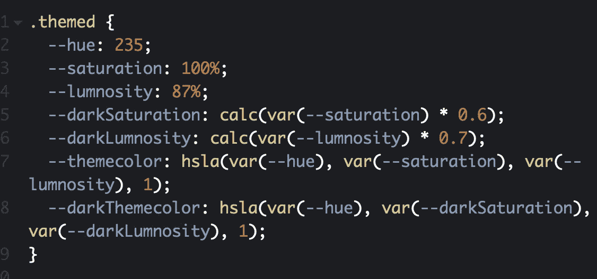
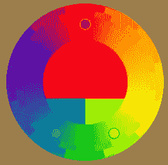

# 使用 CSS 自定义属性(变量)和 calc()进行主题化

> 原文：<https://itnext.io/theming-with-css-custom-properties-variables-and-calc-a89b37ad0013?source=collection_archive---------5----------------------->

样式的主题化有很多用例。组件系统、定制、白色标签、暗模式/亮模式、应用程序内的差异(路线、主题、子应用程序)、可访问性。



一个好的主题化系统需要处理 *DRY* (不要重复自己) *SOC* (关注点分离)*系统各部分之间的松散耦合*(如果我在这里改变了一些东西，我需要在那里改变吗？)，我在这里称之为*共变*(需要一起改变的属性-值对，比如按钮背景和按钮边框颜色)。如果这些问题得不到很好的解决，随着时间的推移，质量问题会越来越多。

我不会在这里讨论足球。本文的一个前提是，就样式而言，CSS 是 SOC 的更好方式。我要讨论的是干燥，耦合，但主要是协变。最后是有趣的部分，我展示了普通 CSS 如何使用自定义属性和 calc()来处理共变。

# 第一步，简单的级联主题化

首先，让我们考虑一下主题化的简单版本:

主题是使用级联创建的。但这是有问题的，原因有二。如果你需要更新颜色，你将不得不在 CSS 中所有使用主题颜色的地方改变它。当 CSS 增长时，这不仅仅是“查找和替换”的问题。如果相同是巧合呢？(是的，会发生这种情况。)或者 RGB 和 HSL 是否混合使用？

另一件事是，如果添加了主题，您可能还需要更新单个组件的 CSS，这在系统中引入了硬耦合。

# 步骤 2，用自定义属性进行简单的主题化

因此，首先，您可以使用自定义属性来确保在应该使用的地方使用相同的值，并且可以从某个中心位置进行更改:

在这里你至少可以确保你可以安全地更新颜色和干燥。但是你仍然需要处理耦合。为此，您可以避免使用以属性值命名的属性，例如，使用命名的配色方案作为系统的一部分。配色方案可以是类似于*原色*和*次色*或者*主题色*和*品牌色*之类的东西。这取决于你。

# 第三步，用自定义属性进行主题化就不那么幼稚了

因此，组件不是引用特定颜色的自定义属性，而是引用配色方案中已命名的自定义属性，这也可以在不影响组件的情况下从某个中心位置进行更改。添加主题将轻而易举:

在这里，组件引用属性`--themecolor`，该属性的值是由主题类设置和限定的。额外的好处是可读性，因为您现在传达了属性的意图或角色。此外，您仍然可以对命名值使用自定义属性。这可能是一个好的实践，因为它降低了在添加和更改内容时意外破坏主题的风险。您只需将命名的 value-property 分配给 schemed-property:

```
--themecolor: var(--purple);
```

# 第 4 步，与 calc()的共变

到目前为止一切顺利，但是协变呢？问题是定制属性可以和 calc()一起使用。一个用例可以是顶部和侧边空白，需要有一定的比例:

```
--marginSides: 30px;
--marginTopBottom: calc(var(--marginSides) * .7)
```

如果您更改`--marginSides`，marginTopBottom 将随之改变。因此，通过使用 calc()，您可以在系统中进行协变，而无需像 LESS 和 SASS 这样的预处理器。

这也适用于颜色。我最喜欢的 LESS color 函数是 darken()，那么，我们能在普通的 CSS 中做类似的事情吗？是的，当然，其中的秘密是使用 HSL 而不是 RGB。HSL 很棒，因为它将颜色分成比 RGB 更容易操作的属性，并且每种颜色都可以用自定义属性来表示:

```
--hue: 255;
--saturation: 100%;
--lumnosity: 87%;
--themecolor: hsla(var(--hue), var(--saturation), var(--lumnosity),1);
```

这可以用于主题化和颜色值之间的共同变化，比如一些背景颜色的稍微暗一点的边框:

颜色的变暗可以通过使用 calc()改变饱和度和亮度来实现，这样系统就可以处理色调的共同变化。你需要 50 个色度？没问题！

正如您在这支笔中看到的，一个很好的地方是，您还可以使用自定义属性来简化属性，这大大降低了意外引入系统可变性的风险:

```
--themeBorder: var(--borderSize) solid var(--darkThemecolor);border: var(--themeBorder);
```

如果需要，您仍然可以覆盖组件中的特定属性:

```
.cracyButton {
    border: var(--themeBorder);
    border-left: 15px dotted var(--cracyColor);
}
```

# 第五步，确保规则是按照它们应该的方式计算的

> 自定义属性的范围是声明它们的元素，并参与级联:这种自定义属性的值来自级联算法决定的声明。【https://developer.mozilla.org/en-US/docs/Web/CSS/-*】【T2 

使用自定义属性和 calc()进行主题化的技巧是，如果属性发生变化，CSS 规则不会自动更新，因此如果 calc()中使用的属性发生变化，您必须确保重新计算规则。

所以类似这样的事情不会起作用，因为在 DOM 树中向下改变属性不会自动影响。主题规则更高:

```
//Does not work.themed {
    --hue: var(--basichue);
    --themecolor: hsla(calc(var(--hue), ...);
}.procolTheme {
    --hue: var(--aWhiterShadeOfPale);
}.hendrixTheme {
    --hue: var(--purpleHaze);
}<main class="themed">
    <section class="procolTheme">...</section>
    <section class="hendrixTheme">...</section>
</main>
```

改变顺序，或者将它们放在同一个节点上，如在笔中，将会有所帮助。

此外，还有强制重新计算计算规则的可能策略。基本原则是做一些在范围内更新属性的事情。您可以稍后在流程中添加一个部分更新规则的规则。如果用例是每条路线的主题，您可以有一个带有基本主题的共享 CSS，以及一个只使用所需属性覆盖规则的每条路线 CSS。或者，如果路由是由框架处理的，或者如果您出于其他原因只需要在应用程序中处理不同的主题，则覆盖的 CSS 可以在组件中。也可以通过 JavaScript 添加覆盖规则。

如果用例是黑暗/光明模式，并且此时浏览器都支持媒体查询`prefers-color-scheme`，您可以在媒体查询中触发重新计算:

```
@media (prefers-color-scheme: dark) {
    .themed {
        --hue: var(--backInBlack);
    }
}
```

*顺便说一句:自定义属性和媒体查询对于在主题化系统中处理响应式设计非常有用，因为你真的可以最小化查询中所需的代码！*

# 第六步，越过顶部

最后一个是实验性的，而不是实践性的，但是它表明您可以将基于色轮的配色方案实现为共变。但是你的设计师可能不会为此感谢你，因为它错过了让他们的一天变得美好的微调。

这支笔所用的方案，被称为*互补分裂*:



免费赠送:[http://www.paletton.com/wiki/index.php?title = Split _ complementary _ color _ scheme](http://www.paletton.com/wiki/index.php?title=Split_complementary_color_scheme)

由于色调可以被视为色轮中的一个角度(0-360 度)，因此可以很容易地导出方案中的其他颜色，就像您可以操纵饱和度和亮度一样:

```
--primaryHue: var(--hueBasic);
--secondaryHue: calc(var(--primaryHue) + 150);
--complementaryHue: calc(var(--primaryHue) + 210);
```

如果你得到的值大于 360，不要担心，它只是开始另一轮。

# 摘要

所以总结一下。CSS 自定义属性和 calc()可以帮助你处理主题化系统中的*相同*、*耦合*和*共变*。

相同，因为自定义属性可以定义在整个系统中需要相同的值。耦合，因为自定义属性可以通过它们的角色来定义，而不仅仅是它们的值的简写。因为 calc()可以使用自定义属性作为参数，所以可以通过自定义属性和 calc()的组合来将值绑定在一起。