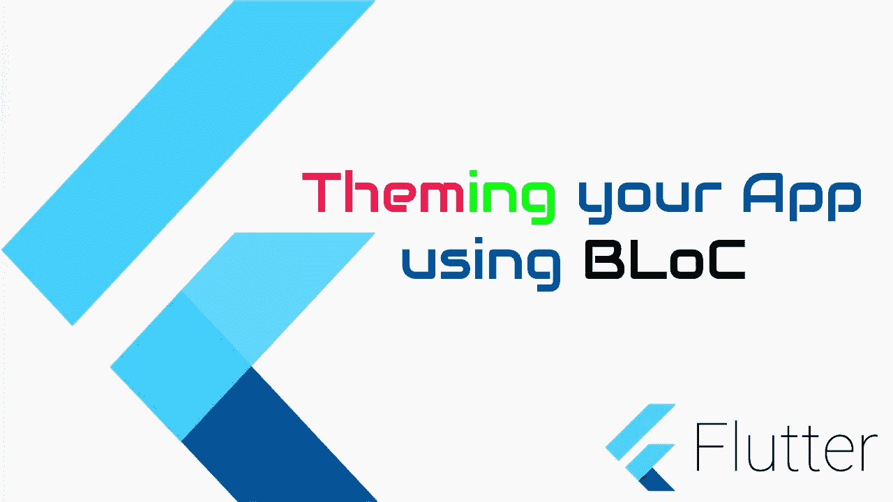

# 在 Flutter 中使用 BLoc，Save & Reload 对你的应用程序进行主题化

> 原文：<https://itnext.io/theming-your-app-in-flutter-using-bloc-save-reload-62048a330584?source=collection_archive---------3----------------------->

在本文中，我们将看到如何使用 BLoc 在 Flutter 中为你的应用程序设置主题。



在 Flutter 中使用 BLoC 进行应用程序主题化

要用一个真实世界的例子来理解 BLoC，你可以参考我以前在 BLoC 上的帖子[这里](https://medium.com/@vipinvijayan23/bloc-pattern-in-flutter-explained-with-real-example-f1af2568d32d)。

# 第一部分

颤动阻塞

# 第二部分

对于这个演示，我们还需要以下插件

```
flutter_bloc: ^6.0.4
equatable: ^1.2.4
```

如果你遵循我以前的教程，你也会很容易理解这篇文章。挺像的。

让我们为我们的应用程序创建主题。

*我们这里有两个主题……*

1.  *黑暗主题*
2.  *灯光主题*

让我们创建一个名为“app_themes.dart”的新类，并声明我们的主题。

```
import 'package:flutter/material.dart';class AppThemes {
  static final appThemeData = {
    AppTheme.lightTheme: ThemeData(
      scaffoldBackgroundColor: Colors.white,
      primarySwatch: Colors.blue,
      backgroundColor: Colors.white,
      textTheme: TextTheme(
        bodyText1: TextStyle(
          color: Colors.black,
        ),
      ),
    ),
    AppTheme.darkTheme: ThemeData(
      scaffoldBackgroundColor: Colors.black,
      primarySwatch: Colors.teal,
      backgroundColor: Colors.black,
      textTheme: TextTheme(
        bodyText1: TextStyle(
          color: Colors.white,
        ),
      ),
    )
  };
}enum AppTheme {
  lightTheme,
  darkTheme,
}
```

你可以看到每个主题的不同属性有不同的颜色。

这里我们需要三样东西

1.  *阻塞*
2.  *事件*
3.  *状态*

该块将接受事件和状态，并输出新状态。

在这里，我们将更新应用程序的主题，所以我们将添加一个主题更改事件，带有当前状态，我们将获得一个新的状态，这是一个新的主题。这就是整个想法。

因此，让我们首先创建事件

我们这里只有一个活动

```
class ThemeEvent {
  final AppTheme appTheme;
  ThemeEvent({this.appTheme});
}
```

现在国家，

```
class ThemeState {
  final ThemeData themeData;
  ThemeState({this.themeData});
}
```

最后是集团

```
class ThemeBloc extends Bloc<ThemeEvent, ThemeState> {
  //
  ThemeBloc()
      : super(
          ThemeState(
            themeData: AppThemes.appThemeData[AppTheme.lightTheme],
          ),
        );[@override](http://twitter.com/override)
  Stream<ThemeState> mapEventToState(ThemeEvent event) async* {
    if (event is ThemeEvent) {
      yield ThemeState(
        themeData: AppThemes.appThemeData[event.appTheme],
      );
    }
  }
}
```

在这里你可以看到我们正在发送一个 ***初始状态*** 给

```
ThemeState(themeData: AppThemes.appThemeData[AppTheme.lightTheme])
```

而在 *mapEventToState* 中，当用户触发了一个 ***ThemeEvent*** 时，我们会返回一个新的 ***ThemeState*** 。让我们看看我们能做些什么。

```
AppTheme selectedTheme =
        darkTheme ? AppTheme.lightTheme : AppTheme.darkTheme;
context.bloc<ThemeBloc>().add(ThemeEvent(appTheme: selectedTheme));
```

重要的部分来了…

```
BlocProvider(
      create: (context) => ThemeBloc(),
      child: BlocBuilder<ThemeBloc, ThemeState>(
        builder: (BuildContext context, ThemeState themeState) {
          return MaterialApp(
            title: 'Flutter Bloc Demo',
            debugShowCheckedModeBanner: false,
            theme: themeState.themeData,
            home: AlbumsScreen(),
          );
        },
      ),
    );
```

你必须包装你的屏幕或你想要应用主题的部件。在这里，它将是我们的根小部件。在上面的代码中,‘albumscreen’是主屏幕，我们的根部件是材料部件。

这里

```
theme: themeState.themeData,
```

是用户触发亮或暗主题时的新主题。

因此，当我们通过调用下面的代码来更新主题时，上面的小部件就会被触发。

在应用程序的其余部分，我们可以像这样使用这些。

```
backgroundColor: Theme.of(context).backgroundColor,
```

举个例子，

如果您想创建一个应用了主题的文本小部件，它应该是这样的

```
import 'package:flutter/material.dart';class Txt extends StatelessWidget {
  final String text;
  Txt({
    this.text = '',
  });
  [@override](http://twitter.com/override)
  Widget build(BuildContext context) {
    return Container(
      child: Text(
        text,
        style: TextStyle(
          fontSize: 20,
          color: Theme.of(context).textTheme.bodyText1.color,
        ),
      ),
    );
  }
}
```

无论你在哪里使用上面的小工具，都会应用合适的主题。

***完整源代码***

 [## 比特桶

### 编辑描述

bitbucket.org](https://bitbucket.org/vipinvijayan1987/tutorialprojects/src/BlocSimple/)