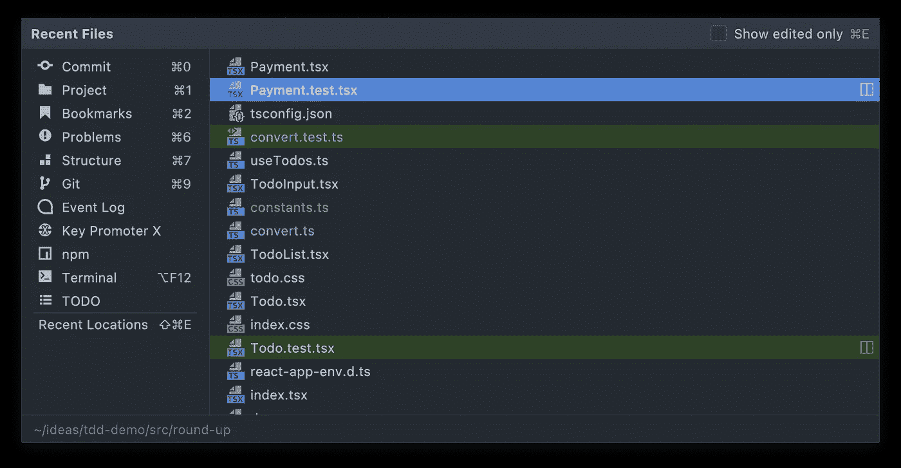
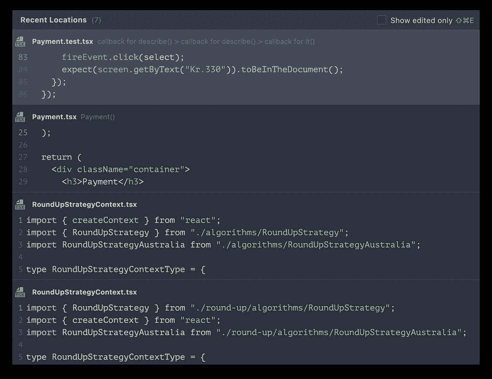
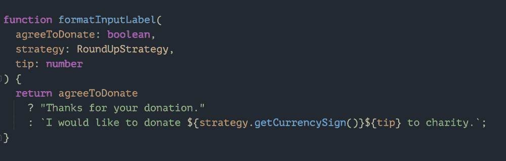
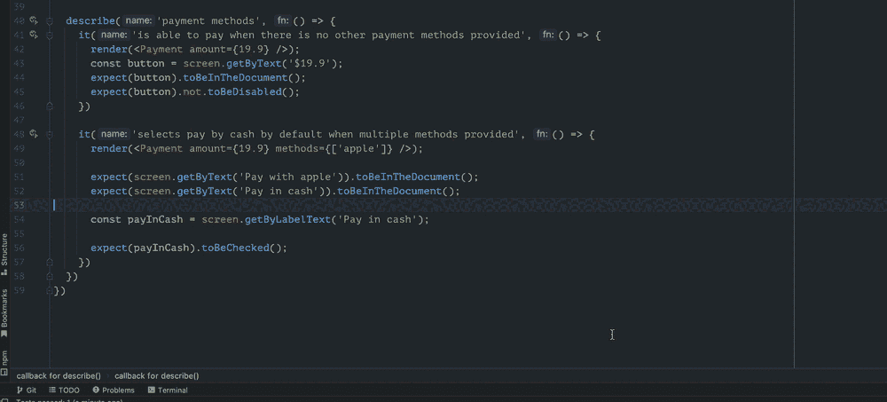
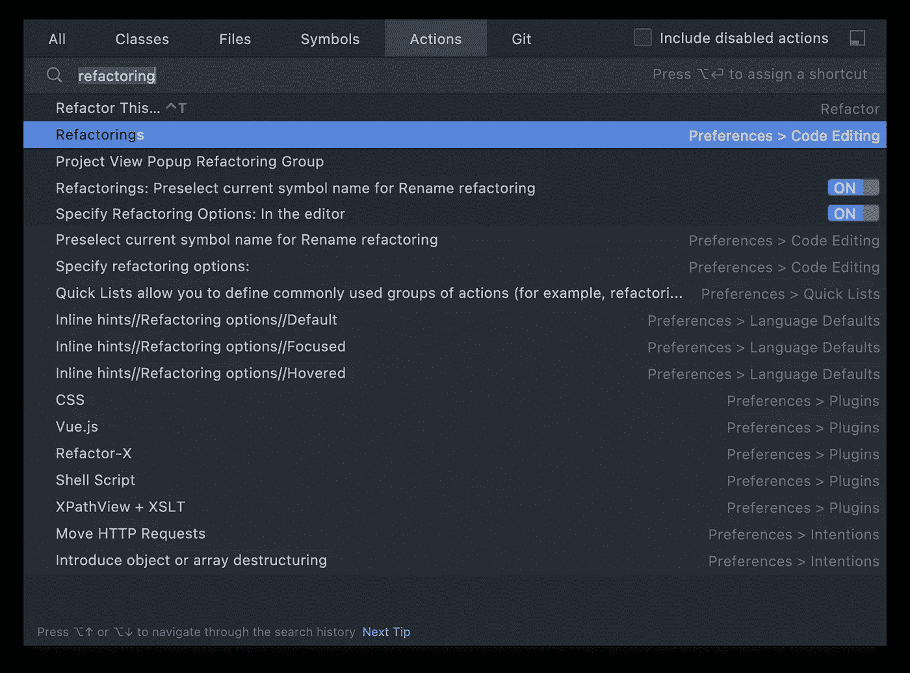

# 人生没有捷径，但编码有很多

> 原文：<https://itnext.io/there-are-no-shortcuts-in-life-but-there-are-many-in-coding-624f647b3e07?source=collection_archive---------5----------------------->

我是生产率的忠实粉丝，我会花很多时间学习如何使过程(开发、构建或部署)更加高效。虽然不同的工具以不同的方式帮助我，但我第一次使用工具时学会的总是快捷方式(或键盘映射)。

如果你正在使用 WebStorm 并做了很多重构，这里有一个适合你的快捷方式[。](https://icodeit.ck.page/10-refactorings)

网络风暴中的重构

这听起来可能是简单的一步，但我认为也是最容易被忽视的一步。即使有多年经验的人也可能不熟悉他们日常使用的工具的键盘快捷键。那太可惜了！他们本可以工作得更有效率，不那么辛苦。

在本文中，我将列出一些我在 WebStorm 中使用的最常用的快捷方式(也适用于大多数 JetBrains 产品)，它们可以提高您的工作效率。

如果你喜欢看视频，看看这个

# 开发者的一天是怎样的？

作为一名开发人员，除了编码工作之外，还有许多小任务需要你重复完成。选择一个代码块，选择一个函数的所有参数，重命名一个变量或函数，移动几行等等。

当你不真正编辑的时候，还有其他的任务。转到最近编辑的文件，搜索公共函数的所有用法，移动文件，运行所有相关的测试，并只运行最新的测试。

只要想想你有多少次通过移动鼠标(这是一种超级低效的方式)来完成这些琐碎的任务，但键盘快捷键是不同的。这些是你需要先花点时间，然后在你的职业生涯中得到回报的东西。

# 几个音符

在本文中，我将使用 Mac OS 进行演示，但是您也应该能够在您的操作系统中找到等效的操作系统。注意这里的要点是试着记住一些基本的，这样你就不必用鼠标重复这些最频繁的任务。

我要用的符号是:

*   命令键:⌘
*   Shift 键:⇧
*   选项键:⌥
*   上/下键:↑/↓

# 导航(⌘ +东)

如果你正在编辑许多文件(比如你现在正在做的😃)，`⌘ + E`是你最好的朋友。它会显示最近打开的文件列表，再次按下`⌘ + E`会显示“仅编辑过”的文件列表，这样您打开但没有接触过的文件就会隐藏起来。

最近的文件弹出菜单

注意上面的窗口中有一些提示，`⌘ + 0`用于切换`git commit`面板，`⌘ + 1`用于切换项目面板等。

# 导航到最近的位置

您也可以使用`⌘ + ⇧ + E`显示最近的位置，这将是您在文件中编辑的位置。如果你正在编辑一些大文件(比如你现在正在编辑的，😃)

最近编辑位置

# Selecting(⌥ + ↑/↓)

我发现我在编码时花了很多时间选择东西。选择一个字符串值，然后发现我也需要换行，或者反过来。你可以在 WebStorm 中使用`⌥ + ↑`或`⌥ + ↓`来扩展或缩小选择范围。

选择一个块

# 提取(⌘ + ⌥ +钒/镁/碳/磷)

一旦你选择了积木，你可以用它们做很多事情。提取一个变量，一个常量，一个参数，一个函数，一个类型别名等等。或者上下滑动选择，甚至将它们移动到另一个文件中，一切都由你决定。

请在这里阅读，看看我每天使用的[十大重构](/10-refactorings-to-boost-your-clean-code-skills-3a1e142d63f3)(你也可以[下载一本免费的小册子](https://icodeit.ck.page/10-refactorings))。

*   `⌘ + ⌥ + V`用于提取变量
*   `⌘ + ⌥ + M`为提取一种方法
*   `⌘ + ⌥ + C`用于提取常数
*   `⌘ + ⌥ + P`用于提取参数

# 测试(⌘+R)

我通常使用测试驱动开发作为我工作流程的一部分:写一个测试，`⌘ + R`运行它，看它失败，写一些代码，重新运行`⌘ + R`直到它通过。然后，如果需要，我可以做一些重构(通过使用上面的一些快捷方式)。

在您的 IDE 中运行测试

# 奖金(⌘ + ⇧ + A)

如果您不确定哪些操作可用，只需按下`⌘ + ⇧ + A`即可搜索要使用的命令。例如，我想从 JSX 提取一个组件，但不确定快捷方式是什么，所以我先输入`⌘ + ⇧ + A`，然后输入`extract component`。如果有相关的命令，我可以将它应用到插入符号下的代码。

搜索可用操作

# 摘要

在这篇文章中，我只是列出了一些我每天最常用的快捷方式。我相信这使我成为一名优秀的(或者至少是多产的)开发人员。

键盘快捷键是你在编程生涯中能找到的为数不多的具有超高投资回报的东西之一。你只需要花几个小时来学习和记住这些常用的按键，从长远来看，它会给你带来巨大的好处。

[**报名我的邮件列表**](https://icodeit.com.au/#subscribe) **。我每周通过博客、书籍和** [**视频**](https://www.youtube.com/@icodeit.juntao) **大致分享干净代码和重构技术。**