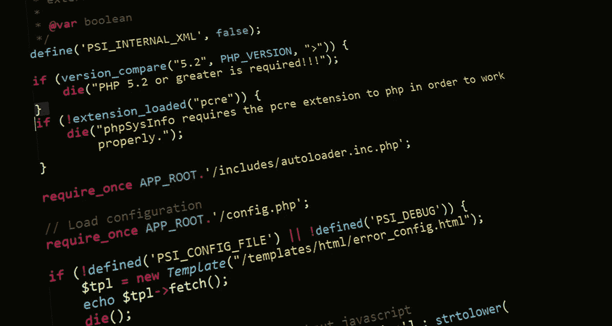

# “这个软件没有任何错误”

> 原文：<https://itnext.io/there-are-zero-bugs-in-the-software-8e50d02d298e?source=collection_archive---------8----------------------->

零缺陷是我曾经信奉的一个谬论。然后现实世界杀了它。

回到大学时代，我记得曾遇到一位在当地软件公司工作的朋友。他说他们即将发布(瀑布日)，他们将发布 x，xxx bugs。

我很震惊。震惊。你怎么能发布有漏洞的软件呢？您知道的 bug，您记录的 bug，但是您决定“哼，我们无论如何都可以发货”的 bug。那些可怜的顾客！

多年以后，也许我变得更加愤世嫉俗，或者更加现实，但是有很多方法可以证明没有商业软件是没有缺陷的。这可能是一件好事。

**修复 bug 的成本收益**

在“现实世界”中，你需要赚钱。显然，客户想要你的特性，而那些(尤其是更新的)特性很可能有问题/缺陷。大多数开发人员/质量保证人员都愿意修复这些问题。但归根结底是成本/收益分析。你是花 6 个月的时间来修复你所知道的所有 bug(并可能引入更多的 bug)，还是把那些新特性拿出来，从客户那里挣钱，并找出他们实际遇到的、需要修复的 bug。

现在很明显，让客户‘测试’你的软件并不理想，如果它有非常明显的缺陷，你可能会失去客户和金钱。所以我们修复顶部缺陷。明显的或危险的。关键与重要。这是一个平衡游戏——在发布/回归测试之后——软件“足够好”吗？我们是否有备份计划——我们可以通过支持流程发布的补丁或修补程序，或者支持技术人员可以提供帮助的解决方案？

**你怎么知道你没有 bug？谁来解决这些问题？**

所以你测试过了。你的整个团队都测试过了。你发现了一大堆虫子。假设你修好了它们。现在你怎么知道你没有介绍更多？通常，您会运行冒烟测试或回归测试套件来检查关键区域。好吧，你可以找到一对夫妇，你解决这些问题？您如何知道这些修复没有造成更多问题？这种情况可能会永远持续下去，但重点很明显——你对问题的解决也可能会产生你可能不知道的新问题。

**你怎么知道你已经找到了所有的缺陷？**

与上面类似，您可能已经运行了一组回归测试。理想情况下，开发人员也运行一些单元测试。太好了！他们够了吗？他们什么都测试吗？
可以说它们相当全面。太好了——他们也在应用程序中检查拼写吗？UI 测试呢——你测试每个浏览器吗？固件与被测设备的每种组合？所有可能的屏幕分辨率？总会有更多的东西需要测试，因此，总会有更多的 bug 被发现。进行静态分析了吗？会找到更多的。

啊哈，但我可以证明！

我在大学读过一些有趣的理论论文，你在论文中用数学证明了一个函数是正确的。这太可怕了，一个简单的方法要花很长时间。也许有可能证明某些东西是有效的，但这也是假设你的证明没有缺陷…

**说起**，**无码是孤岛**

随着电路板越来越薄，我们在一家工程公司遇到的一个问题就是阿尔法粒子的进入和“比特翻转”。这看起来有点牵强，但是[的软错误](https://en.wikipedia.org/wiki/Soft_error)是一个问题，并且已经在国家选举和汽车制造商中引起了[问题](https://www.businessinsider.com.au/cosmic-rays-harm-computers-smartphones-2019-7)！他们的代码可能是完美的，但是如果比特发生了翻转，而他们没有检测到，那么你的软件中就有了一个新的缺陷，这甚至不是你的代码的错。

同样，您的代码不会自己运行。很有可能它位于使用驱动程序代码的操作系统之上，您可能正在传输数据，或者使用第三方库，所有这些都可能导致或导致您的代码出现问题。

**用户永远不会这样做**

几年前，我们不得不处理空中交通管制软件的一个缺陷。有一个绘图工具，ATCs 可以用它来画圆平面，在它们之间画线等等。它已经用了很多年了，没有任何问题，屏幕上到处都是飞机，到处都是线。但它只是一个简单的画线工具，没有人用它做更多的事情，对吗？

快进到圣诞节，一个无聊的控制器决定在深夜在他的屏幕上画一只驯鹿。连接的线路数量之多导致图形库溢出，并导致他们的系统崩溃。一个从未被认为可能且极不可能的场景。

**什么是缺陷？**

最后，不幸的是，有些缺陷是主观的。毕竟，决定软件质量的是最终用户/客户，如果他们认为某样东西是缺陷，即使你不这么认为，那也是需求中的脱节、缺陷或者用户体验流程中的问题。因此，即使你认为，即使你相信你是零缺陷，在各种应用程序商店中没有大规模的应用程序有完美的 5 星评论的事实向你表明——每次都有一些东西在某个地方扰乱一些客户。

**好消息！**

然而，这并不意味着令人沮丧，警戒或警告。它实际上是提供安慰——完美可能是好的敌人。不要追求完美——目标是每天生产出优秀的软件，让客户满意的高质量软件。请记住，有些人不会，有时-这仍然是足够好的。