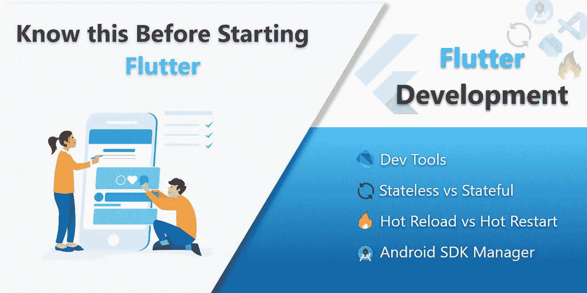
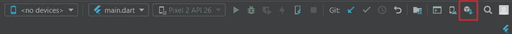
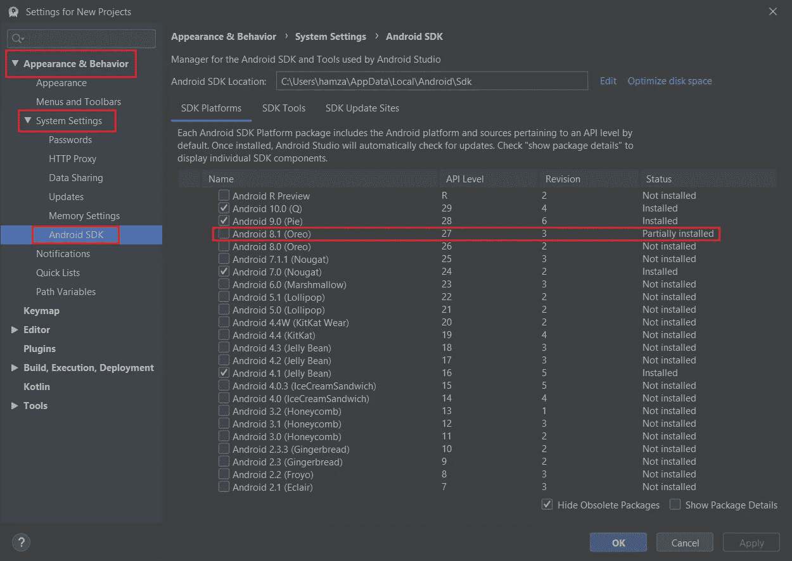
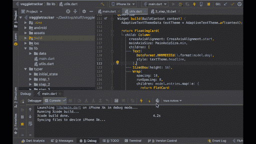
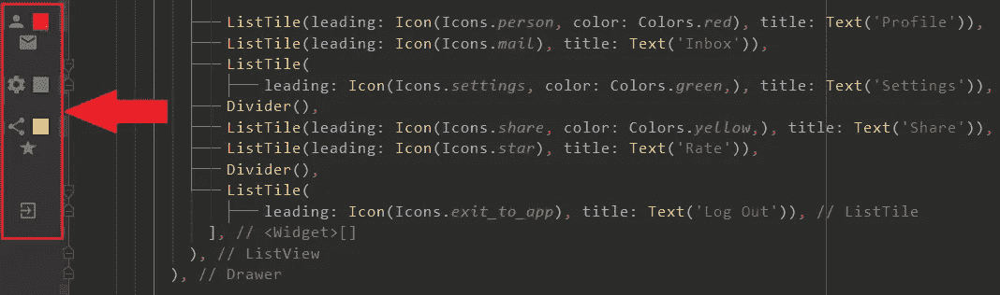

# 当我开始颤抖时，我希望我知道的事情

> 原文：<https://itnext.io/things-i-wish-i-knew-when-i-started-flutter-d43f09912449?source=collection_archive---------3----------------------->

我不会告诉你如何更好地编码或构建你的应用，这就是 Flutter 已经在为你做的。我在这里分享一些我希望在开始开发 Flutter 时就知道的技巧和事情。



我将分享以下主题，这样你就可以跳到与你相关的主题，否则你可以全部阅读😃

1.  **Android SDK 错误**
2.  **颤振开发工具**
3.  **无状态 vs 有状态小部件**
4.  **“构建函数返回 null”错误**
5.  **工具条中的图标&颜色**
6.  **热重装 vs 热重启**
7.  **仿真器或真实装置进行*颤振运行*或**

> 让我们开始吧…

# **Android SDK 错误**

您可能遇到的第一个错误或问题包括如下陈述:

*   不接受 Android SDK 版本(提到了某些版本)许可协议
*   需要新的 SDK
*   Android SDK 许可证状态未知

或任何其他声明，包括任何错误以及您提到的 SDK 版本。你需要做的就是:

1.  打开你的终端，输入

```
flutter doctor --android-licenses
```

2.按下 **Y** 键接受所有的许可

这将解决您的许可证不被接受的问题，如声明。如果不是呢？然后只需在 android studio 中打开 **SDK 管理器**



SDK 管理器按钮

或者，您也可以导航至:

**文件>设置>外观&行为>系统设置> Android SDK**



Android SDK 管理器

只需检查错误声明中提到的 SDK 的具体版本，然后单击应用，它将获得下载并帮助您解决此类错误。

> 提示:不要留下任何部分安装的 SDK，要么完全安装，要么删除它

# 颤振开发工具

DevTools 是一套用于 Dart 和 Flutter 的性能和调试工具。它目前处于预览版，但正在积极开发中。 *~flutter.dev*

> 访问 DevTools 的官方文档

## 你能用 DevTools 做什么？

以下是您可以使用 DevTools 做的一些事情:

*   检查一个 Flutter 应用的 UI 布局和状态。
*   诊断 Flutter 应用程序中的 UI jank 性能问题。
*   Flutter 或 Dart 命令行应用程序的源代码级调试。
*   调试 Flutter 或 Dart 命令行应用程序中的内存问题。
*   查看有关正在运行的 Flutter 或 Dart 命令行应用程序的常规日志和诊断信息。



DevTools 在运行

# 无状态与有状态小部件

当我开始开发 flutter 时，这是我最大的困惑。什么是无状态小部件？什么是有状态小部件？有区别吗？哪个更好？以及其他类似的问题。

它们都是小部件，所以要找出它们的区别，看看它们都有什么方法:

**无状态小部件**:你构建一个小部件，就是这样。

**有状态小部件**:您可以访问 initState 和 setState 方法。这些方法的存在使得您可以更新您构建的小部件的值(比如文本、高度/宽度等)。

假设你有两个房间，A & B，每个房间都有一个灯泡。房间 A 的灯泡总是亮着的，你睡觉前把它打碎，然后每天早上再换一个新的。在 B 房间，你可以简单地开关灯泡。所以，你的房间 A 是无状态的小部件，房间 B 是有状态的小部件，你不只是构建一个小部件，而是控制它的状态。

我希望你明白这一点，你可以改变一个部件的状态，如果它是有状态的，你不需要每次都重新构建它。而您不能更改无状态小部件的状态。就像，你每次都在安装新灯泡，而不是开关它。因此，

> 无状态小部件是不可变的，而有状态小部件是可变的

一般来说，总是使用无状态，直到你不能。

# “构建函数返回 null”错误

对于程序员来说，这有点像“小孩子的东西”,因为这个错误是由于大多数时候缺少 **return** 关键字造成的。

你的构建方法是这样的

```
@override
Widget Build(BuildContext Context) {//code here}
```

应该返回一些小部件，将建立和显示在您的屏幕上。这个构建方法的概念是这样的:

> 嘿构建函数！我给你这个小工具，请建立它，并返回给我*😊*

因此，如果你没有把 **return** 关键字放在你给它的任何小部件之前，它不会返回它，尽管它是构建好的，因此你可能会遇到这个错误。所以，确保你的构建函数中有这个顽固的词

```
@override
Widget Build (BuildContext context) {
       **return** Container();
}
```

> 把我的工具还给我！你这个白痴！

# 边栏中的图标和颜色

你在 Flutter 中编码时使用的每个图标或颜色都像这样放在旁边。



所以，你不需要在代码中搜索图标或者颜色。只要在侧面寻找它们，代码就会在前面。有帮助？

# 热重装与热重启🔥

O 凯！让我们面对现实吧。老实说，当我开始使用 flutter 时，我不知道热重装和热重启的区别。😅

这两个概念是这样的:

> 热重装==刷新应用程序
> 
> 热重启==重置应用程序

就是这样！如果你想刷新一个你已经做了改变的屏幕，比如容器的高度，或者把文本小部件向上移动一点，那么热重载就可以了。热重装只是刷新屏幕。它类似于 setState()。所以，如果你想看到你所做的改变，热重装！

但是，如果你想重置你的应用程序的状态，那么热重启是为你准备的。热重启初始化所有变量、函数和 initState()方法中的任何内容。

> G 一般来说，当你添加了一些资产、自定义字体、自定义图标、添加新包等时，建议使用**热重启**。

## 🔥快捷安卓工作室

热重装: **Ctrl + S** 或 **Ctrl + \**

热重启: **Ctrl + Shift + \**

> *Flutter 的热重新加载是有状态的，这意味着如果你在第五个屏幕，并且你已经调用了那里的 2-3 个 API 并且正在获取数据，那么你进行热重新加载时，它不会打开你的应用的第一个屏幕，而是会通过让你保持在同一个屏幕来刷新你的应用*

安卓开发者是什么样的😜

# 运行 Flutter 应用程序的仿真器或真实设备

许多新用户使用 Android Studio 并在模拟器上运行应用程序，并抱怨他们的笔记本电脑或 PC 速度很慢。😧

嗯，事情是这样的，如果你至少有 **8GB RAM** 和 **SSD** 或任何 **GPU** ，那么模拟器和 Android Studio 都很好，没有问题

但是，如果你有一台像我一样的笔记本电脑😅如果**没有 SSD** 或**没有足够的 RAM** 并且**没有 GPU** ，那么请在真实设备上运行您的应用程序并使用 VS 代码。拜托看在上帝的份上！

> 你的电脑爱你！它总是执行你分配给它的任务 *❤️*

仅此而已。我希望我能帮上点忙😧

if(yes)= > Clap()；

else = > HelpMeImprove()；

# 谢谢大家和# happyfluttering💙