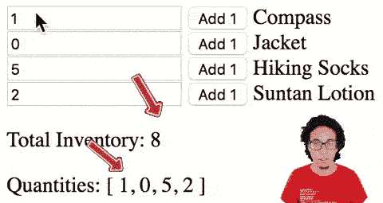
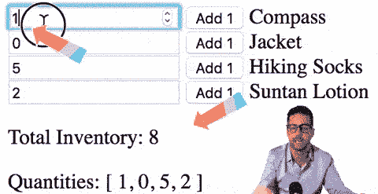
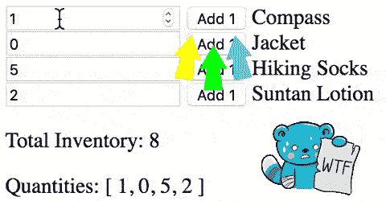
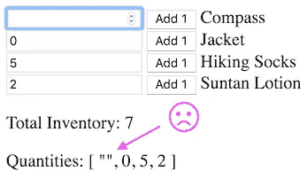

# 没有严格类型化语言可能出错的事情—第一部分

> 原文：<https://itnext.io/things-that-can-go-wrong-without-a-strictly-typed-language-d91d418a53a1?source=collection_archive---------0----------------------->

又名“好儿子”

> 第一部分:Vue 和 Elm
> 
> [第二部分:反应](https://medium.com/@l.mugnaini/things-that-can-go-wrong-without-a-strictly-typed-language-part-ii-8b239a85f35a)


我主要用 Elm 编写代码，但是前几天我看了一下 Vue，写了一个从教程视频中复制的小例子。**出了几个问题**。

这是一个例子:

这是一个工作演示:[https://codepen.io/lucamug/pen/aXdPqw](https://codepen.io/lucamug/pen/aXdPqw)

这是一个简单的应用程序，它发送一个 HTTP 请求，检索产品列表，将它们与库存数量一起列出，并让用户编辑数量或用一个显示库存总数的按钮将数量加 1:

…但是

# #1“总库存”不起作用

虽然“添加 1”按钮工作正常，但在输入字段中键入数字会产生错误的结果:



[密码笔](https://codepen.io/lucamug/pen/aXdPqw)

让我们键入 **123** 。什么？ **01123052** 从哪里来？我猜有人试图连接字符串，而不是添加数字。还要注意的是，数量列表现在是**[“1123”，0，5，2]** 。

在对 Vue 文档进行了一些研究之后，我发现了[这个](https://vuejs.org/v2/guide/forms.html#number):

如果您希望用户输入自动转换为数字，您可以将数字修饰符添加到您的`v-model`托管输入中

这听起来正是我们所需要的。让我们将它添加到脚本的第 3 行:

从

```
<input type="number" v-model="product.quantity">
```

到

```
<input type="number" v-model.**number**="product.quantity">
```

固定！

# #2“总库存”又破了！

现在输入数字可以了，但是如果我们删除所有的数字，我们又会遇到上面讨论的同样的问题。



[密码笔](https://codepen.io/lucamug/pen/zerQda)

好吧，也许我们应该重构计算总库存的函数。

让我们在第 20 行添加一个条件，如果数量不是一个数字，这个值将被忽略。

从

```
totalProducts() {
    return this.products.reduce((sum, product) => {
        return sum + product.quantity
    }, 0)
}
```

到

```
totalProducts() {
    return this.products.reduce((sum, product) => {
        **if (typeof product.quantity === "number") {
            return sum + product.quantity;
        } else {
            return sum;
        }**
    }, 0)
}
```

固定！

# #3“添加 1”按钮有时不起作用

如果在删除所有数字或键入非数字字符后按下该按钮，则该按钮不起作用:



[codepen](https://codepen.io/lucamug/pen/wNMbrW)

好了，是时候修理这个了。让我们将添加 1(第 4 行)的命令从

```
<button @click="product.quantity += 1">
```

到

```
<button @click="product.quantity = **Number**(product.quantity) + 1">
```

固定！

# Vue/Javascript 体验

也许这些问题来自于我对 Vue 知识的缺乏，但我期待一个更顺畅的体验。

也许使用神奇的双向数据绑定器`v-model`不是一个好的实践，我们应该使用单向绑定？

即使应用程序现在工作了，数量数组仍然包含字符串和数字的混合，这是将来其他问题的前奏。例如，当这些数据需要永久保存在某个地方时。



[密码笔](https://codepen.io/lucamug/pen/xMZNXy)

此外，上述所有问题都是使用应用程序检测到的，而不是由开发环境自动检测到的。它们很容易被发现并投入生产。

# 榆树经验

榆树版演示:【https://ellie-app.com/4yx6ZpH7w2Ra1 

这是代码。它由两部分组成，一个用于加载和初始化页面的小 html 部分，以及将编译成 Javascript 的 Elm 代码:

Elm 迫使我们考虑更多的案例，比如导致上述问题的案例。

数量是整数类型，所以不可能在其中存储任何字符串。

在保存之前，我们需要将从输入字段获得的字符串转换成整数。然后我们需要在页面中显示它之前将其转换回字符串。

在从字符串到整数的转换过程中，可能会出错，例如当字符串不包含有效数字时。同样在这种情况下榆树想从我们这里知道我们想如何处理这样的情况。

其中重要的一部分是，如上所述，当我们从字符串转换为整数时:

```
{ product
    | quantity = 
        Maybe.withDefault product.quantity
            (String.toInt newQuantity)
}
```

这段代码说:“如果用户输入了一个有效的号码，用新号码替换旧号码，否则保留旧号码”

Elm 版本不允许任何不可能的状态，所以它不允许删除输入字段中的所有数字，因为那不是一个有效的数字。这使得改变一位数变得困难。例如，这可以通过检查字符串是否为空并将其转换为 0 来解决。但是这里我们将进入与类型号输入字段相关的[问题](https://codepen.io/lucamug/pen/qgbyaE)的领域。

在任何情况下，总库存总是正确的，并且数量列表总是包含开箱即用的数字。

Elm 强迫我们考虑其他事情，例如 HTTP 请求失败的情况，但是这些超出了本文的范围。所以在 Elm 版本中，我们忽略了这个请求，只返回旧的产品列表，不返回命令:

```
GotProducts (Err _) ->
    ( products, Cmd.none )
```

# 关闭 HTML 元素

有一件事我很久没有做了，那就是编写 HTML，特别是关闭 HTML 元素。在 Elm 工作之前，我一直在使用 HAML、杰德和帕格。

在这个例子中工作让我想起了过去的美好时光，那时我打开一个

并关闭一个。

# 打字稿

虽然有几种类型输入错误会在 Vue 中产生运行时错误，但还有一些错误没有被检测出来。例如改变

```
<input v-model.number="product.quantity">
```

到…里面

```
<input v-model.number="product.quanity">
```

不显示任何错误，但应用程序被破坏(所有输入字段都是空的，在它们中键入什么都不会发生。按钮仍在工作)。

其他错误只会在界面上交互时显示，而不会在加载时显示。

在 Elm 中，上面的错别字会在编译时生成以下错误:

```
Detected errors in 1 module.
-- TYPE MISMATCH ----------------------------------------- Main.elmThe 2nd argument to `map` is not what I expect:84|                 products
                    ^^^^^^^^This `products` value is a:List ProductBut `map` needs the 2nd argument to be:List { a | id : Int, name : String, quanity : Int, quantity : Int }Hint: Seems like a record field typo. Maybe quanity should be quantity?
```

注意底部的“提示”部分。

这些问题大多来自 Javascript，但我认为 Vue 会对我们屏蔽这些问题。对于其他框架，这种体验会有所不同吗？TypeScript 或 Flow 能解决这些问题吗？请在下面留下您的评论。

如果您喜欢这篇文章，您可能会对第 2 部分感兴趣，在第 2 部分中，我使用 React 做了同样的练习:[https://medium . com/@ l . mugnaini/things-that-can-go-error-without-a-strict-typed-language-part-ii-8b 239 a 85 f 35 a](https://medium.com/@l.mugnaini/things-that-can-go-wrong-without-a-strictly-typed-language-part-ii-8b239a85f35a)

感谢您的阅读！