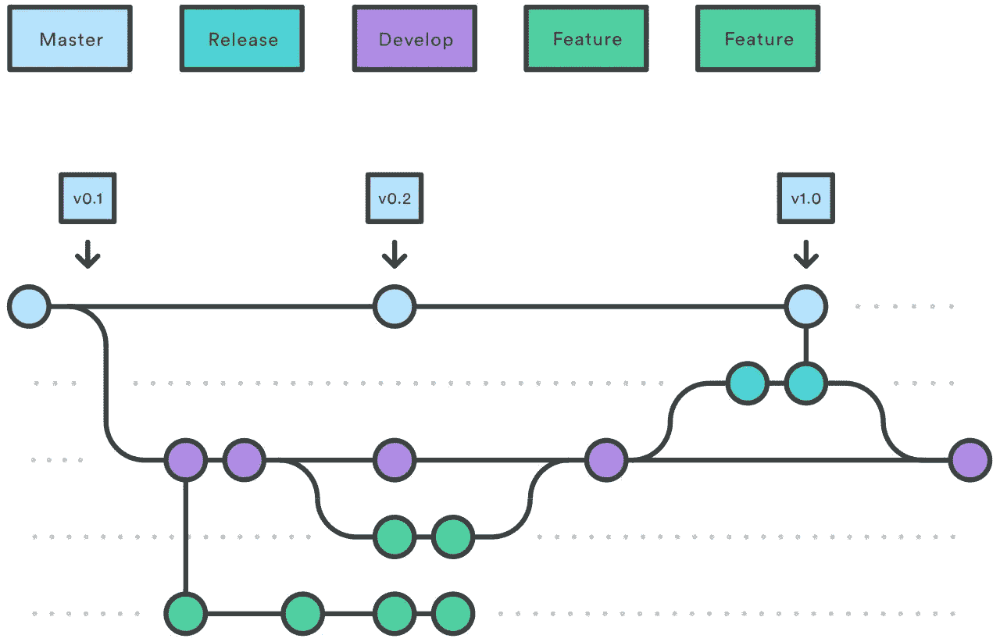
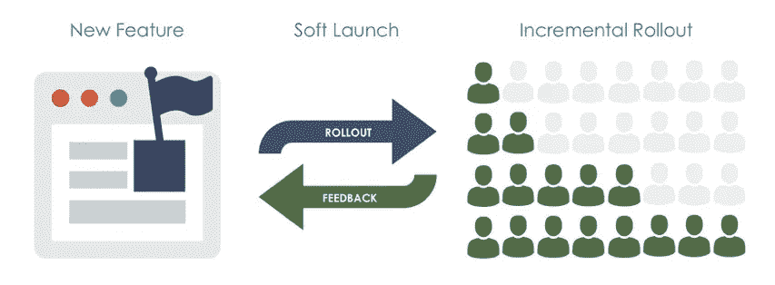
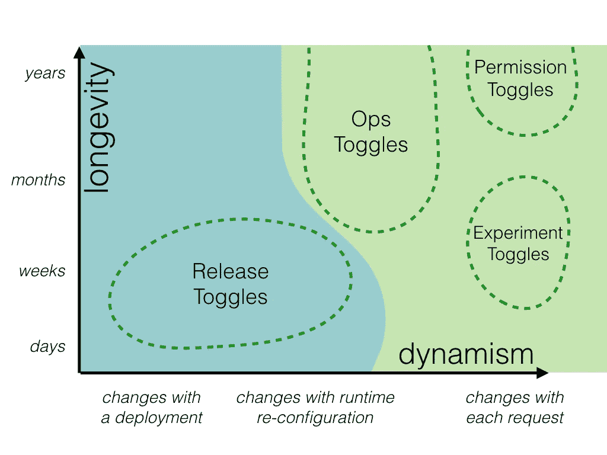
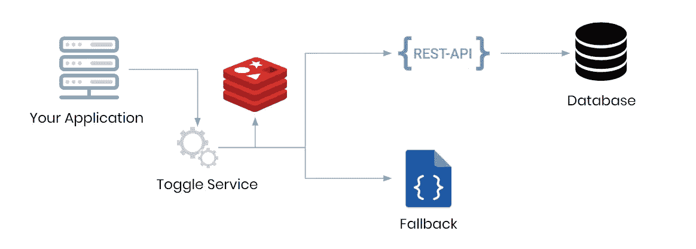
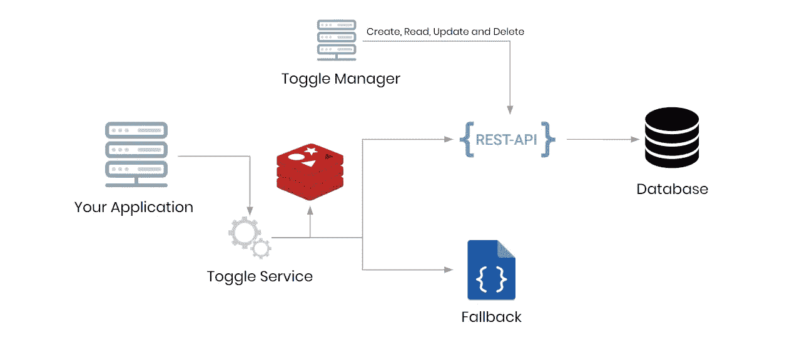
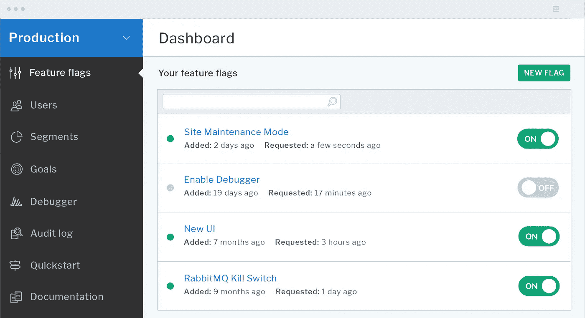
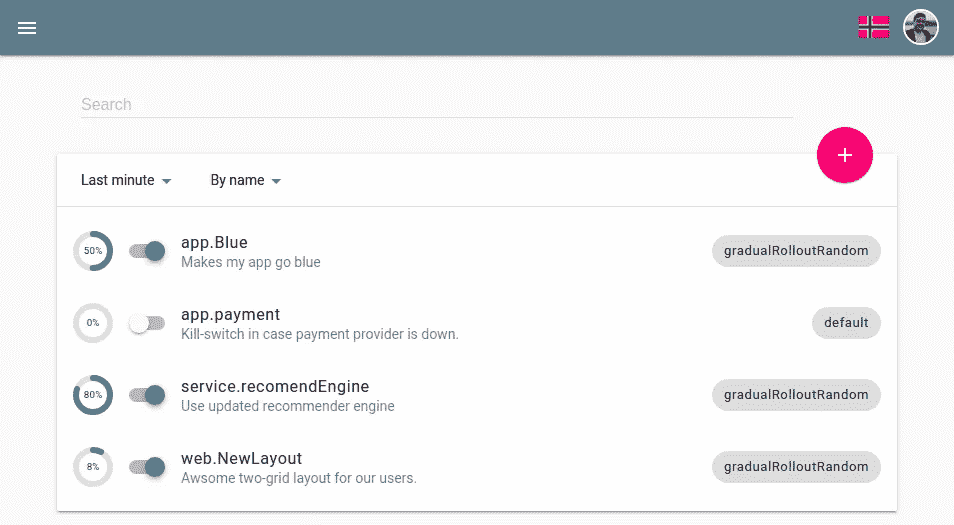
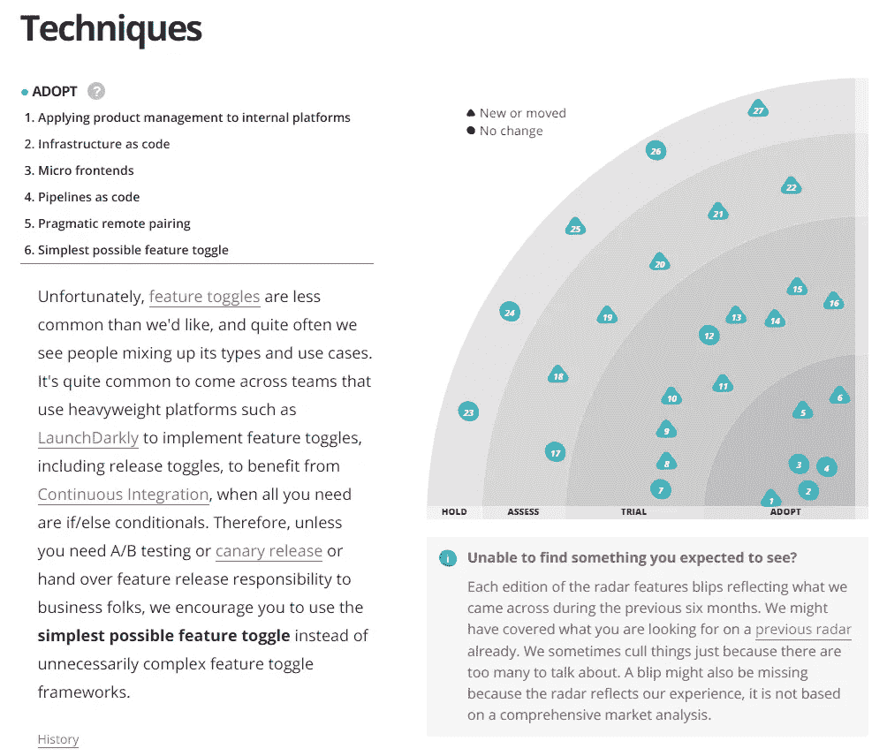

# 在我的应用程序中启用功能切换之前我希望知道的事情

> 原文：<https://itnext.io/things-to-think-before-enabling-feature-toggle-in-your-application-91880373a0ed?source=collection_archive---------4----------------------->

[Feature toggle(又名 Feature Flags)](https://martinfowler.com/articles/feature-toggles.html) 是软件开发中的一种技术，它试图提供一种替代方法来维护多个源代码分支，从而在不改变代码的情况下修改系统行为。

激活和取消激活特性可以保证在这个过程中间发生故障时有更好的响应时间，例如:在激活特性一段时间后，您通过日志记录仪表板注意到来自添加的新代码流的大量错误。监控权力是分散的，工程和产品团队也可以使用，确保在许多情况下响应时间比新部署快得多

经过多次体验，这篇文章的目的是在你的应用程序中创建特性切换之前，提出一些需要注意的要点。

## 切换类型

首先，了解当今存在哪些不同类型的触发器是很重要的

*   **Release Toggle:** 通常用于基于主干的开发，这种类型的 Toggle 提供了一种将未完成和未测试的功能投入生产的方法。代码是**随时可以部署**到生产中而没有副作用。预期寿命是几天。

Gitflow 发布分支由 [Atlassian](https://www.atlassian.com/br/git/tutorials/comparing-workflows/gitflow-workflow)

*   **实验 Toggle:** 用于测试一个理论，一般用于受控 A/B 测试。预期寿命是几天或几周，也就是理论测试结束的时候。

A/B 测试

*   **Ops Toggle:** 用于推出一项功能，并在少量用户部分进行测试，然后逐步发布给所有人。**预期寿命是**长寿(月/年)

软启动由[黑暗启动](https://launchdarkly.com/blog/soft-launches-using-feature-flags/)

*   **权限切换:**最常用于控制对某个功能的访问，例如只对特定用户发布的功能。预期寿命是长寿(岁)

网飞流媒体计划

这些不同的类型可以在该图中进行总结，该图表示为:Y 轴上是时间，X 轴上是如何激活或停用切换。

## **解决方案**

最困难决定是决定采用哪种解决方案，换句话说，您将如何调整您的代码以提供一种更简单的方式来启用或禁用功能，而不需要任何部署。

通常有两条路可以走:

*   **自制解决方案:**这种方法的最大优势是创建一个 100%符合您的用例的解决方案，下面是这种类型的应用程序通常如何工作的示例:
*   总之，您的应用程序查询一个名为 toggle service 的服务，该服务负责缓存 toggle，如果在缓存中找不到 toggle，则搜索它，然后搜索数据库。如果出现问题，你需要提供一个本地或托管文件(S3 或类似文件)的回退，所有切换状态通常是**禁用。**

*   或者，您可以包括一个管理这些切换的前端:

*   **现成的解决方案:**经过一段时间的推广 toggles，一些现成的工具被创造出来以满足这种需求，下面是一些现成的解决方案:[launch darky](https://launchdarkly.com/)、 [fflip](https://github.com/FredKSchott/fflip) 、 [Firebase Remote Config](https://firebase.google.com/docs/remote-config) 和 [Unleash](https://unleash.github.io/) ，其中最完整也是付费的是**launch darky**。

启动深色仪表板示例

*   在分析这些工具时，最重要的事情是，如果这些工具具有您计划要做的所有类型的切换，无论它是否具有针对您项目技术的 SDK，或者集成必须通过 REST 来完成，这个因素都会大大增加实现的复杂性。
*   同样重要的是，价格是一个决定性因素，在这种情况下，我推荐 [Unleash](https://unleash.github.io/) :是一个非常完整的解决方案，拥有官方 SDK，适用于:Java、Node.js、Go、Ruby、Python 和。而且它是开源的。

释放仪表板

## 响应时间

在此处建议的所有解决方案中，都实施了缓存解决方案，做出这一决定非常重要，因为在出现故障时，如果您的应用程序崩溃，这一点将会“着火”。

问问自己:

*   用户在使用应用时的平均使用时间是多少？
*   切换的缓存时间是多少？
*   如果应用程序崩溃，您的哪个监控会这么说？

根据您正在开发的项目的类型，所有这些问题都可能发生巨大的变化，并且还涉及到在出现问题时改善响应时间，并且在出现问题时不会影响用户体验。

## 用户体验

这个主题根据您正在创建的项目的类型有很大的不同，但是对于任何应用程序，您都可以遵循一个重要的规则

> 当使用用户可见的任何现有功能时，激活和去激活切换应该永远不会干扰用户体验

特别是在前端项目中，你可以有一个长的用户流，有三种方法来获取切换的状态，换句话说，如果他们被激活或没有。

*   **登录时:**如果您的初始页面没有任何特殊内容，并且 UX 总是从登录页面开始，通常这是获取切换状态的最佳时间。
*   **页面加载时:**如果您的页面在初始加载时没有登录，并且有重要功能，此时您将进入切换状态。

Amaro.com 加载页面示例

*   **每次需要的时候:**这种方法特别适合带有独立端点的 REST API。这种方法的主要问题可能是重复。有时，在使用基于组件的架构的前端项目中，可能有父子组件需要查看与切换相同的状态，为了实现这一点而不是每次都“重新提取”切换，必须在应用程序中进行定制实现，这增加了功能的复杂性

## 我的两分钱

以下是我的两点看法，以及我过去创作 toggles 的经验:

*   toggle 是一种技术性债务，有时你必须删除它，在现实生活中，随着时间的推移，它会变得更加“昂贵”。
*   在开始实施之前，定义肘节的类型和预期寿命。
*   移除切换时，建议不要重构流。
*   放置切换时，不要触及旧的业务逻辑。
*   测试应该覆盖代码变化，即使它们是暂时的。
*   不要忘记什么类型的用户会使用特性切换应用程序，用户也就是开发人员和其他人，比如产品负责人、产品经理、Scrum Master。等等…)，给他们一个简单的方法来理解什么是特征切换，存在什么类型，它们是做什么的，最重要的是它们如何激活或去激活。
*   跟随最新的[技术雷达关于技术](https://www.thoughtworks.com/radar/techniques)，尽可能保持你的特性切换简单

技术雷达 2020