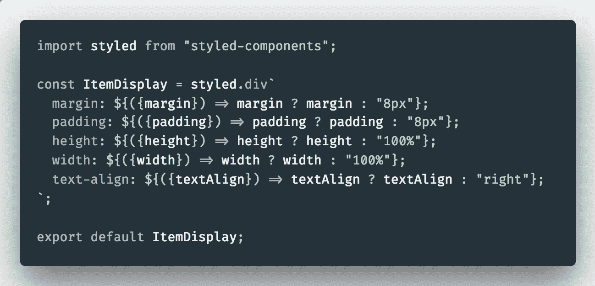
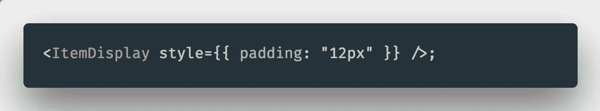
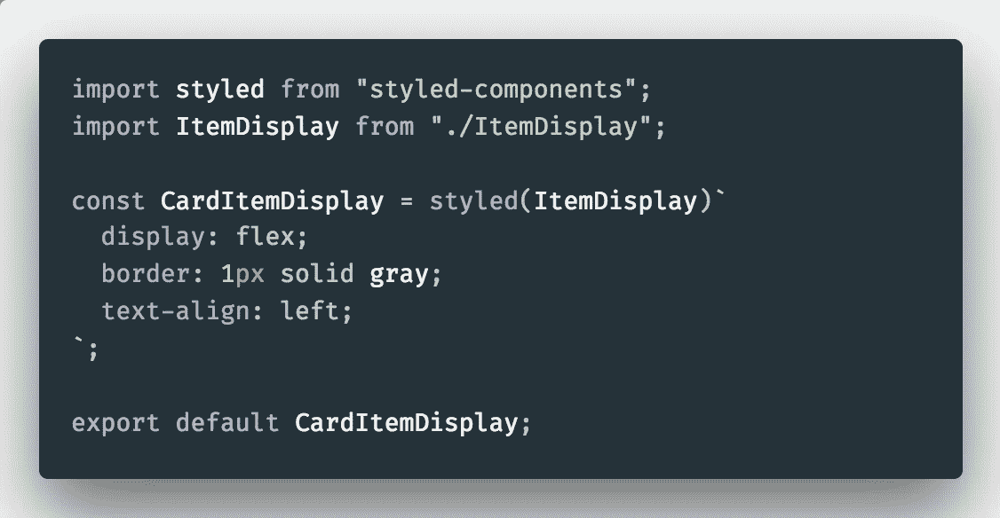
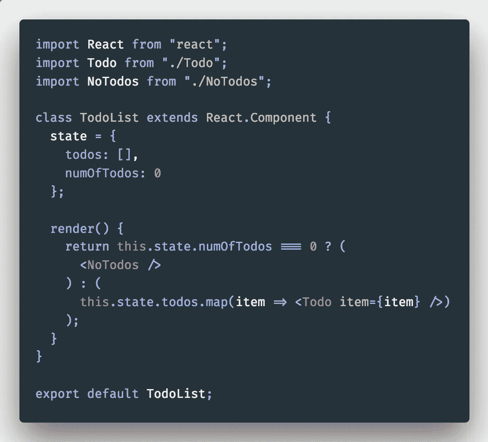
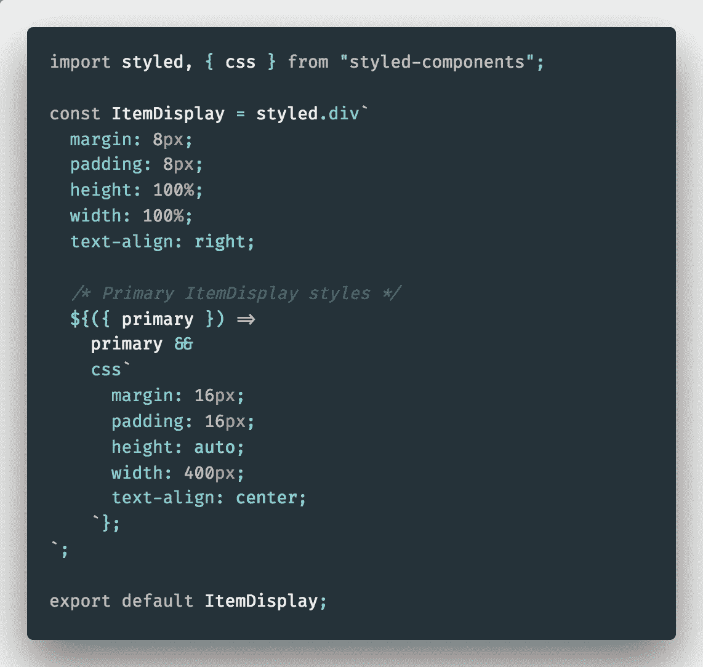

# 在样式组件中思考

> 原文：<https://itnext.io/thinking-in-styled-components-e230ea37c52c?source=collection_archive---------3----------------------->

PB，思考 JS 中的 CSS

一年多以前，我在格蕾丝·赫柏学院为我的 10 分钟技术演讲寻找一个主题。对我们来说，这是一种深入探讨某个话题并作为新程序员练习说话的方式。就在那时，我偶然发现了来自 React Conf 的[麦克斯·斯托伊伯的演讲](https://www.youtube.com/watch?v=jjN2yURa_uM)；我们刚刚开始学习 React，我认为这种新的样式范例听起来非常有趣。

当我开始在[破译](http://deciphernow.com)时，我很兴奋地发现他们即将把他们的代码库从 SCSS 转移到样式化组件！从那时起，我就有了专门处理样式化组件的特权。DX 是一种乐趣，我认为这将是一个完美的时间来写一些我在过去一年中发现的事情。

本文假设您对样式化组件有所了解。如果你对他们不熟悉，我会听听[和](https://www.youtube.com/watch?v=jjN2yURa_uM)的对话，然后[查看他们的文档](https://www.styled-components.com/)。

# 基于组件的体系结构

顾名思义，styled-components 允许我们把样式看作…组件。🤯这就要求我们转变对待 CSS 的方式。这意味着我们可以从组件架构最佳实践中吸取经验并加以应用。Max 已经写了一篇关于这个的很棒的文章，但是我想分享一些我最近一直在思考的关于组件的想法。

首先，我们先举个例子。拿这个`ItemDisplay`组件来说:

## 单一责任

这个组件的道具表明它可以有一堆不同的状态，缺点是这样的组件鼓励开发人员对它进行变异，以至于它可能无法反映组件的初衷。因此，尽管我们*可以*创建极其灵活的组件，但这并不一定意味着我们应该这样做，因为这违反了单一责任原则:

> ****单一责任原则*** *是一条计算机编程原则，该原则规定每个模块或类应该对软件提供的功能的单一部分负责，并且该责任应该完全由该类封装。它的所有服务都应严格符合这一职责。—* [*维基百科*](https://en.wikipedia.org/wiki/Single_responsibility_principle)*

*当然，我并不是说你不应该为个人风格规则编写道具，这只是我通常试图避免的一种模式，我发现我几乎总能想出一个更好的解决方案，比如[扩展组件](https://www.styled-components.com/docs/basics#extending-styles)或者使用内联风格进行非常小的调整。关于样式化组件，需要知道的一件重要事情是，它们总是会通过[已知的 HTML 属性](https://github.com/emotion-js/emotion/blob/master/packages/is-prop-valid/src/props.js)传递给呈现的标记，比如`style`。你总是把它作为逃生出口。*

**

*使用内嵌样式进行细微调整*

**

*当您有多个规则时，扩展组件*

*一个组件应该做一件事，而且应该做好。将样式组件保持在大约 50 行或更少对我们来说效果很好。当它由于许多不同的状态或针对子元素而变得更大时，最好将认知复杂性保持在最低水平，并将组件分解成更小的块。*

## *包装*

*这更像是一个面向对象的概念，但我认为它在这里也有含义。一个组件代表一个接口，它允许开发者使用它的功能，而不需要知道实现的细节。它不公开内部函数、变量或状态的细节。*

*然而，`ItemDisplay`组件公开了所有的实现细节。封装是一个非常强大的工具，它让我们抽象出技术上的东西来创造一个更加人性化的体验。好好利用！*

## *复用性*

*基于组件的架构的一个潜在危险是，尽管它鼓励可重用性和单一责任，但它可能导致其他问题。如果我们设计的东西太过可重用，最终会使我们的代码不可读。我试着仔细考虑组件的可重用性，我发现问自己以下问题很有帮助:*

1.  *已经有我可以重用或扩展的原始组件了吗？*
2.  *组件是否有非常具体的用例？是否应该硬编码来满足这种情况？*
3.  *它需要在整个应用程序中重用吗？*
4.  *它需要能够在任何环境下工作吗？(比如当我在为我们的[组件库](https://github.com/DecipherNow/gm-ui-components)设计东西的时候。)*

*简而言之，不要为了好玩而默认让东西可重用，因为有权衡。把东西做得越复用不一定越好。*

*在 Decipher，我们倾向于将原始的 UI 组件放在一个单独的库中，将应用范围内的组件放在一个顶级目录中，将一次性组件放在呈现它们的容器组件附近。*

## *识别离散的用户界面状态*

*最后，当创建一个组件时，开始考虑一个组件需要满足的每个状态是有帮助的。例如，可能那个`ItemDisplay`组件有一个默认状态和一个主要状态，您需要基于这两个状态派生样式。*

*我们可以再次将此与常规 ol' React 组件开发进行比较，即核心状态与派生状态的概念:*

***核心状态—** 表示用户界面所需的最小状态表示。*

***派生状态—** 可以从核心状态派生的任何状态*

*为了说明这一点，我们来看一个`TodoList`组件。在 state 中，我会保存一个包含所有 todos 的数组。然后假设您必须根据数组中的项目数量呈现一些不同的 UI。这里有一个非常糟糕的方法:*

**

*👎*

*我很确定我们中没有人会将 todo 的数目保持在状态中，特别是因为*我们永远不会从数组*中独立地改变那个数目。你可以通过计算数组的长度得到 todos 的数量。拥有这种“重复状态”意味着您需要确保同时更新两者，并在每一步保持它们同步。*

*在样式领域，我认为类似的想法是将离散的 UI 状态视为核心状态(比如我们的`ItemDisplay`的`primary`状态)，并将组成该 UI 状态的所有样式声明视为派生的。换句话说，派生的状态由单独的样式规则(高度、宽度、边距等)组成。).您不应该能够直接编辑该派生状态，因为它依赖于 UI 的状态。作为开发人员，想要完全控制组件的每一个方面是很诱人的，抵制这种冲动！*

*这里有一个更“面向状态”的`ItemDisplay`可能是什么样子的例子。实现细节(样式规则)被封装，唯一的接口是一个`primary`道具。我更喜欢保持个人风格规则的整洁，我认为这样会产生更干净、更易读的代码。我可以确切地看到在这个组件的两个离散状态中应用了什么样式:*

**

***换句话说，样式声明应该从 UI 状态“派生”而来。***

*样式组件是一个强大的工具；希望这能给你一些充分利用它们的想法！*

*以下是一些资源:*

*[风格化组件:在基于组件的系统中实施最佳实践](https://www.smashingmagazine.com/2017/01/styled-components-enforcing-best-practices-component-based-systems/)*

*[风格化组件的本质](https://blog.elpassion.com/styled-components-nitty-gritty-2d74b8690ef8)*

*[以风格化的组件走向未来](https://medium.com/styled-components/with-styled-components-into-the-future-d1d917e7c22c)*