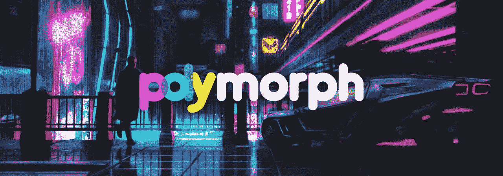
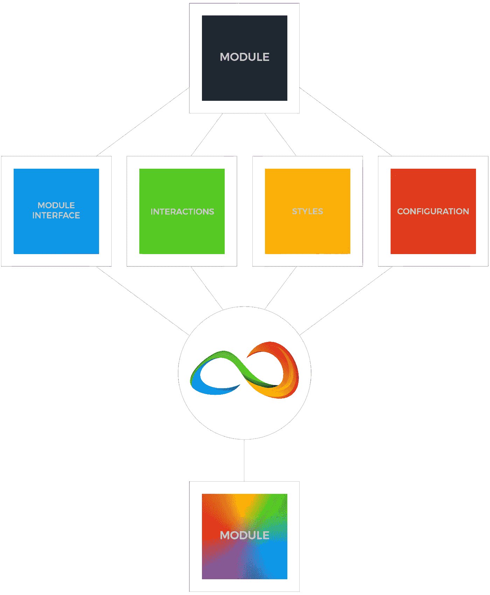

# 将 BEM 视为一种 UI 理念，而不是 CSS 命名惯例

> 原文：<https://itnext.io/thinking-of-bem-as-a-ui-philosophy-instead-of-a-css-naming-convention-9727e2cf9328?source=collection_archive---------4----------------------->


边界元法是一个非常好的概念，因为它以一种非常可行的方式解决了一个非常现实的问题。它有很好的个性，只是很不幸很丑。作为一种 CSS 命名惯例，你可以从 BEM 学到很多关于如何构造你的 ui，即使你不使用 CSS 来设计样式。这就是我喜欢它的地方，因为它帮助塑造了我的思维方式，它可以帮助塑造我们整体开发的方式，而不仅仅是在造型方面。

考虑一个折叠式 UI 元素。让我们考虑像 XML/HTML/JSX 这样的标记语言。标记形式的手风琴的理想表现形式是什么？它肯定是这样的:

```
<Accordion>
  <Panel active>
    <Title />
    <Content />
  </Panel> <Panel>
    <Title />
    <Content />
  </Panel>
</Accordion>
```

现在，没有 BEM 的暗示，我们已经可以提出这个例子有一个外部父代`Block` ( `Accordion`)，子代`Elements` ( `Panel`，`Title`和`Content`)，我们可以把`active`属性看作一个修饰符。这是一个本宾果。我应该能够以这种方式考虑任何 UI 元素。BEM 作为一种 CSS 命名惯例如此有效的原因不是因为一些很酷的 CSS 东西，而是因为它迫使 HTML 以一种明智的方式构造，这允许你以一种新的眼光来看待 ui。现在，您只有块、元素和修饰符，而不是父 div 和嵌套的子 div 以及各种类名。

当使用 BEM 命名约定将上面的伪代码写成 HTML 时，它看起来类似于:

如果遵循得当，使用 BEM 创建一个干净且结构良好的 DOM 树是非常容易的。作为一种哲学，它有如此大的潜力，以至于我真的不能相信它表现为一个 CSS 命名约定而不是一个成熟的框架，或者类似于类似于[原子设计](http://bradfrost.com/blog/post/atomic-web-design/)的某种高级约定(尽管我猜它是相似的)。

通过用 BEM 术语考虑 UI，不管使用什么技术，我们都可以开发具有更友好的 API 的工具，使我们能够更容易地渲染、设计 UI 组件并与之交互。

# 渲染组件

如果我使用 React 之类的东西来呈现我的 ui，这些都不会改变。我仍然应该创建 ui，同时考虑块、元素和修饰符，而不是父 React 组件和嵌套子组件。同样，我在构建 HTML UIs 时不应该考虑 div，我在构建 React UIs 时也不应该考虑 React 组件(至少在创建[表示组件](https://medium.com/@dan_abramov/smart-and-dumb-components-7ca2f9a7c7d0)；容器组件不适用，因为它们不呈现标记)。

我们当然可以使用 React 来创建 BEM HTML 类似于:

…这真的很好，只是不太理想。如果我们知道我们考虑的是块和元素，而不是 div，为什么不努力做到这样呢:

这对人类来说可读性更强(这就是为什么我认为边界元法的概念如此有效；它帮助人类更容易地解释 DOMs)。

## 输入:Lucid

> [Lucid](https://github.com/One-Nexus/Lucid) 是一套用于渲染 BEM DOM 元素的高阶 React 组件


[在 Github 上查看 Lucid](http://---      ---  Twitter | Github)

上面的例子是使用 Lucid 时的有效代码。查看这些文章以及 [Lucid Github 页面](https://github.com/One-Nexus/Lucid)了解更多信息:

*   [使用 React + Lucid 创建 BEM 手风琴](https://medium.com/@ESR360/using-react-lucid-to-create-a-bem-accordion-c7f8475d38a4)
*   [多态&反应(反应+ JavaScript 样式)](https://medium.com/@ESR360/polymorph-react-react-bem-javascript-styles-8f28a77a43b6)

# 与组件交互

如果没有任何工具公开 BEM like API 来与 DOM 元素交互，要使上面 HTML 示例中的 accordion 工作，下面的 JavaScript 就足够了:

…同样，这段代码并没有什么问题，但是因为我们是用边界元法来思考的，所以更好的改写应该是这样的:

…如果你把它分解开来，它会做完全相同的事情，只不过使用了一个与 BEM 一致的更加人性化的 API。

## 输入:sQuery

> sQuery 是一个用于与 BEM DOM 元素交互的库


[查看 Github 上的查询](https://github.com/One-Nexus/sQuery)

上面的代码可以用 sQuery 实现。查看这些文章以及 [sQuery Github 页面](https://github.com/One-Nexus/sQuery)了解更多信息:

*   [使用 sQuery 创建一个带有 BEM 标记的手风琴](https://medium.com/@ESR360/using-squery-to-create-an-accordion-with-bem-markup-93340c4c676e)
*   [用 sQuery+polymer form 创建手风琴](https://medium.com/@ESR360/creating-an-accordion-with-squery-polymorph-a7991a8f5e3c)

# 样式组件

## 使用 Sass

在没有任何预处理器的情况下，用 CSS 来设计 BEM 标记就像在 HTML 中使用它一样难看。使用普通的 Sass，您可以通过使用&符号获得相当好的结果:

基本样式很好，但是当我们开始需要更多的逻辑时(比如根据父`panel`元素上的修饰符来设计`content`元素的样式),它会变得不那么漂亮:

使用`&`的目的是避免重复关键字，保持代码干燥。在没有引入任何复杂需求的情况下，我们已经不得不打破这个规则。你可以做一些事情来处理这个问题，但是从长远来看，这样做只会增加代码的冗长。更好的方法可能是使用 mixins 来处理您需要的行为，留给我们一个 API，类似于:

它仍然是常规的 Sass，没有引入任何新的范例，并且与 BEM 保持一致。实现相同目标的一种更简单的方法是:

从遵循级联规则的 Sass 的角度来看，这可能是从 DX 的角度来看可能得到的最好结果。

**回车:单元格**

> [单元格](https://github.com/One-Nexus/Cell)是一个 Sass 库，用于样式化 BEM DOM 元素


[查看 Github 上的单元格](https://github.com/One-Nexus/Cell)

上面使用的两个例子都可以使用 Cell。查看 [Cell Github 页面](https://github.com/One-Nexus/Cell)了解更多信息。

## 使用 JavaScript

使用 JavaScript 以符合 BEM 的方式处理样式并不需要与 Sass 中的方式有太大的不同(至少后一个例子是这样的):

…您可以看到它与前面的 Sass 示例是多么相似——一行一行都是一致的。这不是巧合，只是当你把你的需求简化成像 BEM 这样的哲学时，不管你使用什么技术，你做事情的方式最终都是相似的。由于 Sass 映射实际上与 JavaScript 对象相同(出于所有意图和目的)，所以它们看起来完全相同是有道理的。

这个对象可以被提供给一个函数，这个函数也接受一个 BEM DOM 元素或者元素的节点列表，瞧；DX-delight…

**输入:多形态**

> 是一个 JavaScript 工具，用于设计 BEM DOM 元素的样式



[在 Github 上查看变形](https://github.com/One-Nexus/Polymorph)

polymer 是一个很好的工具，用于设计遵循 Synergy/BEM 命名约定的 DOM 元素，查看[polymer Github 页面](https://github.com/One-Nexus/Polymorph)和以下文章了解更多信息:

*   [使用多形字设计 BEM 手风琴样式(JavaScript 样式)](https://medium.com/@ESR360/using-polymorph-to-style-a-bem-accordion-javascript-styles-2fd4ca1898b3)
*   [用 sQuery+polymer form 创建手风琴](https://medium.com/@ESR360/creating-an-accordion-with-squery-polymorph-a7991a8f5e3c)
*   [多态&反应(反应+ JavaScript 样式)](https://medium.com/@ESR360/polymorph-react-react-bem-javascript-styles-8f28a77a43b6)

# 结论

我们已经研究了处理 UI 组件的渲染、交互和样式的工具，同时沿着 BEM 的思路进行思考。当你考虑到 UI 组件中的所有东西时，差不多就是这样了。还记得我以前说过，我不相信 BEM 范式仅仅表现为 CSS 命名约定，而不是成熟的框架吗？这就是我决定实现它的原因([而我只花了 4 年](https://medium.com/@ESR360/today-i-finished-a-side-project-i-started-4-years-ago-and-all-i-have-to-show-for-it-is-this-shitty-dd573099f7dc)就走到了这一步)。

## 引入协同效应

> Synergy 是一个为 React-DOM 项目构建模块化、可配置和可伸缩的 UI 组件的框架


[在 Github 上查看 Synergy](https://github.com/One-Nexus/Synergy)

[Synergy](https://github.com/One-Nexus/Synergy) 本质上是一个工具箱，由我们在本文中看到的工具组成。使用 Synergy，您可以创建 Synergy 模块，用技术术语来说，这些模块实际上就是 React 组件(用 Lucid 创建),用于绑定样式(使用 Polymorph/sQuery)。Synergy 模块被设计为单一导入/导出，一切都是现成的，正如我制作的这张很酷的图形所强调的:



使用 Synergy，我们可以将上面使用的所有想法结合起来，从头开始创建一个实用的、有风格的手风琴:

> 除了*块*被称为“模块”和*元素*被称为“组件”(即[协同命名约定](https://github.com/One-Nexus/Synergy-Front-End-Guides/wiki/Synergy-Values#3-naming-convention))之外，下面使用的约定与 BEM 相同

在没有任何其他工具的情况下，导入这个手风琴并用`<Accordion {...props} />`渲染，将会输出一个具有风格和功能的手风琴。尽管 BEM 是一种 CSS 命名约定，并且从技术上讲没有在上面的例子中使用，我仍然认为上面的例子是 BEM 哲学的结果。


[Twitter](https://twitter.com/esr360) | [Github](https://github.com/esr360)