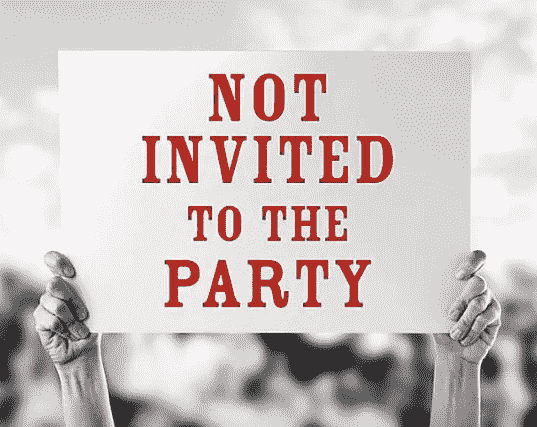

# 第三方 Cookies 和认证

> 原文：<https://itnext.io/third-party-cookies-authentication-769a08709330?source=collection_archive---------2----------------------->

长话短说:年复一年，浏览器越来越保护我们的隐私和安全。副作用之一是第三方 cookies 开始被广泛屏蔽。

简而言之:**第一方 cookie**是由被访问域创建的 cookie。**第三方 cookie**是由不同于被访问域的域创建的 cookie。让我们考虑一个例子。你访问 awesome.com 的**，使用来自 my.plugin.com**的集成插件(它被集成为一个 iframe)。来自**awesome.com**、**static.awesome.com**的 cookie 被视为第一方 cookie，而来自**my.plugin.com**、**plugin.com**的 cookie 被视为第三方 cookie。****

阻止详细信息:

*   [全面的第三方 Cookie 拦截和更多功能](https://webkit.org/blog/10218/full-third-party-cookie-blocking-and-more/)
*   Chrome [用 *SameSite=None* 拒绝不安全的 cookie](https://chromestatus.com/feature/5633521622188032)从 Chrome 80 *开始。*

# 证明

cookies 如何与身份验证相关联？你的应用程序可以是一个独立的应用程序，它总是作为第一方使用，但你的应用程序也可以是另一个系统的插件(例如，特雷罗加电，JIRA 插件等)。在这种情况下，浏览器会将您的应用视为第三方。

有两种常见的身份验证方法。让我们回顾一下它们以及它们如何与第三方 cookies 一起工作。

## 无状态认证

通常它和饼干没有任何共同之处。出于认证原因，在每个请求中添加令牌。它可以作为标题或查询参数添加。

适用于第一方和第三方，因为它根本不使用 cookies。

## 状态认证

它是通过会话实现的。在 cookie 中设置会话 id 的常见方法，以便能够在每次请求时自动发送它。作为替代选项，会话 id 可以作为查询参数传递。

如果查询参数用于会话 id，那么 cookie 就没有任何问题(因为您不使用 cookie)。但是仍然有问题，因为会话 id 将是可见的，更容易被[会话固定攻击](https://owasp.org/www-community/attacks/Session_fixation)，可以被代理记录，因为它是请求 url 的一部分。

如果使用了 cookies，那么如果你的应用是第三方的，你可能会有问题(你被集成到另一个域的另一个应用中)。因为您可能无法设置自己的会话 cookies。

## 怎么修？

如果可能，那么**基于令牌的身份验证**进行迁移。通常，集成提供商(如特雷罗、JIRA 等)会提供一种获取、存储和刷新短期令牌的机制。但有时它有问题或不适合你的系统。

另一个选择是修复你的 cookies(目前这是可能的)。

1.  使用 OAuth 进行用户验证。同意屏幕应在一个单独的窗口中打开(由于[点击劫持](https://interceptd.com/what-is-click-hijacking-and-how-does-it-work/)攻击，默认方法)。在这种情况下，OAuth 也将在该窗口中完成，会话 cookie 将被设置为第一方 cookie。**实际上，cookie 被设置为第一方的事实将允许你作为第三方使用你的会话 cookie(现在在 Safari 中实际上是这样工作的)。**
2.  正确配置您的 cookie。您的会话 cookie 应该包含 *SameSite* 属性。如果该属性设置为*无*，则必须设置*安全*标志。否则会被屏蔽。

> 在没有“SameSite”属性的情况下，设置了与位于<url>的跨站点资源相关联的 cookie。它已被阻止，因为 Chrome 现在只在跨站点请求设置了“SameSite=None”和“Secure”的情况下提供 cookies。您可以在应用程序>存储> cookie 下的开发工具中查看 cookie，并在<url>和<url>查看更多详细信息。</url></url></url>

# 如何测试 cookies 是否受支持？

显示需要 cookies 支持的占位符页面是一种常见的做法。但是要适当的表现出来。如果你谷歌一下如何测试，你很可能会找到下面的代码片段:

但实际上它现在对第三方不适用(至少在 Chrome 上)。它适用于第一方案件。代码片段可以稍加调整，以支持第三方的情况(看起来很笨拙，但它的工作):

此外，如果使用 OAuth 流，那么最好在 OAuth 完成后运行该检查。在这种情况下，完整的 OAuth 可以解锁您的第三方 cookies。

# 存储器存取

它与身份验证无关，但仍与阻止第三方访问有关。一旦第三方 cookies 被阻止，对本地和会话存储的访问也会被阻止。在这种情况下，我强烈建议预见这种情况，并准备好退回到“内存存储”。下面是一个简单的例子:

# 进一步阅读

*   [第一方和第三方 Cookies 有什么区别？](https://clearcode.cc/blog/difference-between-first-party-third-party-cookies/#first-party-cookies)
*   [全面的第三方 Cookie 拦截和更多](https://webkit.org/blog/10218/full-third-party-cookie-blocking-and-more/)
*   [关于第三方 Cookies 你需要知道的一切](https://cookie-script.com/all-you-need-to-know-about-third-party-cookies.html)
*   [拒绝不安全的 same site = None cookie](https://chromestatus.com/feature/5633521622188032)
*   [Chromium-same site 更新](https://www.chromium.org/updates/same-site)
*   [谷歌将“逐步淘汰”Chrome 中的第三方 cookies，但不是在两年内](https://www.theverge.com/2020/1/14/21064698/google-third-party-cookies-chrome-two-years-privacy-safari-firefox)