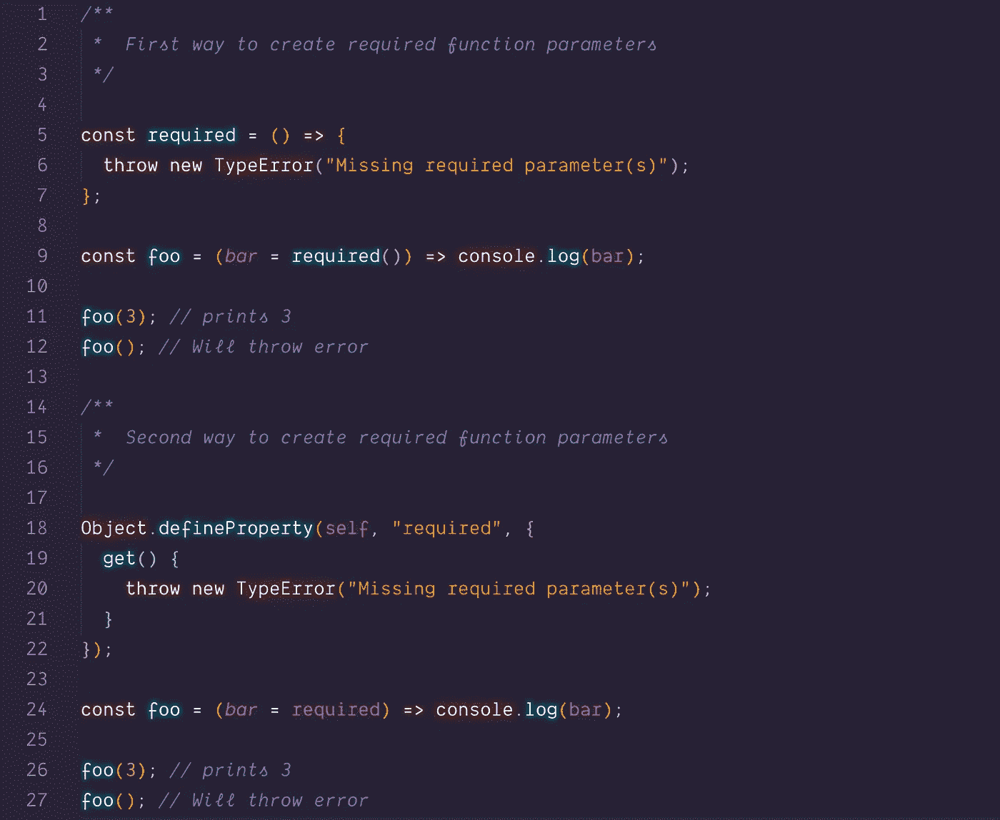
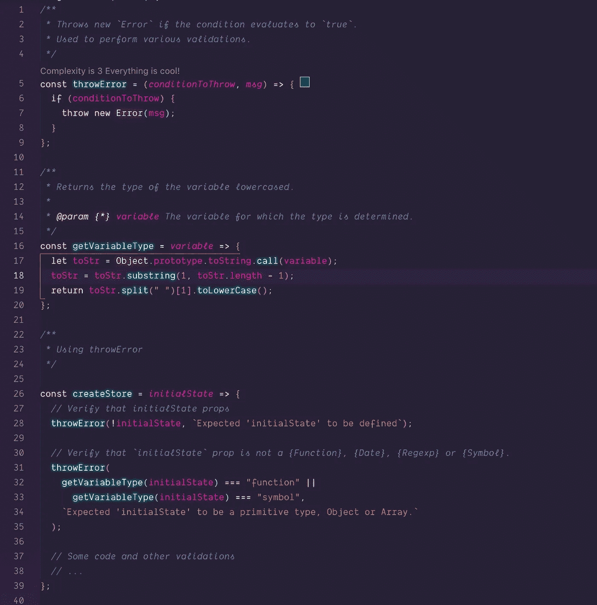
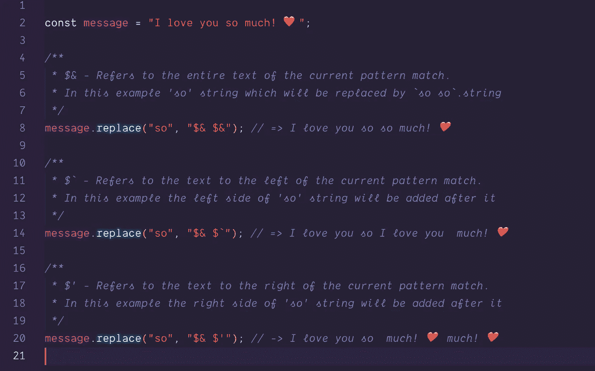
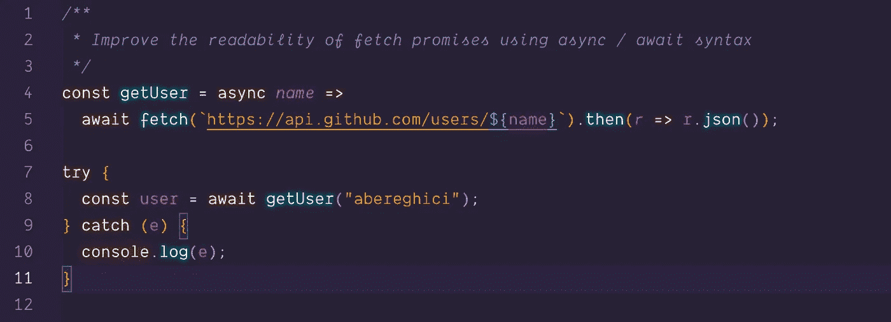
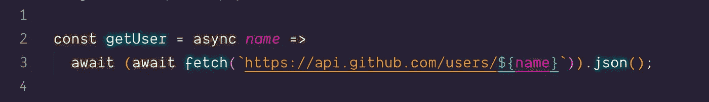
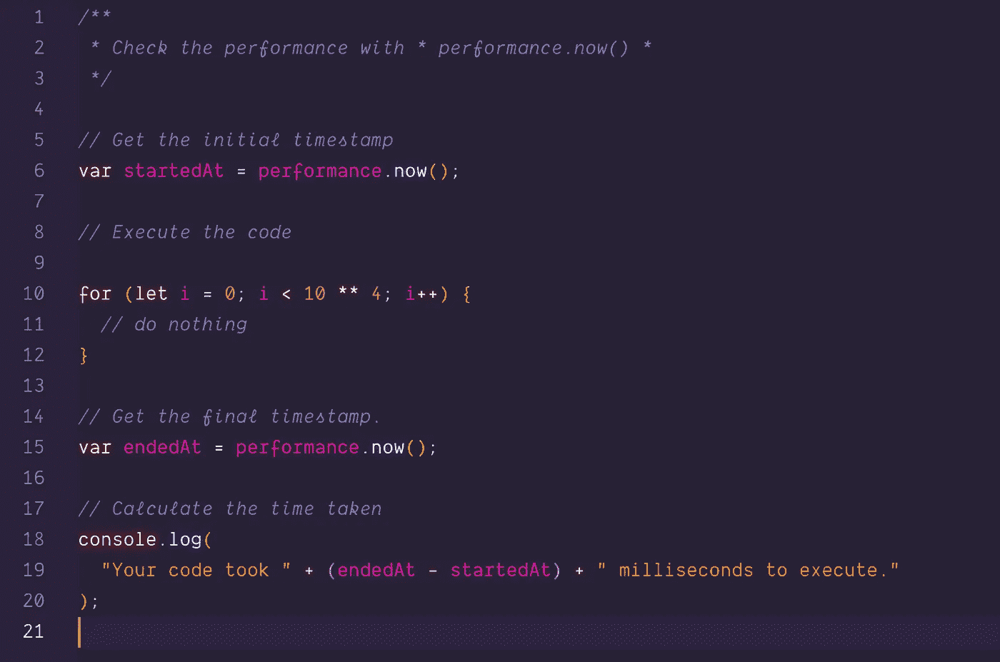
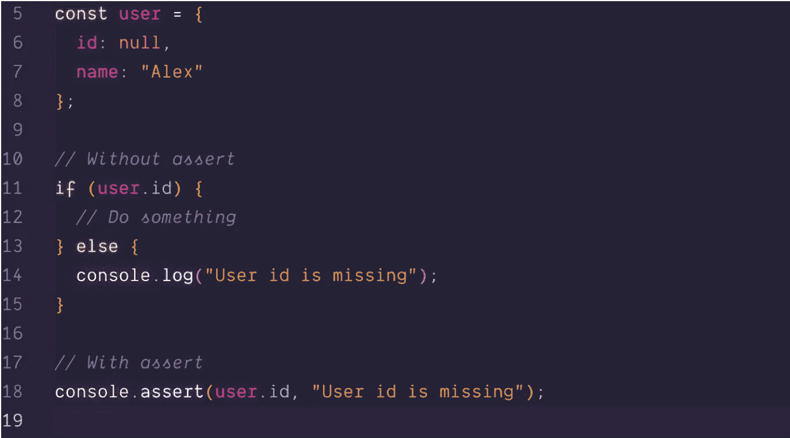
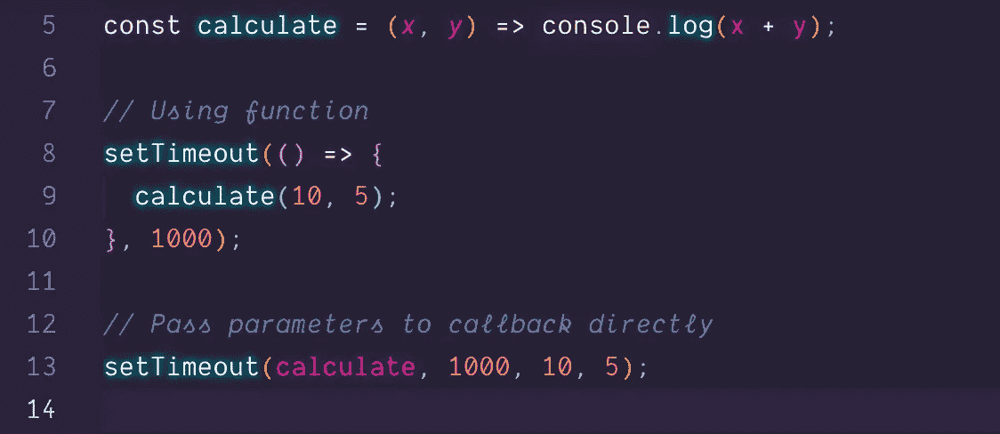
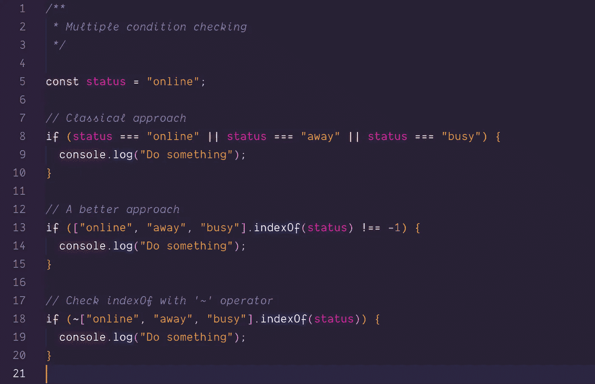
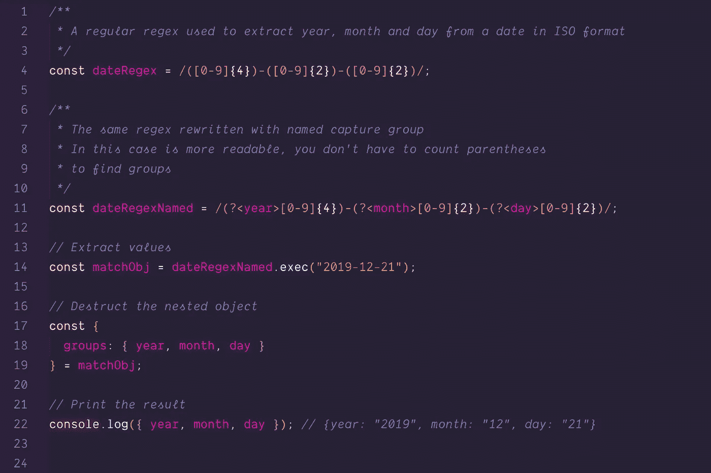

# 这是关于有用的 JS 技巧和窍门！

> 原文：<https://itnext.io/this-is-about-useful-js-tips-and-tricks-4a7ef25c33ad?source=collection_archive---------2----------------------->

> 本文旨在展示一些可以在您的代码中使用的技巧和诀窍，以使代码更加整洁，可读性更好。

## **所需功能参数**

**默认函数参数**如果没有值或`undefined`被传递，允许命名参数用默认值初始化。我们可以利用这个 ES6 特性的优势，创建一个抛出错误的函数，并将其指定为所需参数的默认值。

处理**所需函数参数**的另一种方法是创建一个名为`required`的全局属性。它可以被指定为默认的函数参数，所以如果在函数调用中没有指定值，getter 处理程序将被触发并抛出错误。

## 有效的数据验证

在某些时候，我们需要在方法中验证我们的数据。我最喜欢的方法是使用 assert like 函数。断言函数是指示程序检查条件的一种快捷方式，如果条件不为真，它将抛出错误。

## **替换字符串中的文本**

名为`replace`的字符串原型方法包括一些有趣的替换模式:

*   `$&` 插入匹配的子串。
*   `$`` 插入匹配子字符串之前的字符串部分。
*   `$'` 插入匹配子字符串后面的字符串部分。

## **使用异步/等待语法提高代码可读性**

Async/await 是用 Javascript 编写异步代码的一种新颖而优雅的方式。平时我都是配合`fetch`使用。

编写该函数的一种更简洁的方式可以是:

## **用 performance.now()检查代码性能**

如果你有一部分代码需要运行得非常快，可以用`performance.now()`函数来检查。与使用`Date.now()`创建的常规时间戳不同，方法`performance.now()`生成高分辨率时间戳([domhhighrestimestamp](https://developer.mozilla.org/en-US/docs/Web/API/DOMHighResTimeStamp))。

## **无 if / else 的条件日志**

当条件为假时，我们可以使用***console . assert(condition，msg)*** 来记录一些东西。如果断言为真，则什么都不会发生。

## **使用带有可变参数的 setTimeout()**

`setTimeout`允许我们在间隔时间后运行一次功能。我们可以直接传递函数参数，而不是用匿名函数包装我们的方法:
*(不太确定是否更具可读性*😂*但值得一提的是… )*

## 过滤虚假值

如果您需要过滤虚假值，如(`0`、`undefined`、`null`、`false`等)。)出一个数组，你可以用这个技巧:

## if 语句中的多个条件

如果您必须处理大量条件的检查，您可以使用外观简洁的`if`和`||`操作符，它们的伸缩性很好:

或者更好，使用`includes`方法:

## RegExp 命名的捕获组

ES2018 在 JavaScript 正则表达式中引入了命名捕获组。命名的捕获组减少了与正则表达式的混淆，提高了代码的可读性和质量，因为使用标识符可以很容易地找到一个组。

好了🤪！你最喜欢的 JavaScript 技巧有哪些？