# 这就是可变参数在 C#中的工作方式

> 原文：<https://itnext.io/this-is-how-variadic-arguments-could-work-in-c-e2034a9c241?source=collection_archive---------0----------------------->

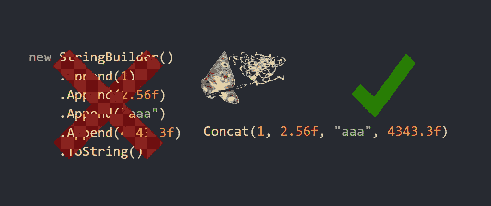

到目前为止，C#的方法只能接受固定数量的参数，这在未来几年内几乎不会改变。这大大有助于语言保持简单！

但是…我们热爱实验！让我们把变量论证变成一件事。最重要的是，我们要给他们一个*归纳*数学定义。

给不耐烦的人: [github](https://github.com/WhiteBlackGoose/InductiveVariadics) 。

# 现在的方式是什么？

## 关键字参数

一个非常基本和古老的 C#特性允许根据需要列出任意多的指定类型的参数:

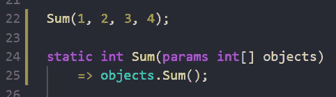

带有 params 关键字的函数示例

这是创建数组的语法糖:

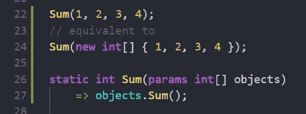

脱糖

## 使超载

这是一种经典的定义方法(或类型)的方式，方法(或类型)的参数数量有所不同。

这种“变通方法”的一个很好的例子是 Func/Action 委托，[在 BCL:](https://source.dot.net/#System.Private.CoreLib/Function.cs,7a86aba051da82dd)

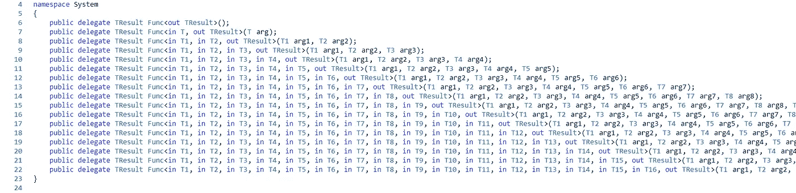

Func 委托的声明

同样，我们也可以定义方法。

# 我们想要什么？

我们希望能够根据需要处理任意类型的参数。在 C++中，有一种模板语法，可以根据函数的用法在编译时生成一个新函数。

我们将通过 C# 9 的源代码生成器使用类似的方法。我们将分析所使用的方法，并生成对基本方法和转换方法的适当调用链。它们是什么？让我来介绍下一部分吧！

# 归纳定义

别担心，这是一个非常简单的概念(我们说的是关于 naturals 的归纳)。基本上，归纳是一种在给定基础和从上一个状态到下一个状态的转换的情况下递归定义某物的方法。

## 问题示例

假设我们需要 Concat 函数，它可以处理字符串、浮点数和整型数。它将创建一个字符串生成器，添加一个新的值，然后最终转换成字符串。

## 基础

首先，让我们定义一下这一切是从什么开始的。

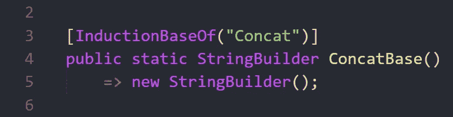

归纳定义的 Concat 的基底定义

所以不管有多少个元素，初始状态都是一个新的字符串生成器。数学上，f(0) = new StringBuilder()。

## 从先前状态到新状态的转换

现在假设我们已经讨论了 N 个论点。我们想定义函数到 N + 1 的转移。

我们想为 int，string 和 float 定义它。所以我们来定义三个过渡！

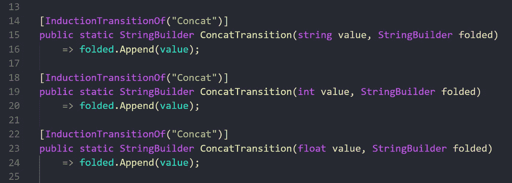

这里的“折叠”基本上是 f(N)，而我们想要定义 f(N + 1)。

数学上我们定义 F(N + 1) = F(N)。Append(值[N + 1])。

所以如果我们展开这些转换，我们得到

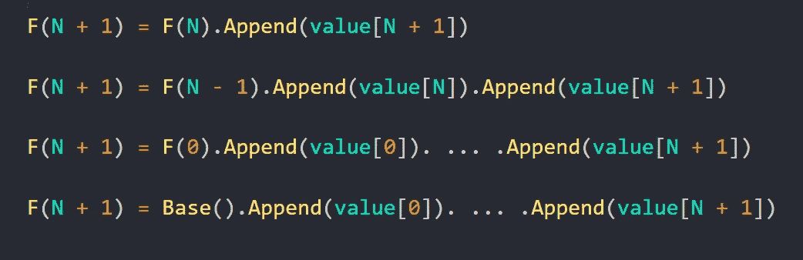

展开的过渡

## 定稿

归纳部分结束了，所以这里的终结只是为了方便我们这些编码者。有人打算用 StringBuilder 做什么？

这就是我们最终确定的原因:

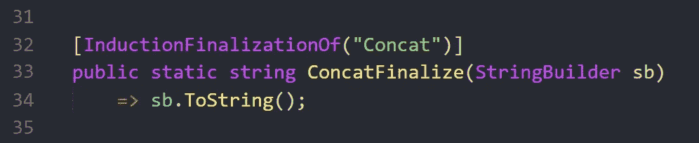

瞧。我们通过归纳递归地定义了 Concat。根据函数式编程，我们将其左折叠。

# 它是如何工作的？

对于上面的例子，让我们考虑这个调用:

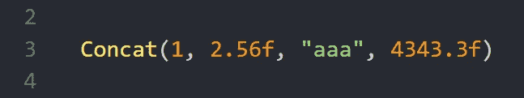

它是一个 **int** ，然后是一个 **float** ，然后是一个 **string** ，然后又是一个 **float** 。

下面是我们的源生成器(SG)为它生成的内容:

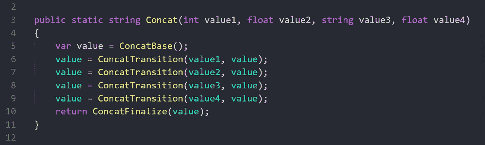

这正是我们调用它的方式，注意它是如何使用归纳法的:它通过调用我们的基类方法来创建基类，然后执行所有保持“状态”的转换，最后完成它。

# 通用归纳变量

以上版本适用于重载。现在让我们把它通用化。我们将打印每个值，并对它们的大小求和。

因此，我们有一个通用的重载，而不是有限数量的重载:

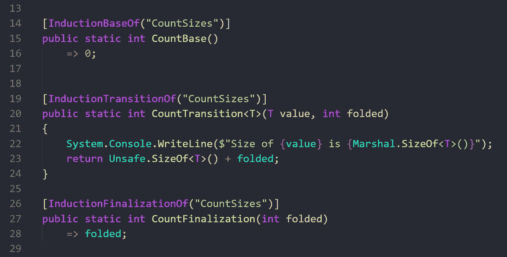

计算大小并打印每个值的函数定义

以下是我们的 SG 为三个参数生成的内容:

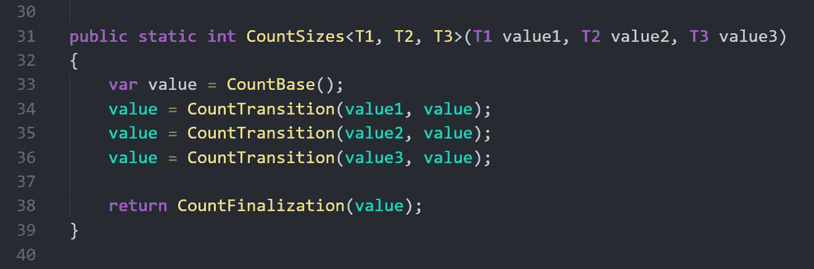

# 源生成器是如何工作的

不幸的是，我省略了文章的这一部分。我不是 SG 专家，那才是应该写 SG:专家的人。代码在[这里](https://github.com/WhiteBlackGoose/InductiveVariadics/blob/main/InductiveVariadics.SourceGenerator/SourceGenerator.cs)可用，它不处理许多情况(例如一般约束)并且用旧的。NET 5 SG API。

基本上，我的想法是找到该方法的所有用法，对于每个唯一的用法，我都基于 base、transition 和 finalization 方法的名称生成一个适当的重载，这些方法都具有 BaseOf、TransitionOf 和 FinalizationOf 属性。

# 灵感

[有限性](https://github.com/FiniteReality)首先使[可变泛型](https://github.com/FiniteReality/VariadicGenerics)。它的工作方式不是归纳定义，而是从生成的方法中调用每个“基本”方法。

所以在那个实现中，你的每个基类方法不“知道”其他参数，它只为一个参数工作。

对于变量日志记录或打印，或者更多，它可能会变得很方便，但是没有我在本文中展示的那么通用。

那个项目启发我做了一个更高级的变量论证的归纳版本。

# 结论

所以这里我们考虑了一种简单的方法来定义和使用 varargs，就像在 C++中使用它们一样。

整个想法是，我们通过基于第 N + 1 个参数定义 N + 1 个参数的函数和 N 个参数的函数值来收集所有参数的状态。

它的用途可能是减少使用 params object[]造成的性能影响和类型不安全性，同时保持一个好的 API 和定义可变函数的简单方法。

感谢您的关注！我的 [github](https://github.com/WhiteBlackGoose) ， [twitter](https://twitter.com/WhiteBlackGoose) 。