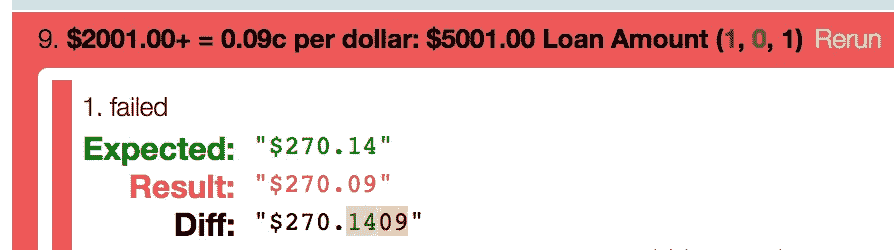
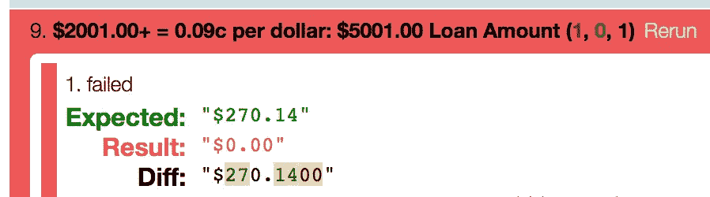
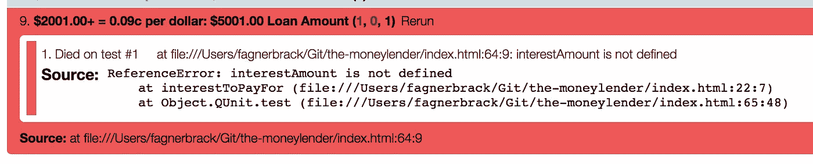
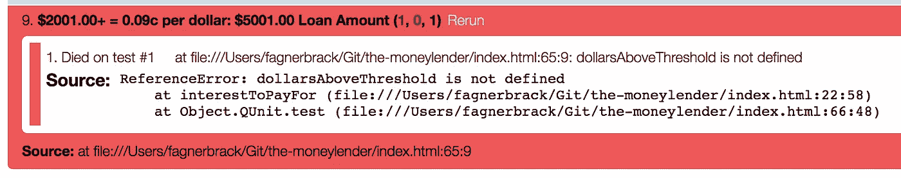
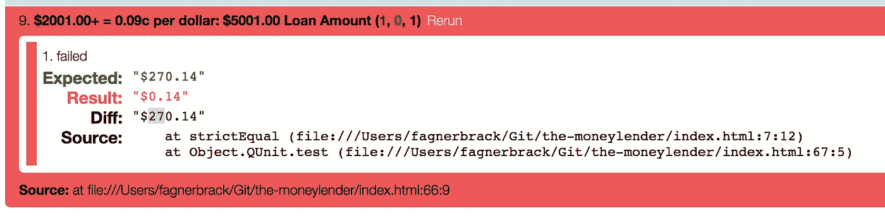
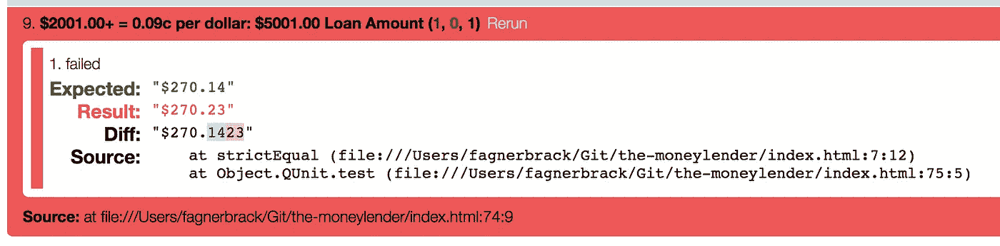

# 这是没人告诉你的关于 TDD 的一件事

> 原文：<https://itnext.io/this-is-the-one-thing-nobody-told-you-about-tdd-7f549254cd74?source=collection_archive---------0----------------------->

## 这和测试无关。是关于开车的。

工作中的铁匠照片。铁匠用锤子在铁砧上敲打一块铁。锤子砸到一个呈现滚烫红色的区域。

这些测试给了你下一步该做什么的提示。他们驱使你去构建代码。在这个关于[“放债人杰克”](/the-missing-practical-step-by-step-test-driven-development-a7140ca4b71)的故事的新篇章中，你将会看到一种从外到内进行测试驱动开发的替代方法**内**测试驱动开发。

想象一个铁匠。他们在火上造剑，用锤子塑造它，然后用水完成它。

编程和锻造一样都是一门手艺。

然而，在编程中，你不是通过热的力量来锻造一把剑，而是通过失败的力量来用你的头脑来编制代码。不是等你把铁从冷里拿回来之后再看结果，而是等失败变成成功，考验通过之后再看结果。

上次我写的[缺少实用的一步一步的测试驱动开发](/the-missing-practical-step-by-step-test-driven-development-a7140ca4b71)。从那以后，我写了如何创建[一个货币模型](/how-to-build-a-money-data-type-in-javascript-7b622beabe00)以及[没有人能在第一时间制作出完美的代码](https://medium.com/@fagnerbrack/the-code-you-write-should-only-suck-less-than-the-one-before-5a20e9a543f)。

第一篇文章介绍了杰克的故事，一个放债人寻找更好的方法来计算他的贷款利息。

事情是这样的:

> 嗨，我是杰克。我的业务是发放贷款。我可以向你提供小额贷款，但如果你这样做了，那么我会对超过一定门槛的每一美元收取利息。
> 
> 你能为我做一些计算吗？
> 
> 0 美元到 2000 美元=无利息
> 
> 从 2001 美元到 5000 美元=每美元 9 美分
> 
> 5001 美元到 10000 美元=每美元 14 美分
> 
> 10001 美元+ =每美元 21 美分

在第一篇文章[之后，Jack 最终开发出了一个产品，可以计算 2000 美元以上的每一美元的 0.09 美元的利息，直到无穷大。这是问题的第一个边界。现在是时候为下一个边界开发代码了。这一次，代码需要为 5000 美元以上的每一美元计算 0.14 美元的利息。](https://medium.com/p/a7140ca4b71)

像以前一样，有一个存储库，在这里您可以看到每次测试运行的一次提交。该存储库显示了每个提交中的红色/绿色/重构步骤。

*   提交有一个🔴当它代表**红色的**步时。
*   当提交表示绿色的**步骤时，它有一个绿色的✅。**
*   提交有一个🔨当它代表**重构**步骤时。

我们开始吧。

> Jack 对 2000 美元以上的每一美元 0.09 美元感到满意，但如果代码能计算出 5000 美元以上的每一美元 0.14 美元，他会更高兴。

先测试 5000 美元，比 5001 美元少一美元。你应该预料到这次考试会通过，而下一次会失败。

[✅加考贷款金额为 5000.00 美元](https://github.com/FagnerMartinsBrack/jack-the-moneylender/commit/0b988d45d6702fef44c4b71bb1e93a0347edf7b0)

不出所料，测试通过了。5000 美元的贷款金额仍应使用旧规则。根据 Jack 的说明，0.14 美元的新规则应该只适用于 5001 美元或更高的贷款金额。

[🔴添加 5001.00 美元贷款金额的测试](https://github.com/FagnerMartinsBrack/jack-the-moneylender/commit/c55b94aae095972099b25bf5029a8eb22056ae1b)

现在，对$5001 贷款金额的测试失败了，因为它计算的是$0.09，而不是$0.14。那是故意的。您还没有为下一个范围执行规则。因此，您可以看到旧算法仍然有效。那个测试失败**驱使**你去实现下一个系列的代码。

5001 美元贷款金额测试失败的屏幕截图。它预计 270.14 美元。相反，它得到 270.09 美元。

在这一点上，有许多途径可以让这个测试通过。我能想到两个:

1.  发展旧的条件，并找到方法来编写最小数量的代码，使这个测试尽快变得绿色。
2.  隔离旧的条件，并创建一个新的条件，只考虑新的规则。只有当算法完成时，测试才通过。

你可以争辩说第一种选择比第二种更尊重 TDD 的法则。第一种选择不需要你为通过测试构建完整的算法，第二种可能需要。因此，第一种选择似乎更有可能帮助你取得好的结果。然而，为了实验起见，让我们尝试第二种方法。

对于第二种方法，您可以隔离旧的条件，只运行大于$2000 且小于$5001 的贷款金额。这样，您可以只关注$5001 或更多贷款金额的代码。

[🔴分离第一个范围的代码](https://github.com/FagnerMartinsBrack/jack-the-moneylender/commit/bbc0ed9eaac8885167bdc88e7c2aef8df76e071f)

测试失败从为每一美元计算 0.09 美元变为忽略所有计算。因此，它返回$0.00。这是因为你已经隔离了先前的逻辑。

一旦你分离出$2000 到$5000 范围内的算法，测试失败的屏幕截图。它预计 270.14 美元。相反，它得到 0.00 美元。

现在，对于大于或等于$5001 的贷款额，您将如何开发第一个条件呢？您可能会写类似“如果贷款金额大于 5001 美元，那么开始构建下一个范围的算法。”

不要那样做。你操之过急了！

记住我们在做 TDD。因此，根据[法律第 3 条](http://butunclebob.com/ArticleS.UncleBob.TheThreeRulesOfTdd)，“除了足以通过一个失败的单元测试之外，你不允许写更多的产品代码。”您可以编写的最小条件是“如果贷款金额正好是 5001 美元，那么开始构建下一个范围的算法。”超过这一点的任何事情都是对代码的不必要的[转换](http://blog.cleancoder.com/uncle-bob/2013/05/27/TheTransformationPriorityPremise.html),会伤害你试图实现的目的。

“最小”是[主观](https://hackernoon.com/programming-subjective-discussion-9c177c31807f)。您可以争辩说，返回静态金额$270.14 是您可以编写的通过测试的最小值。

然而，如果你像那样改变代码，它不会帮助你发现重要的模式。你知道你需要一个与 0.09 美元的**相似的**算法。**因此，您可以尝试使用之前算法的代码作为模板来构建新的需求，只是现在您不需要从头开始再次重新发现计算。**

如果您从返回值开始，编译错误可能会驱使您在新需求的上下文中重新构建旧算法。

让我们试试。

> 如果您已经知道问题的某些部分的解决方案，您可以使用测试来驱动您找出您不知道的剩余部分。

第一件事是从贷款额 5001 美元的条件开始。创建一个未声明的“利息金额”变量并返回该变量。

[🔴为 5001.00 美元贷款金额添加条件](https://github.com/FagnerMartinsBrack/jack-the-moneylender/commit/1182ac60360d49942916cec83b6408c162496f65)

测试仍然是红色的，因为代码没有声明变量“利息金额”但是，现在它失败了，并显示一条不同的错误消息。消息告诉你有东西不见了。

为$5001 贷款金额创建新条件后，测试失败的屏幕截图。文本显示“参考错误:利息金额未定义。”

测试在问:**你是怎么计算“利息金额”的？**

根据[之前的算法](https://github.com/FagnerMartinsBrack/jack-the-moneylender/blob/1182ac60360d49942916cec83b6408c162496f65/index.html#L17),“利息金额”代表高于给定阈值的美分数乘以美元数。

让我们写下来。

[🔴添加正确的逻辑以创建变量“利息金额”](https://github.com/FagnerMartinsBrack/jack-the-moneylender/commit/aaedff44f77628c38dff14a5a03ca258f505dc56)

测试仍然失败，因为代码没有声明变量“dollars above threshold”，而是再次显示不同的错误消息。

创建变量“interest amount”后测试失败的屏幕截图文本显示“参考错误:阈值以上的美元未定义。”

测试在问:**如何计算阈值以上的美元？**

根据前面的算法，您将“高于阈值的美元数”计算为当前贷款金额 5001 美元与代表前一个范围结束的值 5000 美元之间的差额。

根据 TDD 的[第三定律:“你不允许写任何超过足以通过一个失败单元测试的产品代码。”所以，不要跳着把所有的金额都写成变量。你正在发现代码的模式。如果你跳转到变量，你将增加重要的](http://butunclebob.com/ArticleS.UncleBob.TheThreeRulesOfTdd)[转换](http://blog.cleancoder.com/uncle-bob/2013/05/27/TheTransformationPriorityPremise.html)，这使你更难发现那些模式。

[🔴添加正确的逻辑以创建变量“高于阈值的美元”](https://github.com/FagnerMartinsBrack/jack-the-moneylender/commit/ea640a56f0df1141f6103edd63d90019462a804f)

现在是激动人心的时刻了。根据 TDD 第二定律[:](http://butunclebob.com/ArticleS.UncleBob.TheThreeRulesOfTdd)

> 不允许编写任何超过足以导致失败的单元测试；**而编译失败就是失败。**

在这种情况下，“引用错误”被认为是编译失败。因此，在之前的三次提交中，您在没有使用测试的情况下，在另一个测试驱动开发过程中应用了一个测试驱动开发过程**！**

什么！？！好吧，我来解释。

在前三次提交中，每次编译失败都是一个“引用错误”，这代表了 TDD 的红色步骤。与此相对应，成功之处在于错误消息中可预见的变化，即绿色步骤。错误信息驱使你[转换](http://blog.cleancoder.com/uncle-bob/2013/05/27/TheTransformationPriorityPremise.html)代码并实现部分实际算法。它类似于 TDD 的红/绿过程，只是可预测的消息变化取代了真正的“绿”测试，并且没有重构步骤。

这种方法类似于 TDD 中的 [Outside，只不过不是专注于找出模块之间的联系，而是专注于旧算法和新算法之间的未知:**你大脑中的联系。**](https://8thlight.com/blog/georgina-mcfadyen/2016/06/27/inside-out-tdd-vs-outside-in.html)

鉴于你已经在第一篇文章中弄清楚了如何计算每一美元的细节，你不需要再花时间重新计算了。

> 您可以在另一个测试驱动的开发过程中运行一个测试驱动的开发过程。

在此阶段，错误消息如下所示:

创建了所有缺失的变量后，5001 美元贷款金额测试失败的屏幕截图。它预计 270.14 美元。相反，它得到 0.14 美元。

该测试预期值为 270.14 美元，但结果为 0.14 美元。请记住[您隔离了前面的算法](https://github.com/FagnerMartinsBrack/jack-the-moneylender/blob/ea640a56f0df1141f6103edd63d90019462a804f/index.html#L15),只运行高于$2000 且低于$5001 的贷款金额。测试告诉你，你也应该考虑以前范围的逻辑，甚至是新的需求。要应用前面的逻辑，您可以复制/粘贴它并与代码连接来计算$5001 的利息。

[🔴复制$5001.00 贷款金额的第二个范围的逻辑](https://github.com/FagnerMartinsBrack/jack-the-moneylender/commit/482179364a93578b9add68111003a19ec002683e)

复制/粘贴？嗯…听起来不太对。

您需要第一个算法的代码，但是您在第一步中已经隔离了它。看来这是用第二种方法跑步的[味道](https://medium.com/@fagnerbrack/code-smell-92ebb99a62d0)。测试迫使你实现太多的代码，即使是通过测试所需的最小步骤。

两年前[我写了](https://medium.freecodecamp.org/the-benefits-of-typing-instead-of-copying-54ed734ad849)关于为什么复制/粘贴代码比打字更难记忆知识。键入可能会迫使您理解代码的细节，而复制/粘贴可能不会。然而，[没有银弹](https://medium.com/@fagnerbrack/how-to-reject-the-belief-on-the-silver-bullet-1d86b686acbb)。每个好的实践都有例外。

如果**你**最近写了代码，了解了所有的细节，那么复制也是可以的。有些情况下，重新构建的成本超过了你将获得的学习收益。

你可能会问自己的问题是:如果我不复制代码并重新输入，我会学到以前不知道的新东西吗？

> 复制代码是可以的，只要重新构建代码的成本超过你将获得的学习收益。

可惜最后的改动还是没有让测试变绿。

复制/粘贴之前的算法后测试失败的屏幕截图。它预计 270.14 美元。相反，它得到 270.23 美元。

测试仍然试图告诉你一些事情。

假设您复制/粘贴了前面的算法，代码将尝试计算高于 5000 美元阈值的 1 美元的 0.09 美元加 0.14 美元。结果是 0.23 美元。修复方法是确保 5001 美元只加 0.14 美元和 0.09 美元之间的剩余美分，而不是它们的总和。

[✅添加合适的计算为 5001.00 美元的贷款金额](https://github.com/FagnerMartinsBrack/jack-the-moneylender/commit/2af5de9858096f0bf11e3993bb3bd16b08b5c644)

在这里，测试是绿色的！

5001 美元贷款金额的逻辑是正确的。现在这是一个绝佳的机会来尝试三的[规则](https://medium.com/@fagnerbrack/how-to-solve-the-challenge-of-reusability-ac4edce069c9)，看看你是否可以对 5002 美元和 5003 美元的贷款金额重复同样的模式。

[🔴✅🔨为“$5002 和$5003”贷款金额添加测试和代码的提交的差异](https://github.com/FagnerMartinsBrack/jack-the-moneylender/compare/2af5de9858096f0bf11e3993bb3bd16b08b5c644...d042df7795612f9e38b73aa8cda59ebaa9557187)

一旦你这样做了，你会发现每次你复制代码时，你只需要改变两个值就可以通过下一次测试。

只是现在你有了[经验证据](https://en.wikipedia.org/wiki/Empirical_evidence)这些值应该变成变量。

[✅将代码重复的$5002.00 换成$ 5003.00](https://github.com/FagnerMartinsBrack/jack-the-moneylender/commit/d042df7795612f9e38b73aa8cda59ebaa9557187)

恭喜你！您已经找到了下一个范围的代码模式。

接下来的步骤可以是一系列的重构，以清除[重复](https://github.com/FagnerMartinsBrack/jack-the-moneylender/commit/18e7337129f85efcd8fbf5632c0f47b6eae1b546)，[移除所有的幻数](https://github.com/FagnerMartinsBrack/jack-the-moneylender/commit/f30fe0ebd446fc2ff32a2eb22584ea0212fa9c08)并将新的测试分离到一个[新块](https://github.com/FagnerMartinsBrack/jack-the-moneylender/commit/d5cdbc7eb618127aa0bd5546e11b7bbe2d0adc44)中。

结果是，2000 美元以上的每一美元增加 0.09 美元，5000 美元以上的每一美元增加 0.14 美元。你得到一个解决方案，正如第一个帖子所做的那样，交付[增量值](https://levelup.gitconnected.com/code-less-think-more-incrementally-98adee22df9b)。

> TDD 的目的不是创建测试。它是一个基础，可以帮助你发现代码中的模式，更好地理解你试图解决的问题。

还有一件事。

测试也可以作为你代码的文档，比代码注释更好。因此，使用领域的语言而不是程序员的语言来描述测试是有意义的。这样，如果一个新的程序员来到项目中，他们可以很容易地理解问题和代码，因为他们有清晰的例子。代码不会错过它试图解决的问题的关键信息。

[🔨改变测试的描述，使用领域语言](https://github.com/FagnerMartinsBrack/jack-the-moneylender/commit/a06b796a8ed6a55581902b2962aa3ed6a9fa4e48)

此外，您还可以检查代码覆盖率并进行相应的调整。TDD 的价值不是增加 100%的代码覆盖率，或者仅仅是创建测试。它有一个[规则](https://hackernoon.com/how-to-fix-the-software-industry-c2b627ec3d9d)，你可以问[正确的问题](https://hackernoon.com/the-journey-for-the-right-question-c3f5b9e90035)来提供经验证据，你写的代码理解它试图解决的问题的边界。

> TDD 是关于驱动你进入启蒙的。

类似的测试有助于你找到问题的模式。一旦模式清晰，您就可以自由地将测试锁定在更有可能导致回归的范围内，或者可以为未来的代码读者提供系统如何工作的更好示例的范围内。在 Jack 的利率的例子中，问题的边界是利率在 0.00 到 0.09 美元和 0.09 到 0.14 美元之间的变化。

[🔨删除不必要的测试，只留下必要的覆盖面](https://github.com/FagnerMartinsBrack/jack-the-moneylender/commit/217eb31700577382b4e7ed1f08391511347c2c76)

杰克更开心了，因为他现在可以计算 5000 美元以上的贷款金额。现在你可以自信地回家，你的工作创造了真正的价值。你可以相信这些知识让你更有效率地工作。

在下一篇文章中，我将改进这段代码来测试后续的边界。您将看到如何应用同样的[技术](https://medium.com/@fagnerbrack/the-trick-to-write-better-software-lies-on-the-technique-944015f84ce4)来计算贷款金额，对于超过 10000 美元的每一美元，利率为 0.21 美元。此外，我将重构代码以消除重复。

到那时，也许你会看到这个故事的结尾。

敬请期待📻。

**编辑 2018 年 12 月 11 日:** [下面是下一个帖子](/how-tdd-can-prevent-over-engineering-1265a02f8863)

感谢阅读。如果您有任何反馈，请通过 [Twitter](https://twitter.com/FagnerBrack) 、[脸书](https://www.facebook.com/fagner.brack)或 [Github](http://github.com/FagnerMartinsBrack) 联系我。

感谢[杰·巴祖兹](http://jay.bazuzi.com/)、[西达尔特·萨伦克](https://www.linkedin.com/in/siddharthsalunke/)、[马丁·潘恩](https://www.linkedin.com/in/martin-pain-10454329/)、[保罗·克拉维霍](https://twitter.com/pclavijo)、**、**、[克里斯·斯滕克](https://twitter.com/chrizzz0101)和[戴夫·辛克尔](https://twitter.com/DaveSchinkel)对这篇文章的真知灼见。