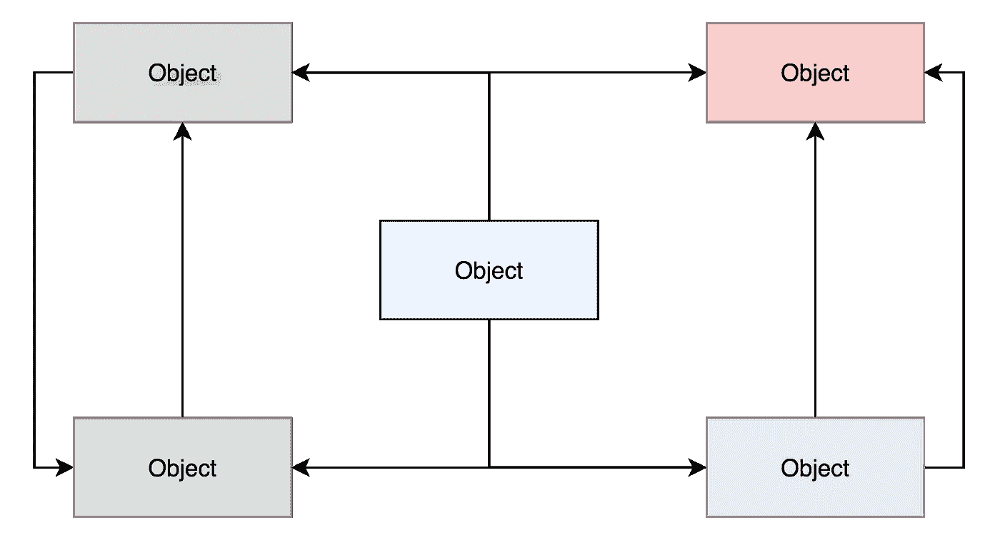
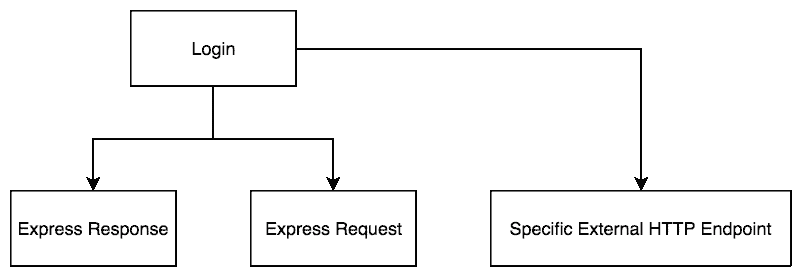
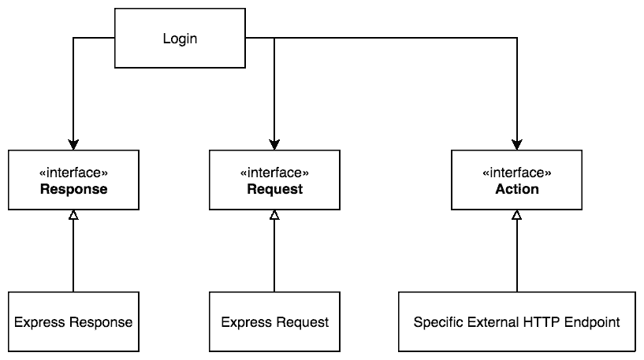

# 这就是为什么耦合是你最大的敌人

> 原文：<https://itnext.io/this-is-why-coupling-is-your-worst-enemy-d4678d0cab49?source=collection_archive---------7----------------------->

我来给你看看它对 **Node.Js.** 里写得很差的 HTTP Server([Express Framework](https://expressjs.com/))的负面影响

【auriosoftware.com】*我们构建壮观的应用程序，查看*

*它总是以一个有趣的预测开始，即我们的新服务器将“小而简单”。*

*然而，正如大多数预测一样，即使是这一次也将很快被毁灭。*

## *这一切都始于这段样板代码*

*Login.js*

*第一个用例非常简单。当我们的服务器收到来自客户端的登录请求时，它将调用**外部 HTTP API** ，当一切顺利时，它将向最终用户发送 200 状态代码响应。*

*我们正在构建中间件。这个服务器位于 UI 和外部 HTTP 端点之间，终端用户不应该知道这个端点。*

*小而简单，这是理所应当的。*

*这是这个用例的测试片段。*

*当我们的外部端点返回 OK 状态代码时，我们期望正确的响应被发送给最终用户。*

## *几个月后*

*一段时间后，我们的中间件有更多的用例需要处理。因此，出现了很多像这样的新功能，也出现了很多这样的测试案例。*

*我们发现，我们必须改变我们的 HTTP 服务器(快速)，因为它太慢了，一些新的花式 HTTP 服务器刚刚出现。*

*所以我们进入代码并意识到…那…嗯… **我们差不多要完蛋了。***

**

*为什么？？*

*因为我们必须改变一切。*

*是的，我是说一切。看看我们的代码，到处都有 express。在我们的测试和产品代码中。*

*我们将我们的高级策略与低级细节紧密耦合，比如快速响应和请求对象。*

*看看代码就知道了。如果我们想要改变我们的 HTTP 服务器，我们必须检查整个代码库，并将 express 请求和响应对象的 API 改变为新服务器的 API。*

*我们以前的测试片段。*

*旧 Express API*

*具有更改的 API 的新代码片段。*

*新的花式服务器 API*

*旧的生产代码。*

*快速 API*

*新的。*

*新的花式服务器 API*

## *几个月后#2*

*我们设法把我们的 HTTP 服务器换成了新的(花了很多时间)。*

**

## *几个月后#3*

*我们的产品负责人告诉我们，我们必须将我们的外部 HTTP 端点更改为另一个具有完全不同的 API 的端点。*

*所以我们运行我们的 IDE 并意识到…*

*嗯…*

**

*我们真的完蛋了。我们又要完蛋了。*

***为什么？？***

*因为我们再次将我们的底层细节(外部 API)与我们的高层策略结合在一起。*

*只要看看代码，我们必须再次检查我们的代码库，并更改我们的外部 HTTP 端点的 API。*

*这是旧的外部端点的外观。*

*旧端点*

*新的 API。*

*新端点*

*整个登录用例的类图是这样的。*

**

*那么…我们如何解决这个问题呢？*

# *这个解决方案怎么样？*

**

*登录对其周围环境一无所知！([得墨忒耳定律](https://en.wikipedia.org/wiki/Law_of_Demeter))。*

*它知道稳定的接口，如**响应**、**请求**和**动作**。它不知道 Response 是 express 对象、node 对象还是其他对象。它不在乎。*

*我们遵守 [**依赖倒置原则**](https://en.wikipedia.org/wiki/Dependency_inversion_principle) ，因为高层模块(登录)依赖于抽象(响应、请求和动作)，低层细节(快速响应、请求和特定的外部 HTTP 端点)也依赖于这些抽象。*

*我们颠倒了依赖关系。现在我们可以在一个地方改变 Express HTTP 服务器，而不破坏其他任何东西。这正是我们想要的。我们也不关心改变特定的外部 HTTP 端点。我们依赖于名为**动作**的抽象。什么都有可能。*

*看看新代码就知道了。*

*请求和响应适配器如下所示。*

*和特定外部登录操作。*

*如果我们需要更改外部 HTTP 操作，我们只需创建一个新文件。如果我们需要更改 HTTP 服务器，我们将只为他的请求和响应对象创建带有新服务器和适配器的新文件。*

***我们根本不会更改登录文件(用例)!***

# *应用模式和原则*

## *德米特里定律*

> *"一个给定的对象应该尽可能少地假设其他任何东西的结构或属性(包括它的子组件)"*

## *从属倒置原则*

> *“高层模块不应该依赖低层模块。两者都应该依赖于[抽象](https://en.wikipedia.org/wiki/Abstraction_(computer_science))*

## *适配器模式*

> *"通过将一个类的接口转换为客户端期望的接口，允许原本不兼容的类一起工作。"*

# *哦，天啊…那个 JavaScript 的东西*

> *“但是……JavaScript 没有接口，所以图中的类和接口没有依赖性”*

*不要被骗了！*

*没有**显式**依赖，但肯定有**隐式**依赖！*

*如果登录操作不使用接口 Request、Response 和 action 提供的相同 API，它将在代码中的某个地方的操作期间抛出运行时错误。*

*我强烈建议改用 TypeScript，因为很多人都落入了这个陷阱。使用 TypeScript，您可以定义模块的显式依赖关系，这有助于保持设计的整洁。*

# *不全是阳光和彩虹*

*至少还有一个问题。我们的业务逻辑(登录用例)仍然与 HTTP 协议相耦合。如果你看这个图，你可以看到这个耦合。但是想象一下，要分离它需要多少抽象(看看登录的例子)。*

*添加越来越多的抽象可能会伤害我们。想象一下，为了解耦，你需要写多少代码。甚至添加一个新的用例也是非常困难和耗时的。*

*明智的做法是思考你的项目，考虑对你的设计做出这样的改变，因为这种灵活性的代价是非常昂贵的。*

*[更多文章尽在我的博客 **foobazbar.club**](http://foobazbar.club) **。***