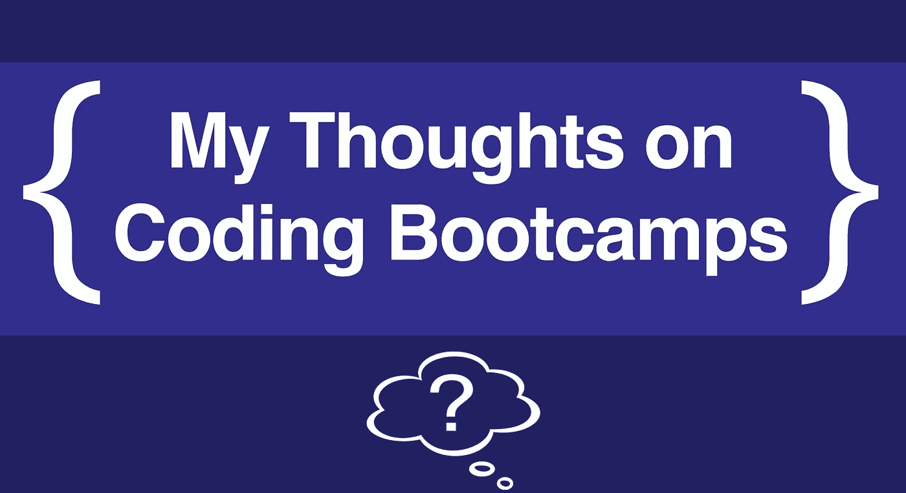

# 我对编写训练营代码的想法(现在我已经毕业了)

> 原文：<https://itnext.io/thoughts-on-coding-bootcamps-now-that-ive-graduated-c6592094658?source=collection_archive---------2----------------------->

***编码训练营*** 现在很火。虽然它们有各种形状和大小，但这篇文章是基于我在熨斗学校的[接入实验室](https://flatironschool.com/campuses/brooklyn/)的经历。这是一个为期 15 周的延期学费计划，重点是 React 和 Rails。此外，我是毕业后两天就找到工作的幸运儿之一(关键字:*)，这给了我一点现实世界的味道来调味这些意见。事不宜迟，以下是我对这次经历的一些总体想法和印象:*

# *学习语言，但不要依恋*

*这无疑是我得到的最重要的建议。一个编码训练营会在很短的时间内扔给你一大堆代码，并且有一种专注于掌握特定语法的诱惑。然而，这是一个陷阱。在你担心要记住什么东西而把自己逼疯之前，确保你理解了所有的概念。每当你想到一个问题，首先用伪代码解决它，然后担心附加一个特定的语法。*

*为什么？因为很有可能你在工作中一点也不会用到那种语言。完美的例子，我在营地学了 Rails，React，Router，Redux。我的新工作完全不用这些。但是他们仍然使用核心概念，如迁移、MVC 模式、单一事实来源等。显然，尽你最大的能力学习语法，但是要知道毕业后你可能不会用到那些东西。只是友情提示，大约 70%的网站使用 PHP，所以你知道，要灵活。*

# *也就是说，这里有一些有用的语言*

*我觉得当我在研究训练营的时候，我跳过了所有没有科技内容的文章。以下是我认为你应该了解的语言，因为它们几乎无处不在:*

## *- JavaScript*

*不仅仅是新的东西。如果你在一家有遗留代码库的公司工作，你可能得不到所有花哨的功能。是的，async/await 是一个美丽的东西，但这并不意味着你不应该理解 basic [如何承诺和。然后()阻塞工作](https://medium.com/@mikecronin92/promises-promises-understanding-the-basics-of-js-promise-objects-dd5c656f2db4)。我已经不得不两者都用，并且把一个转换成另一个。你应该理解像[对象析构](/how-to-use-object-destructuring-in-modern-javascript-59758ebfb778)这样的事情，以及原型在新类 sugar 下面实际上在做什么。JS 是一种基本上在所有 web 项目中使用的语言，所以变得流利是一个安全的赌注。*

## *- SQL*

*查询数据库是我实际上在工作中做的第一件事，因为他们想让我习惯新的领域。您应该能够进行实际的查询，而不仅仅是依赖 GUI。我知道大多数框架都有抽象掉这一层的工具，但是要确保你完全[理解基础](https://medium.com/@mikecronin92/demonstrating-multiple-sql-joins-82481a7c16d2)。SQL 有很多种风格，但是如果你理解了底层核心或关系[，你应该没问题。](https://medium.com/@mikecronin92/what-is-a-many-to-many-relationship-5be38906f8e3)*

## *- Bash(或者实际上是一般的命令行)*

*熟悉命令行，因为您会经常用到它。当您设置好系统时，您将修改您的`.bash_profile`并添加别名，并且您将需要配置您的环境变量来使用键。当你开始一份新工作时，你会有很多事情要担心，你不会想担心一个`|`实际上做什么。(那叫烟斗，[整齐的](https://stackoverflow.com/questions/9834086/what-is-a-simple-explanation-for-how-pipes-work-in-bash)。)*

## *-饭桶*

*几乎每个团队都会使用 GitHub。所以要习惯。你应该理解 Git 实际上是什么，它的基本流程，分支是什么，merge 和 rebase 是做什么的，并且能够自如地从终端使用 Git。我知道当你独自一人或在一个小团队中时，把 Git 看得如此严重会感觉很傻，但是这种练习是至关重要的。理想情况下，每 10-20 行代码应该提交一次。您想要构建项目进展的快照。此外，雇主真的会看你的档案的承诺历史，所以你希望它用绿色填充。*

# *询问具体问题*

*可能没有所谓的哑题，但有效率低的。为了充分利用你在夏令营的时间，问一些有针对性的问题。自己做一些探索。使用调试工具和日志来准确理解程序在进程中的哪个地方出了问题，以及哪些特定元素的行为异常。所以不要说，“为什么我的页面不起作用？”相反，你可以问，“我的页面上的导航条在显示，但是待办事项列表组件没有。在主初始状态，我设置了四个项目，但是当我在组件中控制台注销它们时，它显示未定义。我是不是传道具传错了？”宝贝，这是个问题。并且在问老师之前一定要先问网上。该错误可能是常见的，修复可能是谷歌上的第一个链接。*

# *试验*

*测试。你的。代码。不要只是学习如何阅读测试(尽管这很好)，实际上要推动自己去*编写*测试。大多数测试框架都是相似的，所以获得一个框架会让你在其他框架中有一个很好的立足点。就像我说的，试着理解概念，然后谷歌一下语法。我之所以强调这一点，是因为所有的产品代码在部署之前都必须经过测试。如果你在任何一家像样的公司，你都需要编写和处理测试。*栈在变化，框架来来去去，但是单元测试是永恒的。**

# *一个已部署的项目每次都会击败一堆文件*

*我认为你的营地应该是项目驱动的。主要是因为当你去找工作时，这些项目可能是你简历上的唯一内容。因此，在选择项目时，要瞄准那些你能在给你的几天内完成的事情。一个已部署的小项目比 GitHub repo 中的代码好得多。如果你想全力以赴，也要及时做好预算，为你的代码写一个好的自述文件(如果你是那种超水平的人，也许可以加入一些测试)。*

# *训练营可能不应该是第一步*

*我带着相当大的疑虑说，因为我的一些同学基本上是从训练营开始编程的，但我也注意到他们的压力水平要高得多。在我开始露营之前，我已经花了大约一年的时间研究代码，我不得不说这真的很有帮助。虽然我觉得受到了挑战，但我有足够的经验，从不感到不知所措或压力过大。由于我没有使用 camp 来学习绝对的基础知识，我可以花时间思考更高阶的概念，比如[单一责任原则](https://www.toptal.com/software/single-responsibility-principle)，或者试验我的 Bash 配置文件来提高我的效率。*

*你肯定**可以**使用 bootcamp 作为第一步，但我认为如果你先花至少一两个月的时间自学一些像 JavaScript 或 Python 这样的东西会更有好处。*

# *不要试图做每一个家庭作业*

*我不知道其他训练营做什么，但在我们的训练营，我们几乎每天晚上都有实验室做作业。做作业的实验室很多。虽然你可能很想 100%完成你的任务，但这可能不是最好的利用时间的方式。在训练营的紧张时间框架内，使用调查方法通常是更好的方法。当我做一些家庭作业，寻找核心概念，然后自己研究时，我会有最好的结果。*

*记住，训练营不是关于分数，而是关于你对所学内容的自信。做你认为对你最有利的事情。*

# *请不要拿自己和别人比较*

*我们都是不同的。我们都来自不同的背景。每个人都会带着完全不同的经验水平来到这个营地。如果你只有 3 周的工作经验，把你的“智力”与获得计算机科学学位后参加夏令营的人相比是愚蠢的。他们并不比你聪明，他们只是比你更有经验。但是经验的伟大之处在于，只要开始练习，任何人都可以获得它。鲍勃·罗斯有一句名言，每当我觉得自己不够好的时候，我都会想很多次:*

> *天赋是一种追求的兴趣。任何你愿意练习的事情，你都可以做到。*

*他是国家的财富。*

# *底线:考虑一下*

*训练营对我来说是一个正确的选择，因为时间，而不是金钱，是我开始新事业的最大因素。但是还有很多其他方法可以做到。我不想在这里发出任何含混不清的信息:我爱我的训练营，感觉它就像医生嘱咐的那样，但我完全理解这不会是每个人的路。训练营，即使学费延期，也要花很多钱。所以如果你买不起，千万不要认为这意味着你不能成为一名程序员。在训练营之外付出 100%的人总是比拖拖拉拉直到毕业的人做得更好。你走哪条路并不重要，重要的是你要继续前进。*

*大家编码快乐，*

*迈克*