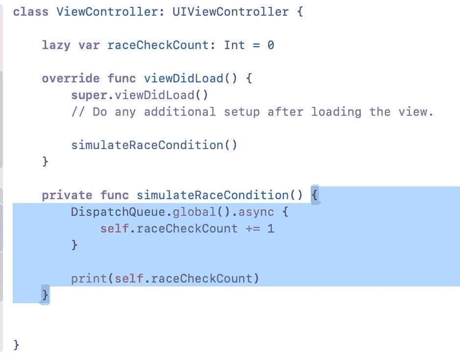
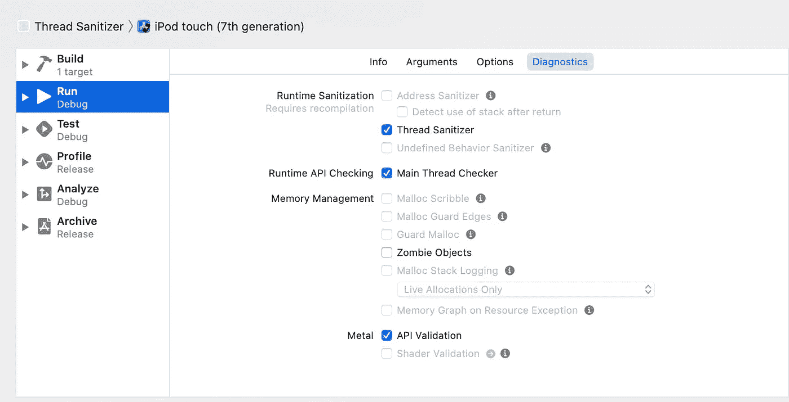
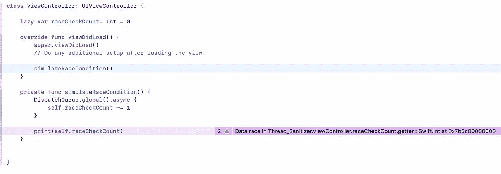
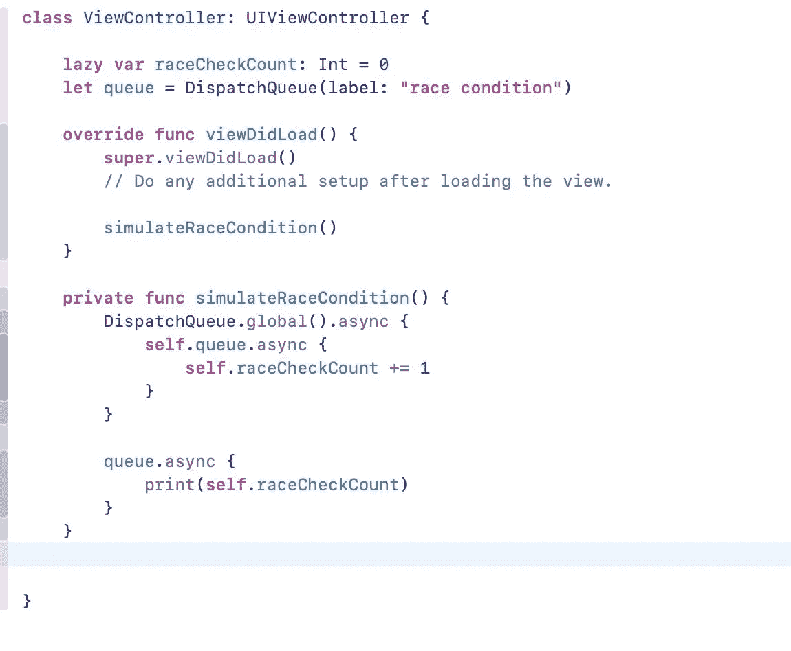

# iOS 中的线程杀毒器

> 原文：<https://itnext.io/thread-sanitizer-in-ios-8438ee3c8c76?source=collection_archive---------5----------------------->

在进入 Thread Sanitizer 或 TSan 之前，我们需要了解数据竞争或竞争条件。数据竞争只不过是不同线程同时访问同一个地址。这种情况称为竞态条件，因此可能会发生许多问题，例如神秘的崩溃等。因此，这篇文章将涵盖数据竞争，以及我们在 Xcode 中如何识别这一点，以及我们如何解决这一问题。

# 简介:

当我们在一个多线程项目中工作时，比方说，从 API 中提取数据并将其存储在本地数据库中，同时 UI 需要显示本地数据库或 CoreData 中的现有数据。在这种情况下，如果我们在从不同的线程访问属性时(写入新获取的数据，从主线程访问数据以显示在 UI 中)没有正确地管理属性，那么就会发生竞争情况或数据竞争。解决由此产生的问题是耗时的，需要挖掘更多的信息来了解实际发生了什么。

# 模拟数据竞赛:

为了理解“Thread Santizer ”,让我们模拟一个竞争条件，如下图所示。这里我们从一个后台线程和一个主线程访问一个惰性变量，因为它是一个惰性变量，只有在第一次被访问时才会初始化。

## 识别数据竞争:

幸运的是，在 Xcode 中，我们有一个名为“线程杀毒器”的工具，它可以帮助我们识别运行时数据竞争发生在哪里。因此，我们可以从编辑方案->运行时清理中启用它，如下图所示。

一旦我们实现了这一点，我们需要建立和运行应用程序。Thread Sanitizer 将完成它的工作，为我们指出竞争条件出现的界限。

## 修复数据竞争:

有许多方法可以解决竞态条件，一个简单的方法是使用一个队列来完全控制这个属性，如下图所示。

经过这一改变后，如果我们在启用线程杀毒器的情况下运行我们的应用，那么数据竞争将不会出现，因为我们已经通过将它锁定在队列中解决了这一问题。

## Swift 5.5 更新:

Swift 5.5 提出了一些很酷的并发编程概念，如 [swift actor](https://devcracker.medium.com/swift-actors-e80ff0dc1832) 和 [swift main actor](https://devcracker.medium.com/mainactor-in-swift-detailed-walkthrough-94044c83118b) 。请点击[链接](https://devcracker.medium.com/mainactor-in-swift-detailed-walkthrough-94044c83118b)了解他们的想法。

希望这篇文章对 iOS 世界的人有所帮助，编码快乐！！！。

## 中等订阅:

从[这里](https://devcracker.medium.com/membership)升级您的中级会员资格，阅读大量文章并提升您的技能。