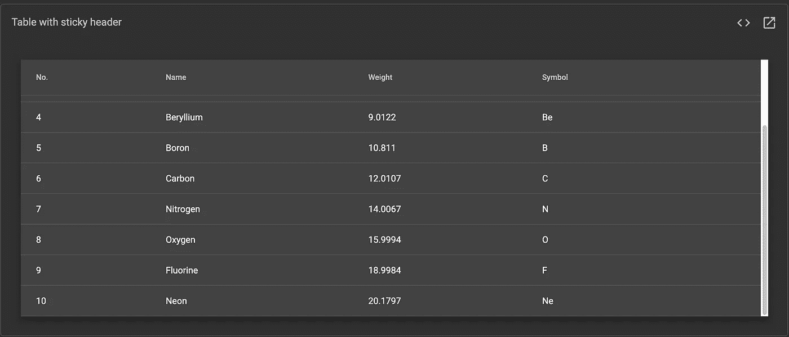
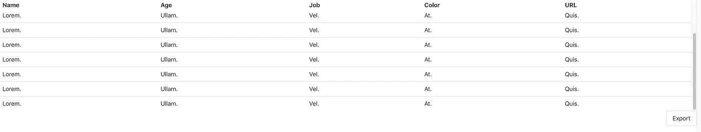
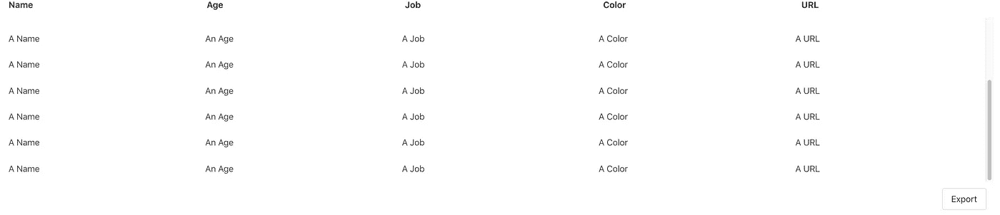

# 让粘性表格标题在网站中工作的 3 种方法

> 原文：<https://itnext.io/three-ways-how-to-make-sticky-table-headers-work-in-websites-4d728ef2b55f?source=collection_archive---------1----------------------->

## 有三种方法可以解决这个本来就不应该成为问题的问题

马库斯·斯皮斯克在 [Unsplash](https://unsplash.com?utm_source=medium&utm_medium=referral) 上拍摄的照片

与苹果 iOS 和安卓等移动平台相比，网络有一个缺点:没有第三方库，开发者一开始只有相当基本的 UI 控件。虽然 HTML5 提供了许多语义元素来表达甚至复杂的布局并尊重可访问性，但默认的 UI 控件并没有很好地跟上时代。要么是风格看起来过时了([尽管谷歌 Chrome 和微软 Edge 团队已经开始着手改善默认的 UI 控件](https://blog.chromium.org/2020/03/updates-to-form-controls-and-focus.html))要么是功能太局限于今天的标准。

我们以`[<table>](https://developer.mozilla.org/en-US/docs/Web/HTML/Element/table)`元素为例。即使默认样式相当简单，纯 HTML5 表格也能完成在表格视图中显示数据的工作。但是，它缺乏现代应用程序可能具有的功能和可用性:

*   在`<table>`中，你不能简单地按列排序
*   `<table>`没有提供过滤表格的方法(例如，使用全文搜索)
*   `<table>`如果有很多行，不提供无限滚动或虚拟滚动等技术来提高性能
*   没有简单的方法让一个`<table>`的标题变得有粘性

最后一点尤其重要。如果需要在一个有许多列的表格中显示成百上千条记录，表格列有助于用户理解表格的内容。例如:考虑一个拥有数千名员工的公司中的用户表。如果看不到表格列，那么如此大的表格很快就会变得难以阅读。

一个图像不像另一个:)

我们要把人送上月球，所以我们应该能够毫不费力地让粘性表头在我们的静态网站和 web 应用程序中工作，对吗？让我们来看看实现这一目标的一些方法:

*   使用提供表格组件的 UI 组件库
*   用 CSS 实现粘性表头
*   首先不要使用桌子

## 使用包含表格组件的 UI 组件库

现代用户界面由多个组件组成。因此，许多项目使用 UI 库，如 [Bootstrap](https://getbootstrap.com/) 或 [Angular Material](https://material.angular.io/) 。如果您使用的组件库已经提供了表格组件，那么您可能很幸运！许多 UI 库包括表格的样式和扩展功能。如果您选择的 UI 库支持粘性表头，那么通常只需应用特定的 CSS 类或特定的 HTML 属性来实现这一点。

下面的屏幕截图显示了一个由[角形材料](https://material.angular.io/components/table/overview)制成的带有粘性标题的表格组件。

但是，只为单个 UI 组件使用一个 UI 库并没有太大的意义。因此，如果您使用的 UI 库比表组件多，那么您应该包含一个 UI 库。

## 用 CSS 实现粘性表头

即使 CSS 有时会很奇怪，但 CSS 可以做很多事情，所以我们可以使用 CSS 制作粘性表头吗？是的，但是它看情况。在一些浏览器中，你可以使用`[position: sticky](https://caniuse.com/css-sticky)`使任何元素具有粘性。遗憾的是，仅仅将它应用于`<tr>`元素并不像人们预期的那样容易。为了让它适用于尽可能多的浏览器，你现在需要将它应用到`<th>`元素中。此外，`<table>`周围的包装元素需要有一个显式的`height`或`max-height`集合。

下面的示例显示了一个带有固定表格列标题的简单表格。

具有固定表格标题的可滚动表格

这种方法不需要第三方依赖或 JavaScript，这很好。如果你的目标主要是现代浏览器，这种方式可能会很好。然而，如果你需要支持 IE11 这样的老浏览器，那么你需要另一个解决方案。请记住，虽然理论上浏览器对`position: sticky`的支持相当好，但你可能会遇到意想不到的问题，所以不要忘记在不同的浏览器中做一些测试。

## 首先不要使用

这似乎是一个显而易见的建议。毕竟，如果一个`<table>`不能解决问题，那么谁会阻止你使用其他东西。您可以使用 Flexbox 或 CSS Grid 来创建类似表格的布局。使用 [bulma.css](https://bulma.io) 的示例实现如下所示:

不使用

元素的表格状网格

上面提到的代码很容易解释:

*   用于显示“表头”的静态容器
*   一个带有显式`max-height`的容器，用于显示表格内容。因为容器不能超过特定的高度，所以“表格内容”上下的内容应该总是可见的。
*   一个静态容器，用于“桌子”下面的所有东西，比如动作按钮

但是，这段代码的可访问性和语义性都不是很好。这是许多屏幕阅读器不容易理解的`
`元素(据我所知)。如果“表格单元格”的 CSS 类不公开，即使是开发人员也无法知道这个“表格”包含多少行。

如果你想走这条路，我建议你通过设置正确的 [ARIA 属性](https://developer.mozilla.org/en-US/docs/Web/Accessibility/ARIA)来确保可访问性。这是本地`<table>`表现更好的一个方面，因为本地元素有相当好的内置可访问性。MDN 建议开发人员优先使用正确的语义 HTML 元素，而不是 ARIA，如果存在这样的元素的话。

## 结论

感谢您阅读这篇关于如何创建带有粘性标题的表格的短文。几乎总是没有一个单一的解决方案适用于所有的用例。作为开发人员，您必须决定哪种方法最适合您的情况。你知道在 web 中制作粘性表格标题的更好的方法吗？请在评论中告诉我。