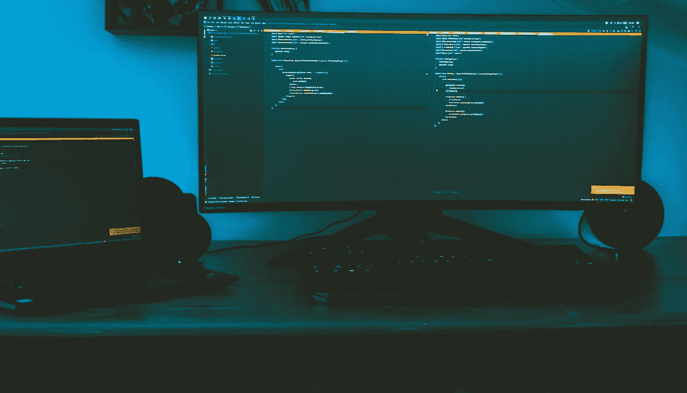
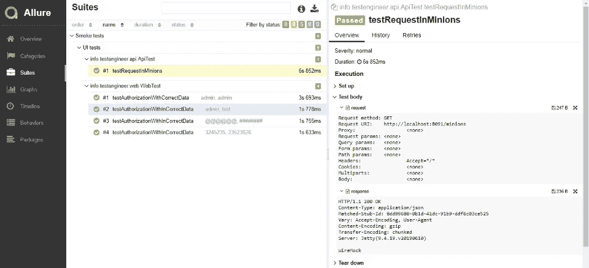

# 用 Selenium WebDriver 抓取截图的三种方法。

> 原文：<https://itnext.io/three-ways-to-how-to-capture-screenshots-with-selenium-webdriver-47358a5cd2fb?source=collection_archive---------1----------------------->



克里斯汀·桑杜拍摄的照片

当使用 Selenium 进行自动化测试时，我们经常需要截取一个网页或者网页的一部分。这可能是有用的，特别是在调试测试失败或者验证我们的应用程序行为在不同浏览器之间是一致的时候。我们可以使用测试脚本在运行时截屏，通过查看应用程序在失败时的状态来帮助我们进行错误分析。
在本文中，我们将看看使用 Selenium WebDriver 捕获屏幕截图的三种方法。

正如我们所知，自动化测试的主要目的之一是减少手工劳动。因此，使用在自动化测试运行期间捕获的屏幕截图变得非常有用。您不希望每次执行测试时都监控您的应用程序。该脚本可以获取一个屏幕截图，这有助于在测试执行完成时检查应用程序的功能/状态。当您的测试用例失败时，屏幕截图也可以帮助您，以便您可以确定您的脚本或应用程序中哪里出错了。

截图是有益的，特别是在 headless 测试执行中，您看不到应用程序的 GUI。尽管如此，Selenium 将通过截屏捕获它，并将其存储在一个文件中，以便您稍后可以验证该应用程序。

为了在 Selenium 中截屏，我们使用一个名为 TakesScreenshot 的接口，它使 Selenium WebDriver 能够捕获截屏并以不同的方式存储它。它有一个 get 方法“getScreenshotAs()”，该方法捕获屏幕截图并将其存储在指定的位置。

1。下面是使用 Selenium WebDriver 捕获网页当前可见部分的截图的基本语法:

```
File scrFile = ((TakesScreenshot)driver).getScreenshotAs(OutputType.FILE);
FileUtils.copyFile(scrFile, new File("c:\\tmp\\screenshot.png"));
```


```
public String captureScreen() {
    String path;
    WebDriver driver = new ChromeDriver();
    try {
        WebDriver webDriver = new Augmenter().augment(driver);
        File source = ((TakesScreenshot)webDriver).getScreenshotAs(OutputType.*FILE*);
        path = "./target/screenshots/" + source.getName();
        FileUtils.*copyFile*(source, new File(path));
    }
    catch(IOException e) {
        path = "Failed to capture screenshot: " + e.getMessage();
    }
    return path;
}
```

2。失败截图。

现在为了在测试失败的情况下截图，我们会使用 TestNG 的 [@AfterMethod](http://twitter.com/AfterMethod) 注释。在 [@AfterMethod](http://twitter.com/AfterMethod) 注释中，我们将使用 ITestResult 接口的 getStatus()方法返回测试结果，如果失败，我们可以使用上面的命令截图。
这里还要提到的一点是，为了唯一地标识截图文件，我们将其命名为附加了测试参数的测试方法的名称(通过数据提供者传递)。为了获得测试名称和参数，我们使用 ITestResult 接口的 getName()和 getParameters()方法。如果您没有使用任何数据提供者(就像本演示中的情况)，那么您可以使用 getName()方法来打印测试方法名称。

```
@AfterMethod 
public void takeScreenShotOnFailure(ITestResult testResult) throws IOException { 
	if (testResult.getStatus() == ITestResult.FAILURE) { 
		File scrFile = ((TakesScreenshot)driver).getScreenshotAs(OutputType.FILE); 
		FileUtils.copyFile(scrFile, new File("errorScreenshots\\" + testResult.getName() + "-" 
				+ Arrays.toString(testResult.getParameters()) +  ".jpg"));
	} 
}
```

现在为了在测试失败的情况下截图，我们会使用 JUnit 的 [@Rule](http://twitter.com/Rule) 注释。

```
@Rule
public ScreenShotOnFailure onFailure = new ScreenShotOnFailure();
```

在 [@Rule](http://twitter.com/Rule) 注释中，我们将使用 MethodRule 接口的 ScreenShotOnFailure()方法返回测试结果，如果失败，我们可以使用上面的命令截图。

```
public class ScreenShotOnFailure implements MethodRule {

    @Override
    public Statement apply(final Statement statement, final FrameworkMethod frameworkMethod, final Object object) {
        return new Statement() {
            @Override
            public void evaluate() throws Throwable {
                try {
                    statement.evaluate();
                } catch (RuntimeException throwable) {
                    makeScreenshotOnFailure();
                    throw throwable;
                }
            }

            @Attachment("Screenshot on failure")
            public byte[] makeScreenshotOnFailure() {
                return ((TakesScreenshot) DriverHolder.*getDriverThread*()).getScreenshotAs(OutputType.*BYTES*);
            }
        };
    }
}
```

3。听众。

有时候在测试自动化工程师的工作中，您需要使用额外的库来创建报告。在本文中，我将考虑 Allure 框架的例子。

Allure Framework 是一个灵活的轻量级多语言测试报告工具，它不仅以简洁的 web 报告格式非常简洁地展示了已测试的内容，还允许参与开发过程的每个人从测试的日常执行中提取最大限度的有用信息。你可以在[链接](https://docs.qameta.io/allure/)了解更多信息。

首先，您需要创建一个诱人的屏幕截图:

```
*/**
 * The class Allure screen shooter.
 */* public class AllureScreenShooter extends ExitCodeListener {

    */**
     * The class Allure screen shooter.
     *
     ** ***@param*** *result this is ITestResult.
     */* public void onTestFailure(final ITestResult result) {
        super.onTestFailure(result);
        AllureHelpers.*takeScreenshot*();

    }
}
```

接下来，您需要创建 Allure Helpers，在其中您可以使用 [@Attachment](http://twitter.com/Attachment) 注释来注册所有必要的动作。

Java 代码中的附件只是一个用 [@Attachment](http://twitter.com/Attachment) 注释的方法，它返回一个字符串或 byte[]，应该添加到报告中。

如果用 [@Attachment](http://twitter.com/Attachment) 注释的方法中的返回类型不同于 String 或 byte[]，我们在返回值上调用 toString()来获取附件内容。您可以使用如上所示的 [@Attachment](http://twitter.com/Attachment) 注释的类型参数为每个附件指定确切的 MIME 类型。但是，没有必要为所有附加文件明确指定附件类型，因为 Allure 默认情况下会分析附件内容，并且可以自动确定附件类型。处理纯文本文件时，通常需要指定附件类型。

```
*/**
 * The class Allure helpers.
 */* public final class AllureHelpers {
    */**
     * Attach text string.
     *
     ** ***@param*** *text the text
     ** ***@return*** *the string
     */* @SuppressWarnings("UnusedReturnValue")
    @Attachment(value = "AllureTextReport", type = "text/plain", fileExtension = ".txt")
    public static String attachText(final String text) {
        return text;
    }

    */**
     * Attach csv string.
     *
     ** ***@param*** *csv the csv
     ** ***@return*** *the string
     */* @SuppressWarnings("UnusedReturnValue")
    @Attachment(value = "AllureCSVReport", type = "text/csv", fileExtension = ".csv")
    public static String attachCSV(final String csv) {
        return csv;
    }

    */**
     * Get page source byte [ ].
     *
     ** ***@return*** *the byte [ ]
     */* @SuppressWarnings("UnusedReturnValue")
    @Attachment(value = "Html source", type = "text/html", fileExtension = ".html")
    public static byte[] getPageSource() {
        return *getPageSourceBytes*();
    }

    */**
     * Take screenshot byte [ ].
     *
     ** ***@return*** *the byte [ ]
     */* @SuppressWarnings("UnusedReturnValue")
    @Attachment(value = "Screenshot", type = "image/png", fileExtension = ".png")
    public static byte[] takeScreenshot() {
        return *getScreenshotBytes*();
    }

    */**
     * Take screenshot byte [ ].
     *
     ** ***@param*** *name the name
     ** ***@return*** *the byte [ ]
     */* @SuppressWarnings("UnusedReturnValue")
    @Attachment(value = "{name}", type = "image/png", fileExtension = ".png")
    public static byte[] takeScreenshot(final String name) {
        return *getScreenshotBytes*();
    }

    */**
     * Take screenshot byte [ ].
     *
     ** ***@param*** *elem the elem
     ** ***@return*** *the byte [ ]
     */* @SuppressWarnings("UnusedReturnValue")
    @Attachment(value = "Element screenshot", type = "image/png", fileExtension = ".png")
    public static byte[] takeScreenshot(final SelenideElement elem) {
        return *getScreenshotBytes*(elem);
    }

    */**
     * Get page source bytes byte [ ].
     *
     ** ***@return*** *the byte [ ]
     */* public static byte[] getPageSourceBytes() {
        return WebDriverRunner.*getWebDriver*().getPageSource().getBytes(StandardCharsets.*UTF_8*);
    }

    */**
     * Get screenshot bytes byte [ ].
     *
     ** ***@return*** *the byte [ ]
     */* public static byte[] getScreenshotBytes() {
        return ((TakesScreenshot) WebDriverRunner.*getWebDriver*()).getScreenshotAs(OutputType.*BYTES*);
    }

    */**
     * Get screenshot bytes byte [ ].
     *
     ** ***@param*** *elem the elem
     ** ***@return*** *the byte [ ]
     */* public static byte[] getScreenshotBytes(final SelenideElement elem) {
        return elem.getScreenshotAs(OutputType.*BYTES*);
    }
}
```

在我们项目的基类中，您需要调用 AllureScreenShooter:

```
*/**
 * The class Base web class.
 */* @Listeners(AllureScreenShooter.class)
public class BaseWeb {}
```



在本文中，我们看到了使用 Selenium WebDriver 捕获屏幕截图的三种方法。

在第一种方法中，我们看到了如何直接使用 Selenium 捕获整个屏幕。然后，我们学习了如何使用 TestNG 和 JUnit 捕获页面，在第三种方法中，我们考虑使用侦听器。

使用 Allure 的一个主要好处是不同的 WebDrivers 在截图时会有不同的表现。使用 Allure 将我们从这种复杂性中抽象出来，并给出透明的结果，而与我们使用的驱动程序无关。请务必查看完整的文档，以了解所有可用的支持特性。