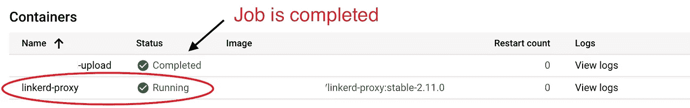

# 在 Kubernetes 作业中使用 Linkerd 的三种方式

> 原文：<https://itnext.io/three-ways-to-use-linkerd-with-kubernetes-jobs-c12ccc6d4c7c?source=collection_archive---------2----------------------->


照片由[王嘉卉·阿塞维多](https://unsplash.com/@angelyviviana55?utm_source=unsplash&utm_medium=referral&utm_content=creditCopyText)在 [Unsplash](https://unsplash.com/s/photos/infinite?utm_source=unsplash&utm_medium=referral&utm_content=creditCopyText) 上拍摄

# 问题是

将资源定义为 Linkerd 网格的常用方法有两种:

*   显式:为每个资源添加 linkerd.io/inject 注释
*   **隐式:为名称空间添加**linkerd.io/inject**注释**

**直截了当的方式比含蓄的方式更彻底。但是如果你不得不使用 Kubernetes 的作业，你会对其中任何一个有问题。工作是最棘手的资源。和 CronJobs，因为它们也可以运行作业。**

**用***linkerd.io/inject:启用*** 注释作业完成后不会终止。你可能会问——为什么？答案很简单。注入的 **linkerd-proxy** 在作业容器完成其工作后继续运行。**

**而且，如果使用隐式的方式，你会惊讶于 cron 和 jobs 开始无限运行。你可以在下图中看到这一点。**

****

**问题的典型情况**

# **解决方案**

**有三种方法可以解决这个问题:**

*   **不要对作业使用 linkerd**
*   **手动调用 linkerd 代理关闭挂钩**
*   **使用[**linkerd-await**](https://github.com/linkerd/linkerd-await)**

**让我们逐一看看。**

## **解决方案 1:不要啮合**

**如果你不想要网状作业，这是最简单的解决方案。**

**因此，如果明确定义了网格资源，就不应该为任务资源添加注释。很简单！**

**在隐式变体的情况下，您应该为每个作业禁用 linkerd 代理注入，例如，对于某些 cronjob:**

```
jobTemplate:
  spec:
    template:
      metadata:
 **annotations:
          linkerd.io/inject: disabled**
```

***这里的主要缺点是，有时你需要网格来完成工作。例如，从 2.11.0 开始，Linkerd 支持授权策略。如果策略要求 mTLS 身份验证，则不可能请求其他 pod，但是作业不在网格中。***

## ***解决方案 2:手动调用关机挂钩***

***Linkerd 代理有一个关闭挂钩[可以从同一个 POD 的另一个容器中调用。](https://github.com/linkerd/linkerd2-proxy/commit/24bee8cbc5413b4587a14bea1e2714ce1f1f919a)***

***实现它有几种选择。例如，可以在作业结束时调用它，只需从代码中调用。但是这需要额外的工作。我们应该将此功能添加到每项工作或中间件中，重新构建所有功能，然后推出。*痛苦的*。***

***当我们模板化每个作业时，我们可以尝试在主要流程结束后添加额外的步骤:***

```
*command: ["/bin/sh"]
args: ["-c", 
       "<job_run_command_here>",
       "; **CODE=$?; wget --post-data hello=shutdown** [**http://localhost:4191/shutdown**](http://localhost:4191/shutdown)**; exit $CODE**;"]*
```

***很丑，但是很管用！***

******这里的*** 主要缺点是容器可能还没有**卷曲**或 **wget** ，或者有些容器有一个而有些有另一个。还有，真的不好看。***

## ***解决方案 3:使用 linkerd-await***

***linkerd-await 是一个命令包装器，它轮询 linkerd 是否准备就绪，并可以在命令结束后调用 shutdown hook。***

***GitHub 上的官方例子建议在构建阶段将其添加到容器中。这再次意味着，我们需要为所有作业重建所有 docker 映像，以支持如下命令:***

```
*command: ["/linkerd-await"]
args: ["--shutdown", "--", "/coolcommand"]*
```

****这里的主要缺点是，我们应该在构建阶段添加一个第三方组件，将它保存在 docker 映像中，并在每次包装器升级时都这样做。这需要时间和努力。****

## ****解决方案#3.1:使用 linkerd-以另一种方式等待****

****但是，如果我们尝试使用解决方案 2 中的方法和解决方案 3 中的包装器呢？****

> ****我们不想为作业重建映像，但我们希望使用包装器，因为它非常好。****

****因此，我们需要以某种方式将包装器注入到作业容器中，并直接调用它。欢迎来到豆荚卷。****

****首先，将空目录卷添加到 POD 定义中:****

```
****volumes:
- name: linkerd-await
  emptyDir: {}****
```

****其次，添加一个 init 容器，该容器带有一个将 **linkerd-await** 复制到卷的包装器:****

```
**# Dockerfile
FROM alpine:latest
ARG LINKERD_AWAIT_VERSION=v0.2.4RUN apk add curl
RUN curl -sSLo /tmp/linkerd-await [https://github.com/linkerd/linkerd-await/releases/download/release%2F${LINKERD_AWAIT_VERSION}/linkerd-await-${LINKERD_AWAIT_VERSION}-amd64](https://github.com/linkerd/linkerd-await/releases/download/release%2F${LINKERD_AWAIT_VERSION}/linkerd-await-${LINKERD_AWAIT_VERSION}-amd64) && chmod 755 /tmp/linkerd-await# Kubernetes POD definition
initContainers:
- name: linkerd-await
  image: "<image>/linkerd-await:0.2.4"
 **command: ["cp"]
  args: ["/tmp/linkerd-await", "/linkerd-await"]
  volumeMounts:
  - mountPath: /linkerd
    name: linkerd-await****
```

****第三，将卷附加到主容器，并用 **linkerd-await** 包装基本命令:****

```
****volumeMounts:
- mountPath: /linkerd
  name: linkerd-await**
command: ["/linkerd-await"]
args: ["--shutdown", "--", "/coolcommand"]**
```

****就是这样！****

*******这里的主要缺点是*** 增加了一个 init 容器，使得 POD 定义更加复杂。但是这里的优点是有益的。我们不需要重新构建，只需要一个控制点就可以控制舵图，并使用推荐的方法在作业使用的情况下关闭 linkerd 代理。****

# ****摘要****

*   ****请记住，如果没有额外的工作，linkerd 不会与 Kubernetes Jobs 或 CronJobs 一起工作****
*   ****如果作业不需要网格，则禁用代理注入****
*   ****在另一种情况下，建议使用 linkerd-await 包装器****
*   ****在规模上，如果你有几十个工作，尝试使用 POD volume 注入包装到基础容器****