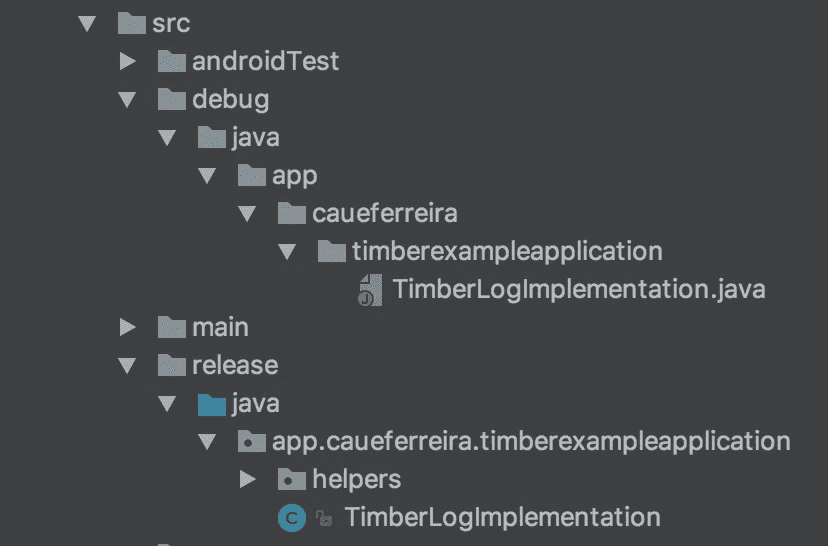
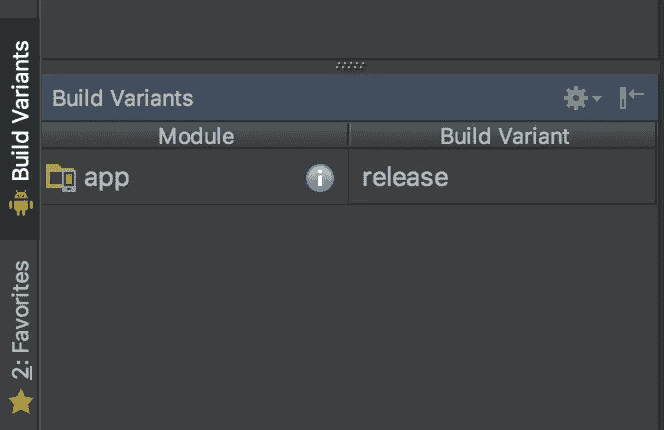

# 木材:增强您的伐木体验

> 原文：<https://itnext.io/timber-enhancing-your-logging-experience-330e8af97341?source=collection_archive---------0----------------------->

我们都听说过日志，知道如何使用它们；我们经常这样做。我们喜欢时不时地使用日志，我们使用日志进行 api 响应、异常、简单的*if else*debug；为了一切。但是，这里是交易:我们应该继续这样做吗？我的意思是，当我们要发布我们的应用程序时，我们必须检查所有的项目，寻找每一个日志，该死的那些日志很难找到！

假设我们有几个日志，我们想在发布应用程序时使用它们，我们该怎么做呢？当然我们可以用我们的 IDE 找到所有的*日志* ***。**** 行，但最终我们会以过多的行而告终。当发现数百行时，我们将做什么？一个一个删除？评论他们所有人？在我们发布应用程序后，我们想再次检索所有日志，我们该怎么办？我们会删除所有行，编译项目，然后进行 git 检验吗？听起来有点蹩脚，不是吗？

一个人可以说*“我有解决方案！让我们创建自己的日志方法，并检查它是否是一个调试版本；如果是，我们记录，否则我们不记录！”。*

嗯…它会工作，但是如果我们想要记录不同的优先级，我们将不得不创建多个方法或者添加优先级作为参数，这样我们就可以使用正确的日志。

尽管我们可以编造出一个像样的解决方案，但我们都知道我们不应该重新发明轮子，而且，正如你可能知道的那样:有一个更简单——可能更好——的解决方案；遇见[木材](https://github.com/JakeWharton/timber)。


**Timber** 是——很少的词 Android 的 *Log* 类的 API。它基本上增强了来自 Android 的日志。我们通过种植一棵**树**来做到这一点，并且每次我们记录一些东西时，行为可能会根据哪棵**树**实现最终被调用而改变。

# [计] 下载

```
compile 'com.jakewharton.timber:timber:4.5.1'
```

# 它是如何工作的

1—创建一个**树**实例并尽快种植。(尽快通常意味着我们应该将它添加到 *onCreate* 中的*应用程序类*

2 —使用**木材**的调用而不是*日志开始记录。*

3 —就这样，我们准备好了。

说真的，就是这么难。

不管有多难，我不会只写这三个步骤。让我们更多地了解一下**木材**是如何工作的，以及我们可以用它来做什么。

# 木材类伐木

在我们设置好我们的**树**之后，我们应该使用**木材**类开始伐木，这真的很简单。它包含与*日志*类相同的日志方法，例如:*。五、。d，。我，。w* 和*。e* 。因为它们是相似的，如果我们正在开发一个项目，现在我们想使用**木材**库，我们可以简单地替换所有的*日志*。谓为**木材*。* *** 来电；但这并不特别，不是吗？

注意到**木材**的叫声不具备*标记*吗？那是因为 **Timber** 会找出它被调用的是哪个类，并且会添加那个作为它的*标签。*

同样，**木材**有*。搞什么鬼*著名的*搞什么鬼*..我是说，*多么可怕的失败*。与*错误*不同，顾名思义，它是一个最终可能会发生也可能不会发生的错误，如果是这样，我们知道如何处理它们并找出解决方法。 *WTF* 通常是一个如此深刻和有问题的错误，我们没有办法从中恢复，通常 *WTF* 应该——取决于我们的应用程序——[终止你的应用程序，并发送一个错误报告](https://developer.android.com/reference/android/util/Log.html#wtf(java.lang.String,%20java.lang.String))或更重要的东西。

## Lint 规则

木材有一些非常方便的规则。它们分为两组:*错误*和*警告*。正如你可能想象的那样，*错误*使我们的应用程序无法编译，而*警告*可以，正如它所说；显示警告，但允许我们的应用程序编译。
如果我们提供了错误数量的参数，在使用字符串插值时使用了不同类型的参数，或者标签的大小超过了 [Android 的最大长度](http://stackoverflow.com/a/28168739/3506842)，则会触发*错误*规则。
如果我们使用 *Log* 类来记录，一个 *String.format* 或 *concat* 或 *Strings* 在一个 **Timber** 调用或记录一个*异常*时，会触发一个*警告*规则。你可以在这里查看更多规则。

# 种植我们自己的树

正如在*步骤 1* 中所说，我们应该创建一个**树**和*植物*的实例，但是，它是什么呢？一个**树**基本上是一个包含我们日志行为的类。要实例化它，我们必须*扩展*一个**树**类*并实现 log *方法*。每次我们使用**木材**伐木时，它都会经过我们实例化的**树**——如果我们种植了多棵**树**，它会经过所有这些树——并且会按照我们想要的方式行动。
例如，假设我们发布应用程序时不想记录任何内容，我们该怎么办？首先，我们创建一个**树**，它在 log 方法中不做任何事情。*

然后我们*将*植入到 *onCreate* 方法内的应用程序类中:

说完后，没有**木材。*** 会记录一些东西，但我们希望只有在发布我们的应用程序时才这样做；为此，我们可以简单地添加一个 *if。*

我们可以走了！来测试一下吧！

如果你测试我们的应用程序，你会注意到它不会记录任何东西。发生了什么事？嗯，我们用的是**木材。*** 当我们没有为调试 app 种植的**树** *！太可惜了！尽管我们的应用程序发布时工作正常，但在调试时，我们的应用程序没有**树**。我们如何解决这个问题？我必须创建一个**树**仅仅是为了调试的目的吗？嗯… *有点儿的；*你不必创建一个，但你必须*种植*一个。
**木材**船带着**树**准备调试！认识一下**调试树**。简单的*植物*它和我们的应用程序将完美地工作。*

如果是*调试 app* ，它会使用**调试树**如果是*发布 app* ，它会使用**非日志树**。我们不仅修复了我们的应用程序，还摆脱了那个讨厌的*，如果不是*。但是，嘿，因为我们没有用我们发布的应用程序登录，如果出了问题；我们要做什么？我们把我们的*错误*和*警告*发送到我们的*崩溃库*怎么样？听起来很棒，不是吗？
嗯，那真的很简单！只需抓取您的自定义**树**并添加一个*行为*，这样当您记录一个*错误*或*警告*时，它就会调用您的*崩溃库*！

就是这样。当应用发布时，*错误*和*警告*将被发送到我们的*崩溃库*，其他所有日志级别将被忽略。当我们发布我们的应用程序时，我们不再需要继续搜索和删除——或评论——日志行。

但是你知道吗？我不喜欢那个 ***if (BuildConfig。*调试)**。你看，这是一种 ***if production*** 听起来很奇怪，幸运的是我们可以解决这个问题——可能还有许多其他问题——只需为不同的*构建变体*创建类。不知道该怎么做？别担心，我会掩护你的。

# 使用构建变体

首先，让我们创建一个类来处理 **Timber** 实现，这样我们就可以从我们的*应用程序*类中移除逻辑。

然而，我们仍然拥有这个*如果否则*我说过我们将放弃它，因为我们必须在同一个*包*中创建两次*TimberLogImplementation*类。你没听错:*两次*。

为此，我们必须在 *src* 中创建两个目录:*发布*和*调试*。在这个目录中，我们简单地创建另一个名为 *java* 的目录，并正常地创建*包*，就像我们在*主*目录中所做的一样。使用*项目*视图，我们的目录应该看起来像这样:



一旦你创建了它，根据你的*构建变体*，IDE 将编译其中一个目录。



创建好这个之后，我们重构我们的*TimberLogImplementation*类，这个 *release* 类应该只有 *release* 实现。

而我们的 *debug* 类将只有 *debug* 实现——你猜对了。

搞定了。现在，当您将*构建变体*更改为*调试*时，它将编译`debug/java/.../TimberLogImplementation` ，当您更改为*版本*时，它将编译`release/java/.../TimberLogImplementation`。没有更多的讨厌的**如果生产**，一切都很棒！但是等等，还有更多！我还有最后一笔奖金！

比方说，我们希望在调试中获得更多信息，例如日志的类和行。通常我们会简单地在消息中添加这些，像`Timber.i("MyClass:13-Something happen here!")`但是有一个问题——实际上很多，但是让我们保持简单——如果我们添加更多的代码，日志*的行*可能会不一样，我们可以在一些*复制&粘贴*之间添加错误的类，等等。幸运的是，我们可以简单地做到以下几点。

我们正在截取我们的 *DebugTree* 的日志，添加在开头的*类*名称和行号！

如果你想要一个有木材的项目，你可以检查这个项目[](https://github.com/caueferreira/timber-example)**我已经添加到我的 Github。**

**我希望你喜欢这篇小文章，我很快会带着更多的东西回来。从现在开始，我希望你在你的项目中总是使用**木材**！**

**保持牛逼:)**