# 外部系统计时器及其运行时间

> 原文：<https://itnext.io/timers-and-when-they-run-5614d683c973?source=collection_archive---------0----------------------->

这是一篇关于 OutSystems 平台的文章，特别是关于定时器(以及它们何时运行)。

更新:我添加了一个段落，明确描述了当您手动(或编程)启动一个计时器时会发生什么，并且该计时器当前处于停用状态。感谢 Rui Barradas 指出这一遗漏。

# 你说的这个计时器是什么？

计时器是外部系统平台的批处理作业。它们异步运行，可以运行很长时间，通常用于处理数据。对于任何使用 OutSystems 平台的严肃企业来说，它们都是无价的。最近，我看到了很多关于平台如何处理定时器，何时调度定时器，以及在失败的情况下多长时间重启一次的困惑，所以我决定写一篇文章来澄清所有这些。

OutSystems 平台的核心组件之一是*调度器*。调度程序最终是一个名为*外部系统调度程序服务*的 Windows 服务。在服务中心，管理菜单的环境配置页面显示其状态:下面应该有一个快乐的绿色复选标记。

在“*调度程序”*下面应该有一个快乐的绿色复选标记。事实上，在“环境健康”页面上应该有很多快乐的绿色勾号。

为了描述调度程序做什么，我们首先需要看一下定时器本身，以及如何配置它们。

# 计时器，到处都是计时器

像任何其他逻辑一样，定时器也是在 Service Studio 中创建的。要创建计时器，请选择进程选项卡，右键单击“计时器”文件夹，然后选择“添加计时器”。

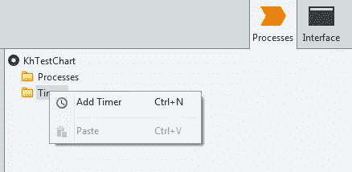

这就是你如何做到这一点，宝贝…

创建新计时器后，首先要注意的是它有几个属性:

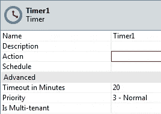

像树中的大多数对象一样，计时器也有属性。

值得仔细研究的是以下内容:

*   名称:计时器的名称。它被用作定时器唤醒动作的一部分；
*   Action:这是计时器启动时调用的服务器操作。它包含定时器的逻辑。如果选择*新服务器动作*，Service Studio 将创建一个新的服务器动作，其名称与计时器的名称相同。如果您随后更改了动作的名称，计时器的名称也会更新。如果你改变了计时器的名字，幸运的是动作的名字保持不变；
*   Schedule:这是计时器的时间表，它定义了计时器运行的频率和时间。注意，这里指定的任何时间都是服务器的*本地时间，所以知道它在哪个时区运行是件好事；*
*   超时时间(分钟):这是分配给计时器的最长时间。跑久了，就被杀光了；
*   优先级:计时器的优先级。当准备运行的计时器数量超过允许连续运行的最大计时器数量时(稍后会有更多计时器)，优先级最高的计时器将首先运行。

初始时间表通过时间表编辑器弹出窗口设置。这样可以轻松创建时间表。但是，请注意，稍后可以在服务中心覆盖该计划。

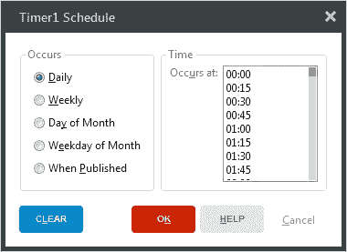

时间表编辑器弹出窗口。如果你说“shedule”而不是“skedule ”,你可能对即将到来的英国退出欧盟感到焦虑。如果不是，你应该是。

“发布时”选项允许计时器在其模块发布后运行，这对于自举之类的事情来说是理想的。

关于如何[正确设计](https://www.outsystems.com/learn/courses/43/master-class-on-best-practices-and-timers/?StartCourse=False)定时器的逻辑，关于提交数据、检查即将到来的死亡等等，有许多[最佳实践](https://success.outsystems.com/Documentation/Best_Practices/Performance_Best_Practices/Performance_Best_Practices_-_Logic#Avoid_long-running_timers_and_batch_jobs)。但是这些超出了本文的范围。

# …开拍！

一旦编写、测试和部署了计时器逻辑，就可以运行计时器了。如果在开发期间指定了时间表，新创建的计时器将获得该时间表。如果没有指定时间表，计时器根本不会运行，直到您在服务中心手动指定时间表。为此，导航到模块的页面(通过 Factory / eSpaces)，单击 Timer 选项卡，然后单击特定的计时器。

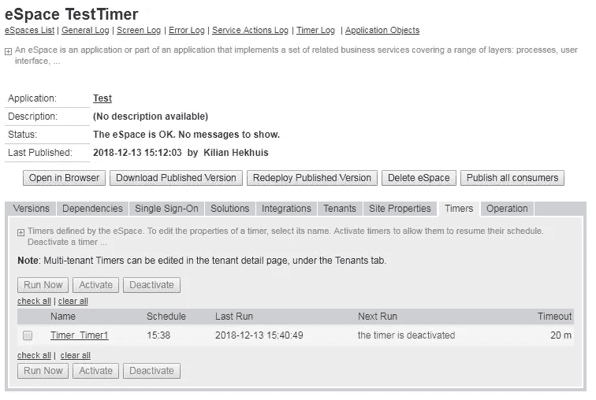

由于历史原因，在 Service Studio 中创建的模块在 Service Center 中被称为“空间”。保罗认为这是有史以来最糟糕的名字选择。

在计时器的详细信息页面上，你会看到无数的选项。

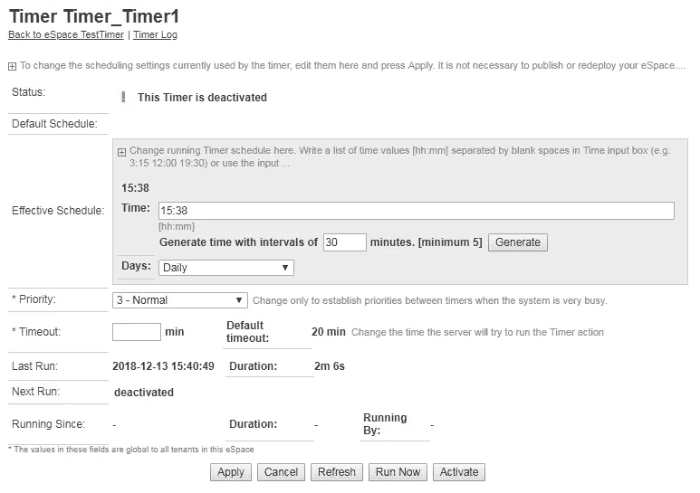

也许不是无数，但仍然很多。如果有什么不同的话，这表明 UI 设计不应该被轻率地考虑。

在顶部，有定时器的*状态*:它显示定时器是*激活*，即准备运行，还是*去激活*，即无论时间表怎么说都不会运行。接下来是*默认时间表*。如上所述，这是在开发时设置的时间表。*有效时间表*顾名思义就是当前处于活动状态的时间表。它显示的参数与 Service Studio 弹出窗口中显示的参数相同(但名称略有不同，容易混淆，例如，弹出窗口的*发生时间*是服务中心的*天数*),与弹出窗口一样，可用信息会随着*天数*的设置而变化。

Service Center 提供但 Service Studio 没有的一个巧妙选项是生成计时器运行的时间间隔，例如每十分钟一次。最小间隔是五分钟，这是有意义的，因为计时器是用于需要一些时间的批处理作业的。

该页面还显示了计时器最后一次运行的时间，运行了多长时间，以及下次运行的时间安排(如果它没有被停用)。如果它现在确实在运行，也会显示出来(运行的*是它开始运行的日期/时间，而不是启动它的人)。*

在所有信息下面有五个按钮。这些是:

*   应用:保存您对计划所做的任何更改；
*   取消:取消您所做的任何更改；
*   刷新:刷新页面。用于刷新“上次运行”、“下次运行”和“运行时间”信息；
*   立即运行:直接启动此计时器，不考虑日程或状态；
*   激活/去激活:顾名思义，激活一个去激活的定时器，或者去激活一个活动的定时器。

除了通过时间表和计时器详细信息页面上的“立即运行”按钮，还可以通过编程来运行计时器。这是通过定时器的唤醒动作来完成的，它显示在树的下面。

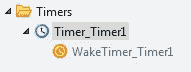

醒醒，你这个瞌睡虫，穿上衣服，摇醒你的床…

您可以将操作拖到画布上，或者通过“选择操作”弹出式菜单选择它，该菜单位于“计时器”文件夹下。

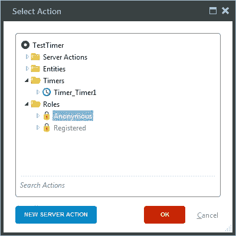

定时器 Timer_Timer1 位于定时器文件夹下方。现在快速说十遍。

当您希望用户能够启动计时器时，这很方便，例如，当用户上传了一个需要处理的大型 Excel 文件时，或者在计时器操作本身中，当等待终止时，它会重新启动自己，然后结束。这些“手动”启动的定时器与预定定时器的交互方式将在后面描述。

# 像老板一样配置

现在我们知道了有一个调度器，以及如何创建定时器和调度它们，让我们看看调度器如何调度定时器。

首先，需要考虑几个配置选项，首先是可以并发运行的定时器数量。出于性能原因，该平台对可以同时运行的不同计时器的数量进行了限制。你不希望 20 个安排不当的计时器同时运行，导致你的服务器突然停止工作。默认情况下，三个定时器可以并行运行。注意，这是三个不同的*定时器。同一个定时器*永远不会*同时运行不止一次。如果您需要并发数据处理，BPT 是一个不错的选择。如果您想要配置不同的号码，您需要访问平台配置工具。在调度选项卡上，有一个 *Max。并发计时器*设置。*

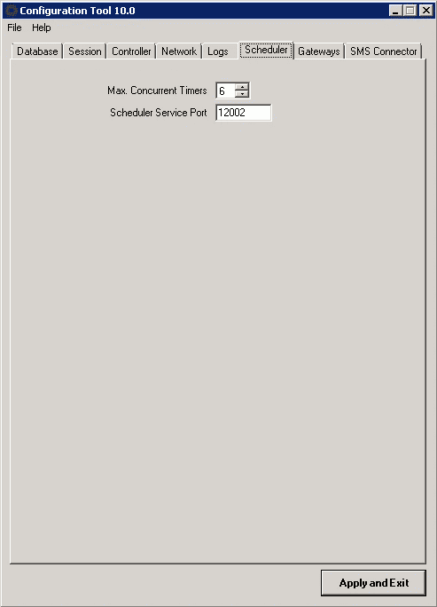

这么大的空间，这么少的选择…

其次，还有执行尝试的次数。这个数字指定计时器运行的频率，以防它在运行时失败。这里的“失败”是指发生了未捕获的异常，过早地中止了计时器，或者计时器被调度程序终止，因为它没有在配置的超时之前完成。在任一情况下，如果执行尝试次数设置为大于 1 的值(默认值为 3)，调度程序将再次调度计时器，直到它成功或尝试次数达到上限。

执行尝试次数在服务中心*环境配置*页面(*管理*菜单)*定时器执行尝试次数*设置中进行配置。

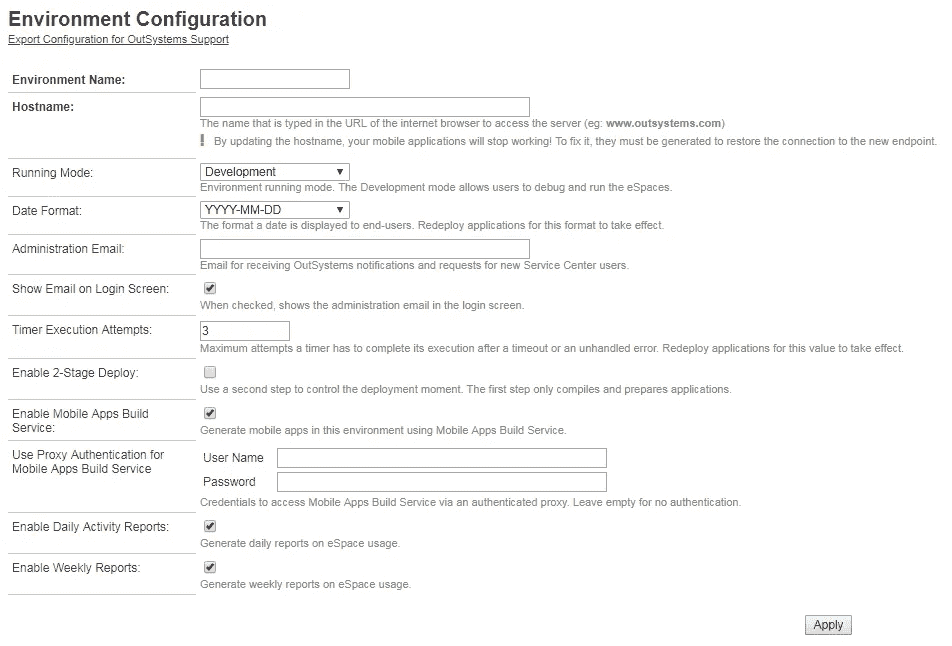

如果计时器在三次尝试后仍然有效，他们可以获得自由。

# 像没有明天一样计划

如上所述，每一个被启用并有时间表的定时器都由调度器进行调度。一旦计时器激活(或首次发布)，将计算并存储下一次运行日期/时间。调度程序频繁地查看(一分钟几次)所有活动计时器的时间表，并通过将下一次运行日期/时间与当前日期/时间进行比较来确定哪些计时器适合运行。任何下次运行时间等于或早于当前日期/时间的计时器都会被放入调度程序的内部运行队列中。

接下来，调度程序查看队列中的计时器数量，按优先级排序(最低的优先)和下一次运行日期/时间排序(较早的优先)。如果当前运行的定时器数量少于配置的最大并发定时器数量，则调度第一个符合条件的定时器立即运行，调度器将指示平台运行它。定时器启动后，将考虑下一个可伸缩定时器(如果可能，将启动)，依此类推。

注意，记住上面的规则，计时器运行的实际时间只是一个“值得拥有”的时间——不能保证计时器将在下一个运行日期/时间实际运行，因为调度程序尽最大努力调度计时器；实际日期/时间可能会有很大偏差(尤其是当符合条件的计时器数量超过配置的连续数量时)。

当定时器成功完成执行时(即，按时且没有抛出未捕获的异常)，调度器计算定时器的下一次运行日期/时间(如果定时器有一个不是“发布时”的调度)，并相应地更新其下一次运行(之后，它再次参与上述的合格性检查)，*除非*已经有一个不是用于启动当前定时器的下一次运行集。后者在手动计时的情况下很重要(见下文)。

当定时器没有成功结束时，调度器检查已经尝试运行定时器多少次。如果计时器已达到其最大执行尝试次数，调度程序将放弃，并像成功执行一样，计算并更新下一次运行。

# 混合起来

以上都很简单，但是有一种情况稍微复杂一些:前面描述的“手动”计时器运行。不过，处理这些问题的方式非常简单:当执行一个 WakeTimer 动作时，下一次运行会被当前的日期/时间覆盖，使得计时器立即可以运行。计时器结束后，调度程序会像任何其他计时器运行后一样计算下一次运行(除非计划了另一次手动运行，如上所述)。这会导致以下行为:

*   当计时器因其计划而运行，并且请求手动运行时，下一次运行将设置为当前日期/时间。当计时器结束时，调度程序检测到自计时器启动以来下一次运行已被更改，因此不会重新计算下一次运行。这使得计时器可以直接运行(因此它将在结束后很快重新启动)。当“手动”运行结束时，将根据计时器的时间表设置下一次运行(除非在*其*运行期间，请求另一次手动运行)。

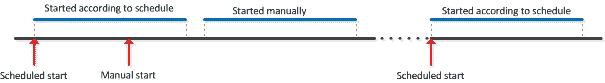

计时器运行时的单次手动启动会推迟手动运行，直到当前运行结束。手动运行完成后，将根据计划安排新的运行。

*   当计时器正在运行时，手动启动多次只会更新下一次运行多次。一旦计时器完成运行，它将再次变得无效，并将再次运行一次(除非在*的*运行期间，再次请求另一次手动运行)。

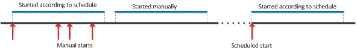

计时器运行时多次手动启动只会导致一次手动启动。只手动启动一次没有区别。

*   如果安排了计时器，但在下次运行的日期/时间之前安排了手动运行，则下次运行将被覆盖。当计时器结束时，如果“旧的”下一次运行仍在未来，调度程序将再次计算并存储该日期/时间。

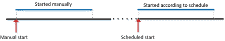

手动运行完成后，将根据计划计算下一次运行。

*   但是，如果旧的下一次运行是在过去(这意味着手动运行仍在运行，而正常情况下计划的运行应该已经发生)，则跳过该运行，因为计划程序将根据计划计算下一次运行，因此总是在将来。

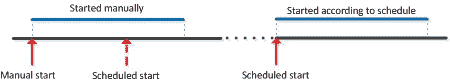

如果一个定时器本应根据计划运行，但由于手动启动(或计划启动)而仍在运行，则跳过计划启动(实际上，它的下一次运行将被覆盖)。手动运行完成后，将根据计划计算下一次运行。

有一种情况你应该知道，这可能会让你措手不及:当一个定时器被停用，你手动运行它，调度程序将计算一个新的下一次运行，如上所述。如果定时器有一个时间表，这意味着它将根据该时间表再次激活！其原因是，停用的定时器实际上具有 3000–01–01 的下一次运行，当定时器由当前日期/时间手动启动时，该运行将被覆盖，如上所述。因此，在这之后，调度程序没有办法知道定时器被停用，因此，如果定时器有一个时间表，调度程序将根据它计算下一次运行，有效地激活定时器！只有当没有计划时，计划程序才会将下一次运行设置为 3000–01–01，并且手动运行后计时器会再次显示为停用状态。所以如果你有一个只能手动启动的计时器，确保它没有时间表。

*Addition 2023–02–17:*我上面没有描述的一个具体情况是，Eduardo Jauch 今天向我指出了默认时间表设置为“发布时”，但有效时间表设置为其他时间。在这种情况下，且仅在这种情况下，默认调度不会被忽略，当模块发布时，计时器将运行。由于“发布时”运行被视为手动运行，因此在“发布时”运行之后，计划程序会计算新的下一次运行，如上面对手动运行所述。

# 运行计时器，运行！

既然我们已经确定了计时器如何以及何时运行，你可能会问自己“但是*它们在哪里运行呢？”这似乎是一个微不足道的问题:如果你有一个单一的前端服务器，这是他们运行的地方。然而，如果您有多个前端服务器，这就变得不那么简单了:有可能指定一个或多个服务器运行计时器，而其他服务器不运行计时器。为了进行配置，服务中心有*前端服务器*配置页面(*管理*菜单)。当您访问该页面时，它会显示所有已配置的前端服务器的概述，显示它们是否已启用、它们是否执行计时器和进程，以及它们是否发送电子邮件。*

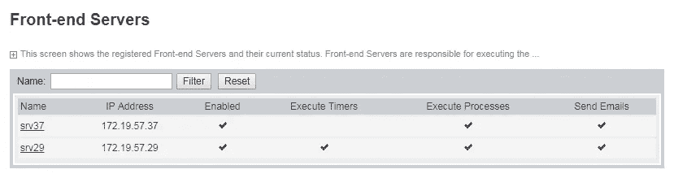

前端服务器概述。srv37 不允许执行定时器。真扫兴。

当您单击服务器名称时，服务中心会显示详细信息页面，允许您配置各种选项。

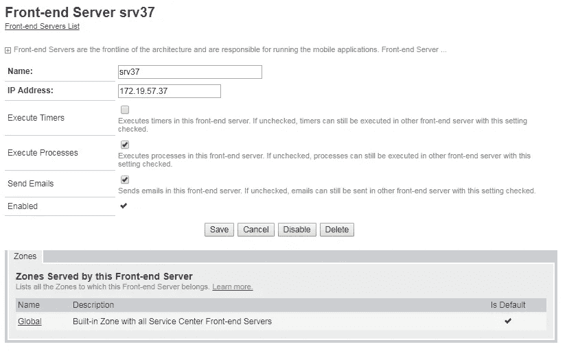

看到未选中的复选框了吗？我知道你想检查它，运行计时器规则！

请注意“执行定时器”复选框:正如下面的帮助文本所说，如果选中，服务器可以运行定时器，如果没有选中，它不能。也就是说，调度程序服务仍然运行在前端，但是它知道不允许调度计时器。

如果你有多个可以运行定时器的前端，你永远不知道它们最终在哪里运行。这些前端的调度程序协作运行计时器，这样就不会有一个服务器最终运行所有的计时器。精确的算法是一个黑盒，可能只有维护调度程序服务的外部系统工程师知道(尽管它可能像先来先服务一样简单)。

那么，为什么要拒绝服务器运行计时器呢？很明显是因为性能原因。忙于向用户提供页面的前端服务器可能不是运行繁重批处理作业的最佳服务器。因此，通常的做法是让一台或多台服务器专用于服务用户页面，另一台或多台服务器专用于运行计时器。

# 我用我的小眼睛窥探…

在一个理想的世界里，一切都运行得很好，几乎没有必要去关注计时器:如果它们被很好地编程，并且基础设施的性能很好，它们只是不停地运转，做它们注定要做的事情。然而，在这样一个理想的世界里，可能也有彩虹色的独角兽在嬉戏——不幸的是，我从未见过它们。实际上，能够关注计时器以及它们是否运行良好是非常重要的。

在服务中心有几个地方你可以看到发生了什么。首先，当然还有*错误日志*。如果计时器遇到问题，错误日志会显示令人不快的错误，调度程序服务会告知是否会安排重试或 not⁴.

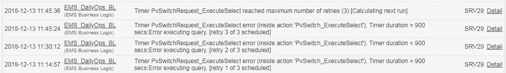

实际上，日志是一个谎言:总共只有三次运行，所以重试两次，而不是三次。

单击“详细信息”可能会告诉您更多关于导致计时器中止的原因。

其次，有已经提到的*环境卫生*页面。除了显示调度程序是否启动并运行之外，它还显示了下一个运行的 20 个定时器的列表，以及任何实际运行的定时器。

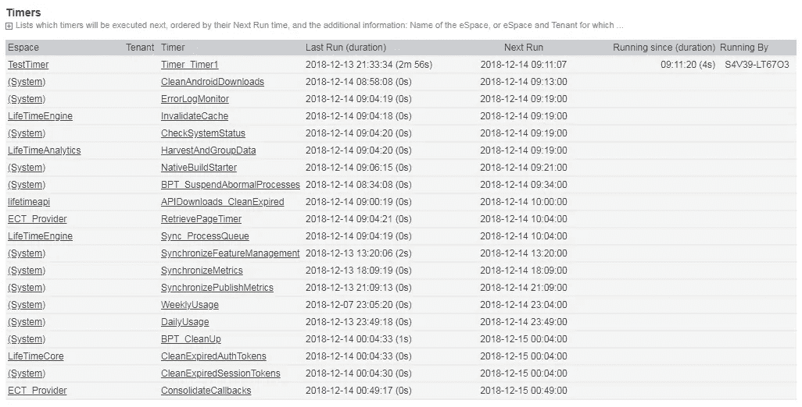

与一盒巧克力不同，时间表显示了你将会得到什么。

第三，还有*计时器日志*。计时器日志显示所有已完成运行的计时器(无论成功与否)，以及它们的开始时间、原始计划时间(“本应运行时间”)和下次运行时间。如果不成功，则会出现一个“错误”链接，该链接会重定向到与错误日志中的页面相同的页面。

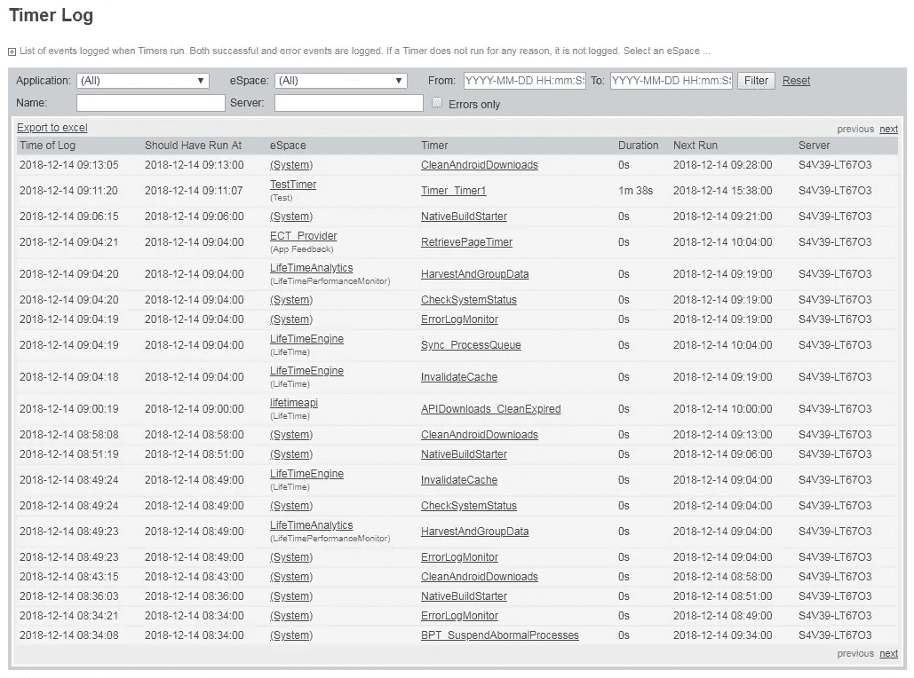

一切都很好，看不出有什么差错。

那么，差不多就这样了。如果你有任何关于计时器的问题，可以去 [OutSystems 社区论坛](https://www.outsystems.com/forums)咨询。如果真的需要，你也可以在那里见我。

或者，如果您愿意，也可以选择 cronjobs 或 tasks。

因为这个工具运行在服务器本身上，如果你的平台是基于云的，你就不能访问它。在这种情况下，如果需要更改，请联系 OutSystems 支持。

由于计划程序是 Windows 服务，它不能直接启动计时器。相反，该平台公开了一个专用的计时器 web 服务，当调度程序需要启动计时器时会调用该服务。

⁴注意到调度器安排重试的方式有点奇怪:由于指定最大尝试次数的属性被称为“计时器执行尝试次数”(如前所示)，并且计时器的第一次启动也是第一次尝试，重试次数实际上比尝试次数少一次(毕竟第一次重试是第二次尝试)。然而，日志显示调度程序实际上调度了该数量的*次重试*，但是在最后一次重试开始时直接中止，因为已经达到了最大重试次数(在日志中也可以看到，参见屏幕截图)，之后计算下一次运行(即下一次“正常”运行，而不是重试)。