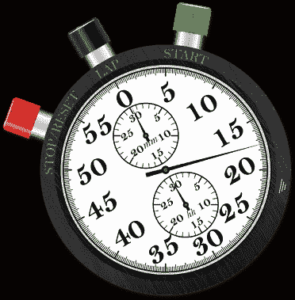
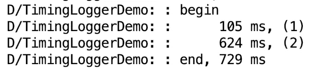

# TimingLogger:一种测量执行时间的惯用 Android 方法

> 原文：<https://itnext.io/timinglogger-an-idiomatic-android-approach-to-measuring-execution-time-8ac10a8fa0ba?source=collection_archive---------4----------------------->

## 通过实例学习



在你作为 Android 开发人员的职业生涯中，你最终会遇到一些性能不佳的代码。也许这是你创作的代码，也许这是你继承的代码，但它的起源并不重要。代码现在在你的管理下，你的团队和你的用户都在看着你，这个完美的 Android 摇滚明星，来解决困扰应用的性能问题。

开发 Android 代码的开发人员可以采用几种不同的方法来衡量代码块的性能。由于许多 Android 开发人员都有 Java 编程背景，您将看到的一种更常见的策略是通过调用`[System.nanoTime()](https://docs.oracle.com/javase/7/docs/api/java/lang/System.html#nanoTime())`来包围可疑代码，如下所示:

```
*// capture the start time* **val** startTime = System.nanoTime()

*// suspiciously long running block of code* **var** number = 0L
**for** (x **in** 0..10_000_000)
    number += x

*// capture the end time* **val** endTime = System.nanoTime()

*// dump the execution time out* Log.d(**"TimingLoggerDemo"**,**"${**TimeUnit.**MILLISECONDS**.convert(endTime -
        startTime, TimeUnit.**NANOSECONDS**)**} ms, (1)"**)
```

这很好，而且它肯定会完成工作，但是在大多数情况下，您正在分析的方法中会有多个潜在的调用或代码块，它们可能是执行时间接收器的来源。下面的例子演示了使用`[System.nanoTime()](https://docs.oracle.com/javase/7/docs/api/java/lang/System.html#nanoTime())`或者它的一个变体(例如`System.elapsedTime()`)会很快变得难以使用:

```
*// capture the start time* **var** startTime = System.nanoTime()

*// suspiciously long running block of code* **var** number = 0L
**for** (x **in** 0..10_000_000)
    number += x

*// capture the end time* **var** endTime = System.nanoTime()

*// dump the execution time out* Log.d(**"TimingLoggerDemo"**,**"${**TimeUnit.**MILLISECONDS**.convert(endTime -
        startTime, TimeUnit.**NANOSECONDS**)**} ms, (1)"**)

*// capture the start time* startTime = System.nanoTime()

*// another suspiciously long running block of code* callSomeMethod()

*// capture the end time* endTime = System.nanoTime()

*// dump the execution time out again* Log.d(**"TimingLoggerDemo"**,**"${**TimeUnit.**MILLISECONDS**.convert(endTime -
        startTime, TimeUnit.**NANOSECONDS**)**} ms, (2)"**) ...and on and on for each possible culprit
```

令人欣慰的是，Android 的实用程序包中有一个更简单、更简洁、更惯用的类，可以用来分析像上面这样有问题的方法。引入 [TimingLogger](https://developer.android.com/reference/android/util/TimingLogger) 类(或者*重新引入*，因为它从 API Level 1 开始就可用了)！

人群听到计时日志类时的反应

让我们重写上面的示例，但是这次我们将利用 [TimingLogger](https://developer.android.com/reference/kotlin/android/util/TimingLogger.html) 类来捕获执行时间度量。我们走吧。是的，是的，我们会:

```
*// instantiate a timing logger* **val** timingLogger = TimingLogger(**"TimingLoggerDemo"**, **""**)

*// suspiciously long running block of code* **var** number = 0L
**for** (x **in** 0..10_000_000)
    number += x
timingLogger.addSplit(**"(1)"**)

*// another suspiciously long running block of code* callSomeMethod()
timingLogger.addSplit(**"(2)"**)

*// dump all of the execution times out* timingLogger.dumpToLog()
```

运行上述代码的输出如下:



定时日志输出

所以基本上你只需要实例化一个 [TimingLogger](https://developer.android.com/reference/kotlin/android/util/TimingLogger.html) 对象，然后为你想要测量的每段代码调用`[addSplit(*split-label)*](https://developer.android.com/reference/kotlin/android/util/TimingLogger.html#addsplit)`方法。一旦你把所有的[香蕉船](https://www.braums.com/wp-content/uploads/2018/06/BananaSpit.jpg)都准备好了，你就调用`[dumpToLog()](https://developer.android.com/reference/kotlin/android/util/TimingLogger.html#dumptolog)`把测量结果写到 [logcat](https://developer.android.com/studio/command-line/logcat) 中。

🔔 [TimingLogger](https://developer.android.com/reference/kotlin/android/util/TimingLogger.html) 类的一个常见缺陷是，默认情况下，它不会产生任何输出。要查看输出，必须将类实例化期间指定的标记的日志记录级别设置为 VERBOSE。在我们的示例代码中，我们指定了一个标记“TimingLoggerDemo ”,因此下面的命令必须通过终端执行，以便查看我们示例的输出。

```
adb shell setprop log.tag.TimingLoggerDemo VERBOSE
```

**结论
因此，如果你发现自己在与一个麻烦的、性能差的方法争论，那么希望你能记住这个非常有用的类。**

感谢您的关注！托马斯·桑德兰

[](https://www.linkedin.com/in/thomas-sunderland/) [## 托马斯·桑德兰-安卓开发者| LinkedIn

### 加入 LinkedIn 我叫 Thomas Sunderland，是一名软件工程师，专注于原生 Android 开发。我…

www.linkedin.com](https://www.linkedin.com/in/thomas-sunderland/)