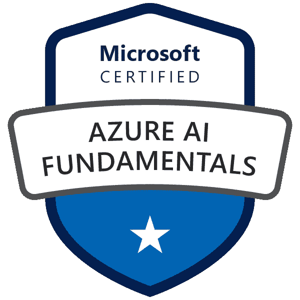
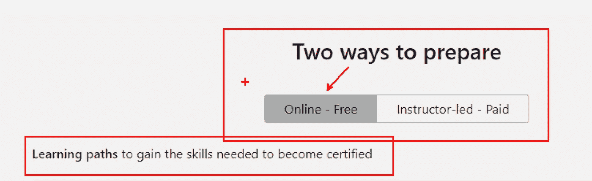
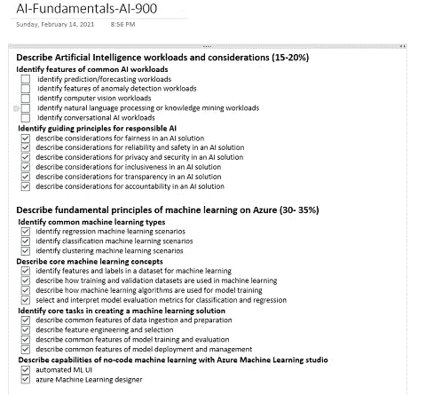
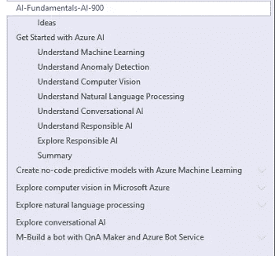

# Azure AI-900 认证提示

> 原文：<https://itnext.io/tips-for-azure-ai-900-certification-9806dd50177c?source=collection_archive---------4----------------------->

通过考试后获得的 Azure AI 基础徽章

我最近通过了 Azure AI Fundamentals 认证考试，我想分享一些关于如何准备考试的技巧。我每晚学习几个小时，持续了大约 3 周，星期五休息，因为…星期五😁。

首先，你需要学习的一切都可以免费获得*！*

*在[认证页面](https://docs.microsoft.com/en-us/learn/certifications/azure-ai-fundamentals/)的底部，你可以看到所有你需要通过 Microsoft Learn 学习的材料。这是一个循序渐进的过程，让你掌握认证所需的一切。*

**

*可以看到所测技能都在这些主题目里，点击[下载认证技能大纲](https://query.prod.cms.rt.microsoft.com/cms/api/am/binary/RE4wAEF)更详细的讲解。*

***提示 1** —准备好你的学习材料*

*将详细的解释复制到 OneNote 之类的地方，这样你就可以交叉你已经学过的内容，在你的学习会话前后重温这些内容。*

**

*AI-900 研究要求*

*花几分钟格式化它。我喜欢在我的前面加上复选框。这让我可以很容易地标记出我已经学过的内容。如果您愿意，也可以在电子表格中做类似的事情。*

*好了，现在你有了考试需要学习的东西，是时候准备材料了。对于这次考试，我使用了微软学习(*它有你需要的一切*)和 YouTube。*

***提示 2** —使用多个学习资源*

*Microsoft Learn 很棒，易于使用，非常详细，但更好的是，它有免费的动手练习，在某些课程中，您可以打开一个预先加载了材料的虚拟机，这样您就不必自己安装任何东西。*

*我也喜欢 YouTube，因为它有助于听到其他人的不同观点，也有助于巩固你迄今为止所学的内容。*

*我特别喜欢来自 [Daniel Baker](https://www.youtube.com/watch?v=l49f-BE-ay4) 的这个视频，他解释了来自 MS Learn 的相同示例，以及来自[云指南](https://www.youtube.com/watch?v=E2644J4jgd8&list=PLhLKc18P9YOAGdtSpB3y7WMkjJbi7dva_)的这个播放列表，它们是每个模块学习后的一个很好的回顾。*

*技巧 3——当你浏览学习材料时，把它们抄下来，标出你认为重要的地方，并做笔记。*

*我喜欢将我正在学习的内容(在这种情况下是从 Microsoft Learn)复制到 OneNote，我发现它很容易分组，也很容易在以后搜索材料*

**

*Microsoft 学习材料笔记*

***提示 4** —回顾你之前的学习过程。*

*在每节课开始的时候，我会花一些时间浏览前一节课。我没有重读它，我只是快速复习一下。这有助于我把已经学过的东西记忆犹新。特别是经过几周的学习。我真的很喜欢这样做，尤其是当我在研究一个与我日常工作无关的话题时。*

**

*照片由[思想目录](https://unsplash.com/@thoughtcatalog?utm_source=medium&utm_medium=referral)在 [Unsplash](https://unsplash.com?utm_source=medium&utm_medium=referral) 上拍摄*

*技巧 5 —当你在学习的时候，写下你的想法。*

*通常当我准备或研究一个话题时，我的脑海里会蹦出一堆想法。我喜欢边走边记下它们，因为否则我会忘记它们。*

*我喜欢做的另一件事是在学习时问自己问题。例如“我能用这个做什么？”“我能用这个做那个吗？”我也会把这些答案写下来。你想得越多，越想办法把你的想法和你正在学习的东西结合起来，你就越容易记住。*

*就这样吧，祝你考试好运，我相信你会做得很好的！*

*这些建议对你有帮助吗？你还有其他的吗？请在评论中告诉我！*