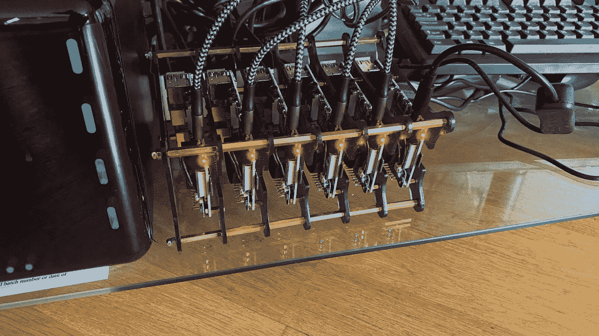
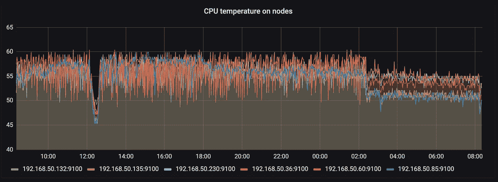
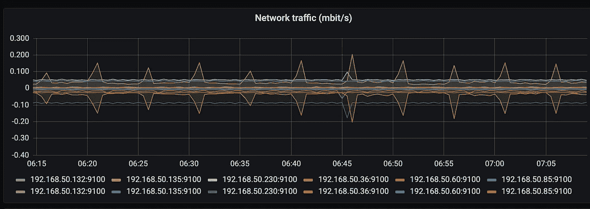
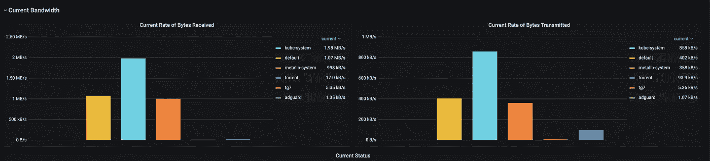

# 在 Raspberry Pi 上运行 Kubernetes 集群的技巧

> 原文：<https://itnext.io/tips-for-running-kubernetes-cluster-on-raspberry-pi-6c86487c6cf?source=collection_archive---------0----------------------->

## 你以前不知道，知道或者不关心的事情。

在成功收到我之前关于在 Raspberry Pi 上构建 Kubernetes 集群的文章之后(如果你想要完全自动化的构建，请看一下，代码附后)。我决定跟进我从那时起学到和发现的一些事情，以节省你的时间和精力，谁知道呢，甚至可能说服你自己旋转。

# 温度控制

树莓派有过热的趋势——就像每个计算设备一样——工作负载越多，产生的热量就越多。不幸的是，您在盒子里得到的只是主板本身，但在开始时对我有用的是第三方散热器的慷慨放置，它工作得很好，直到我决定向池中添加一些更重的应用程序。

经过一番研究后，我发现了皮莫罗尼公司提供的[风扇垫片](https://shop.pimoroni.com/products/fan-shim)，它适合我的部署和集群结构，不需要我安装额外的分离器，也不需要我让 Pi 塔更高。

为了管理粉丝，你可以从我以前的文章中反转[工程师代码](https://github.com/lukaszraczylo/rpi-home-cluster-setup/blob/master/step2/roles/common/tasks/fan-support.yml)，或者简单地使用它，让它为你做好一切。


信用:*加雷思·哈勒菲克里*

风扇是伟大的，他们绝对做的工作，特别是当混合散热器，虽然还有另一件事，我已经错过了，而指望他们太多，从来没有注意到，直到我在提到的垫片上启用彩色 led 状态。温度上升，所以塔底的 Pi 在煮塔顶的 Pi。

将节点水平放置后，温度下降了 10 摄氏度(*！*)没有任何额外的改动。



# 储存和寿命

根据定义，从存储卡运行 Raspberry Pi 可能是自找麻烦。幸运的是，在将近一年的时间里，我在上面运行 Kubernetes 没有遇到任何问题，但是通过适当的配置，您可以预计主节点的写入速度大约为 30kb/s，工作节点的写入速度大约为 5kb/s。

我将 NFS 用于存储本身——有备用的英特尔 NUC，它作为网络存储工作得非常好，因此我能够限制节点存储卡上的写入。使用 [log2ram](https://github.com/azlux/log2ram) 可能会进一步限制灾难的可能性，这与我使用的大存储卡有关，应该可以让一切正常运行相当长一段时间，不会出现进一步的问题。

在卡片上注明——我使用 *SanDisk Extreme Pro 128GB、A2、UHS-I、U3、V30* 有几个原因——一个是“你有更多的可用空间，更少的卡损坏的机会”,第二个是——SanDisk 的[终身保修](https://kb.sandisk.com/app/answers/detail/a_id/22478/~/product-warranty-table),在整个集群出现故障的情况下，它应该可以为我节省足够多的两个额外的覆盆子 Pi。为了避免潜在故障期间的任何延迟，请始终准备一张备用卡，因为您永远不知道何时会需要它。

# 建立工作关系网

群集节点往往会相互进行大量通信，为了保持一切正常运行，您不希望这种通信受到限制，同时保持网络的其余部分免受额外流量的影响。在我看来，使用额外的千兆位交换机(无论是管理的还是非管理的)是必须的，尤其是在 Pi 不断与 NFS 服务器联系的情况下。



空闲群集网络流量

将集群直接连接到您的家庭 wifi 路由器(特别是如果您使用互联网服务提供商提供的“库存”路由器)可能会带来麻烦，因为它们通常是规格的低端产品，并针对“普通”用户进行了优化。



主动集群网络利用

如果你对网络感兴趣——可以看看我的另一篇文章，其中我详细描述了[我的家庭网络设置](/i-made-my-internet-fast-finally-cb97f55361d9)。

# **动力**


通过 [raspi.tv](https://raspi.tv/2019/how-much-power-does-the-pi4b-use-power-measurements) 使用 Raspberry Pi 电源

由于树莓皮使用接近没有电力和插头的溢价，我已经决定使用多插座的电源砖。我选择的工具是 [RAVPower 官方](https://medium.com/u/8405206298c2?source=post_page-----6c86487c6cf--------------------------------) 60W brick(亚马逊链接:[点击](https://www.amazon.co.uk/gp/product/B07MJ9ZMDM/ref=ppx_yo_dt_b_search_asin_title?ie=UTF8&psc=1))，它完成了这项工作，没有对当前的六个 Raspberry Pi 设置造成任何电源故障，因为只有一个“输入”，它不仅很小，而且比带有多个插头的标准延长线更容易连接到 UPS。一个额外的建议是使用尽可能短的优质电源线以避免中断，并关闭你的树莓 Pi 上的 WiFi，因为它会消耗一点点额外的能量。

# Pi 超频

⚠️超频你的树莓派可以作废你的保修！

在强制性免责声明之后，我决定谈谈圆周率调优的话题。是的——这是可能的，而且比你想象的要容易。您可以在引导过程中简单地更改 rPI 使用的`/boot/userconfig.txt`文件的值(并由`/boot/config.txt`包含)来完成所有这些工作。

```
#uncomment to overclock the arm. 700 MHz is the default.
over_voltage=2
arm_freq=1750
```

你可以在[这篇文章](https://magpi.raspberrypi.org/articles/how-to-overclock-raspberry-pi-4)和[官方参考](https://www.raspberrypi.org/documentation/configuration/config-txt/overclocking.md)中找到更多关于超频本身的信息，尽管如果你事先至少为你的设置准备几个散热器和风扇，你的 Pi 很可能会很感激。